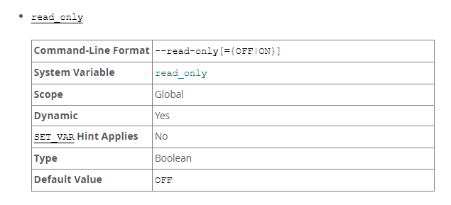
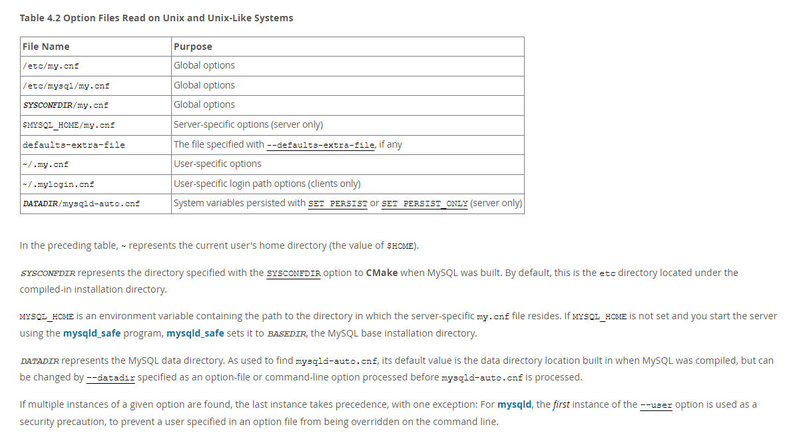

# 故障分析 | MySQL 重启之后无法写入数据了？

**原文链接**: https://opensource.actionsky.com/%e6%95%85%e9%9a%9c%e5%88%86%e6%9e%90-mysql-%e9%87%8d%e5%90%af%e4%b9%8b%e5%90%8e%e6%97%a0%e6%b3%95%e5%86%99%e5%85%a5%e6%95%b0%e6%8d%ae%e4%ba%86%ef%bc%9f/
**分类**: MySQL 新特性
**发布时间**: 2024-05-28T01:18:22-08:00

---

数据库交接后因 persist_only 级别的参数设置引发的故障分析。
> 作者：不吃芫荽，爱可生华东交付服务部 DBA 成员，主要负责 MySQL 故障处理及相关技术支持。
爱可生开源社区出品，原创内容未经授权不得随意使用，转载请联系小编并注明来源。
本文约 1800 字，预计阅读需要 6 分钟。
# 背景
客户在给系统打补丁之后需要重启服务器，数据库在重启之后，read_only 的设置与标准配置 文件中不一致，导致主库在启动之后无法按照预期写入。
已知并没有外部程序会对数据库做只读的设置，那么会是哪里出了问题？
# 排查过程
首先，检查启动进程配置文件的内容，是否的确正确配置了 read_only ，有没有在重启前后对文件进行修改：
`# 检查配置文件的修改状态
[root@localhost ~]# stat /usr/local/mysql/etc/my.cnf
File: ‘/usr/local/mysql/etc/my.cnf’
Size: 6160          Blocks: 16         IO Block: 4096   regular file
Device: fd00h/64768d    Inode: 591296      Links: 1
Access: (0644/-rw-r--r--)  Uid: (   27/   mysql)   Gid: (   27/   mysql)
Access: 2023-12-18 03:47:45.375190686 +0800
Modify: 2022-08-01 23:25:34.861953062 +0800
Change: 2022-08-01 23:25:34.862953087 +0800
Birth: -
# 查看配置文件内对read_only的设置
[root@localhost ~]# cat /usr/local/mysql/etc/my.cnf |grep read_only
[root@localhost ~]# 
[root@localhost ~]#
`
已知数据库版本信息为 8.0.25 ，近期没有修改过配置文件，文件也没有对 [read_only](https://dev.mysql.com/doc/refman/8.0/en/server-system-variables.html#sysvar_read_only) 进行配置，默认配置为 **OFF** ：

其次，查看所有可能读取的配置文件，并逐个排查：
`# 1. 查看 mysql 配置文件默认的加载顺序
[root@localhost ~]# mysql --verbose --help | grep -A 1 'Default options'
Default options are read from the following files in the given order:
/etc/my.cnf /etc/mysql/my.cnf /usr/local/mysql/etc/my.cnf ~/.my.cnf
# 2. 依次查看可能会存在的配置文件，及其配置的 read_only 值
[root@localhost ~]# ll /etc/my.cnf
ls: cannot access /etc/my.cnf: No such file or directory
[root@localhost ~]# ll /etc/mysql/my.cnf
ls: cannot access /etc/mysql/my.cnf: No such file or directory
# /usr/local/mysql/etc/my.cnf 为本实例启动时的指定配置文件，配置见上文，此处略
[root@localhost ~]# ll ~/.my.cnf
-r-------- 1 root root 355 Aug 19  2021 /root/.my.cnf
[root@localhost ~]# cat .my.cnf |grep read_only
[root@localhost ~]#
[root@localhost ~]# ll /home/mysql/.my.cnf
ls: cannot access /etc/my.cnf: No such file or directory
# 3. 通过检查服务器上可能存在的配置文件，发现 read_only 的设置在以上文件内并不存在
`
以上查看配置文件 的配置并没有找到相关配置，那么还有什么办法呢？尝试看看对数据库的历史操作记录，确认是否有用户对数据库做过 read_only 配置的操作：
`# 通过 /root/.mysql_history ，看到这样的历史记录：
set PERSIST_ONLY read_only = 1;
`
全局模糊搜索配置文件，发现了 `mysqld-auto.cnf` 文件：
`[root@localhost ~]# find / -name '*my*cnf'
/root/my.cnf
/root/.my.cnf
/usr/share/mysql/README.mysql-cnf
/usr/share/mysql/my-huge.cnf
/usr/share/mysql/my-innodb-heavy-4G.cnf
/usr/share/mysql/my-large.cnf
/usr/share/mysql/my-medium.cnf
/usr/share/mysql/my-small.cnf
/usr/local/mysql/support-files/my.cnf
/usr/local/mysql/etc/my.cnf
/data/mysql/mysqld-auto.cnf
# 查看 mysqld-auto.cnf 文件内容，以及文件的操作时间
[root@localhost ~]# cat /data/mysql/mysqld-auto.cnf
{ "Version" : 1 , "mysql_server" : { "read_only" : { "Value" : "ON" , "Metadata" : { "Timestamp" : 1659045255269856 , "User" : "root" , "Host" : "localhost" } } } }
# 时间戳转换为北京时间 【1659045255269856】 -- >【2022-07-29 05:54:15】
# 查看 mysqld-auto.cnf 文件的状态
[root@localhost ~]# stat /data/mysql/mysqld-auto.cnf
File: ‘/data/mysql/mysqld-auto.cnf’
Size: 164           Blocks: 8          IO Block: 4096   regular file
Device: fd08h/64776d    Inode: 6291467     Links: 1
Access: (0640/-rw-r-----)  Uid: (   27/   mysql)   Gid: (   27/   mysql)
Access: 2023-12-19 11:48:42.511662204 +0800
Modify: 2022-07-29 05:54:15.269682214 +0800
Change: 2022-07-29 05:54:15.269682214 +0800
Birth: -
`
这套数据库之前由别的团队管理，根据 `mysql_history` 的操作记录、前后带有时间记录的业务查询、以及 `mysqld-auto.cnf` 文件的生成时间，这些时间在我们接管之前，接管时仅检查了当时的数据库状态、`my.cnf` 文件中的配置，非常怀疑是这个操作导致了启动之后 `read_only` 被开起来，导致业务无法按照预期写入，接下来我们对这个参数进行测试。
## 参数测试
在主库设置参数。
`# 配置文件检查
[root@localhost etc]# cat my.cnf |grep read_only
read_only = 0
super_read_only = 0
# 参数检查：
mysql> select @@read_only,@@super_read_only;
+-------------+-------------------+
| @@read_only | @@super_read_only |
+-------------+-------------------+
|           0 |                 0 |
+-------------+-------------------+
1 row in set (0.00 sec)
# 设置参数
mysql> set PERSIST_ONLY read_only = 1;
Query OK, 0 rows affected (0.00 sec)
`
查看重启后的参数变化。
`# 重启数据库
[root@localhost ~]# systemctl restart mysqld_3301
# 查看参数：
mysql> select @@read_only,@@super_read_only;
+-------------+-------------------+
| @@read_only | @@super_read_only |
+-------------+-------------------+
|           1 |                 0 |
+-------------+-------------------+
1 row in set (0.00 sec)
`
通过 `strace` 来查看数据库在启动时读取了哪些配置文件，以下是相关配置片段：
`15:56:34.828260 stat("/opt/mysql/etc/3301/my.cnf", {st_mode=S_IFREG|0640, st_size=5042, ...}) = 0 <0.000008>
15:56:34.829061 stat("/opt/mysql/data/3301/mysqld-auto.cnf", {st_mode=S_IFREG|0640, st_size=164, ...}) = 0 <0.000006>
15:56:35.154154 stat("/opt/mysql/data/3301/auto.cnf", {st_mode=S_IFREG|0640, st_size=56, ...}) = 0 <0.000008>
15:56:35.154228 stat("/opt/mysql/data/3301/auto.cnf", {st_mode=S_IFREG|0640, st_size=56, ...}) = 0 <0.000007>
15:56:35.172411 stat("/opt/mysql/data/3301/auto.cnf", {st_mode=S_IFREG|0640, st_size=56, ...}) = 0 <0.000007>
15:56:35.172441 stat("/opt/mysql/data/3301/auto.cnf", {st_mode=S_IFREG|0640, st_size=56, ...}) = 0 <0.000007>
15:56:35.174142 stat("/opt/mysql/data/3301/mysqld-auto.cnf", {st_mode=S_IFREG|0640, st_size=164, ...}) = 0 <0.000007>
15:56:35.174172 stat("/opt/mysql/data/3301/mysqld-auto.cnf", {st_mode=S_IFREG|0640, st_size=164, ...}) = 0 <0.000007>
15:56:35.357608 stat("/opt/mysql/data/3301/auto.cnf", {st_mode=S_IFREG|0640, st_size=56, ...}) = 0 <0.000011>
15:56:35.357643 stat("/opt/mysql/data/3301/auto.cnf", {st_mode=S_IFREG|0640, st_size=56, ...}) = 0 <0.000010>
15:56:35.360019 stat("/opt/mysql/data/3301/mysqld-auto.cnf", {st_mode=S_IFREG|0640, st_size=164, ...}) = 0 <0.000009>
15:56:35.360052 stat("/opt/mysql/data/3301/mysqld-auto.cnf", {st_mode=S_IFREG|0640, st_size=164, ...}) = 0 <0.000008>
`
### 测试结论
根据以上排查过程和测试，数据库在启动时，读取完启动时指定的配置文件，会去读 `mysqld-auto.cnf` 这个文件，的确是这个参数设置导致 read_only 与标准配置文件预期不符的。
### 官网说明补充
官网搜索 [PERSIST_ONLY](https://dev.mysql.com/doc/refman/8.0/en/persisted-system-variables.html) ，这个操作会将设置写入 [mysqld-auto.cnf](https://dev.mysql.com/doc/refman/8.0/en/persisted-system-variables.html) ，也可以通过 `RESET PERSIST` 来删除写入此文件的配置。
官方描述还提到，配置文件需要登录 MySQL 的服务器去修改，而且 `SET GLOBAL` 的操作是运行时功能，无法持久化到数据库运行依据的配置文件 ，更不会延续到后续的配置，因此提供了 `PERSIST` 的 `SET` 语法变体，来将系统变量设置保存到 `mysqld-auto.cnf` 中。
*The MySQL server maintains system variables that configure its operation. A system variable can have a global value that affects server operation as a whole, a session value that affects the current session, or both. Many system variables are dynamic and can be changed at runtime using the [`SET`](https://dev.mysql.com/doc/refman/8.0/en/set-variable.html) statement to affect operation of the current server instance. [`SET`](https://dev.mysql.com/doc/refman/8.0/en/set-variable.html) can also be used to persist certain global system variables to the `mysqld-auto.cnf` file in the data directory, to affect server operation for subsequent startups. [`RESET PERSIST`](https://dev.mysql.com/doc/refman/8.0/en/reset-persist.html) removes persisted settings from `mysqld-auto.cnf`.*
关于在 [Unix 类操作系统中配置文件的读取顺序](https://dev.mysql.com/doc/refman/8.0/en/option-files.html)，我们也可以了解一下，`mysqld-auto.cnf` 也在其中：
