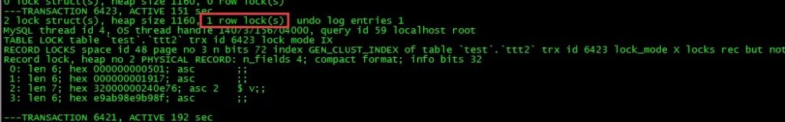
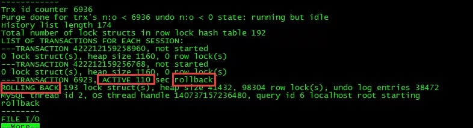
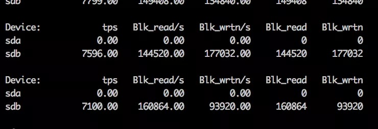
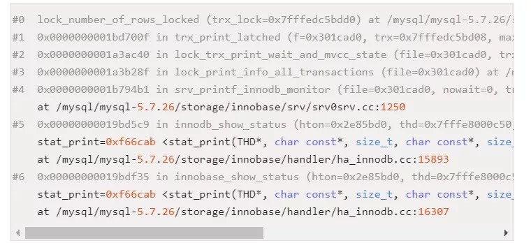

# 故障分析 | MySQL：5.6 大事务 show engine innodb status 故障一例

**原文链接**: https://opensource.actionsky.com/20200319-mysql/
**分类**: MySQL 新特性
**发布时间**: 2020-03-19T02:53:50-08:00

---

作者：高鹏（网名八怪）
文章末尾有他著作的《深入理解 MySQL 主从原理 32 讲》，深入透彻理解 MySQL 主从，GTID 相关技术知识。
本文来源：转载自公众号-老叶茶馆，
（作者简书：https://www.jianshu.com/p/40bef28e84cf）
*爱可生开源社区出品，原创内容未经授权不得随意使用，转载请联系小编并注明来源。
**背景**
今天遇到一个朋友的线上问题，大概意思就是说，我有一个线上的大事务大概 100G 左右，正在做回滚，当前看起来似乎影响了线上的业务，并且回滚很慢，是否可以减轻对线上业务的影响。并且朋友已经取消了双 1 设置，但是没有任何改观。版本：MySQL 5.6
首先我们需要知道的是，MySQL 并不适合大事务，大概列举一些 MySQL 中大事务的影响：- binlog 文件作为一次写入，会在 sync 阶段消耗大量的 IO，会导致全库 hang 主，状态大多为 query end。
- 大事务会造成导致主从延迟。
- 大事务可能导致某些需要备份挂起，原因在于 flush table with read lock，拿不到 MDL GLOBAL 级别的锁，等待状态为 Waiting for global read lock。
- 大事务可能导致更大 Innodb row 锁加锁范围，导致 row 锁等待问题。
- 回滚困难。
基于如上一些不完全的列举，我们应该在线上尽可能的避免大事务。好了我们下面来进行问题讨论。
**分析**
一、问题前面已经说了，我们已经取消了双 1 设置，所谓的双 1 就是 sync_binlog=1 和 innodb_flush_log_at_trx_commit=1。这两个参数线上要保证为 1，前者保证 binlog 的安全，后者保证 redo 的安全，它们在数据库 crash recovery 的时候起到了关键作用，不设置为双 1 可能导致数据丢失。具体的参数含义不做过多讨论。但是这里的问题是即便取消了双 1，没有任何改观，因此似乎说明 IO问题不是主要瓶颈呢？
下面我们来看几个截图：
- **vmstat 截图**
											
**iostat 截图**
											
**top -Hu截图**
											
我们重点观察 vmstat 的 r 和 b 列发现，IO 队列没有什么问题，并且 wa% 并不大。我们观察 iostat 中的 %util 和读写数据大小来看问题不大，并且 tps 远没达到极限（SSD 盘）。我们 top -Hu 可以观察到 %us 不小，并且有线程已经打满了（99.4%CPU）一个 CPU 核。
因此我们可以将方向转为研究 CPU 瓶颈的产生，希望能够对问题有帮助，然后从提供的 perf top 中我们有如下发现：
											
好了我们将问题先锁定到 lock_number_of_rows_locked 这个函数上。
二、函数 lock_number_of_rows_locked 的作用
朋友用的 5.6，但是我这里以 5.7.26 的版本进行描述。然后下一节描述 5.6 和 5.7 算法上的关键差异。不知道大家是否注意过 show engine innodb status 中的这样一个标志：
											
这个标记就来自函数 lock_number_of_rows_locked，含义为当前事务加行锁的行数。而这个函数包裹在函数 lock_print_info**_**all_transactions 下面，lock_print_info_all_transactions 函数是打印我们通常看到 show engine innodb status 中事务部分的核心参数。我们来看一下简单的流程：- `PrintNotStarted print_not_started(file);//建立一个结构体，目的是做not start 事务的打印`
- `ut_list_map(trx_sys->mysql_trx_list, print_not_started); //这个地方打印出那些事务状态是no start的事务。mysql_trx_list是全事务。`
- 
- `consttrx_t* trx;`
- `TrxListIterator trx_iter; //这个迭代器是trx_sys->rw_trx_list 这个链表的迭代器`
- `consttrx_t* prev_trx = 0;`
- 
- `/* Control whether a block should be fetched from the buffer pool. */`
- `bool load_block = true;`
- `bool monitor = srv_print_innodb_lock_monitor && (srv_show_locks_held != 0);`
- 
- `while((trx = trx_iter.current()) != 0) { //通过迭代器进行迭代 ，显然这里不会有只读事务的信息，全部是读写事务。`
- 
- `...`
- `/* If we need to print the locked record contents then we`
- `need to fetch the containing block from the buffer pool. */`
- `if(monitor) {`
- 
- `/* Print the locks owned by the current transaction. */`
- `TrxLockIterator& lock_iter = trx_iter.lock_iter();`
- 
- `if(!lock_trx_print_locks( //打印出锁的详细信息`
- `file, trx, lock_iter, load_block))`
简单的说就是先打印哪些处于 not start 的事务，然后打印那些读写事务的信息，当然我们的回滚事务肯定也包含在其中了，需要注意的是只读事务 show engine 不会打印。对于处于回滚状态的事务我们可以在 show engine 中观察到如下信息：
											
函数 trx_print_low 可以看到大部分的信息，这里就不详细解释了。既然如此我们需要明白 lock_number_of_rows_locked 是如何计算的，下面进行讨论。
三、函数 lock_number_of_rows_locked 的算法变化
上面我们说了函数 lock_number_of_rows_locked 函数会打印出当前事务加行锁的行数。那么我们来看一下 5.6 和 5.7 算法的不同。
**5.7.26**
实际上只有如下一句话：
- 
`return(trx_lock->n_rec_locks);`
我们可以看到这是返回了一个计数器，而这个计数器的递增就是在每行记录加锁后完成的，在函数 lock_rec_set_nth_bit 的末尾可以看到 ++lock->trx->lock.nreclocks，因此这是一种预先计算的机制。因此这样的计算代价很低，也不会由于某个事务持有了大量的锁，而导致计算代价过高。
**5.6.22**
随后我翻了一下 5.6.22 的代码，发现完全不同如下：
- `for(lock= UT_LIST_GET_FIRST(trx_lock->trx_locks); //使用for循环每个获取的锁结构`
- `lock!= NULL;`
- `lock= UT_LIST_GET_NEXT(trx_locks, lock)) {`
- 
- `if(lock_get_type_low(lock) == LOCK_REC) { //过滤为行锁`
- `ulint n_bit;`
- `ulint n_bits = lock_rec_get_n_bits(lock);`
- 
- `for(n_bit = 0; n_bit < n_bits; n_bit++) {//开始循环每一个锁结构的每一个bit位进行统计`
- `if(lock_rec_get_nth_bit(lock, n_bit)) {`
- `n_records++;`
- `}`
- `}`
- `}`
- `}`
- 
- `return(n_records);`
我们知道循环本身是一种 CPU 密集型的操作，这里使用了嵌套循环实现。因此如果在 5.6 中如果出现大事务操作了大量的行，那么获取行锁记录的个数的时候，将会出现高耗 CPU 的情况。
四、原因总结和解决
有了上面的分析我们很清楚了，触发的原因有如下几点：- MySQL 5.6 版本
- 有大事务的存在，大概 100G 左右的数据加行锁了
- 使用了 show engine innodb status
这样当在统计这个大事务行锁个数的时候，就会进行大量的循环操作。从现象上看就是线程消耗了大量的 CPU 资源，并且处于 perf top 的第一位。
知道了原因就很简单了，找出为频繁使用 show engine innodb status 的监控工具，随后业务全部恢复正常，IO 利用率也上升了如下：
											
当然如果能够使用更新的版本比如 5.7 及 8.0 版本将不会出现这个问题，可以考虑使用更高版本。分析性能问题需要首先找到性能的瓶颈然后进行集中突破，比如本例中 CPU 资源消耗更加严重。也许解决问题就在一瞬间。
五、其他
最后通过朋友后面查询的 bug 如下：https://bugs.mysql.com/bug.php?id=68647
发现印风（翟卫翔）已经在多年前提出过了这个问题，并且做出了修改意见，并且这个修改意见官方采纳了，也就是上面我们分析的算法改变。经过印风（翟卫翔）的测试有 bug 中有如下描述：
- From perf top, function locknumberofrowslocked may occupy more than 20% of CPU sometimes
也就是 CPU 消耗会高达 20%。
下面是 5.7.26 调用栈帧：
											
最后推荐高鹏的专栏《深入理解 MySQL 主从原理 32 讲》，想要透彻了解学习 MySQL 主从原理的朋友不容错过。
作者微信：gp_22389860
