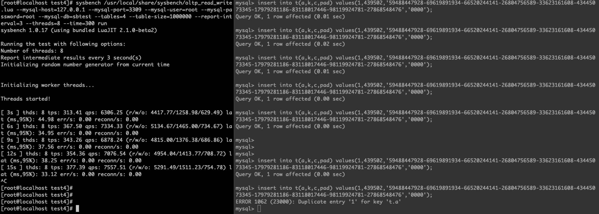
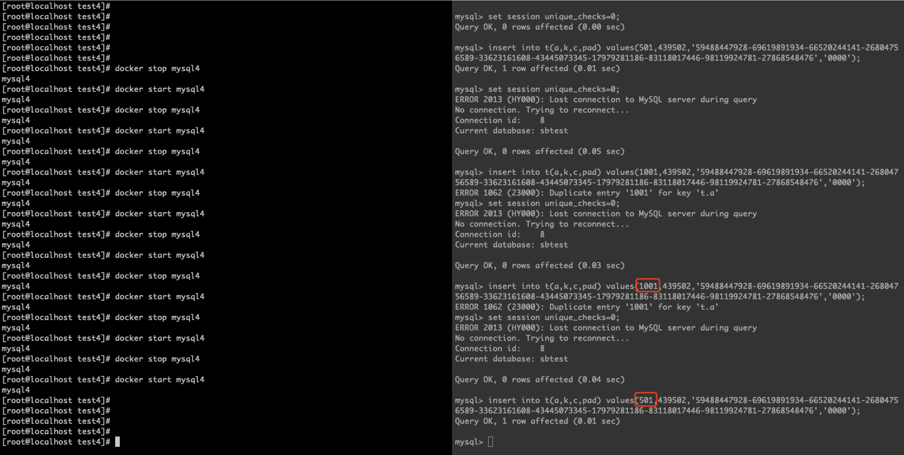

# 故障分析 | MySQL：唯一键约束失效

**原文链接**: https://opensource.actionsky.com/20220124-mysql/
**分类**: MySQL 新特性
**发布时间**: 2022-02-10T18:36:24-08:00

---

作者：胡呈清
爱可生 DBA 团队成员，擅长故障分析、性能优化，个人博客：https://www.jianshu.com/u/a95ec11f67a8，欢迎讨论。
本文来源：原创投稿
*爱可生开源社区出品，原创内容未经授权不得随意使用，转载请联系小编并注明来源。
最近遇到一个故障：单主模式5节点 MGR 集群，在使用 mysqlshell 导入数据时，所有secondary节点报错唯一键冲突退出集群。最终得到的结论是：mysqlshell importTable() 导入数据时会做 SET unique_checks=0 操作，在满足一定条件时会导致唯一键约束失效，主库插入了重复的数据，但从库会插入失败从而报错。下面我们就来聊聊这是怎么回事。
### unique_checks=0 的原理（会导致唯一键约束失效吗？）
看看官方文档是怎么描述的：
> 
If you have UNIQUE constraints on secondary keys, you can speed up table imports by temporarily turning off the uniqueness checks during the import session:
SET unique_checks=0;
&#8230; SQL import statements &#8230;
SET unique_checks=1;
For big tables, this saves a lot of disk I/O because InnoDB can use its change buffer to write secondary index records in a batch. Be certain that the data contains no duplicate keys.
对大数据量的导入，无论是 sql 文件还是 csv 文件，如果表中有唯一索引，我们可以通过 SET unique_checks=1; 来加快导入速度。这里用到的是 change buffer 的原理：
change buffer 的作用对象是普通二级索引，当插入、修改、删除二级索引记录时，即使数据不在 innodb buffer pool 中，也不需要先把数据从磁盘读取到内存。只需要在 change buffer 中完成 DML 操作，下次读取时才会从磁盘读取到内存，并与 change buffer 进行 merge，从而得到正确的数据。这个功能减少了 DML 时的随机 IO。
这里要注意对象是普通二级索引，唯一索引为什么不行？当执行 DML 时，数据不在内存中，为了保证唯一性，必须先从磁盘读取数据，这个随机 IO 是无法避免的，change buffer 失去了其作用，因此对唯一索引无效。
但是 unique_checks=0 让 change buffer 重新对唯一索引有效了。文档还有句暧昧的描述：“Be certain that the data contains no duplicate keys.”（你需要自己确保数据不包含重复值）。这会让唯一键约束失效吗？再让我们看看文档对于 unique_checks 系统变量的描述：
> 
If set to 0, storage engines are permitted to assume that duplicate keys are not present in input data. If you know for certain that your data does not contain uniqueness violations, you can set this to 0 to speed up large table imports to InnoDB.
Setting this variable to 0 does not require storage engines to ignore duplicate keys. An engine is still permitted to check for them and issue duplicate-key errors if it detects them.
至始至终没有出现“不进行唯一性检查”的字眼，写文档的人真是狡猾。要搞清楚这个问题，我们还得回到 change buffer 的原理：change buffer 无法支持唯一索引，但是 unique_checks=0 让 change buffer 重新对唯一索引有效。结合文档两个描述，我们作出如下假设：
- 
如果 set unique_checks=0; DML操作的数据，如果主键和唯一索引在 innodb buffer pool 中，则可以通过内存中的数据进行唯一性检测，这也是我们在测试中都会遇到即使 set unique_checks=0 也不能插入重复数据；
- 
但如果 DML 操作的数据如果不在 innodb buffer pool 中，则不会通过读取磁盘上的主键、唯一索引进行唯一检测，此时就和普通的二级索引一样，直接在 change buffer 完成数据写入，减少磁盘 IO。
## 验证
###### 1. 用 sysbench 造点数据
`sysbench /usr/local/share/sysbench/oltp_read_write.lua --mysql-host=127.0.0.1 \
--mysql-port=3309 --mysql-user=root --mysql-password=root \
--mysql-db=sbtest --tables=4 --table-size=1000000 --report-interval=3 --threads=8 --time=300 prepare
`
###### 2. 再创建一张表，并导入一些数据
`CREATE TABLE `t` (
`id` int(11) NOT NULL AUTO_INCREMENT,
`a` int(11) NOT NULL,
`k` int(11) NOT NULL DEFAULT '0',
`c` char(120) COLLATE utf8mb4_bin NOT NULL DEFAULT '',
`pad` char(60) COLLATE utf8mb4_bin NOT NULL DEFAULT '',
PRIMARY KEY (`id`),
KEY `k_1` (`k`),
unique key `a` (`a`)
);
insert into t(a,k,c,pad) select * from sbtest1 where id 
###### 3. 重启 mysqld
这一步目的是为了保证数据不在 innodb buffer pool 中，注意参数：
`innodb_buffer_pool_size = 64M
innodb_buffer_pool_load_at_startup = 0
innodb_buffer_pool_dump_at_shutdown = 0
innodb_buffer_pool_dump_pct = 0
`
###### 4. 插入重复数据
`mysql> set session unique_checks=0;
Query OK, 0 rows affected (0.04 sec)
mysql> insert into t(a,k,c,pad) values(1,439502,'59488447928-69619891934-66520244141-26804756589-33623161608-43445073345-17979281186-83118017446-98119924781-27868548476','0000');
Query OK, 1 row affected (0.01 sec)
`
可以看到成功插入了重复数据（这里用where a=1 等值查询只会输出一行结果，因此用 where a`mysql> select id,a from t where a
如果想观察的更清楚，可以持续运行 sysbench run，用 sbtest* 表把 innodb buffer pool 占满，这样可以反复插入同一行数据：

###### 5. 一些干扰验证的现象
有些记录无法顺利插入进去，这个对我困扰非常大，一度让我以为推论是错误的...这个就留给官方解释吧：

如果是 char 类型的唯一键，则不会有类似问题：
`CREATE TABLE `t1` (
`id` int NOT NULL AUTO_INCREMENT,
`a` char(10) COLLATE utf8mb4_bin DEFAULT NULL,
`k` int NOT NULL DEFAULT '0',
`c` char(120) CHARACTER SET utf8mb4 COLLATE utf8mb4_bin NOT NULL DEFAULT '',
`pad` char(60) CHARACTER SET utf8mb4 COLLATE utf8mb4_bin NOT NULL DEFAULT '',
PRIMARY KEY (`id`),
UNIQUE KEY `a` (`a`),
KEY `k_1` (`k`)
) ENGINE=InnoDB;
`
## 结论
如果 set unique_checks=0; DML操作的数据，如果主键和唯一索引在 innodb buffer pool 中，则可以通过内存中的数据进行唯一性检测，这也是我们在测试中通过都会遇到即使 set unique_checks=0 也不能插入重复数据；
但如果 DML 操作的数据如果不在 innodb buffer pool 中，则不会通过读取磁盘上的主键、唯一索引进行唯一检测，此时就和普通的二级索引一样，直接在 change buffer 完成数据写入，减少磁盘 IO。
需要注意的是 mysqldump 导出的 sql 文件头部会自动携带 set unique_checks=0 信息，包括开头我们提到的 mysqlshell importTable() 也会做同样的设置。
对此我提了个 bug：https://bugs.mysql.com/bug.php?id=106121
虽然文档很狡猾的写了：“Be certain that the data contains no duplicate keys.”，我们也知道了 set unique_checks=0 的原理就是通过 change buffer 加速唯一键的插入，这似乎就不能完全保证唯一性。如果这确实不算 bug，也希望官方能把文档写的更清楚明白些，而不是描述的暧昧不清。
## 解决方案
如果不能保证导入的数据唯一，在 mysqlshell importTable() 导入前关闭 change buffer：`set global innodb_change_buffering=none`;，如果是导入 sql 文件，则注意将 set unique_checks=0 注释。