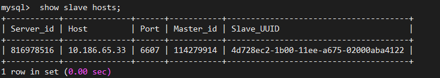
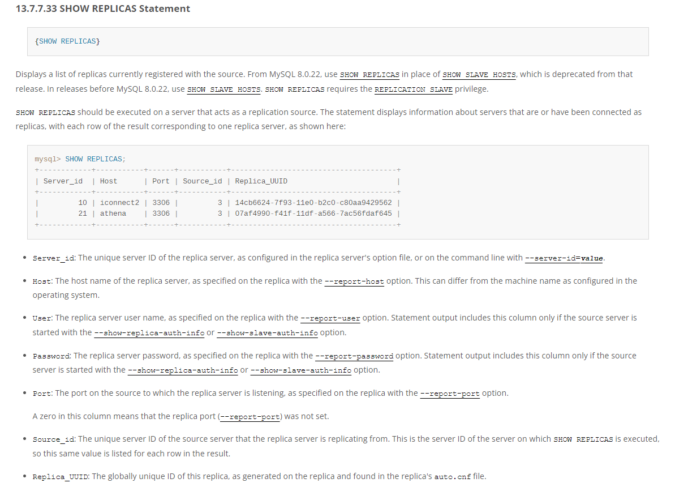
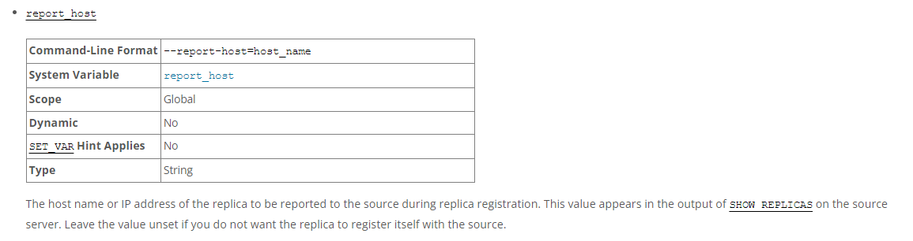
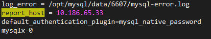

# 故障分析 | MySQL：我的从库竟是我自己！？

**原文链接**: https://opensource.actionsky.com/%e6%95%85%e9%9a%9c%e5%88%86%e6%9e%90-mysql%ef%bc%9a%e6%88%91%e7%9a%84%e4%bb%8e%e5%ba%93%e7%ab%9f%e6%98%af%e6%88%91%e8%87%aa%e5%b7%b1%ef%bc%81%ef%bc%9f/
**分类**: MySQL 新特性
**发布时间**: 2023-07-10T00:58:28-08:00

---

本文将通过复制场景下的异常分析，介绍手工搭建MySQL主从复制时需要注意的关键细节。
> 作者：秦福朗
爱可生 DBA 团队成员，负责项目日常问题处理及公司平台问题排查。热爱互联网，会摄影、懂厨艺，不会厨艺的 DBA 不是好司机，didi~
本文来源：原创投稿
- 爱可生开源社区出品，原创内容未经授权不得随意使用，转载请联系小编并注明来源。
# 背景
有人反馈装了一个数据库，来做现有库的从库。做好主从复制关系后，在现有主库上使用 `show slave hosts;` 管理命令去查询从库的信息时，发现**从库的 IP 地址竟是自己的 IP 地址**，这是为什么呢？
因生产环境涉及 IP，端口等保密信息，以下以本地环境来还原现象。
# 本地复现
## 基本信息
|  | 主库 | 从库 |
| --- | --- | --- |
| IP | 10.186.65.33 | 10.186.65.34 |
| 端口 | 6607 | 6607 |
| 版本 | 8.0.18 | 8.0.18 |
## 问题现象
不多说，先上图，以下为在主库执行 `show slave hosts;` 出现的现象：

可以看到这里的 Host 是主库的 IP 地址。
我们登陆从库查看一下 `show slave status\G`：
`mysql> show slave status\G
*************************** 1. row ***************************
Slave_IO_State: Waiting for master to send event
Master_Host: 10.186.65.33
Master_User: universe_op
Master_Port: 6607
Connect_Retry: 60
Master_Log_File: mysql-bin.000002
Read_Master_Log_Pos: 74251749
Relay_Log_File: mysql-relay.000008
Relay_Log_Pos: 495303
Relay_Master_Log_File: mysql-bin.000002
Slave_IO_Running: Yes
Slave_SQL_Running: Yes
`
我们看到确实从库是在正常运行的，且复制的源就是主库。
**为什么执行 `show` 命令看到的 Host 和实际的情况对不上呢？**
# 查阅资料
首先查阅官方文档，关于 `show slave hosts;` 语句的解释：

- 首先说明 8.0.22 之后版本的 `show slave hosts` 语句被废弃（可执行），改为 `show replicas`，具体机制还是一样的。
- 这里说明了各个数据的来源，多数来源于 `report-xxxx` 相关参数，其中 Host 的数据来自于从库的 `report_host` 这个参数。
然后，我们测试在从库执行 `show variables like "%report%";`。
`mysql> show variables like "%report%";
+-----------------+--------------+
| Variable_name   | Value        |
+-----------------+--------------+
| report_host     | 10.186.65.33 |
| report_password |              |
| report_port     | 6607         |
| report_user     |              |
+-----------------+--------------+
4 rows in set (0.01 sec)
`
可以看到这里显示的就是主库的 IP。
我们再查询 `report_host` 的参数基本信息：

可以看到该参数非动态配置，在从库注册时上报给主库，所以主库上执行 `show slave hosts;` 看到的是 IP 是从这里来的，且无法在线修改。
最后也通过查看从库上的 `my.cnf` 上的 `report_port` 参数，证实确实是主库的 IP：

# 结论
经了解，生产上的从库是复制了主库的配置文件来部署的，部署时没有修改 `report_host` 这个值，导致启动建立复制后将 `report_host` 这个 IP 传递给主库，然后主库查询 `show slave hosts` 时就出现了自己的 IP，让主库怀疑自己的从库竟然是自己。
生产上大部分人知道复制主库的配置文件建立新库要修改 `server_id` 等相关 ID 信息，但比较容易忽略掉 `report_ip`、`report_port` 等参数的修改，这个需要引起注意，虽然错误之后看起来对复制运行是没影响的。