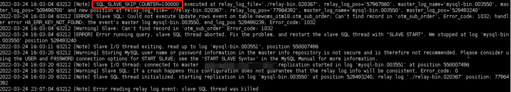
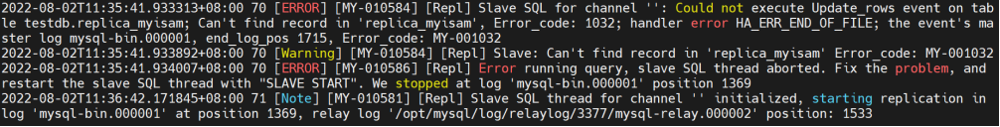
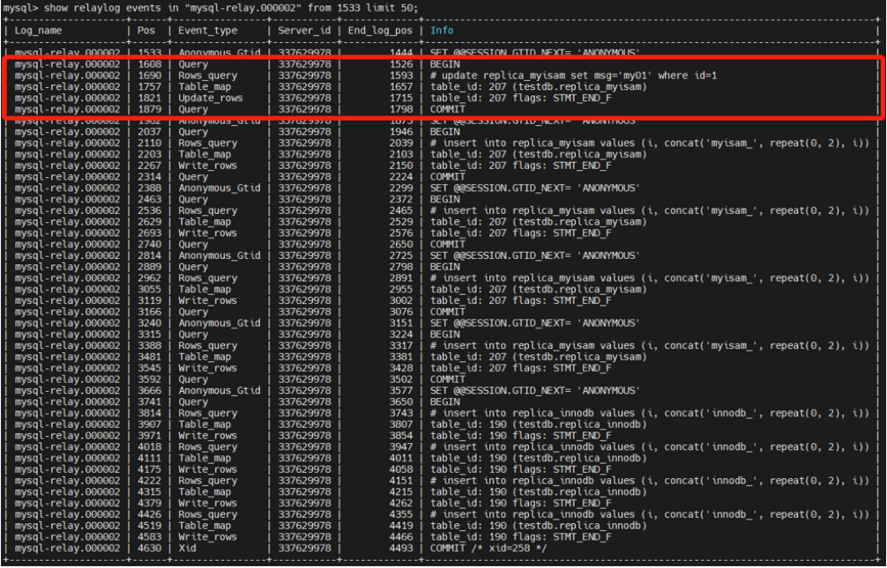

# 故障分析 | Sql_slave_skip_counter 使用不规范对复制的影响

**原文链接**: https://opensource.actionsky.com/%e6%95%85%e9%9a%9c%e5%88%86%e6%9e%90-sql_slave_skip_counter-%e4%bd%bf%e7%94%a8%e4%b8%8d%e8%a7%84%e8%8c%83%e5%af%b9%e5%a4%8d%e5%88%b6%e7%9a%84%e5%bd%b1%e5%93%8d/
**分类**: 技术干货
**发布时间**: 2022-08-07T21:41:38-08:00

---

作者：唐龙哲
爱可生交付服务团队上海DBA，负责 MySQL 数据库故障处理及日常维护。擅长故障诊断
本文来源：原创投稿
*爱可生开源社区出品，原创内容未经授权不得随意使用，转载请联系小编并注明来源。
#### 一、背景描述
最近在客户环境遇到一个 sql_slave_skip_counter 使用不规范引起的主从故障问题。
我们知道 mysql 的主从复制是逻辑复制，所以 slave 在应用 relay log 的过程中，经常会遇到错误，而参数 sql_slave_skip_counter 可以设置跳过多少个 event ，让从库 sql 继续回放。但是如果 sql_slave_skip_counter 使用不当，也会造成主从数据不一致。
###### 以下为抓取的部分错误日志截图：
可以看到为了跳过报错的 SQL ，现场有手动设置过 SQL_SLAVE_SKIP_COUNTER=100000 ，表示跳过10万的 events ，而 binlog event 事件的多少，与事务表/非事务表、及 binlog 日志模式有关。

常见错误说明：
write_rows ：Duplicate entry（1062错误）主键冲突，主要表现为重复插入已经存在的记录;
update_rows ：Can&#8217;t find record（1032错误），无法发现需要更新的行记录。
###### sql_slave_skip_counter 参数说明：
> 从官方解释知道，sql_slave_skip_counter以event 为单位 skip ，直到 skip 完第N个 event 所在的 event group 才停止。对于事务表，一个 event group 对应一个事务; 对于非事务表，一个 event group 对应一条 SQL 语句。并且一个 event group 可以包含多个 event 事件。
详细解释，可以参考官方文档：
[https://dev.mysql.com/doc/refman/5.6/en/set-global-sql-slave-skip-counter.html。](https://dev.mysql.com/doc/refman/5.6/en/set-global-sql-slave-skip-counter.html。)
[https://dev.mysql.com/doc/refman/8.0/en/replication-administration-skip.html。](https://dev.mysql.com/doc/refman/8.0/en/replication-administration-skip.html。)
#### 二、测试 sql_slave_skip_counter 对复制的影响
使用显示开启事务方式(begin/commit)，模拟 delete/update 遇到 Can&#8217;t find record (1032) 错误，insert 中的 Duplicate entry(1062) 错误可以使用类似的方法去分析。此处使用 MySQL8.0.23 版本，基于 Row 日志模式 + Position 方式搭建异步复制架构。
##### 2.1 准备数据
前提条件(主从库应用如下配置)：
-- 关闭GTID
mysql> show global variables like '%gtid%';
+----------------------------------------+----------+
| Variable_name               | Value  |
+----------------------------------------+----------+
| binlog_gtid_simple_recovery | OFF |
| enforce_gtid_consistency  | OFF |
| gtid_executed    |      |
| gtid_mode     | OFF   |
| gtid_owned     |       |
| gtid_purged     |       |
| simplified_binlog_gtid_recovery | OFF   |
+----------------------------------------+----------+
-- 禁用read_only
mysql> show global variables like 'read_only';
+------------------+-------+
| Variable_name | Value |
+------------------+-------+
| read_only    | OFF  |
+------------------+-------+
-- 设置row模式
mysql> show global variables like 'binlog_format';
+---------------+----------+
| Variable_name | Value |
+---------------+----------+
| binlog_format | ROW |
+---------------+----------+
在主库创建两张表，一张是事务表，另一张为非事务表，然后往各表中写入id=1的记录。
-- 主库创建测试表
create table replica_innodb (id int, msg char(32)) engine=innodb;
create table replica_myisam (id int, msg char(32)) engine=myisam;
-- 往测试表中添加数据 
insert into replica_innodb values(1,'innodb_001');
insert into replica_myisam values(1,'myisam_001');
##### 2.2 模拟 sql_slave_skip_counter = N 跳过复制故障的场景
说明：该场景将模拟主库更新 replica_myisam 非事务表的记录，导致从库更新失败的操作。
(1)从库执行 delete 语句，删除非事务表id=1的记录
set sql_log_bin=0;
delete from replica_myisam where id=1;
set sql_log_bin=1;
(2)主库更新 replica_myisam 非事务表id=1的记录，并新增数据到两张表中
-- 编写insert存储过程
delimiter $$
create procedure p_insert()
begin
declare i int;
set i = 2;
while i < 6 do
insert into replica_innodb values (i, concat('innodb_', repeat(0, 2), i));
insert into replica_myisam values (i, concat('myisam_', repeat(0, 2), i));
set i = i + 1;
end while;
end$$
delimiter ;
-- 更新数据
begin;
update replica_myisam set msg='my01' where id=1;
call p_insert;
commit;
（3）检查复制状态
Slave_IO_Running: Yes
Slave_SQL_Running: No
Last_SQL_Errno: 1032
Last_SQL_Error: Could not execute Update_rows event on table testdb.replica_myisam; Can't find record in 'replica_myisam', Error_code: 1032; handler error HA_ERR_END_OF_FILE; the event's master log mysql-bin.000001, end_log_pos 1715
上述操作先在从库先删除非事务表数据id=1的情况下，主库再更新数据，然后通过复制将主库id=1的记录传递到从库，在 SQL 线程回放时造成从库无法更新不存的记录 (报1032错误)，导致 SQL 线程故障（此时 SQL 线程已经停止）。
（4）尝试使用 sql_slave_skip_counter 跳过错误，并重启复制
-- 从库跳过"10000"个event，并重启SQL线程
set global sql_slave_skip_counter=10000;
start slave sql_thread;
-- 查看数据，可以发现replica_myisam以及replica_innodb表id>=2的记录并未同步到从库
mysql> select * from replica_myisam;
Empty set (0.00 sec)
mysql> select * from replica_innodb\G
*************************** 1. row ***************************
id: 1
msg: innodb_001
1 row in set (0.01 sec)
-- 查看复制状态为Yes，表示已经跳过冲突的event事件
mysql> show slave status\G
Slave_IO_Running: Yes
Slave_SQL_Running: Yes
Last_Errno: 0
Last_Error:
Skip_Counter: 9955
Exec_Master_Log_Pos: 4493
Relay_Log_Space: 4854
根据观察到的 Skip_Counter 及查询结果显示，所有冲突的 sql 语句及正常的 sql 语句产生的 event 都被跳过了。被跳过的操作以及对应的事件类型，可以通过错误日志中 SQL 线程恢复时记录的 Relay_Log_File和Relay_Log_Pos 两个值，确认执行过了哪些操作。

show relaylog events in "mysql-relay.000002" from 1533 limit 50;

可以看到，基于 ROW 日志模式下，事务表及非事务表至少会产生对应的4个 event 事件：
rows_query (binlog_rows_query_log_events=ON 情况下才会记录到 binlog 日志中)、table_map 、update_rows/write_rows 以及 query(begin)/xid(commit)。实际上所有对事务表的操作是在同一个显式事务中，所有对非事务表的操作，每条 SQL 语句单独对应一个事务。
按照 binlog 记录的提交顺序，可以看到非事务表会先提交，innodb 事务表在 commit 执行之后提交，所以1032报的是 replica_myisam 表相关的错误操作。
各个 event 事件作用：
| Event | 作用 |
| --- | --- |
| Query | 以文本的形式记录事务，包括DDL操作（ROW格式），begin等 |
| Rows_query | 记录DML操作（insert、delete、update） |
| Table_map | 记录事件的库表信息 |
| Write_rows | 针对insert操作，包含了要插入的数据 |
| Update_rows | 针对update操作，包含了，修改前后的数据 |
| Xid | 在事务的末尾分配一个Xid（事务id，唯一），标志事务的结束 |
(5) 模拟主库追加数据
-- 主库追加数据
begin;
insert into replica_innodb values(6,'innodb_006');
commit;
select * from replica_innodb where id=6\G
*************************** 1. row ***************************
id: 6
msg: innodb_006
-- 从库观察到IO及SQL线程状态为yes，复制正常且Skip_Counter值递减。
show slave status\G
*************************** 1. row ***************************
Slave_IO_Running: Yes
Slave_SQL_Running: Yes
Last_Errno: 0
Last_Error:
Skip_Counter: 9949
Exec_Master_Log_Pos: 4849
Relay_Log_Space: 5210
-- 从库检查事务表数据，未发现id=6的记录 
select * from replica_innodb\G
*************************** 1. row ***************************
id: 1
msg: innodb_001
说明：上述操作并未将主库提交的事务应用到从库。
现象说明：
> (1)通过上述操作，sql_slave_skip_counter=N(N>0) 重启 slave 复制线程后，从库开始跳过 event ，每跳过一个 event ，N就减去1，直到N变成0。在此期间，所有冲突的 sql 语句及正常的 sql 语句产生的 event 都被记录到该变量中，当N变成0后从库才开始执行当前的语句。
并且当 Skip_Counter 值等于1，在对事务表操作时，并不是只跳过一个 event ，而是跳过一个完整事务，该事务如果存在多条 sql ，那么当报错发生时，会将剩余的 sql 操作一并跳过，直到遇到 xid event 为止。例如: 报错发生在第一个 sql 语句，如果第二条 sql 语句影响1000行数据，那么主从就有1000行数据不一致。
(2)观察从库复制正常，IO 及 SQL 线程状态为 yes 、Skip_Counter 值递减，且 binlog 无新的日志产生，错误日志无报错信息。
##### 2.3 sql_slave_skip_counter 清零
为了防止 sql_slave_skip_counter 对复制的影响，需要在错误跳过之后及时的恢复，将参数置为零。
方式一：重启复制
注意：MySQL5.7、8.0 重启复制后，Skip_Counter 计数器清零，MySQL 5.6 此方法无效。
stop slave;
start slave;
show global variables like 'sql_slave_skip_counter'\G
*************************** 1. row ***************************
Variable_name: sql_slave_skip_counter
Value: 0
方式二：手工设置为零，立即生效
stop slave;
set global sql_slave_skip_counter=0;
start slave;
show variables like 'sql_slave_skip_counter'\G
*************************** 1. row ***************************
Variable_name: sql_slave_skip_counter
Value: 0
方式三：重启从库
#### 三、总结
规范使用 sql_slave_skip_counter ，如果操作不当，极有可能跳过其他 events ，并造成主从数据不一致。
如果数据库数据量较小，大约60G左右，建议重做复制。数据量超过60G大小，可以在 sql_slave_skip_counter 跳过之前，看一下当前 binlog event group 执行了哪些操作。对于1032、1062错误尽量修补数据，让复制进程在从库应用变更。
建议 MySQL 复制开启 GTID（全局唯一事务ID），该方式可以根据当前事务的变化快速判断主从数据一致性，也强化故障恢复以及容错能力。需要注意：此方式在5.6不支持在线开启 GTID ，需要先停库再进行 GTID 相关参数配置。