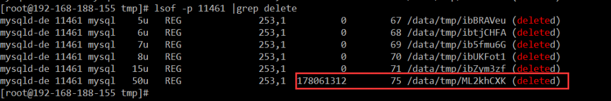
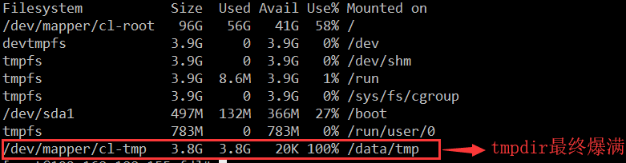
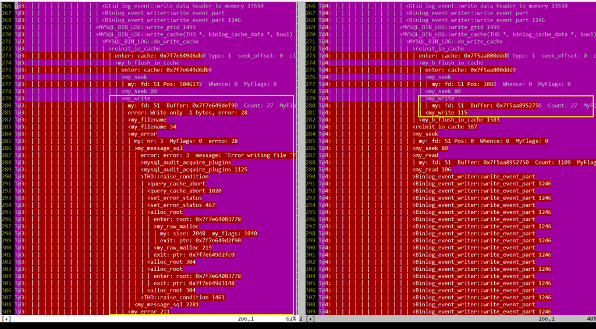

# 故障分析 | binlog flush 失败导致的 Crash

**原文链接**: https://opensource.actionsky.com/20200221-mysql/
**分类**: MySQL 新特性
**发布时间**: 2020-02-21T05:08:37-08:00

---

**一、问题现象**
某项目上出现 `MySQL Crash`，相关 errorlog 日志如下，从日志可以看出是 `binlog error` 导致的问题，但是无法确认具体原因，网上大部分资料都说是由于空间已满导致，后来在系统日志( `/var/log/message`)中确实找到了 / 分区空间已满的信息，所以基本可以确认 binlog error 是由于磁盘空间已满导致，进而造成 MySQL Crash。- `2019-09-24T14:17:47.786460+08:00 527621 [ERROR] /usr/local/mysql/bin/mysqld: Binary logging not possible. Message: An error occurred during flush stage of the commit. 'binlog_error_action' is set to 'ABORT_SERVER'. Hence aborting the server.`
- `06:17:47 UTC - mysqld got signal 6 ;`
- `This could be because you hit a bug. It is also possible that this binary`
- `or one of the libraries it was linked against is corrupt, improperly built,`
- `or misconfigured. This error can also be caused by malfunctioning hardware.`
- `Attempting to collect some information that could help diagnose the problem.`
- `As this is a crash and something is definitely wrong, the information`
- `collection process might fail.`
- 
- `key_buffer_size=8388608`
- `read_buffer_size=16777216`
- `max_used_connections=79`
- `max_threads=2500`
- `thread_count=35`
- `connection_count=34`
- `It is possible that mysqld could use up to`
- `key_buffer_size + (read_buffer_size + sort_buffer_size)*max_threads = 122921649 K  bytes of memory`
- `Hope that's ok; if not, decrease some variables in the equation.`
- 
- `Thread pointer: 0x7fbc3400ef40`
- `Attempting backtrace. You can use the following information to find out`
- `where mysqld died. If you see no messages after this, something went`
- `terribly wrong...`
- `stack_bottom = 7fbcd01d9ea8 thread_stack 0x40000`
- `/usr/local/mysql/bin/mysqld(my_print_stacktrace+0x35)[0xf4fbe5]`
- `/usr/local/mysql/bin/mysqld(handle_fatal_signal+0x4a4)[0x7d1f54]`
- `/lib64/libpthread.so.0(+0xf370)[0x7fc5897fe370]`
- `/lib64/libc.so.6(gsignal+0x37)[0x7fc5881f21d7]`
- `/lib64/libc.so.6(abort+0x148)[0x7fc5881f38c8]`
- `/usr/local/mysql/bin/mysqld[0xee626a]`
- `/usr/local/mysql/bin/mysqld(_ZN13MYSQL_BIN_LOG33handle_binlog_flush_or_sync_errorEP3THDb+0x17b)[0xef289b]`
- `/usr/local/mysql/bin/mysqld(_ZN13MYSQL_BIN_LOG14ordered_commitEP3THDbb+0x3ca)[0xef480a]`
- `/usr/local/mysql/bin/mysqld(_ZN13MYSQL_BIN_LOG6commitEP3THDb+0x51d)[0xef4f7d]`
- `/usr/local/mysql/bin/mysqld(_Z15ha_commit_transP3THDbb+0x174)[0x823434]`
- `/usr/local/mysql/bin/mysqld(_Z12trans_commitP3THD+0x49)[0xdd38f9]`
- `/usr/local/mysql/bin/mysqld(_Z21mysql_execute_commandP3THDb+0x2c89)[0xd1a1a9]`
- `/usr/local/mysql/bin/mysqld(_Z11mysql_parseP3THDP12Parser_state+0x40d)[0xd1c86d]`
- `/usr/local/mysql/bin/mysqld(_Z16dispatch_commandP3THDPK8COM_DATA19enum_server_command+0x11a5)[0xd1da95]`
- `/usr/local/mysql/bin/mysqld(_Z10do_commandP3THD+0x194)[0xd1e944]`
- `/usr/local/mysql/bin/mysqld(handle_connection+0x2b4)[0xdeffa4]`
- `/usr/local/mysql/bin/mysqld(pfs_spawn_thread+0x174)[0xfc8f64]`
- `/lib64/libpthread.so.0(+0x7dc5)[0x7f097d411dc5]`
- `/lib64/libc.so.6(clone+0x6d)[0x7f097becf73d]`
- 
- `Trying to get some variables.`
- `Some pointers may be invalid and cause the dump to abort.`
- `Query (7f00a80008f0): is an invalid pointer`
- `Connection ID (thread ID): 98525`
- `Status: NOT_KILLED`
**二、问题疑惑**
对于这个问题，一开始存在几点疑惑，需要实验和源码追踪验证。1. binlog error 是由于 / 分区空间已满造成的，为什么会造成 MySQL Crash？2. / 分区明明有十几个 G 的剩余空间，为什么会满？是什么文件撑满的？为啥事后空间却自动释放了？
这里就已知的知识先猜测下问题过程，是否正确则需要测试验证，内部机制可能就需要去查看源码。
											
大概过程如上，项目上 `/tmp` 默认为 MySQL 的临时文件目录，其所在分区一般为 `/ 分区(根分区)`，而 MySQL 的数据目录都存放在 `/data/mysql_data` 为另一个单独的分区( `/data 分区`)，项目上一般均是如此。
- `#bin包默认值`
- `datadir = /data/mysql_data`
- `tmpdir = /tmp`
当 `/tmp` 空间不足，也就是 /分区 已满的情况下，导致 `binlog flush` 无法进行下去，抛出 `binlog_error` 的异常，导致 `MySQL crash`！
**三、资料查阅**
针对这个问题，网上进行大量资料查阅后，相关知识点总结如下：
与此次问题相关最主要的 2 个 MySQL 参数。- `#bin包默认值`
- `binlog_cache_size=32768`
- `binlog_error_action = ABORT_SERVER`
`binlog_cache_size`：当**事务**开始时，MySQL 会分配一个 `binlog_cache_size` 大小的缓冲区（默认 32K）给 session 用于存储二进制日志的缓存。如果事务大于 `binlog_cache_size`（默认 32K），线程将打开一个 `临时文件` 用于存储事务(默认 `/tmp 下`）， 当线程结束时，临时文件会自动被删除。
`binlog_error_action`：默认值为 `ABORT_SERVER`，会使 MySQL 在写 binlog 遇到严重错误时直接退出( `即 Crash 动作`)，比如磁盘满了，文件系统不可写入等。在 ABORT_SERVER 选项下，binlog 和从库都是安全的，这是官方选择此默认值的原因。
此时我们就已经可以回答之前提的问题了~
1. binlog error 是由于 / 分区空间已满造成的，为什么会造成 `MySQL Crash`？
- 因为 `binlog_error_action` 参数默认值为 `ABORT_SERVER`，在 binlog 写入错误时会选择直接退出保证 binlog 安全。
2. / 分区明明有十几个 G 的剩余空间，为什么会满？是什么文件撑满的？为啥事后空间却自动释放了？- 猜测是由于事务较大，超过了 `binlog_cache_size`，所以会在 `/tmp(即 / 分区)` 下生成临时文件，导致 / 分区空间不足，引起 MySQL Crash 后，空间又自动释放，所以事后看 / 分区空间是正常的。
**四、测试模拟**
本地环境（为方便测试，与上述分区略有不同）：- `Filesystem           Size  Used Avail Use% Mounted on`
- `/dev/mapper/cl-root   96G   57G   39G  60% /               <-------- datadir = /data/mysql_data`
- `/dev/mapper/cl-tmp   3.8G   33M  3.8G   1% /data/tmp       <-------- tmpdir  = /data/tmp`
**模拟 **`多条 SQL 组成的超大事务`**，在存储过程中显示开启事务， **`循环插入 1kw`** 数据，观察 tmpdir 目录使用情况。**
直接在 `/data/tmp` 下无法看到临时文件，只有通过 `lsof` 命令才可以看到在 tmpdir 目录下确实生成了临时文件，且一直在增长，占用了 tmpdir 目录下的大量空间。
											
											
存储过程最终执行报错，报 `Nospace left on device` 即临时目录空间不足，但是此时 MySQL 并没有 Crash，errorlog 里未出现报错！！！
经过测试验证，当报错的时候，如果你在 `同一个会话下` 执行 `commit` 或者 `再开启一个事务` 就会立即触发 `binlog_error_action`，导致 MySQL 立即崩掉，且 errorlog 里会出现 binlog error 报错，与项目上现象一致。
PS：当 MySQL 解释器遇到 start transaction 时候会触发 commit… !!!
- `mysql> call test_insert();`
- `ERROR 1026 (HY000): Error writing file '/data/tmp/ML1aShmH' (errno: 28 - No space left on device)`
- `mysql> commit;`
- `ERROR 1598 (HY000): Binary logging not possible. Message: An error occurred during flush stage of the commit. 'binlog_error_action' is set to 'ABORT_SERVER'. Hence aborting the server.`
- `mysql> call test_insert();`
- `ERROR 1026 (HY000): Error writing file '/data/tmp/ML5b0Mj6' (errno: 28 - No space left on device)`
- `mysql> start transaction;`
- `ERROR 1598 (HY000): Binary logging not possible. Message: An error occurred during flush stage of the commit. 'binlog_error_action' is set to 'ABORT_SERVER'. Hence aborting the server.`
**五、源码跟踪**
跟踪 MySQL 源码验证上述猜想及测试，不感兴趣的童鞋可以直接跳过~
为了查看上述测试过程到底是在源码的哪一步最先报了错误，所以对比了 2 份 DBUG 日志， `左图` 是 `报错` 的跟踪日志， `右图` 为 `不报错` 的跟踪日志。
可以看到报错的跟踪日志最终是在 `my_write 函数` 中抛出错误，而不报错的日志则正常执行完 my_write 函数。
											
- `//Write a chunk of bytes to a file`
- `size_t my_write(File Filedes, const uchar *Buffer, size_t Count, myf MyFlags)`
- `{`
- `    size_t writtenbytes;`
- `    size_t sum_written= 0;`
- `    const size_t initial_count= Count;`
- 
- `    for (;;)`
- `    {`
- `        //...`
- `        #ifdef _WIN32`
- `            writtenbytes= my_win_write(Filedes, Buffer, Count);`
- `        #else`
- `            writtenbytes= write(Filedes, Buffer, Count); //writtenbytes为实际写入的字节数`
- `        //...`
- `        if (writtenbytes == Count)  //判断实际写入的字节数与要求写入的字节数是否相符`
- `        {`
- `          //写入正常则直接break跳出循环,正常结束.`
- `          sum_written+= writtenbytes;`
- `          break;`
- `        }`
- `        //...`
- `    }`
- `    //...`
- `    if (MyFlags & (MY_NABP | MY_FNABP))`
- `    {`
- `        if (sum_written == initial_count)  //写入正常走这个逻辑，返回0代表成功`
- `          DBUG_RETURN(0);`
- `        if (MyFlags & (MY_WME | MY_FAE | MY_FNABP)) //写入过程报错走这个逻辑`
- `        {`
- `          char errbuf[MYSYS_STRERROR_SIZE];`
- `          my_error(EE_WRITE, MYF(0), my_filename(Filedes),`
- `               my_errno(), my_strerror(errbuf, sizeof(errbuf), my_errno())); //打印错误信息`
- `        }`
- `        DBUG_RETURN(MY_FILE_ERROR); //返回错误`
- `    }`
- `    //...`
- `}`
- 
- `/*`
- `源码如上,MySQL最终会走Linux内核方法write(Filedes, Buffer, Count)来刷新binlog缓冲至磁盘文件中。`
- `1.Filedes为文件号（对应/proc/mysqld_pid/fd下的文件编号）`
- `2.Buffer为指向所需写入缓冲的指针。`
- `3.Count为所需要写入的字节数。`
- 
- `my: fd: 51  Buffer: 0x7f24c49e9e30  Count: 27`
- 
- `由于/data/tmp磁盘已满，无法写入Count所需的字节数，导致writtenbytes!=Count，然后引起了后续一系列的代码报错，最终诱发binlog_error_action->MySQL Crash.`
- `*/`
											
**MySQL 源码执行 Commit 报错过程精简如下：**
- `T@12: | >trans_commit`
- `T@12: | | >ha_commit_trans`
- `T@12: | | | >MYSQL_BIN_LOG::commit`
- `T@12: | | | | >MYSQL_BIN_LOG::ordered_commit`
- `T@12: | | | | | >MYSQL_BIN_LOG::process_flush_stage_queue`
- `T@12: | | | | | | >binlog_cache_data::flush`
- `T@12: | | | | | | | >MYSQL_BIN_LOG::write_cache(THD *, binlog_cache_data *, bool)`
- `T@12: | | | | | | | | >MYSQL_BIN_LOG::do_write_cache`
- `T@12: | | | | | | | | | >reinit_io_cache`
- `T@12: | | | | | | | | | | >my_b_flush_io_cache`
- `T@12: | | | | | | | | | | | >my_write`
- `T@12: | | | | | | | | | | | | my: fd: 52Buffer: 0x7f9ccc050db0Count: 27MyFlags: 20`
- `T@12: | | | | | | | | | | | | error: Write only -1 bytes, error: 28`
- `T@12: | | | | | | | | | | | | >my_error`
- `T@12: | | | | | | | | | | | | | >my_message_sql`
- `T@12: | | | | | | | | | | | | | | error: error: 3  message: 'Error writing file '/data/tmp/MLJRp8sa' (Errcode: 28 - No space left on device)'`
- `T@12: | | | | | | | | | | | | | <my_message_sql 2281`
- `T@12: | | | | | | | | | | | | <my_error 211`
- `T@12: | | | | | | | | | | | <my_write 122`
- `T@12: | | | | | | | | | | <my_b_flush_io_cache 1583`
- `T@12: | | | | | | | | | <reinit_io_cache 367`
- `T@12: | | | | | | | | <MYSQL_BIN_LOG::do_write_cache 7679`
- `T@12: | | | | | | | <MYSQL_BIN_LOG::write_cache(THD *, binlog_cache_data *, bool) 8031`
- `T@12: | | | | | | <binlog_cache_data::flush 1740`
- `T@12: | | | | | <MYSQL_BIN_LOG::process_flush_stage_queue 8848`
- `T@12: | | | | | >my_error`
- `T@12: | | | | | | >my_message_sql`
- `T@12: | | | | | | | error: error: 1598  message: 'Binary logging not possible. Message: An error occurred during flush stage of the commit. 'binlog_error_action' is set to 'ABORT_SERVER'. Hence aborting the server.'`
- `T@12: | | | | | | | >sql_print_error`
- `T@12: | | | | | | | | >error_log_print`
- `T@12: | | | | | | | | | >print_buffer_to_file`
- `T@12: | | | | | | | | | | enter: buffer: /opt/mysql-5.7.24-linux-glibc2.12-x86_64/bin/mysqld-debug: Binary logging not possible. Message: An error occurred during flush stage of the commit. 'binlog_error_action'isset to 'ABORT_SERVER'. Hence aborting the server.`
- `2019-11-11T11:54:45.434783+08:0012[ERROR] /opt/mysql-5.7.24-linux-glibc2.12-x86_64/bin/mysqld-debug: Binary logging not possible. Message: An error occurred during flush stage of the commit. 'binlog_error_action'isset to 'ABORT_SERVER'. Hence aborting the server.`
- `T@12: | | | | | | | | | <print_buffer_to_file 2109`
- `T@12: | | | | | | | | <error_log_print 2134`
- `T@12: | | | | | | | <sql_print_error 2148`
- `T@12: | | | | | | <my_message_sql 2281`
- `T@12: | | | | | <my_error 211`
**六、扩展内容**
下图这个报错其实就是本次问题的一个日常例子，很多童鞋通过 navicate 还原 MySQL 的时候可能就会碰到这个问题，本质就是 navicate 还原数据库的时候默认会走 `事务`，当表数据库较大时，事务大小超过`binlog_cache_size`，就会用临时表记录事务数据，当 tmdir 目录磁盘不足就会报错，但是这种情况并不会造成 MySQL Crash，因为 navicate 在还原报错后并不会继续去执行`commit` 或 `另开一个事务`，而是直接断开连接。
											
											
**七、总结**
这个问题目前在项目上很少碰到，这次也是出于好奇拿来学习探讨，下面总结下这个问题出现的场景：1. 代码中存在较大事务，超过 binlog_cache_size，高并发下生成大量临时文件，占满 tmpdir。2. 代码在事务执行过程中碰到 tmpdir 磁盘已满错误，未处理异常执行回滚，后续执行 Commit 导致。3. 代码在事务执行过程中碰到 tmpdir 磁盘已满错误，未处理异常执行回滚，继续执行碰到嵌套事务，引发 Commit 导致。
也许很多童鞋想到可以 `加大binlog_cache_size` 来减少临时文件的产生，但是这样会增加内存消耗，试想以下，假如 binlog_cache_size 增加到 `32MB`，当有 `300 个数据库连接` 时，每个连接都会分配 32MB 的 binlog_cache( `不管你用多少`)，那么就是将近 10G，很容易导致内存溢出，被系统 OOM。
因此 binlog_cache_size 不可能增加很多，根本解决方法是减少事务大小，避免在高并发下同时产生大量临时文件，撑满 tmpdir；另外可以增加 tmpdir 所在分区的大小。
**遗留问题：**
CentOS Linux release 7.3.1611 问题复现成功，commit 会导致 Crash。CentOS Linux release 7.6.1810 问题无法复现，commit 不报错，但是会造成 binlog event 部分写。
**附录：**https://blog.51cto.com/lee90/1939469https://dev.mysql.com/doc/refman/5.7/en/replication-options-binary-log.htmlhttps://stackoverflow.com/questions/37813819/mysql-max-binlog-cache-size-vs-binlog-cache-size