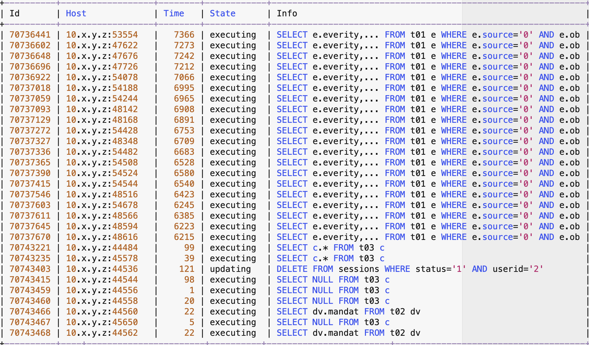

# 故障分析 | innodb_thread_concurrency 导致数据库异常的问题分析

**原文链接**: https://opensource.actionsky.com/%e6%95%85%e9%9a%9c%e5%88%86%e6%9e%90-innodb_thread_concurrency-%e5%af%bc%e8%87%b4%e6%95%b0%e6%8d%ae%e5%ba%93%e5%bc%82%e5%b8%b8%e7%9a%84%e9%97%ae%e9%a2%98%e5%88%86%e6%9e%90/
**分类**: 技术干货
**发布时间**: 2023-05-22T01:23:19-08:00

---

作者通过分析源码定位数据库异常，梳理参数 innodb_thread_concurrency 设置的注意事项。
> 作者：李锡超
一个爱笑的江苏苏宁银行数据库工程师，主要负责数据库日常运维、自动化建设、DMP 平台运维。擅长 MySQL、Python、Oracle，爱好骑行、研究技术。
- 爱可生开源社区出品，原创内容未经授权不得随意使用，转载请联系小编并注明来源。
## 一、问题现象
研发同学反馈某测试应用系统存在异常，分析应用的错误日志、CPU、内存和磁盘 IO 等指标后，未发现相关异常。请求配合确认数据库运行情况。
### 关键配置
| 配置项 | 值 |
| --- | --- |
| 数据库版本 | MySQL 8.0 |
| 数据库架构 | 单机 |
| CPU 个数 | 8C |
| 内存 | 16G |
| 参数 innodb_thread_concurrency | 16 |
| 参数 innodb_concurrency_tickets | 5000 |
## 二、初步分析
此类问题，一般是由于 SQL 的效率低下，导致服务器的 CPU、IO 等资源耗尽，然后应用发起新的 SQL 请求，会由于无法获取系统资源，导致 SQL 请求被堵塞。
为此，检查 CPU、IO 等资源，发现 CPU 使用率约 5%，IO 几乎没有压力。登陆数据库检查连接状态，发现很多连接的状态都在 `executing`。部分结果如下：

根据上述结果分析：
有 28 个会话状态为 `executing`，1 个会话状态为 `updating`。如果这些会话都真正在 `executing`，CPU 压力应该会很高，但实际情况仅占用很少的 CPU。
### 1 系统有报错或者某其它异常？
随后，对 MySQL 错误日志、磁盘使用率、磁盘 Inode 使用率、系统 messages 等信息进行确认，都未发现有相关异常！
### 2 SQL 语句存在特殊性？
对连接中的 SQL 进行了初步分析，发现除了表 `t01` 所在的 SQL 较为复杂，其它 SQL 都非常简单，且访问的都是数据表（不是视图）。表 `t02`、`t03` 的数据仅 1 行，应该瞬间执行完成！
由于是测试环境，且问题导致测试阻断，于是执行如下命令收集了诊断数据：
| 诊断项 | 执行 SQL |
| --- | --- |
| 连接状态 | show processlist; |
| 线程状态 | select * from performance_schema.threads where processlist_info\G |
| 事务信息 | select * from information_schema.innodb_trx\G |
| InnoDB status | show engine innodb status\G |
| 堆栈信息 | pstack \ |
随后对数据库执行了重启，重启完成后，应用系统恢复正常。
## 三、堆栈与源码分析
综合收集的信息，对连接状态、线程状态和堆栈信息进行关联分析，发现被堵塞的 29 个连接中，有 13 个都被卡在函数 `nanosleep` 中，比较奇怪。其堆栈关键信息如下：
#0  in nanosleep from /lib64/libpthread.so.0
#1  in srv_conc_enter_innodb
#2  in ha_innobase::index_read
#3  in ha_innobase::index_first
#4  in handler::ha_index_first
#5  in IndexScanIterator<false>::Read
#6  in Query_expression::ExecuteIteratorQuery
#7  in Query_expression::execute
#8  in Sql_cmd_dml::execute
#9  in mysql_execute_command
#10 in dispatch_sql_command
#11 in dispatch_command
#12 in do_command
#13 in handle_connection
其中 `index_read` ⼀般是⾸次访问 index，去找 `WHERE` ⾥的记录。更关键的，看到了 `srv_conc_enter_innodb` 函数，并由他调用了 `nanosleep`，执行了类似**“睡眠”** 的操作。为此，结合对应版本的源码进行分析。总结如下：
|-index_read(buf, nullptr, 0, HA_READ_AFTER_KEY) // 入口函数
|-ret = innobase_srv_conc_enter_innodb(m_prebuilt)
|-err = DB_SUCCESS
// STEP-1: 判断 innodb_thread_concurrency 是否为0, 不为0则进一步判断。否则直接返回（即不限制进入innodb的线程数）
|-if (srv_thread_concurrency): 
// STEP-2: 判断事务拥有的 ticket(该值初始为:0) 个数是否大于0，如成立则 --ticket，然后返回 DB_SUCCESS 至上层函数；否则继续判断
|-if (trx->n_tickets_to_enter_innodb > 0):  --trx->n_tickets_to_enter_innodb
|-else: err = srv_conc_enter_innodb(prebuilt)
|-return srv_conc_enter_innodb_with_atomics(trx)
|-for (;;):
|-ulint sleep_in_us 
|-if (srv_thread_concurrency == 0): return DB_SUCCESS // 再次判断 innodb_thread_concurrency 是否为0, 满足则直接返回 DB_SUCCESS
/* STEP-3: 判断进入 innodb 的事务是否小于 innodb_thread_concurrency 。
如小于(进入innodb)：则调整innodb中活动线程个数、标记事务进入了innodb、设置事务的ticket个数，然后返回 DB_SUCCESS 至上层函数； 
*/
|-if (srv_conc.n_active.load(std::memory_order_relaxed) < srv_thread_concurrency): 
|-n_active = srv_conc.n_active.fetch_add(1, std::memory_order_acquire) + 1
|-if (n_active <= srv_thread_concurrency):
|-srv_enter_innodb_with_tickets(trx): // Note that a user thread is entering InnoDB.
|-trx->declared_to_be_inside_innodb = TRUE
|-trx->n_tickets_to_enter_innodb = srv_n_free_tickets_to_enter
|- // 调整 srv_thread_sleep_delay/
|-return DB_SUCCESS
|-srv_conc.n_active.fetch_sub(1, std::memory_order_release)
/* STEP-4: 否则(未进入innodb)，执行:
a. 设置事务的状态(information_schema.innodb_trx.trx_operation_state)为"sleeping before entering InnoDB"
b. 根据 innodb_thread_sleep_delay 设置sleep时间
c. 判断 sleep 时间是否超过上限 innodb_adaptive_max_sleep_delay, 如超过则设置睡眠时间为 innodb_adaptive_max_sleep_delay(1.5s)
d. 调用 nanosleep 进行指定时间的 sleep
e. 设置事务状态为 “”
f. 自增 sleep 此时
h. 自增睡眠时间 
i. 进行下一次for 循环   ------------------ > for
*/
|-trx->op_info = "sleeping before entering InnoDB"
|-sleep_in_us = srv_thread_sleep_delay
|-if (srv_adaptive_max_sleep_delay > 0 && sleep_in_us > srv_adaptive_max_sleep_delay):
|-sleep_in_us = srv_adaptive_max_sleep_delay
|-srv_thread_sleep_delay = sleep_in_us
|-std::this_thread::sleep_for(std::chrono::microseconds(sleep_in_us))
|-nanosleep
|-trx->op_info = ""
|-++n_sleeps
|-if (srv_adaptive_max_sleep_delay > 0 && n_sleeps > 1):
|-++srv_thread_sleep_delay
|-if (trx_is_interrupted(trx)):
|-return DB_INTERRUPTED
|-return err
|-ret = row_search_mvcc(buf, mode, m_prebuilt, match_mode, 0) // 执行查询操作
|-innobase_srv_conc_exit_innodb(m_prebuilt);
// STEP-5: 判断是否进入了innodb，且ticket为0(ticket 被耗尽)
|-if (trx->declared_to_be_inside_innodb && trx->n_tickets_to_enter_innodb == 0):
|-srv_conc_force_exit_innodb(trx)
// STEP-6: 标记事务为未进入innodb状态。以避免不必要的函数调用
|-srv_conc_exit_innodb_with_atomics(trx)
|-trx->n_tickets_to_enter_innodb = 0
|-trx->declared_to_be_inside_innodb = FALSE
|-srv_conc.n_active.fetch_sub(1, std::memory_order_release)
为便于理解，将以上源码逻辑总结为 4 个场景：
- **场景 1：`innodb_thread_concurrency == 0`, 执行逻辑：**

- **场景 2：`innodb_thread_concurrency != 0`、事务拥有 ticket, 执行逻辑：**

- **场景 3：**`**innodb_thread_concurrency != 0**`**、事务没有 ticket、进入 innodb 的事务小于 **`**innodb_thread_concurrency**`** , 执行逻辑： **

- **场景 4：`innodb_thread_concurrency != 0`、事务没有 ticket、进入 innodb 的事务大于 `innodb_thread_concurrency` , 执行逻辑:** 

根据堆栈信息，收影响的会话都被堵塞在 `nanosleep` 函数；同时，通过事务信息，看到对应的会话的 ticket 为 0、事务状态为 `sleeping before entering InnoDB`，与上述场景 4 基本相符。
### 小结
故障数据库配置 `innodb_thread_concurrency=16`，问题时刻由于数据库中慢 SQL 持有并发资源，且并发较高（超过 `innodb_thread_concurrency`），导致其它事务需要进行 `nanosleep` 以等待 InnoDB 并发资源。
同时，结合源码不难看出，对于慢 SQL，其自身也需要频繁从 innodb 中进出，而当其拥有的 ticket（5000）用完之后，也需要重新进入排队已等待并发资源，导致执行 SQL 性能进一步降低，形成劣性循环。
## 四、问题解决
问题发生后，已通过重启的方式临时解决。但通过与研发同学的沟通，还存在如下问题：
### 1 如何根本解决解决问题？
综合以上分析过程，我们可以看到导致此次故障的根本原因就是问题时刻数据库存在慢 SQL，耗尽了 InnoDB 的并发资源，因此需要对问题 SQL 进行优化（由于篇幅有限，不在此讨论）。
此外，测试数据库设置了 `innodb_thread_concurrency=16` 是导致发生该现象的直接原因。对于该参数设置建议，简要总结如下（完整说明参考 MySQL 官方文档）：
- 如果数据库的活动并发用户线程数小于 64，则设置 `innodb_thread_concurrency=0`；
- 如果压力一直很重或偶尔出现峰值，首先设置 `innodb_thread_concurrency=128`，然后将该值降低到 96、80、64，以此类推，直到找到提供最佳性能的线程数；
- `Innodb_thread_concurrency` 值过高会导致性能下降，因为这会增加系统内部和资源的争用。
因此，建议将 `innodb_thread_concurrency=0` 从数据库层面解决。该参数为动态参数，发生问题后可立即修改，并会立即生效，以避免不必要的重启操作。同时，需要尽快对慢 SQL 进行优化，以从根本解决该问题。
### 2 如何影响到那些本身执行会很快的其它 SQL？
根据源码分析结果：由于耗尽的是 InnoDB 全局并发线程资源，类似于进入 InnoDB **“连接”** 被耗尽了一样。因此会影响所有的其它线程。
### 3 影响的会话到底会被堵塞多久？
对于线上系统，当 InnoDB 并发资源被耗尽后，新发起的 SQL 会进入 `nanosleep`，直至已进入 InnoDB 事务的 ticket 被耗尽后，才有可能进入 InnoDB（而且好像是最后新发起的 SQL 请求，由于 sleep 时间越短，越容易进入）。除非源头的慢 SQL 快速执行完成，但由于慢 SQL 在此状态下，当 ticket 用完后也需要参与排队，因此其执行时间会进一步加长，导致源头 SQL 无法快速完成。因此对于大多数 SQL 请求，都需要参与堵塞，且堵塞的时间会越来越长。问题发生后，建议尽快处理。
### 4 再次发生后，如何快速确认是该问题？
- 对于该数据库版本，检查是否大量的数据库会话处于 `executing`, 且部分会话执行的 SQL 可能非常简单；
- 检查数据库事务的状态，判断是否有处于 `sleeping before entering InnoDB` 的事务，且基本满足：
`sleeping before entering InnoDB` 的事务个数 = 总的事务个数 &#8211; `innodb_thread_concurrency`
- 检查 `innodb` 输出，示例输出结果如下：
--------------
ROW OPERATIONS
--------------
16 queries inside InnoDB, 22 queries in queue
....
----------------------------
- 根据前面提供的信息采集步骤，保存相关信息，并结合堆栈和源码进行确认。
本文关键字：#MySQL# #源码#