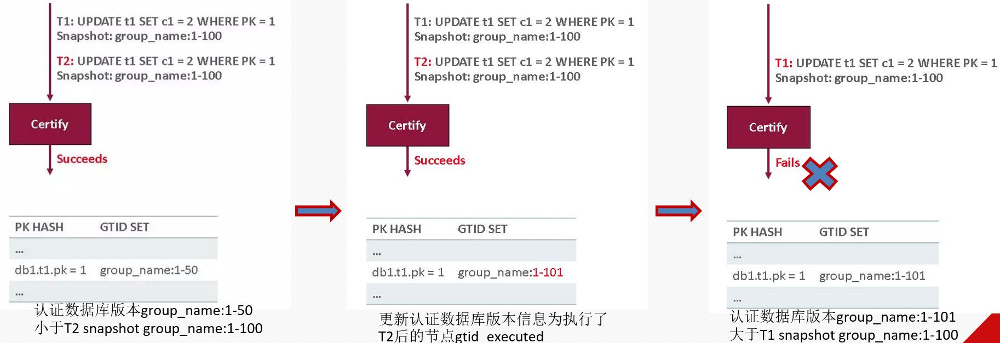

# 故障分析 | mysql mgr 多主数据不能更新案例浅析

**原文链接**: https://opensource.actionsky.com/20210824-mysql/
**分类**: MySQL 新特性
**发布时间**: 2021-08-23T23:57:55-08:00

---

作者：付祥
现居珠海，主要负责 Oracle、MySQL、mongoDB 和 Redis 维护工作。
本文来源：原创投稿
*爱可生开源社区出品，原创内容未经授权不得随意使用，转载请联系小编并注明来源。
## 1.故障现象
一套运行快两年的MGR三节点多主环境（5.7.25），在节点1成功导入一批数据后，开发反馈程序修改这批数据报错，报错信息如下：
`update match_equip set name = ?, type = ?, equips = ?,score = ? where id = ? and
person_id = ?
Received #3101 error from MySQL server: "Plugin instructed the server to rollback
the current transaction."
`
#### 1.1.尝试故障恢复操作1
经过初步分析，发现导入的这批数据，在导入节点1可以更新，在其他节点更新失败，怀疑1节点有问题，本着快速恢复故障原则，询问开发得知1节点可以重启，于是对其进行重启，重启后不能加入组复制，看来重启大法也不好使，报错信息如下：
`2021-05-27T07:37:53.290267Z 0 [ERROR] Plugin group_replication reported: 'This
member has more executed transactions than those present in the group. Local
transactions: 91f9d301-c234-11e9-
b15f-fa163e13423a:1-156817757:156843131-157503127:158192163-158412212,
a71d98a2-c234-11e9-b6db-fa163e3407f8:1-92,
eba21052-c250-11e9-b0d0-fa163e134234:1-3 > Group transactions: 91f9d301-c234-
11e9-b15f-fa163e13423a:1-156817825:156843131-157503172:158192163-158412212,
eba21052-c250-11e9-b0d0-fa163e134234:1-3'
2021-05-27T07:37:53.290348Z 0 [ERROR] Plugin group_replication reported: 'The
member contains transactions not present in the group. The member will now exit
the group.'
`
Local transactions：
`Local transactions:
91f9d301-c234-11e9-b15f-fa163e13423a:1-156817757:156843131-157503127:158192163-
158412212,
a71d98a2-c234-11e9-b6db-fa163e3407f8:1-92,
eba21052-c250-11e9-b0d0-fa163e134234:1-3
`
Group transactions：
`Group transactions:
91f9d301-c234-11e9-b15f-fa163e13423a:1-156817825:156843131-157503172:158192163-
158412212,
eba21052-c250-11e9-b0d0-fa163e134234:1-3
`
经过比较，本地节点已执行的gitd集合中 `a71d98a2-c234-11e9-b6db-fa163e3407f8:1-92` gtid 并不在Group transactions中，即 Local transactions 不是 Group transactions 子集，无法通过验证，加入集群失败。
#### 1.2. 尝试故障恢复操作2
通过正常节点物理备份还原的方式加入集群，还是报错：
`2021-05-27T08:35:01.331704Z 13 [ERROR] Plugin group_replication reported: 'The
certification information could not be set in this server: 'Certification
information is too large for transmission.''
2021-05-27T08:35:01.331752Z 13 [ERROR] Plugin group_replication reported: 'Error
when processing Certification information in the Recovery process'
2021-05-27T08:35:01.331762Z 13 [ERROR] Plugin group_replication reported: 'Fatal
error during the Recovery process of Group Replication. The server will leave the
group.
`
由于传输的集群冲突校验信息太大而加入集群失败：
`Certification information is too large for transmission
`
查看当前集群冲突检测信息：
`root@3306 performance_schema> select COUNT_TRANSACTIONS_ROWS_VALIDATING from
performance_schema.replication_group_member_stats;
+------------------------------------+
| COUNT_TRANSACTIONS_ROWS_VALIDATING |
+------------------------------------+
| 11239426 |
+------------------------------------+
1 row in set (0.00 sec)
`
当前冲突检测信息有1千多万条记录，正是由于这个信息太大导致加入集群失败。事情到这里，估计有人会认为碰上了 mysql bug ，实则不然，要解决这个问题，还得从 mgr 事务冲突检测机制说起。
## 2.故障分析与复现
#### 2.1.事务认证机制
参考文章：https://zhuanlan.zhihu.com/p/41175310
MGR 事务认证模块用于决定进入MGR的事务是继续提交还是需要被回滚，实现该功能的依据是判断冲突检测数据库（certification_info）中被该事务更新的各个主键的 gtid_set 是否为事务的快照版本 snapshot_version 的子集，若是则提交，否则进行回滚。

对于可继续提交的事务，为其分配 GTID 。随后该事务 writeset 中包含的各个主键会被插入/更新到 certification_info 中。可以预见，随着越来越多的事务被认证，certification_info 中的记录会越来越多。
如何清理 certification_info 中的记录？很显然，如果一个事务A经过认证后，已经在 MGR 集群的各个节点都提交了，也就是说各节点的 gtid_executed 都包含了该事务GTID，由于事务在集群中的全局有序性，还未被认证的事务一定是在本节点事务A之后或同时（无相互依赖）执行的，那么可以确定后续需要在 MGR 中认证的事务都不会跟事务A有冲突。所以，certification_info 中快照版本（snapshot_version）为事务A快照版本子集的那些记录都可以被清理掉。MGR的各个节点每隔60s会广播一次自己的 gtid_executed 。各节点收集一轮完整的节点 gtid_executed 取交集（stable_gtid_set），即可基于该交集实施清理操作。
certification_info 清理时，需要遍历其中的每条记录，将其中的 GTID_SET 跟 stable_gtid_set 进行对比，如果记录的 GTID_SET 是 stable_gtid_set 的子集则可清理。
#### 2.2.故障分析
##### 2.2.1.当前mgr中certification_info有11239426条记录，mgr每隔60s清理一次，为何会这么大？
节点1存在独立本地事务 `a71d98a2-c234-11e9-b6db-fa163e3407f8:1-92` ，当在1节点进行 dml 时，只要冲突认证通过，事务writeset中包含的各个主键便会被插入/更新到 certification_info 中，snapshot_version 信息便带有本地事务标识 `a71d98a2-c234-11e9-b6db-fa163e3407f8:1-92` ，当 certification_info 清理时，各节点 gtid_executed 交集永远不会包含 `a71d98a2-c234-11e9-b6dbfa163e3407f8:1-92` 这段gitd集合，故1节点dml操作产生的 certification_info 永远不会被清理，日积月累，certification_info 就达到了1000多万。
##### 2.2.2.节点1 dml操作提交后的数据为何在其他节点不能更新？
假设：
节点1、2、3的 server_uuid 分别为A、B、C,全局事务 uuid 为：G
节点1存在本地独立事务：`A:1-XXX`
节点1`Executed_Gtid_Set`：`G:1-XXX,A:1-XXX`
节点2`Executed_Gtid_Set`：`G:1-XXX`
节点3`Executed_Gtid_Set`：`G:1-XXX`
节点1`dml`产生的 certification_info 信息为：`G:1-XXX,A:1-XXX`，其他节点对节点1修改后的数据进行更新时，certification_info 中 snapshot_version ：`G:1-XXX,A:1-XXX`，当前事务快照版本`G:1-XXX`，`G:1-XXX,A:1-XXX`永远不可能是`G:1-XXX`子集，故冲突认证失败，事务回滚：
`Plugin instructed the server to rollback the current transaction
`
#### 2.3.故障模拟复现
##### 2.3.1.环境准备，构造节点3含有本地事务
节点2、节点3故意不关闭参数`sql_log_in`修改 root 初始密码产生一个本地 gtid ：
`[root@mysql.sock][(none)]> show master status;
ERROR 1820 (HY000): You must reset your password using ALTER USER statement
before executing this statement.
[root@mysql.sock][(none)]>
[root@mysql.sock][(none)]>
[root@mysql.sock][(none)]> alter user root@'localhost' identified by '***';
Query OK, 0 rows affected (0.05 sec)
[root@mysql.sock][(none)]> show master status;
+------------------+----------+--------------+------------------+----------------
------------------------+
| File | Position | Binlog_Do_DB | Binlog_Ignore_DB | Executed_Gtid_Set
|
+------------------+----------+--------------+------------------+----------------
------------------------+
| MySql-bin.000002 | 391 | | | f1b251a9-bf54-11eb-a4fd-
000c299b4d6c:1 |
+------------------+----------+--------------+------------------+----------------
------------------------+
1 row in set (0.00 sec)
`
接下来各个节点依次执行一些初始化操作：
`SET SQL_LOG_BIN=0;
CREATE USER rpl_user@'%' IDENTIFIED BY '*****';
GRANT REPLICATION SLAVE ON *.* TO rpl_user@'%';
FLUSH PRIVILEGES;
SET SQL_LOG_BIN=1;
CHANGE MASTER TO MASTER_USER='rpl_user', MASTER_PASSWORD=''*****' FOR CHANNEL
'group_replication_recovery';
INSTALL PLUGIN group_replication SONAME 'group_replication.so';
`
###### 2.3.1.1.节点1作为引导节点启动mgr集群
`SET GLOBAL group_replication_bootstrap_group=ON;
START GROUP_REPLICATION;
SET GLOBAL group_replication_bootstrap_group=OFF;
`
###### 2.3.1.2.节点2加入集群：
2号节点存在本地事务`start group_replication`失败：
`[ERROR] Plugin group_replication reported: 'This member has more executed
transactions than those present in the group. Local transactions: 332ee50a-bf55-
11eb-b407-000c293fd895:1 > Group transactions: 91f9d3
01-c234-11e9-b15f-fa163e13423a:1,
f1b251a9-bf54-11eb-a4fd-000c299b4d6c:1-2'
`
`reset master`，重置 binlog 后再加入成功。
###### 2.3.1.3.节点3加入集群:
同理，3节点加入集群同样失败，通过设置参数：
`set global group_replication_allow_local_disjoint_gtids_join=1
`
不校验本地事务后成功加入集群。
##### 2.3.2.故障模拟及恢复
###### 2.3.2.1.当前环境信息：节点3含有本地事务
`root@mysql.sock][fxtest]> select * from
performance_schema.replication_group_members;
+---------------------------+--------------------------------------+-------------
+-------------+--------------+
| CHANNEL_NAME | MEMBER_ID | MEMBER_HOST | MEMBER_PORT |
MEMBER_STATE |
+---------------------------+--------------------------------------+-------------
+-------------+--------------+
| group_replication_applier | 332ee50a-bf55-11eb-b407-000c293fd895 | fxtest02 |
3307 | ONLINE |
| group_replication_applier | 34668704-bf55-11eb-b120-000c29ed3768 | fxtest03 |
3307 | ONLINE |
| group_replication_applier | f1b251a9-bf54-11eb-a4fd-000c299b4d6c | fxtest01 |
3307 | ONLINE |
+---------------------------+--------------------------------------+-------------
+-------------+--------------+
`
查看每个节点 Executed_Gtid_Set ：
`#节点1：
root@mysql.sock][fxtest]> show master status;
+------------------+----------+--------------+------------------+----------------
---------------------------+
| File     | Position | Binlog_Do_DB | Binlog_Ignore_DB | Executed_Gtid_Set
|
+------------------+----------+--------------+------------------+----------------
---------------------------+
| MySql-bin.000001 | 1152 | | | 91f9d301-c234-11e9-b15ffa163e13423a:1-29 |
+------------------+----------+--------------+------------------+----------------
---------------------------+
`
`#节点2：
root@mysql.sock][fxtest]> show master status;
+------------------+----------+--------------+------------------+----------------
---------------------------+
| File     | Position | Binlog_Do_DB | Binlog_Ignore_DB | Executed_Gtid_Set
|
+------------------+----------+--------------+------------------+----------------
---------------------------+
| MySql-bin.000001 | 1152 | | | 91f9d301-c234-11e9-b15ffa163e13423a:1-29 |
+------------------+----------+--------------+------------------+----------------
---------------------------+
1 row in set (0.02 sec)
`
`#节点3：
root@mysql.sock][performance_schema]> show master status;
+------------------+----------+--------------+------------------+----------------
-------------------------------------------------------------------+
| File      | Position | Binlog_Do_DB | Binlog_Ignore_DB | Executed_Gtid_Set
|
+------------------+----------+--------------+------------------+----------------
-------------------------------------------------------------------+
| MySql-bin.000001 | 1319 | | | 34668704-bf55-11eb-b120-000c29ed3768:1,
91f9d301-c234-11e9-b15f-fa163e13423a:1-29 |
+------------------+----------+--------------+------------------+----------------
-------------------------------------------------------------------+
1 row in set (0.00 sec)
`
可以看到节点3多了一个本地事务 `34668704-bf55-11eb-b120-000c29ed3768:1`
###### 2.3.2.2.场景1：节点3新增数据后，其他节点进行更新
在节点3上执行新增数据：
`root@mysql.sock][fxtest]> create table mgr_test1(id int primary key,name
varchar(10));
Query OK, 0 rows affected (0.02 sec)
[root@mysql.sock][fxtest]> insert into mgr_tes
t1 values(1,'a');
Query OK, 1 row affected (0.00 sec)
`
节点1执行修改：
`root@mysql.sock][fxtest]> update mgr_test1 set name='aa' where id=1;
ERROR 3101 (HY000): Plugin instructed the server to rollback the current
transaction.
[root@mysql.sock][fxtest]>
`
节点2执行修改：
`root@mysql.sock][fxtest]> update mgr_test1 set name='aa' where id=1;
ERROR 3101 (HY000): Plugin instructed the server to rollback the current
transaction.
[root@mysql.sock][fxtest]>
`
结论：节点1、2都不能修改节点3新增的数据。
###### 2.3.2.3.场景2：其他节点新增数据，节点3修改后，其他节点再次更新
节点1：
`root@mysql.sock][fxtest]> insert into mgr_test1 values(11,'aa');
Query OK, 1 row affected (0.01 sec)
`
节点2：
`root@mysql.sock][fxtest]> insert into mgr_test1 values(22,'aa');
Query OK, 1 row affected (0.00 sec)
`
节点3：
`root@mysql.sock][fxtest]> update mgr_test1 set name='11' where id=11;
Query OK, 1 row affected (0.01 sec)
Rows matched: 1 Changed: 1 Warnings: 0
[root@mysql.sock][fxtest]> update mgr_test1 set name='22' where id=22;
Query OK, 1 row affected (0.01 sec)
Rows matched: 1 Changed: 1 Warnings: 0
`
之后节点1、2再修改数据报错：
`root@mysql.sock][fxtest]> update mgr_test1 set name='aaa' where id=11;
ERROR 3101 (HY000): Plugin instructed the server to rollback the current
transaction.
[root@mysql.sock][fxtest]> update mgr_test1 set name='aaa' where id=22;
ERROR 3101 (HY000): Plugin instructed the server to rollback the current
transaction.
[root@mysql.sock][fxtest]>
`
###### 2.3.2.4.故障修复
###### 2.3.2.5.场景1：节点3本地事务对应 binlog 还存在，如何修复
只需重启节点1、2组复制即可同步过来节点3的本地事务。下面演示重启节点1：
`root@mysql.sock][fxtest]> show master status;
+------------------+----------+--------------+------------------+----------------
-------------------------------------------+
| File   | Position | Binlog_Do_DB | Binlog_Ignore_DB | Executed_Gtid_Set
|
+------------------+----------+--------------+------------------+----------------
-------------------------------------------+
| MySql-bin.000001 | 3386 | | | 91f9d301-c234-11e9-b15ffa163e13423a:1-35:1000029:2000029 |
+------------------+----------+--------------+------------------+----------------
-------------------------------------------+
1 row in set (0.03 sec)
[root@mysql.sock][fxtest]> stop group_replication;
Query OK, 0 rows affected (9.73 sec)
[root@mysql.sock][fxtest]> start group_replication;
Query OK, 0 rows affected (3.24 sec)
[root@mysql.sock][fxtest]> show master status;
+------------------+----------+--------------+------------------+----------------
---------------------------------------------------------------------------------
--+
| File   | Position | Binlog_Do_DB | Binlog_Ignore_DB | Executed_Gtid_Set
|
+------------------+----------+--------------+------------------+----------------
---------------------------------------------------------------------------------
--+
| MySql-bin.000001 | 4935 | | | 34668704-bf55-11eb-b120-
000c29ed3768:1,
91f9d301-c234-11e9-b15f-fa163e13423a:1-36:1000029:2000029 |
+------------------+----------+--------------+------------------+----------------
---------------------------------------------------------------------------------
--+
1 row in set (0.00 sec)
`
重启1号节点组复制成功，且节点3本地事务`34668704-bf55-11eb-b120-000c29ed3768:1`也同步过来了。
###### 2.3.2.6.场景2：节点3本地事务对应 binlog 已经不在了，如何修复
清空3号节点 binlog ，模拟本地事务对应 binlog 被删除，并关闭1节点组复制，重启2号节点组复制，使其只能从3号节点同步。
`#清空节点3本地事务对应binlog
root@mysql.sock][fxtest]> show binary logs;
+------------------+-----------+
| Log_name | File_size |
+------------------+-----------+
| MySql-bin.000001 | 4968 |
+------------------+-----------+
1 row in set (0.00 sec)
[root@mysql.sock][fxtest]> flush logs;
Query OK, 0 rows affected (0.00 sec)
[root@mysql.sock][fxtest]> show binary logs;
+------------------+-----------+
| Log_name | File_size |
+------------------+-----------+
| MySql-bin.000001 | 5011 |
| MySql-bin.000002 | 262 |
+------------------+-----------+
2 rows in set (0.00 sec)
[root@mysql.sock][fxtest]> purge binary logs to 'MySql-bin.000002';
Query OK, 0 rows affected (0.01 sec)
[root@mysql.sock][fxtest]> show binary logs;
+------------------+-----------+
| Log_name | File_size |
+------------------+-----------+
| MySql-bin.000002 | 262 |
+------------------+-----------+
1 row in set (0.00 sec)
`
关闭1号节点组复制：
`root@mysql.sock][fxtest]> stop group_replication;
Query OK, 0 rows affected (9.57 sec)
`
重启2号节点组复制失败，2号节点从3号节点同步数据，3号节点本地事务对应 binlog 被删除了，故2号节点加入集群失败，一直处于 recovering 状态，2号节点日志如下：
`2021-05-28T09:58:28.091303Z 276 [ERROR] Error reading packet from server for
channel 'group_replication_recovery': The slave is connecting using CHANGE MASTER
TO MASTER_AUTO_POSITION = 1, but the master has purged binary logs containing
GTIDs that the slave requires. Replicate the missing transactions from elsewhere,
or provision a new slave from backup. Consider increasing the master's binary log
expiration period. The GTID set sent by the slave is '91f9d301-c234-11e9-b15ffa163e13423a:1-36:1000029:2000029', and the missing transactions are '34668704-
bf55-11eb-b120-000c29ed3768:1'. (server_errno=1236)
`
`root@mysql.sock][fxtest]> select * from
performance_schema.replication_group_members;
+---------------------------+--------------------------------------+-------------
+-------------+--------------+
| CHANNEL_NAME | MEMBER_ID | MEMBER_HOST | MEMBER_PORT |
MEMBER_STATE |
+---------------------------+--------------------------------------+-------------
+-------------+--------------+
| group_replication_applier | 332ee50a-bf55-11eb-b407-000c293fd895 | fxtest02 |
3307 | RECOVERING |
| group_replication_applier | 34668704-bf55-11eb-b120-000c29ed3768 | fxtest03 |
3307 | ONLINE |
`
故2号节点只能通过reset master，set global gtid_purged方式加入集群：
`stop group_replication;
reset master;
set global gtid_purged='91f9d301-c234-11e9-b15f-fa163e13423a:1-
36:1000029:2000029,34668704-bf55-11eb-b120-000c29ed3768:1';
start group_replication;
`
## 3.总结
在搭建 MGR 时：
1、一定要保证 mgr 是干净的，即只含有全局 gtid 事务，不含本地 gtid 事务，在启动 mgr 前的初始化阶段，操作命令前要关闭写 binlog 日志。
2、当成员加入集群，启动组复制报错：
`This member has more executed transactions than those present in the group
`
这说明环境不干净，有本地事务，千万不要设置参数 `group_replication_allow_local_disjoint_gtids_join=1` 这会给以后留下隐患，估计官方已经意识到这个问题严重性，在8.0.4版本后被移除：
`group_replication_allow_local_disjoint_gtids_join: Allow current server to join
group even if it has transactions not present in group. Removed in MySQL 8.0.4.
`