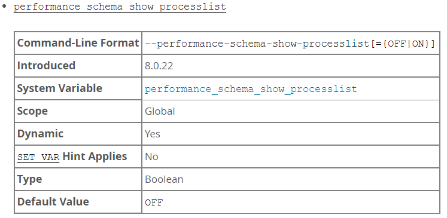

# 故障分析 | show processlist 引起的性能问题

**原文链接**: https://opensource.actionsky.com/20220711-mysql/
**分类**: MySQL 新特性
**发布时间**: 2022-07-11T00:43:56-08:00

---

> 作者：王祥
爱可生 DBA 团队成员，主要负责 MySQL 故障处理和性能优化。对技术执着，为客户负责。
本文来源：原创投稿
*爱可生开源社区出品，原创内容未经授权不得随意使用，转载请联系小编并注明来源。
&#8212;
#### 背景信息
业务监控发现交易的平均响应时间比之前慢了近一倍，需要排查一下数据库是不是响应慢了。生产MySQL版本为8.0.18，一主3从半同步复制。
#### 故障分析
首先对比查看了交易正常时段与出现异常的时段各项监控指标（cpu、qps、tps、磁盘IO等）都未发现明显的变化。接下来查看slow log发现了较多的慢SQL，而且是普通的insert语句，执行时长超过1秒。进一步观察对比发现，每次insert慢都是出现在同一秒，insert慢语句条数基本在30条左右，而且出现的间隔都是两分钟或两分钟的倍数。根据这个规律第一感觉是不是定时任务引起的问题。经过对定时任务的排查最终定位到监控脚本，监控脚本为两分钟执行一次。接下来需要排查一下，具体是哪部分导致insert慢。为了快速复现问题，直接在一个从库上使用mysqlslap进行压测。从业务那得知问题insert语句每秒会有60-80次的写入量，压测语句如下：
mysqlslap -h127.0.0.1 -uroot -p --concurrency=80 --iterations=10 --create-schema=userdb --query=/root/test.sql --engine=innodb --number-of-queries=50000#test.sqlinsert into userdb.ps (clo1, clo2, clo3, clo4, clo4, clo5, clo6) values (substring(MD5(RAND()),1,20), 'fffffdddddddddd', '0', '', 'aaaaaaaaaaaaaaaaaaaaaaaaaaaaaaaaaaaaaaaaaaaaaaaaaaaaaaaaaaaaaaaaaaaaaaaaaaaaaaaddddddddd', '2022-06-17 16:00:38.145', 34);
在压测期间执行监控脚本，一边查看slow log，能稳定复现生产的现象。通过排除法，最终定位到几个使用information_schema.processlist表的语句导致了insert慢。那information_schema.processlist为什么会导致insert慢呢？带着这个问题去查看一下官方对information_schema.processlist的描述。
The default SHOW PROCESSLIST implementation iterates across active threads from within the thread manager while holding a global mutex. This has negative performance consequences, particularly on busy systems. The alternative SHOW PROCESSLIST implementation is based on the Performance Schema processlist table. This implementation queries active thread data from the Performance Schema rather than the thread manager and does not require a mutex.
根据官方的说明：在使用默认的show processlist会持有全局互斥锁，在业务繁忙的系统上会导致性能问题。同时也给出了解决办法，使用Performance Schema中的processlist代替，此方式不会产生全局互斥锁。
performance_schema_show_processlist是MySQL 8.0.22版本引入的新功能。接下来我们来看看官方对Performance Schema中的processlist描述。

The SHOW PROCESSLIST statement provides process information by collecting thread data from all active threads. The performance_schema_show_processlist variable determines which SHOW PROCESSLIST implementation to use:The default implementation iterates across active threads from within the thread manager while holding a global mutex. This has negative performance consequences, particularly on busy systems.The alternative SHOW PROCESSLIST implementation is based on the Performance Schema processlist table. This implementation queries active thread data from the Performance Schema rather than the thread manager and does not require a mutex.
如果开启参数performance_schema_show_processlist，show processlist使用Performance Schema中的processlist避免了全局互斥锁的问题，如果不开启该参数则show processlist使用information_schema.processlist会产生全局锁。
在配置文件[mysqld]下加上performance_schema_show_processlist=on配置。配置完成后，查看performance_schema下的processlist。
root@localhost:mysql.sock [(none)]> show variables like 'performance_schema_show_processlist';+-------------------------------------+-------+| Variable_name                       | Value |+-------------------------------------+-------+| performance_schema_show_processlist | ON    |+-------------------------------------+-------+#信息与information_schema.processlist下保持一致root@localhost:mysql.sock [(none)]> select * from performance_schema.processlist\G*************************** 1. row ***************************     ID: 5   USER: event_scheduler   HOST: localhost     DB: NULLCOMMAND: Daemon   TIME: 354  STATE: Waiting on empty queue   INFO: NULL*************************** 2. row ***************************     ID: 8   USER: root   HOST: localhost     DB: NULLCOMMAND: Query   TIME: 0  STATE: executing   INFO: select * from performance_schema.processlist2 rows in set (0.00 sec)
#### 总结
1.使用MySQL 8.0.22之前的版本，在业务繁忙的敏感系统上执行show processlist需要谨慎。
2.使用MySQL 8.0.22之后版本， 可以开启performance_schema_show_processlist避免该问题。但依旧不建议频繁查询会话信息。
另外查询processlist表导致MySQL 实例crash问题，请参考文章：https://mp.weixin.qq.com/s/qRc6mGk4_jvc2rHBIKojiQ
**参考：**
[https://dev.mysql.com/doc/refman/8.0/en/performance-schema-processlist-table.html](https://dev.mysql.com/doc/refman/8.0/en/performance-schema-processlist-table.html)
[https://dev.mysql.com/doc/refman/8.0/en/performance-schema-system-variables.html#sysvar_performance_schema_show_processlist](https://dev.mysql.com/doc/refman/8.0/en/performance-schema-system-variables.html#sysvar_performance_schema_show_processlist)