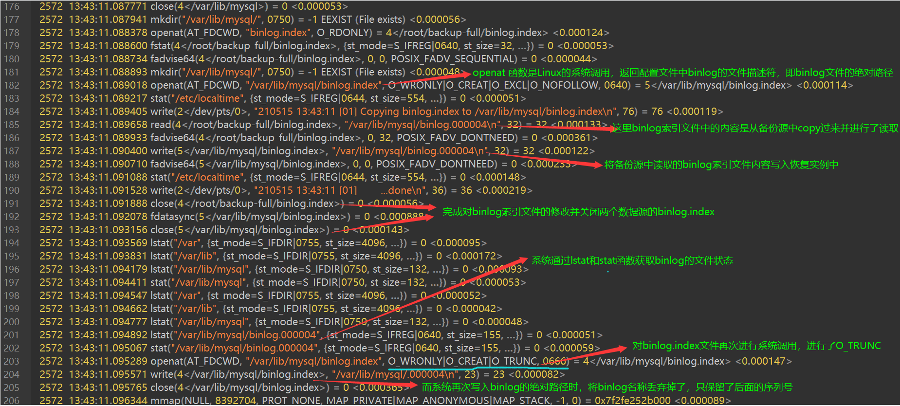
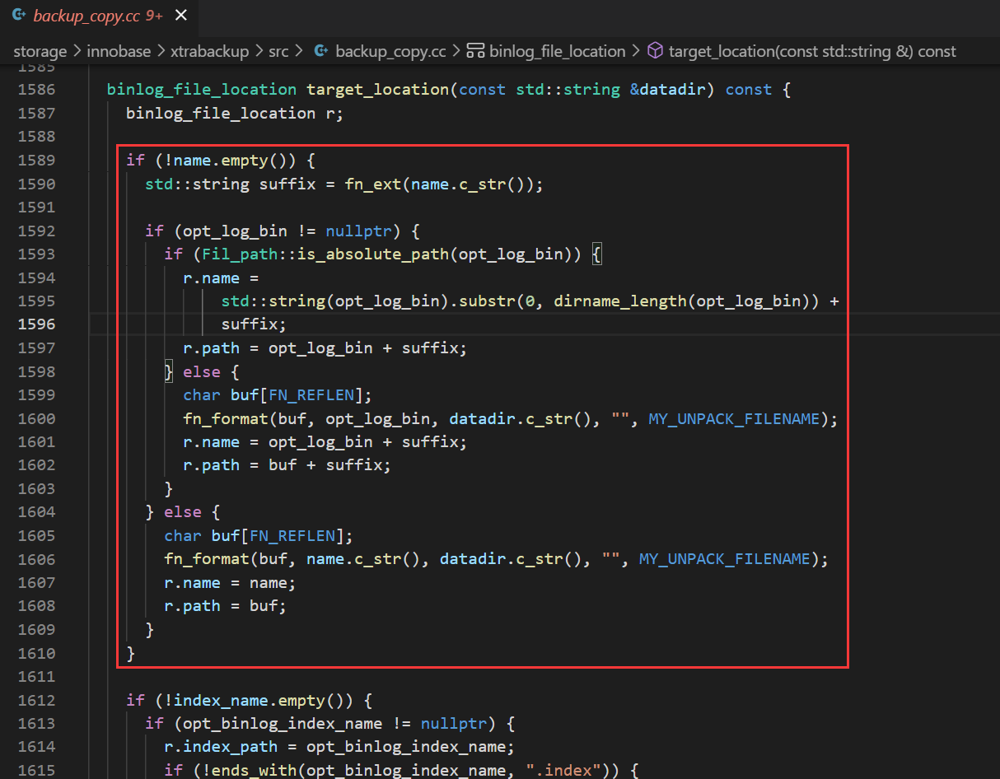
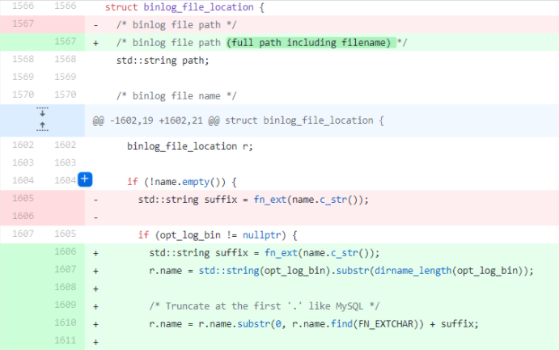

# 故障分析 | xtrabackup 吃掉了MySQL的 binlog 文件名？

**原文链接**: https://opensource.actionsky.com/20210809-xtrabackup-binlog/
**分类**: 技术干货
**发布时间**: 2021-08-09T23:17:12-08:00

---

作者：刘开洋
爱可生交付服务团队北京 DBA，对数据库及周边技术有浓厚的学习兴趣，喜欢看书，追求技术。
本文来源：原创投稿
*爱可生开源社区出品，原创内容未经授权不得随意使用，转载请联系小编并注明来源。
前段时间在 centos 8 环境上做 MySQL 的备份恢复测试的时候，遇到一个问题，下面跟大家分享下。
## 1、讲环境
| 服务器 OS | 数据库版本 | 备份工具 |
| --- | --- | --- |
| Centos 8 for X86 | mysql 8.0.18 | xtrabackup 8.0.10 |
小编的问题场景出现在 centos 8 上，验证也使用了 centos 8 版本，不过相信看到最后你会发现这个问题和 OS 关系不大，我们继续往下看。
## 2、说问题
从备份到恢复的过程还挺顺利，但是在最后启动数据库时出现了下面的问题，仔细看看，好像数据库的 binlog 文件名被吃掉了。
`2021-03-08T16:48:08.510032+08:00 0 [Warning] [MY-010097] [Server] Insecure configuration for --secure-file-priv: Current value does not restrict location of generated files. Consider setting it to a valid, non-empty path.
2021-03-08T16:48:08.510125+08:00 0 [System] [MY-010116] [Server] /usr/sbin/mysqld (mysqld 8.0.18) starting as process 16556
mysqld: File '/var/lib/mysql/.000003' not found (OS errno 2 - No such file or directory)
2021-03-08T16:48:09.196673+08:00 0 [ERROR] [MY-010958] [Server] Could not open log file.
2021-03-08T16:48:09.196787+08:00 0 [ERROR] [MY-010041] [Server] Can't init tc log
2021-03-08T16:48:09.196961+08:00 0 [ERROR] [MY-010119] [Server] Aborting
2021-03-08T16:48:10.632676+08:00 0 [System] [MY-010910] [Server] /usr/sbin/mysqld: Shutdown complete (mysqld 8.0.18)  MySQL Community Server - GPL.
`
不要慌，这个现象可能是 binlog 的索引文件在数据库恢复的时候修改出错，就会导致数据库启动失败的情况，解决方案很简单，这里 MySQL 报错输出的是 binlog.index 文件中的信息，只要将 binlog 名重写，之后再启动数据库即可恢复。
当然这不是我们这篇文章的重点，重点是讨论下为什么 xtrabackup 会因为 binlog 文件名不一致就只 delete 而不进行 insert 呢？因为之前的测试由于疏忽，没有确认配置文件是否一致，结果报错后发现备份恢复的两套环境中的 binlog 文件名不一致，因此猜测是因为binlog 文件名问题导致的这次故障发生，以小编既往故障案例的特点，我们还是先进行一个 review 复现吧。
## 3、搞测试
大体测试流程如下：
(1) 准备 MySQL 8.0.18 环境，使用对应的 xtrabackup 做一个全备
`[root@yang ~]# xtrabackup --defaults-file=/etc/my.cnf --host=192.168.1.7 --user=root --password=123 --port=3306 --backup --target-dir=/root/backup-full/
xtrabackup: recognized server arguments: --datadir=/var/lib/mysql --server-id=1 --log_bin=/var/lib/mysql/mysql-bin
xtrabackup: recognized client arguments: --host=192.168.1.7 --user=root --password=* --port=3306 --backup=1 --target-dir=/root/backup-full/
xtrabackup version 8.0.10 based on MySQL server 8.0.18 Linux (x86_64) (revision id: 94f9645)
210515 12:11:55  version_check Connecting to MySQL server with DSN 'dbi:mysql:;mysql_read_default_group=xtrabackup;host=192.168.1.7;port=3306' as 'root'  (using password: YES).
210515 12:11:55  version_check Connected to MySQL server
210515 12:11:55  version_check Executing a version check against the server...
# A software update is available:
210515 12:12:00  version_check Done.
210515 12:12:00 Connecting to MySQL server host: 192.168.1.7, user: root, password: set, port: 3306, socket: not set
Using server version 8.0.18
xtrabackup: uses posix_fadvise().
······
210515 12:12:04 completed OK!
// 备份完成
`
(2) 修改新实例配置文件中的 binlog 文件名，人为制造我们遇到的故障点
`[root@yang ~]# cat /etc/my.cnf | grep log_bin
log_bin = /var/lib/mysql/binlog
[root@yang ~]# vim /etc/my.cnf
[root@yang ~]# cat /etc/my.cnf | grep log_bin
log_bin = /var/lib/mysql/mysql-bin
`
(3) 准备恢复环境
`[root@yang ~]# pkill mysqld
[root@yang ~]# rm -rf /var/lib/mysql
[root@yang ~]# cd backup-full/
[root@yang backup-full]# ls
backup-my.cnf    ib_buffer_pool   ibdata1   mysql    binlog.000004    binlog.index    mysql.ibd  
performance_schema   sys    test   undo_001    undo_002   xtrabackup_binlog_info      xtrabackup_checkpoints      
xtrabackup_info    xtrabackup_logfile    xtrabackup_tablespaces
[root@yang backup-full]# cat binlog.index
/var/lib/mysql/binlog.000004
`
(4) xtrabackup 的 prepare 过程，即数据准备阶段
`[root@yang ~]# xtrabackup --defaults-file=/etc/my.cnf --user=root --prepare --target-dir=/root/backup-full/
······
210515 12:14:28 completed OK!
[root@yang ~]# cat backup-full/binlog.index
/var/lib/mysql/binlog.000004
`
(5) xtrabackup 的 copy-back 过程，即最后数据的恢复阶段
`[root@yang ~]# xtrabackup --defaults-file=/etc/my.cnf --user=mysql --copy-back --target-dir=/root/backup-full/
xtrabackup: recognized server arguments: --datadir=/var/lib/mysql --server-id=1 --log_bin=/var/lib/mysql/binlog
xtrabackup: recognized client arguments: --user=mysql --copy-back=1 --target-dir=/root/backup-full/
xtrabackup version 8.0.10 based on MySQL server 8.0.18 Linux (x86_64) (revision id: 94f9645)
210515 12:14:51 [01] Copying undo_001 to /var/lib/mysql/undo_001
······
210515 12:14:51 [01] Copying ./xtrabackup_info to /var/lib/mysql/xtrabackup_info
210515 12:14:51 [01]        ...done
210515 12:14:51 [01] Copying ./xtrabackup_master_key_id to /var/lib/mysql/xtrabackup_master_key_id
210515 12:14:51 [01]        ...done
210515 12:14:51 [01] Copying ./ibtmp1 to /var/lib/mysql/ibtmp1
210515 12:14:51 [01]        ...done
210515 12:14:51 [01] Creating directory ./#innodb_temp
210515 12:14:51 [01] ...done.
210515 12:14:51 completed OK!
[root@yang ~]# cat backup-full/binlog.index
/var/lib/mysql/binlog.000004
`
(6) 环境复现
`[root@yang ~]# chown -R mysql:mysql /var/lib/mysql/*
[root@yang ~]# /usr/sbin/mysqld --defaults-file=/etc/my.cnf --user=mysql &
[1] 1545
[root@yang ~]#
[1]+ Exit 1                  /usr/sbin/mysqld --defaults-file=/etc/my.cnf --user=mysql
[root@yang ~]# tail -f /var/log/mysqld.log
2021-05-15T12:20:18.510125+08:00 0 [System] [MY-01016] [Server] /usr/sbin/mysqld (mysqld 8.0.18) starting as process 1545
mysqld: File '/var/lib/mysql/.000004' not found (OS errno 2 - No such file or directory)
2021-05-15T12:20:18.596673+08:00 0 [ERROR] [MY-010958] [Server] Could not open log file.
2021-05-15T12:20:18.596787+08:00 0 [ERROR] [MY-010041] [Server] Can't init tc log
2021-05-15T12:20:18.596961+08:00 0 [ERROR] [MY-010119] [Server] Aborting
2021-05-15T12:20:19.132676+08:00 0 [System] [MY-010910] [Server] /usr/sbin/mysqld: Shutdown complete (mysqld 8.0.18)  MySQL Community Server - GPL.
[root@yang ~]# ls /var/lib/mysql |grep bin
mysql-bin.000004
mysql-bin.index
[root@yang ~]# cat /var/lib/mysql/mysql-bin.index
/var/lib/mysql/.000004
`
在以上操作中，每操作一步我们就查看下备份源中的 binlog 文件是否被篡改，发现并没有，只有最后 copy-back 数据的时候发生了 binlog.index 文件的更改。
(7) 我们做一个猜测，会不会即使 binlog 名称相同也会导致这种报错吗？来测试一下
`[root@yang mysql]# cat /etc/my.cnf | grep log_bin  // 修改配置文件与备份源的binlog文件名相同
log_bin = /var/lib/mysql/binlog
[root@yang ~]# rm -rf /var/lib/mysql/*
[root@yang ~]# xtrabackup --defaults-file=/etc/my.cnf --user=mysql --copy-back --target-dir=/root/backup-full/
······
[root@yang mysql]# cat /var/lib/mysql/binlog.index
/var/lib/mysql/.000004
`
有验证的猜测就不是算命了，那么就排除了 xtrabackup 备份时 binlog 名称不一致的问题，那么怎么进一步确定 xtrabackup 的行为呢？
(8) 再次删除数据恢复数据的过程中进行 strace 监控，看看 xtrabackup 到底做了什么
`// 在copy-back过程中，另开一个会话输出xtrabackup 的strace
[root@yang ~]# ps aux |grep xtrabackup | grep -v 'color=auto' | awk '{print $2}' | xargs strace -o strace_output-copy_write.txt -T -tt -f -y -s 3000 -e trace=all -p
strace: Process 2572 attached
strace: Process 2575 attached
`
## 4、聊分析
接下来我们看 strace 的输出分析 strace_output-copy_write.txt ，如下所示：

上图的说明将我们指向了 xtrabackup 的判断逻辑出现了问题，如果继续分析我们可以将 xtrabackup 打一个源码包，进而使用 gdb 进行分析源代码中的逻辑判断的方法来继续分析，相关使用步骤这里不做过多说明。有兴趣的同学可以参考社区中的《一问一实验》专栏的第9问、第12问和第32问，以及文末的参考文档。
关于逻辑判断问题大体出在了下图源码中，官方的 requests 中发现该问题在新版本 xtrabackup 中已经得到解决，附上链接：https://github.com/percona/percona-xtrabackup/pull/1094 。

代码变更：

## 5、扯总结
本篇文章概括内容有两点：
(1) 遇到备份时 MySQL 启动报错 binlog 名称丢掉的情况可能是 binlog.index 文件中信息丢失，如果是这种情况只要重写该文件重启即可完成数据库的恢复。
(2) 使用 xtrabackup 版本 from percona-xtrabackup-8.0.6 to percona-xtrabackup-8.0.23-16 时需要注意 binlog 文件名如果配置了绝对路径，发生文章中这种报错提前预知，官方已于https://github.com/percona/percona-xtrabackup/blob/percona-xtrabackup-8.0.25-17/storage/innobase/xtrabackup/src/backup_copy.cc 版本修复。
## 6、来参考
- 
strace 的使用技巧：一问一实验/12：Table cache 有什么作用
- 
gdb 的使用：一问一实验/09 &#8211; MySQL 莫名崩溃, 如何保留现场
- 
参考 MySQL 的调试版本编译 xtrabackup ：一问一实验/39：如何编译 MySQL 的调试版本
- 
xtrabackup 编译：https://www.percona.com/doc/percona-xtrabackup/8.0/installation/compiling_xtrabackup.html（文章中有一个坑，建议 cmake 不要使用-B参数）
- 
源码变更：https://github.com/percona/percona-xtrabackup/commit/d27028be415b8a1940066d993ca9fa7f1ce1b675
- 
bug 修复版本：https://github.com/percona/percona-xtrabackup/blob/percona-xtrabackup-8.0.25-17/storage/innobase/xtrabackup/src/backup_copy.cc
- 
Linux 系统调用函数解释：https://man7.org/linux/man-pages/man2/open.2.html
ps：问题涉及的故障点很容易处理，本篇主要是跟大家分享一些工具的使用以及问题的分析思路，多多学习 MySQL 周边，共同进步。