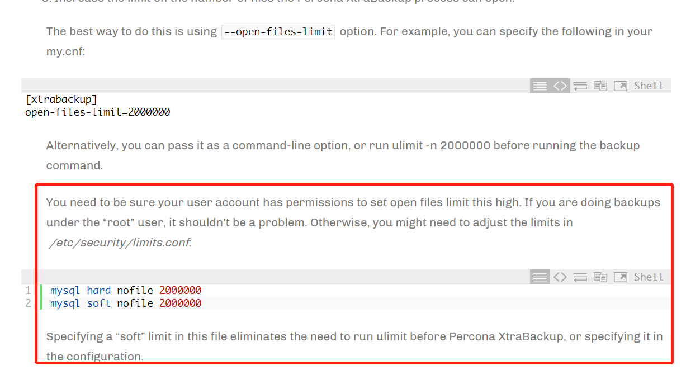

# 故障分析 | xtrabackup 多表备份报错“ too many open files ”

**原文链接**: https://opensource.actionsky.com/20220816-xtrabackup/
**分类**: 技术干货
**发布时间**: 2022-08-16T00:51:49-08:00

---

作者：汤薇
爱可生南区DBA组成员，主要负责MySQL的日常维护及故障处理。擅长多种数据库的运维经验及故障调优。
本文来源：原创投稿
*爱可生开源社区出品，原创内容未经授权不得随意使用，转载请联系小编并注明来源。
#### 一、背景描述
最近使用 xtrabackup 工具对 mysql 实例进行备份时，由于实例的 ibd 文件过多，而备份用户 的 open files 参数设置的值太小，在备份实例时打开的文件数量超过了备份用户允许打开的文件 数量限制，导致备份失败，其报错如下：
220330 08:28:47 >> log scanned up to (328701072168)
InnoDB: Operating system error number 24 in a file operation.
InnoDB: Error number 24 means 'Too many open files'
InnoDB: Some operating system error numbers are described at
http://dev.mysql.com/doc/refman/5.7/en/operating-system-error-codes.html
InnoDB: File ./stage/ts_cg_inteltaxtochanges #P#P_20220322.ibd: 'open' returned OSerror 124. Cannot continue operation
InnoDB: Cannot continue operation.
#### 二、模拟故障场景
##### 1、环境说明
mysql 版本： v5.7.35
xtrabackup 版本：v2.4.24
##### 2、查看 open files 的已知参数值
（1）操作系统当前的 open files 数量
[root@test ~]# ulimit -a
core file size (blocks, -c) 0
...
open files (-n) 1024
...
（2）mysql 实例配置文件 my.cnf 的 innodb_file_per_table、open_files_limit 参数值
[root@test ~]# less /opt/mysql/etc/3306/my.cnf |grep innodb_file_per_table
innodb_file_per_table = 1
[root@test ~]# less /opt/mysql/etc/3306/my.cnf |grep open_files_limit
open_files_limit = 20000
（3）备份用户 actiontech-mysql 在 /etc/security/limits.d 中的配置文件的 open files 的限制
[root@test ~]# cd /etc/security/limits.d
[root@test limits.d]# cat actiontech-mysql.conf
actiontech-mysql soft nofile 10240
actiontech-mysql hard nofile 10240
actiontech-mysql soft nproc 65535
actiontech-mysql hard nproc 65535
[root@test limits.d]# su -s $(which bash) actiontech-mysql
bash-4.2$ ulimit -a
core file size (blocks, -c) 0
...
open files (-n) 10240
...
##### 3、使用 sysbench 生成大量数据表
[root@test ~]# /usr/share/sysbench/oltp_read_write.lua --table-size=1000 --tables=12000 --mysql-user=root --mysql-password=1 --mysql-host=127.0.0.1 --mysql-port=3306 --mysql-db=testdb --threads=250 --time=60 --report-interval=3 --skiptrx=on --mysql-ignore-errors=1062 prepare
##### 4、模拟在 root 用户与非 root 用户下备份的报错情况
（1）在非 root 用户 actiontech-mysql 下执行备份命令，复现报错现象
[root@test ~]# su -s $(which bash) actiontech-mysql
bash-4.2$ xtrabackup --defaults-file=/opt/mysql/etc/3306/my.cnf --user=root --
password=1 --socket=/opt/mysql/data/3306/mysqld.sock --backup --target-dir=/opt/mysql/backup/3306
xtrabackup: recognized server arguments: --server-id=1224415609 --
datadir=/opt/mysql/data/3306 --log_bin=/opt/mysql/log/binlog/3306/mysql-bin --
tmpdir=/opt/mysql/tmp/3306 --
innodb_log_group_home_dir=/opt/mysql/log/redolog/3306 --
innodb_buffer_pool_size=1G --innodb_data_file_path=ibdata1:1G:autoextend --
innodb_file_per_table=1 --innodb_flush_log_at_trx_commit=1 --
innodb_flush_method=O_DIRECT --innodb_io_capacity=1000 --
innodb_log_buffer_size=64M --innodb_log_file_size=2G --
innodb_log_files_in_group=2 --innodb_max_dirty_pages_pct=60 --
innodb_undo_tablespaces=3 --innodb_read_io_threads=8 --innodb_write_io_threads=8
--innodb_open_files=4096 --open_files_limit=20000
...
xtrabackup: open files limit requested 20000, set to 10240
...
220413 13:58:50 >> log scanned up to (6550086912)
InnoDB: Operating system error number 24 in a file operation.
InnoDB: Error number 24 means 'Too many open files'
InnoDB: Some operating system error numbers are described at
http://dev.mysql.com/doc/refman/5.7/en/operating-system-error-codes.ht ml
InnoDB: File ./testdb/sbtest4576.ibd: 'open' returned OS error 124. Cannot
continue operation
InnoDB: Cannot continue operation.
（2）直接以 root 用户备份
前提：将 mysql 配置文件中的 open_files_limit 参数值改小（20000->10000），重启数据库生效
[root@test ~]# less /opt/mysql/etc/3306/my.cnf |grep open_files_limit
open_files_limit = 10000
[root@test ~]# systemctl start mysqld_3306
在 root 用户下进行备份，复现报错现象
[root@test ~]# xtrabackup --defaults-file=/opt/mysql/etc/3306/my.cnf --user=root
--password=1 --socket=/opt/mysql/data/3306/mysqld.sock --backup --targetdir=/opt/mysql/backup/3306
xtrabackup: recognized server arguments: --server-id=1224415609 --
datadir=/opt/mysql/data/3306 --log_bin=/opt/mysql/log/binlog/3306/mysql-bin --
tmpdir=/opt/mysql/tmp/3306 --
innodb_log_group_home_dir=/opt/mysql/log/redolog/3306 --
innodb_buffer_pool_size=1G --innodb_data_file_path=ibdata1:1G:autoextend --
innodb_file_per_table=1 --innodb_flush_log_at_trx_commit=1 --
innodb_flush_method=O_DIRECT --innodb_io_capacity=1000 --
innodb_log_buffer_size=64M --innodb_log_file_size=2G --
innodb_log_files_in_group=2 --innodb_max_dirty_pages_pct=60 --
innodb_undo_tablespaces=3 --innodb_read_io_threads=8 --innodb_write_io_threads=8
--innodb_open_files=4096 --open_files_limit=10000
...
xtrabackup: open files limit requested 10000, set to 10000
...
220413 14:42:33 >> log scanned up to (6550257170)
InnoDB: Operating system error number 24 in a file operation.
InnoDB: Error number 24 means 'Too many open files'
InnoDB: Some operating system error numbers are described at
http://dev.mysql.com/doc/refman/5.7/en/operating-system-error-codes.html
InnoDB: File ./testdb/sbtest10796.ibd: 'open' returned OS error 124. Cannot
continue operation
InnoDB: Cannot continue operation.
以上两种情况均已成功复现故障现场。
#### 三、故障分析
首先我们统计下目前数据库需要打开多少文件
[root@test ~]# find /opt/mysql/data/3306 -name "*.ibd" |wc -l
12945
根据以上统计结果显示，我们已知实例的 open_files_limit 的运行参数值为20000，且大于备份时需要打开的文件数量，那为什么还会报错呢？
看以下官方给出的说明，意思是当你在非 root 用户下执行备份时，用户允许的open files 需要比备份时打开的文件数量要多才可以，而在root用户下是没有限制的，因此并不会有此问题。

结合以上官方的说明，我们再来看看使用的非 root 用户备份过程中 open files limit 实际的取值是多少？
查看备份日志，确认当时 open files limit 实际设置的值
xtrabackup: open files limit requested 20000, set to 10240
查看备份进程实际使用的 open files 的值
bash-4.2$ ps -ef|grep xtrabackup
actiont+ 19732 19630 0 16:03 pts/1 00:00:00 xtrabackup --defaults￾file=/opt/mysql/etc/3306/my.cnf --user=root --password=x --
socket=/opt/mysql/data/3306/mysqld.sock --backup --target￾dir=/opt/mysql/backup/3306
bash-4.2$ cat /proc/19732/limits
Limit Soft Limit Hard Limit Units
Max cpu time unlimited unlimited seconds
...
Max open files 10240 10240 files
..
显然 open files limit 请求的值为20000，获取的是 mysql 配置文件中的值，但是实际设置的值为备份用户允许的 open files 的值10240，少于上面统计的当前需要打开的文件数量，所以导致备份失败。
我们再来看看直接使用 root 用户备份过程中 open files limit 实际的取值是怎样的？
查看备份日志，确认当时 open files limit 实际设置的值
xtrabackup: open files limit requested 10000, set to 10000
查看备份进程实际使用的 open files 的值
[root@test 3306]# ps -ef|grep xtrabackup
root 20826 8965 3 16:18 pts/1 00:00:00 xtrabackup --defaultsfile=/opt/mysql/etc/3306/my.cnf --user=root --password=x --
socket=/opt/mysql/data/3306/mysqld.sock --backup --targetdir=/opt/mysql/backup/3306
[root@test 3306]# cat /proc/20826/limits
Limit Soft Limit Hard Limit Units
Max cpu time unlimited unlimited seconds
...
Max open files 10000 10000 files
...
可看到 open files limit 请求的值为10000，获取的是 mysql 配置文件中的值，实际设置的值也是10000，没有变化。这说明在 root 用户下，直接以 mysql 配置文件中的 open files limit为 实际允许打开文件数量的限制。
#### 四、总结
（1）在非root用户下使用xtrabackup备份时，用户的open files值需要大于备份时打开的文件数量。建议设置的值比配置文件中的open_files_limit参数值大，确保备份用户的open files是够备份时打开的文件数量。可在/etc/security/limits.d下修改nofile的值永久生效，也可以直接在用户下ulimit -n 修改open files 使其临时生效。
# 修改用户的soft、hard的nofile值永久生效
* soft nofile 20000
* hard nofile 20000
# 或者登录到用户下ulimit -n临时生效
（2）在 root 用户下使用 xtrabackup 备份时，因为 root 用户默认对 open files 不做限制，这时需要确保配置文件中的 ope_files_limit 的运行值是满足需求的，其备份会直接以配置文件中的参数值来限制允许打开的文件数量。也可以直接命令行选项传递符合需求的值，或直接在执行备份前设置 ulimit -n 20000 使 open files 临时生效。
# 1.修改配置文件中的open_files_limit值
[mysqld]
open_files_limit=20000
# 2.执行指定命令行选项传递
--open-files-limit=20000
# 3、在执行备份前设置ulimit值
ulimit -n 20000
（3）确保系统中保持打开的最大文件数。如果这个数字太小，Percona Xtrabackup 可能会独占系统中打开的文件，导致其他进程尝试打开文件时失败。这可能会导致 MySQL 服务器崩溃，以及其他进程失败。
# 查看系统的file-max
[root@test ~]# cat /proc/sys/fs/file-max
379560
# 修改file-max
[root@test ~]# sysctl -w fs.file-max=5000000
[root@test ~]# echo "fs.file-max=5000000" >> /etc/sysctl.conf
参考资料：https://www.percona.com/blog/2016/12/28/using-percona-xtrabackup-mysql-instance-large-number-tables/