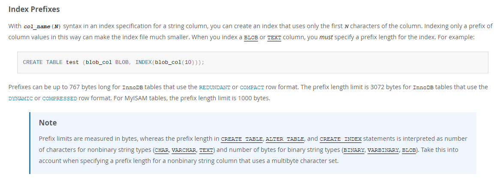
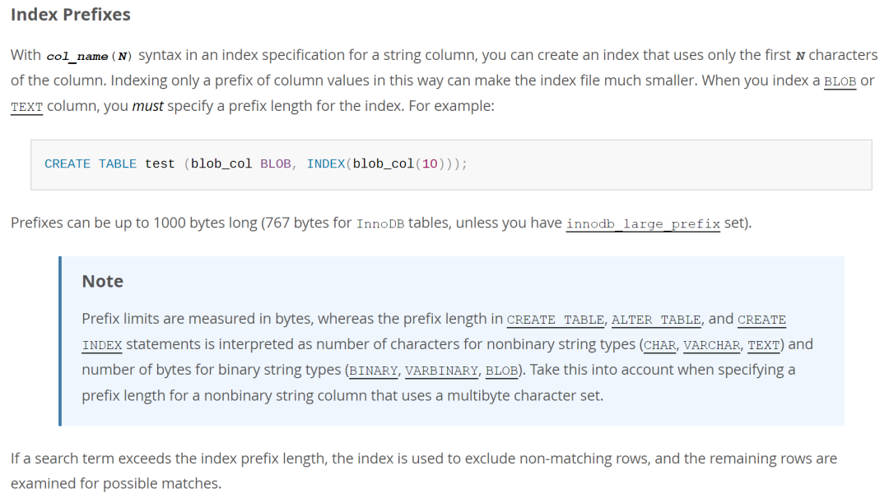

# 故障分析 | 一个索引创建错误引发的思考

**原文链接**: https://opensource.actionsky.com/%e6%95%85%e9%9a%9c%e5%88%86%e6%9e%90-%e4%b8%80%e4%b8%aa%e7%b4%a2%e5%bc%95%e5%88%9b%e5%bb%ba%e9%94%99%e8%af%af%e5%bc%95%e5%8f%91%e7%9a%84%e6%80%9d%e8%80%83/
**分类**: 技术干货
**发布时间**: 2023-09-13T23:23:38-08:00

---

MySQL 创建索引的操作提示失败，这是什么原因导致的？字段类型和索引创建之间有什么关系？
> 作者：刘晨，网名 bisal ，具有十年以上的应用运维工作经验，目前主要从事数据库应用研发能力提升和技术管理相关的工作，公众号”bisal的个人杂货铺”。
爱可生开源社区出品，原创内容未经授权不得随意使用，转载请联系小编并注明来源。
本文约 800 字，预计阅读需要 3 分钟。
# 背景
同事反馈说某个 MySQL 数据库创建索引提示错误，模拟报错如下：
`CREATE INDEX t_reg_code_idx USING BTREE ON t(reg_code)
BLOB/TEXT column 'reg_code' used in key specification without a key length
`
从该提示可知，给 T 表的 `reg_code` 列创建一个 BTREE 索引，而这个 `reg_code` 列的字段类型是 BLOB 或 TEXT。
**需要在键的说明中有长度定义，这是什么意思？**
# 表索引前缀长度限制
## MySQL 8.0
从 MySQL 8.0 的官方手册可以找到这段对 [Index Prefixes](https://dev.mysql.com/doc/refman/8.0/en/column-indexes.html) 的说明。意思是如果对 BLOB 或者 TEXT 列创建索引，必须指定索引的前缀长度。对于使用 REDUNDANT 或者 COMPACT 行格式的 InnoDB 表，索引前缀最多 767 个字节，对于使用 DYNAMIC 或者 COMPRESSED 行格式的 InnoDB 表，索引前缀的上限最多是 3072 个字节，如果是 MyISAM 表，前缀长度最多可以达到 1000 个字节。

## MySQL 5.7
而 MySQL 5.7 官方手册中，对索引前缀的限制有所不同，InnoDB 表的索引前缀最多可以达到 1000 个字节（此处我认为是错误的，应该是 3072），但前提是设置了 innodb_large_prefix（只对 DYNAMIC 或者 COMPRESSED 行格式生效，对 REDUNDANT 或者 COMPACT 行格式无效），否则只能达到 767 个字节。

因此可知，MySQL 8.0 在 InnoDB 表的索引前缀长度限制的设置上有所调整，但是限制还是有，这是和 Oracle 等数据库有所不同的一个特性。
# 验证
通过实验，验证 MySQL 8.0 对于前缀长度的限制。
创建一张 row format 是 COMPACT 的 InnoDB 表，指定前缀长度 10000，提示最大键的长度只能是 767 个字节。
`create table test01 (
id int(30) not null auto_increment,
t_a text,
primary key(id),
index idx_t_a(t_a(10000))
) COLLATE='gbk_chinese_ci' ENGINE=InnoDB ROW_FORMAT=COMPACT;
SQL 错误 [1071] [42000]: Specified key was too long; max key length is 767 bytes
`
创建一张 row format 是 COMPRESSED 的 InnoDB 表，指定前缀长度 10000，提示最大键的长度只能是 3072 个字节。
`
create table test01 (
id int(30) not null auto_increment,
t_a text,
primary key(id),
index idx_t_a(t_a(10000))
) COLLATE='gbk_chinese_ci' ENGINE=InnoDB ROW_FORMAT=COMPRESSED;
SQL 错误 [1071] [42000]: Specified key was too long; max key length is 3072 bytes
`
# 总结
抛开技术问题，和同事追问了下这个操作的背景。原始需求是某个厂商的 ETL 任务需要从源库将数据导入目标库，源库字段是 VARCHAR 类型，目标库定义为 TEXT，才间接引起的这个问题。推测一种可能的原因，因为 VARCHAR、TEXT 都可以存储字符串类型的数据，所以没做区分，另一种可能，为了图省事儿，不用关注源库和目标库字符串类型定义的长度，直接设置了 TEXT 类型，保证肯定能存下。
无论是何种原因，TEXT 这种大字段类型，一般不推荐作为索引检索字段，因为往往它存储了很多字符，索引存储空间会占用更多，索引的区分度也会有影响。
因此，虽然这个问题表象是个技术问题，但实际上来源于不合理的设计，我们在进行应用设计、数据库设计时，如果能多考虑一些合理性，避免一些所谓的省事儿，可能在实际使用过程中，就会更顺畅，相辅相成的。