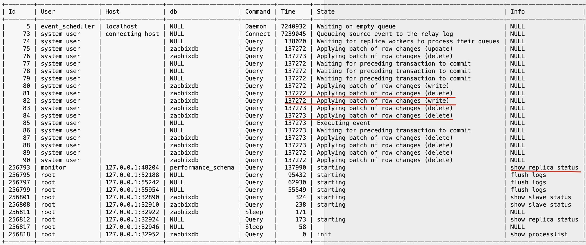
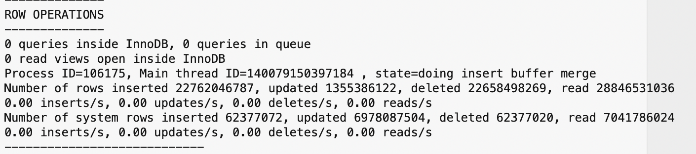
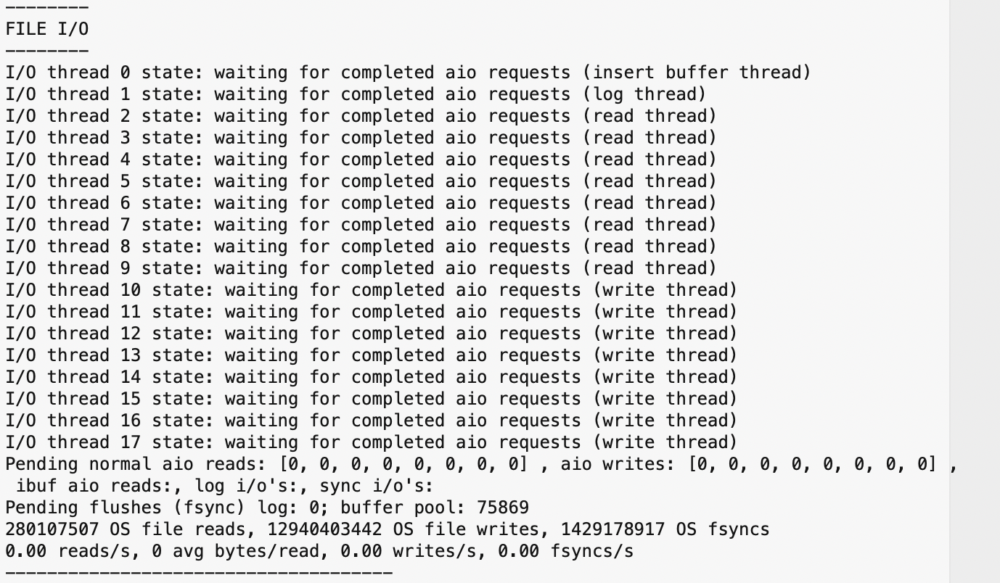
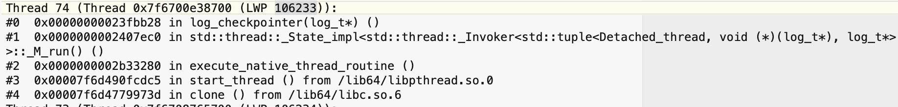
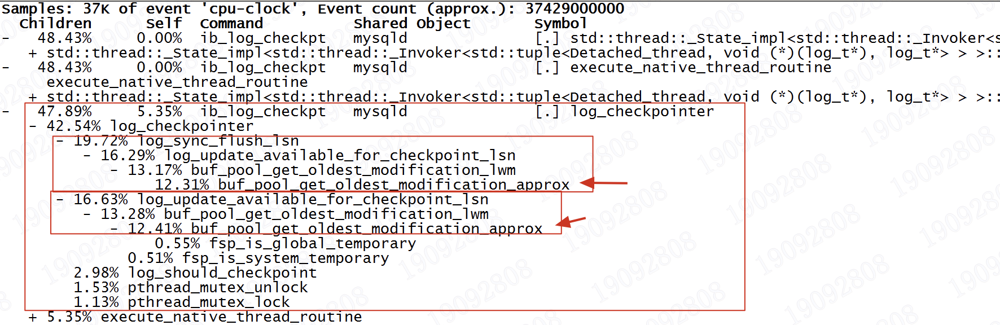

# 故障分析 | 一则 MySQL 从节点 hung 死问题分析

**原文链接**: https://opensource.actionsky.com/%e6%95%85%e9%9a%9c%e5%88%86%e6%9e%90-%e4%b8%80%e5%88%99-mysql-%e4%bb%8e%e8%8a%82%e7%82%b9-hung-%e6%ad%bb%e9%97%ae%e9%a2%98%e5%88%86%e6%9e%90/
**分类**: MySQL 新特性
**发布时间**: 2024-04-06T21:29:40-08:00

---

作者通过 MySQL 从节点的一个 hung 问题，对数据库连接、日志、innodb status 输出等分析，再结合源码、堆栈等最终明确为由于 redo日志配置不合理导致 hung 死问题根本原因。
> 作者：李锡超，一个爱笑的江苏苏商银行 数据库工程师，主要负责数据库日常运维、自动化建设、DMP 平台运维。擅长 MySQL、Python、Oracle，爱好骑行、研究技术。
爱可生开源社区出品，原创内容未经授权不得随意使用，转载请联系小编并注明来源。
本文约 3000 字，预计阅读需要 10 分钟。
近期，发现一个 MySQL 从节点提示同步异常。执行 `show replica status` 都被挂起。
#### 重要信息
|  |  |
| --- | --- |
| MySQL 版本 | 8.0.27 |
| 架构 | 主从模式 |
| binlog_transaction_dependency_tracking | WRITESET |
| replica_parallel_workers | 16 |
# 初步分析
## 1.1 连接情况

当前连接中，运行的 16 个 worker 线程。其中：
- 4 个状态为 *Waiting for preceding transaction to commit*
- 11 个状态为 *Applying batch of row changes*
- 1 个状态为 *Executing event*
线程等待时间 137272 秒（38 小时左右）。
同时看到执行的 `show replica status`、`flush logs` 命令都被挂起。
## 1.2 InnoDB Status 输出

根据 **innodb status** 输出结果：检查 *ROW OPERATIONS*、*FILE I/O*，未见几个典型的问题，比如 `innodb_thread_concurrency` 配置不合理导致无法进入 InnoDB。
## 1.3 负载情况

检查系统负载，线程模式查看所有线程的状态。发现 MySQL 的 *ib_log_checkpt* 线程 CPU 使用率一直处于 100% 的状态。其它线程都处于空闲状态。
## 1.4 错误日志

检查错误日志，未见相关的错误日志记录。
## 1.5 慢查询

检查慢查询日志，未见相关的慢查询记录。
## 1.6 分析小结
我们知道当前版本存在一些已知缺陷，根据主从线程的状态，首先想到可能是由于多线程复制（MTS）的缺陷（Bug 103636 ：MySQL 8.0 MTS 定时炸弹）导致。
但根据之前发现的案例，如果是该缺陷导致，在Bug触发了这么久，worker线程的状态应该都是处于 *Waiting for preceding transaction to commit* 状态，与此处现象不相符。
# 结合源码进一步分析
结合源码对 MTS 相关的逻辑进行梳理。关键逻辑如下：
`// STEP-1: 启动时，根据配置参数，分配 commit_order_mngr
|-handle_slave_sql (./sql/rpl_replica.cc:6812)
|-Commit_order_manager *commit_order_mngr = nullptr
|-if (opt_replica_preserve_commit_order && !rli->is_parallel_exec() && rli->opt_replica_parallel_workers > 1)
|-commit_order_mngr = new Commit_order_manager(rli->opt_replica_parallel_workers)
|-rli->set_commit_order_manager(commit_order_mngr) // 设置 commit_order_mngr
// STEP-2: 执行event时，分配提交请求的序列号
|-handle_slave_sql (./sql/rpl_replica.cc:7076)
|-exec_relay_log_event (./sql/rpl_replica.cc:4905)
|-apply_event_and_update_pos (./sql/rpl_replica.cc:4388)
|-Log_event::apply_event (./sql/log_event.cc:3307)
|-Log_event::get_slave_worker (./sql/log_event.cc:2770)
|-Mts_submode_logical_clock::get_least_occupied_worker (./sql/rpl_mta_submode.cc:976)
|-Commit_order_manager::register_trx (./sql/rpl_replica_commit_order_manager.cc:67)
|-this->m_workers[worker->id].m_stage = cs::apply::Commit_order_queue::enum_worker_stage::REGISTERED
|-this->m_workers.push(worker->id)
// 此节点的 worker 正在处理的提交请求的序列号，其取值为每次从 m_commit_sequence_generator(提交序列号计数器) 加 1 后所得
// m_commit_sequence_generator 应该是全局的
// 每次 start slave 之后会重新初始化
|-this->m_workers[index].m_commit_sequence_nr->store(this->m_commit_sequence_generator->fetch_add(1))
// 将worker id 加入到 m_commit_queue 的尾部
|-this->m_commit_queue << index
|-...
|-handle_slave_worker (./sql/rpl_replica.cc:5891)
|-slave_worker_exec_job_group (./sql/rpl_rli_pdb.cc:2549)
|-Slave_worker::slave_worker_exec_event (./sql/rpl_rli_pdb.cc:1760)
|-Xid_apply_log_event::do_apply_event_worker (./sql/log_event.cc:6179)
|-Xid_log_event::do_commit (./sql/log_event.cc:6084)
|-trans_commit (./sql/transaction.cc:246)
|-ha_commit_trans (./sql/handler.cc:1765)
|-MYSQL_BIN_LOG::commit (./sql/binlog.cc:8170)
// STEP-3: 提交事务前，判断worker队列状态和位置，使用MDL锁，等待释放事务锁
|-MYSQL_BIN_LOG::ordered_commit (./sql/binlog.cc:8749)
// 在该函数会控制，只有 slave 的worker 线程由于持有commit_order_manager, 才会在此处进行 mngr->wait
|-Commit_order_manager::wait (./sql/rpl_replica_commit_order_manager.cc:375)
|-if (has_commit_order_manager(thd)): // 确认有 commit_order_manager 对象，该对象只要在开启并行符合和从库提交顺序一致后，才不为nullptr
|-Commit_order_manager::wait (./sql/rpl_replica_commit_order_manager.cc:153)
|-Commit_order_manager::wait_on_graph (./sql/rpl_replica_commit_order_manager.cc:71)
|-this->m_workers[worker->id].m_stage = cs::apply::Commit_order_queue::enum_worker_stage::FINISHED_APPLYING
// Worker is first in the queue
|-if (this->m_workers.front() != worker->id) {}
// Worker is NOT first in the queue
|-if (this->m_workers.front() != worker->id):
|-this->m_workers[worker->id].m_stage = cs::apply::Commit_order_queue::enum_worker_stage::REQUESTED_GRANT
|-set_timespec(&abs_timeout, LONG_TIMEOUT);  // Wait for a year
// 等待 MDL 锁
|-auto wait_status = worker_thd->mdl_context.m_wait.timed_wait(worker_thd, &abs_timeout,...)
// STEP-4: 提交事务后，自增获取下一个 worker、sequence_number，然后释放对应的锁。
//         释放了之后，其它worker就会在STEP-3中获取到锁，否则就会一直在STEP-3 等待
|-MYSQL_BIN_LOG::ordered_commit (./sql/binlog.cc:8763)
|-MYSQL_BIN_LOG::change_stage (./sql/binlog.cc:8483)
|-Commit_stage_manager::enroll_for (./sql/rpl_commit_stage_manager.cc:209)
|-Commit_order_manager::finish_one (./sql/rpl_replica_commit_order_manager.cc:454)
|-Commit_order_manager::finish_one (./sql/rpl_replica_commit_order_manager.cc:300)
// 获取 commit_queue 的第一个 worker 线程: next_worker
|-auto next_worker = this->m_workers.front()
// 确认 next_worker 线程的状态，并比对 m_commit_sequence_nr。
// 如果满足，则设置 mdl 锁状态为 GRANTED，即唤醒 next_worker 执行 ordered_commit 的后续操作
|-if (this->m_workers[next_worker].m_stage in (FINISHED_APPLYING,REQUESTED_GRANT) and
/* 对比 next_worker 的 m_commit_sequence_nr 与 next_seq_nr:
如果 m_commit_sequence_nr == next_seq_nr, 则 返回 true , 然后将 m_commit_sequence_nr = SEQUENCE_NR_FROZEN(1)
如果 m_commit_sequence_nr != next_seq_nr, 则 返回 false
*/
this->m_workers[next_worker].freeze_commit_sequence_nr(next_seq_nr))
// 如果 if 条件满足， 设置 next_worker 为授权状态
|-this->m_workers[next_worker].m_mdl_context->m_wait.set_status(MDL_wait::GRANTED)
/* 对比 next_worker的 m_commit_sequence_nr 与 next_seq_nr
如果 m_commit_sequence_nr == 1, 则 返回 true , 然后将 m_commit_sequence_nr = next_seq_nr
如果 m_commit_sequence_nr != 1, 则 返回 false
*/
|-this->m_workers[next_worker].unfreeze_commit_sequence_nr(next_seq_nr)
|-this->m_workers[this_worker].m_mdl_context->m_wait.reset_status()
// 标记当前状态为终态(FINISHED)
|-this->m_workers[this_worker].m_stage = cs::apply::Commit_order_queue::enum_worker_stage::FINISHED
`
为便于下文说明，对于 MTS 的 16 个 worker 线程，分类如下：
- A 类: 4 个 worker 线程的状态为 *Waiting for preceding transaction to commit*
- B 类: 11 个 worker 线程的状态为 *Applying batch of row changes*
- C 类: 1 个 worker 线程的状态为 *Executing event*
### 论点 1
假设是由于 Bug 103636 导致该问题，那么 worker 线程应该会在执行提交操作的时候，在 `ordered_commit` 函数执行的开始位置，由于无法获取 MDL 锁而进行等待，通过 `show processlist` 查看 worker 线程的状态应该为 *Waiting for preceding transaction to commit*。
而且通过 debug 验证发现，一旦该问题被触发，那么所有的 worker（即使只有一个 worker 在执行事务），都会进入到 `ordered_commit` 函数，然后由于无法获取 MDL 锁，都会在相同的位置进行等待。即应该是所有 worker 线程处于 *Waiting for preceding transaction to commit* 状态。
**因此，初步判断该问题现象和 bug 103636 不相符合。**
### 论点 2
从因果关系来看：如果是由于 bug 103636 作为问题的原因，结合论点 1 的分析，无法完全说明问题现象。
但相对的，可能是由于其它原因，导致以上 B 类和 C 类的 worker 线程无法顺利执行事务，从而导致 A 类 worker 线程在提交的时候，由于具有较小的 commit_sequence 事务的 worker 线程还未提交执行操作，因此进行等待，导致其线程状态为 *Waiting for preceding transaction to commit*。如此更能合理的解释当前数据库的状态。
那又是什么原因，导致 B 类、C 类线程无法提交？根据采集信息，发现1个奇怪的症状：
根据的 CPU 使用情况，问题时段的 *ib_log_checkpt* 一直是处于 100% 的 CPU 在运行。
# 根因分析
## 3.1 ib_log_checkpt 堆栈分析
根据 top 的线程 ID、堆栈以及 perf report 信息：

结合 log_checkpoint 的实现，我们看到该线程，主要是执行 `dirty page flush` 操作。具体包括：
从 `buf_pool_get_oldest_modification_approx` 实现分析，一直在循环遍历，找 dirty page 的最小 LSN。然后根据该 LSN 进行异步 IO 刷 dirty page 操作。
由于 `buf_pool_get_oldest_modification_approx` 一直在跑，猜测可能是异步 IO 慢。导致检查点无法完成，一直在寻找最小的 LSN。为此，进一步分析系统 IO 压力。
## 3.2 系统 IO 负载情况

根据以上 IO 负载情况，发现问题时段服务器 IO 压力分析，与上述猜想不想符！那是因为什么原因导致该问题呢？难道是无法找到最小 LSN，或者寻找比较慢？
## 3.3 再次分析 InnoDB Status
根据以上分析结果，再次分析了相关采集数据。发现 innodb status 输出包含如下信息：
`---
LOG
---
Log sequence number          54848990703166
Log buffer assigned up to    54848990703166
Log buffer completed up to   54848990703166
Log written up to            54848990703166
Log flushed up to            54848990703166
Added dirty pages up to      54848990703166
Pages flushed up to          54846113541560
Last checkpoint at           54846113541560
5166640859 log i/o's done, 0.00 log i/o's/second
----------------------
`
发现当前 InnoDB 中的 Redo 日志使用量=最新 lsn &#8211; checkpoint lsn=54848990703166-54846113541560=2,877,161,606=2.68GB。
而此时数据库的 InnoDB Redo Log 配置为：
- innodb_log_file_size | 1073741824
- innodb_log_files_in_group | 3
即总的日志大小=1073741824*3=3GB
根据 MySQL 官方说明，需要确保 Redo 日志使用量不超过 Redo 总大小的 75%，否则就会导致数据库出现性能问题。但问题时刻我们的日志使用率=2.68/3=89%，超过 Redo 日志使用率的建议值 14%。
# 问题总结与建议
## 4.1 问题总结
综合以上分析过程，导致此次故障的根本原因还是在于数据库的 Redo 配置参数过小，在问题时段从节点的压力下，Redo 的使用率过高，导致 InnoDB 无法完成检查点。并进一步导致从节点的 worker 线程在执行事务时，检查 Redo Log 是否存在有剩余 Log 文件时，而发生等待。当前一个 worker 线程执行事务挂起后，由于从节点采用 MTS，且 `slave_preserve_commit_order=on`，因此其它 worker 线程需要等待之前的事务提交，最终导致所有 worker 线程挂起。
## 4.2 解决建议
- 增加 Redo Log 文件的大小
- 升级到 MySQL 8.0 的最新版本，解决 Bug 103636 等关键 bug
- 增加 `innodb_buffer_pool_size` 内存大小
## 4.3 复杂问题针对数据采集建议
针对以上所有问题数据的采集，分享针对 MySQL 复杂问题的问题采集命令。具体如下：
`来自:李锡超 -- <未知问题重启前信息采集>
su - mysql
currdt=`date +%Y%m%d_%H%M%S`
echo "$currdt" > /tmp/currdt_tmp.txt
mkdir /tmp/diag_info_`hostname -i`_$currdt
cd /tmp/diag_info_`hostname -i`_$currdt
-- 1. mysql进程负载
su - 
cd /tmp/diag_info_`hostname -i`_`cat /tmp/currdt_tmp.txt`
ps -ef | grep -w mysqld
mpid=`pidof mysqld`
echo $mpid
-- b: 批量模式; n: 制定采集测试; d: 间隔时间; H: 线程模式; p: 指定进程号
echo $mpid
top -b -n 120 -d 1 -H -p $mpid > mysqld_top_`date +%Y%m%d_%H%M%S`.txt
-- 2. 信息采集步骤--- 以下窗口，建议启动额外的窗口执行
mysql -uroot -h127.1 -p
tee var-1.txt
show global variables;
tee stat-1.txt
show global status;
tee proclist-1.txt
show full processlist\G
show full processlist;
tee slave_stat-1.txt
show slave status\G
tee threads-1.txt
select * from performance_schema.threads \G
tee innodb_trx-1.txt
select * from information_schema.innodb_trx \G
tee innodb_stat-1.txt
show engine innodb status\G
tee innodb_mutex-1.txt
SHOW ENGINE INNODB MUTEX;
-- 锁与等待信息
tee data_locks-1.txt
-- mysql8.0
select * from performance_schema.data_locks\G
select * from performance_schema.data_lock_waits\G
-- mysql5.7
select * from information_schema.innodb_lock_waits \G
select * from information_schema.innodb_locks\G
-- 3. 堆栈信息
su - 
cd /tmp/diag_info_`hostname -i`_`cat /tmp/currdt_tmp.txt`
ps -ef | grep -w mysqld
mpid=`pidof mysqld`
echo $mpid
-- 堆栈信息
echo $mpid
pstack $mpid > mysqld_stack_`date +%Y%m%d_%H%M%S`.txt
-- 线程压力
echo $mpid
perf top
echo $mpid
perf top -p $mpid
perf record -a -g -F 1000 -p $mpid -o pdata_1.dat
perf report -i pdata_1.dat
-- 4. 等待 30 秒
SELECT SLEEP(60);
-- 5. 信息采集步骤--- 以下窗口，建议启动额外的窗口执行
mysql -uroot -h127.1 -p
tee var-2.txt
show global variables;
tee stat-2.txt
show global status;
tee proclist-2.txt
show full processlist\G
show full processlist;
tee slave_stat-2.txt
show slave status\G
tee threads-2.txt
select * from performance_schema.threads \G
tee innodb_trx-2.txt
select * from information_schema.innodb_trx \G
tee innodb_stat-2.txt
show engine innodb status\G
tee innodb_mutex-2.txt
SHOW ENGINE INNODB MUTEX;
-- 锁与等待信息
tee data_locks-2.txt
-- mysql8.0
select * from performance_schema.data_locks\G
select * from performance_schema.data_lock_waits\G
-- mysql5.7
select * from information_schema.innodb_lock_waits \G
select * from information_schema.innodb_locks\G
-- 6. 堆栈信息
su - 
cd /tmp/diag_info_`hostname -i`_`cat /tmp/currdt_tmp.txt`
ps -ef | grep -w mysqld
mpid=`pidof mysqld`
echo $mpid
-- 堆栈信息
echo $mpid
pstack $mpid > mysqld_stack_`date +%Y%m%d_%H%M%S`.txt
-- 线程压力
echo $mpid
perf top
echo $mpid
perf top -p $mpid
perf record -a -g -F 1000 -p $mpid -o pdata_2.dat
perf report -i pdata_2.dat
--- END --
`
以上信息仅供交流，作者水平有限，如有不足之处，欢迎在评论区交流。