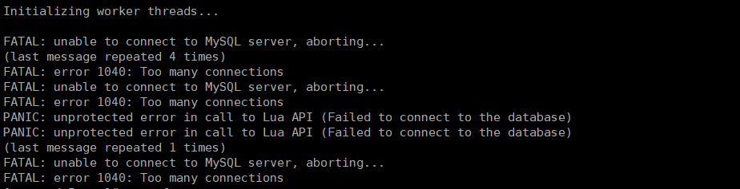
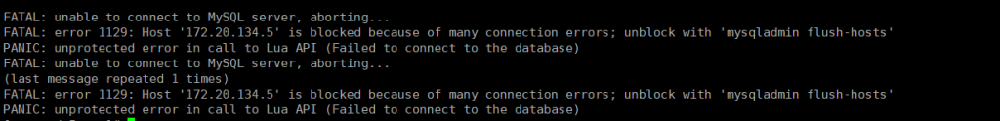
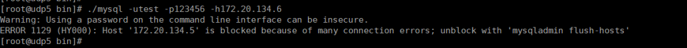
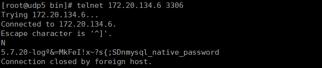
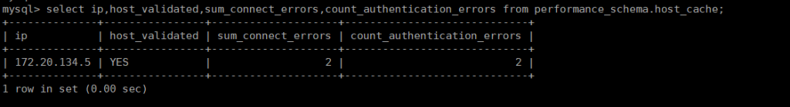
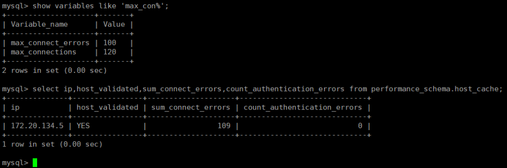
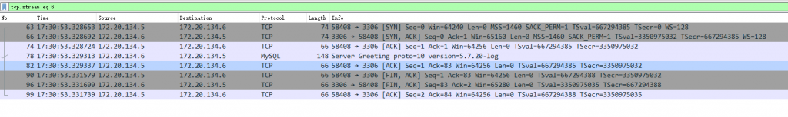

# 故障分析 | 一次因为超过最大连接数的登陆限制

**原文链接**: https://opensource.actionsky.com/%e6%95%85%e9%9a%9c%e5%88%86%e6%9e%90-%e4%b8%80%e6%ac%a1%e5%9b%a0%e4%b8%ba%e8%b6%85%e8%bf%87%e6%9c%80%e5%a4%a7%e8%bf%9e%e6%8e%a5%e6%95%b0%e7%9a%84%e7%99%bb%e9%99%86%e9%99%90%e5%88%b6/
**分类**: 技术干货
**发布时间**: 2020-07-13T00:31:59-08:00

---

作者：王翔飞爱可生研发团队测试成员，负责数据库管理平台的测试工作。
本文来源：原创投稿
*爱可生开源社区出品，原创内容未经授权不得随意使用，转载请联系小编并注明来源。
本文关键字：最大连接数、TCP协议、MySQL协议、参数配置
相关推荐文章：
[MySQL 客户端连不上（1045 错误）原因全解析](https://opensource.actionsky.com/20190715-mysql/)
**现象**
在测试某功能时，将 mysql 的最大连接数设置为 120，使用 sysbench 并发 200 插入数据，
											
上述错误是预期内的结果，因为 sysbench 的 200 个并发超过了 mysql 实例最大连接数；
随后，修改 sysbench 并发数为 100（小于最大连接数），再次插入数据，失败报错，并发数已经小于最大连接数了，为什么还报错，报错信息如下：
											
使用用户 test 单独登录实例，和上面报一样的错误：
											
之前正常的可以登录的用户 test，现在无法登录了。
**原因和解决方法**
起初，并不了解是什么原因造成的登录失败。查询官网文档了解到，是用户的错误的连接数超过了设置的最大值，这个最大值参数是 max_connect_errors。
解决方法很简单：执行 flush hosts
> 官网解释：https://dev.mysql.com/doc/refman/5.7/en/server-system-variables.html#sysvar_max_connect_errors
**分析**
对于这个参数 max_connect_errors 之前并不了解，查阅网上文档提到，使用错误密码多次登录并不能模拟失败连接。尝试将此参数修改为 2，然后使用错误密码登录 2 次，后续再登录依然成功。看来使用错误密码确实不能模拟失败连接。
查阅官网文档了解到，在 Performance Schema 库表 host_cache 里会保存客户端的连接信息，其中字段 SUM_CONNECT_ERRORS 就是记录连接的错误次数，一旦 SUM_CONNECT_ERRORS 的值达到 max_connect_errors 设定的值，来自此客户端的连接就会被阻止。
SUM_CONNECT_ERRORS 的官网描述：The number of connection errors that are deemed “blocking” (assessed against the max_connect_errors system variable). Only protocol handshake errors are counted, and only for hosts that passed validation (HOST_VALIDATED = YES).
可以看到这里指的是协议握手错误的次数。> 官网链接：
https://dev.mysql.com/doc/refman/5.7/en/host-cache-table.html
下面使用 telnet 来模拟协议的握手错误次数：
配置最大错误连接错误数为 2，查看库表 Performance Schema.host_cache 的 SUM_CONNECT_ERRORS
											
这里 SUM_CONNECT_ERRORS 初始值为 0；
注：另一个参数 count_authentication_errors 是尝试错误密码登录的次数（这里的 2 就是之前尝试错误密码登录的次数）。
在客户端主机上使用 telnet 尝试 2 次端口探测，
											
再次查看该主机的 SUM_CONNECT_ERRORS 变成了 2。
											
此时问题复现，客户端登录实例被拒绝，因为错误连接次数达到了最大值 2。
											
回到本文最开始的问题，sysbench 并发 200 超过最大连接数 max_connections=120 时，
											
由于 max_connect_errors 的缺省值是 100，sysbench 并发 200 造成了 109 个错误连接，这就超过了错误连接的最大值，所以后续连接就报错了。
另外，为什么错误连接数 SUM_CONNECT_ERRORS 是 109，是因为此环境实例已经存在来自其他客户端的 11 个正常连接（通过 show processlist 可见），那么只剩下 120-11=109 个可用连接，sysbench 的 200 个并发，只接受了 109 个然后就协议握手失败，所以造成了 109 个错误连接。
**延伸**
官网提到错误连接指的是协议的握手失败次数，并未明确说明是哪个协议，是 TCP/IP 还是应用层的 MySQL 协议?
对于 TCP/IP 通信，首先是 TCP 协议的三次握手，因为客户端已经成功收到了服务端返回的报错：error 1040: Too many connections，TCP 握手已经成功完成了，所以这里的协议应该指的是 MySQL 的握手协议。
这里可以通过抓包来验证：
											
上述前三个包是完整的 TCP 握手协议包，已经完成了 TCP 的握手协议，后面 MySQL 协议服务端发送完 HandShake 信息之后双方就关闭了连接，客户端并未继续发送登录认证包，造成 MySQL 的协议握手失败。所以这里指的是 MySQL 的协议握手失败次数。
针对上面利用 telnet 来模拟协议握手失败的例子，由于 telnet 只是发送了 TCP 的握手包，并不会发送 MySQL 登录认证包，服务器端等待 10 秒（mysql 的 connect_timeout=10）就关闭了连接，所以才造成 MySQL 的握手失败。