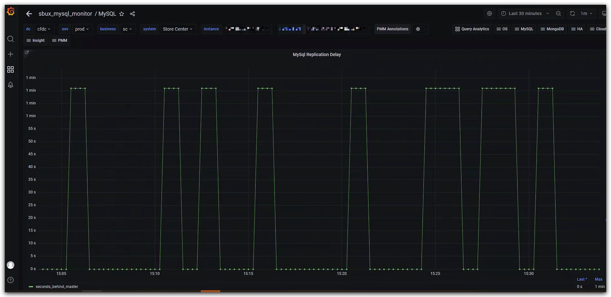

# 故障分析 | 一次规律的 MySQL 主从延迟跳变

**原文链接**: https://opensource.actionsky.com/%e6%95%85%e9%9a%9c%e5%88%86%e6%9e%90-%e4%b8%80%e6%ac%a1%e8%a7%84%e5%be%8b%e7%9a%84-mysql-%e4%b8%bb%e4%bb%8e%e5%bb%b6%e8%bf%9f%e8%b7%b3%e5%8f%98/
**分类**: MySQL 新特性
**发布时间**: 2023-04-17T18:33:14-08:00

---

作者：李彬
爱可生 DBA 团队成员，负责项目日常问题处理及公司平台问题排查。爱好有亿点点多，吉他、旅行、打游戏&#8230;
本文来源：原创投稿
*爱可生开源社区出品，原创内容未经授权不得随意使用，转载请联系小编并注明来源。
作为一名DBA，相信你一定处理过主从延迟，最近在生产中遇到一个比较有意思的延迟问题，在此与大家进行分享。
首先来看下MySQL延迟的相关监控：

或许你已经发现，这个监控曲线图不同于常见的延迟曲线，主要表现出以下两个特点：
1.延迟上升和下降的曲线几乎都是直上直下，并不是缓慢增长，是一种突变。
2.延迟曲线的最高点是一致的。
通过监控配置了解到，延迟检测获取的是Seconds_Behind_Master的值。既然出现了规律性的变化，那么我们可以通过一个简单的命令来抓取Seconds_Behind_Master的值，观察是否与监控的曲线变化一致。
# 观察曲线，五分钟内延迟会出现多次变化，所以本次共抓取5分钟，300次的Seconds_Behind_Master值
for i in {1..300}
do
echo `date` `mysql -S /data/mysql/3306/data/mysqld.sock -uxxx -pxxx -e 'show slave status\G' | grep Second` >>/tmp/second.log
sleep 1
done
查看/tmp/second.log的内容，可以看到Seconds_Behind_Master的值确实在0和71之间反复横跳。

为什么会出现这种现象呢？根据以往的经验，这种延迟大概率不是因为数据库压力大导致的，因为延迟曲线的变化过于规律。从其他角度进行排查，在对比主从服务器时间的过程中，终于捕捉到一个关键信息：从库的时间与主库的时间差基本在71S，这正好符合Seconds_Behind_Master跳动的最大值71。

或许有人会问，Seconds_Behind_Master在计算时不是会自动减去时间差吗？是的，从官方文档中我们可以看到，IO线程启动后，Seconds_Behind_Master在计算时确实会自动减去时间差，但很重要的一个前提是，这个时间差异在IO线程启动后&#8221;不会发生变化&#8221;。

所以，发生延迟跳变很大的一个可能是：IO线程启动后，该从库通过NTP或者其他方式进行了时间校正，导致Seconds_Behind_Master在计算时出现了误差。
那么如何解决呢？一种简单的处理方法是重启从库的IO线程，让其重新计算服务器时间之间的差值。但这种处理方法可能会导致延迟跳变的情况再次出现。最优解为先校正集群中所有服务器的时间，在时间一致的情况下，再重启IO线程。在校正服务器时间前，有几点是需要我们关注的：
第一，业务是否使用了调用系统时间的函数？一种可能的场景是：直接登录到数据库服务器上导入SQL脚本，这时调整服务器时间有风险，需要业务侧进行评估。
第二，校正时间时，主库的时间是向前校正还是向后校正？正常来说，时间向前校正(例如00:03校正为23:58)的业务影响是大于向后校正的。比如在insert一条数据时，create_time时间字段为00:03，之后时间校正为23:58，校正后在00:03之前又进行了一次update操作，这时就会出现update_time在create_time之前的现象。
第三，在进行时间校正时，如果时间差异过大，可以分多次进行缓步校正，即控制每次校正的时间幅度，而不是通过一次操作就校正为正确的时间，这样也可以在一定程度上降低对业务的影响。
一个建议是：如果业务逻辑强依赖于时间字段，可靠的做法是停掉应用的连接或者配置为只读，再进行时间校正和重启IO线程的操作。
参考：https://dev.mysql.com/doc/refman/5.7/en/show-slave-status.html