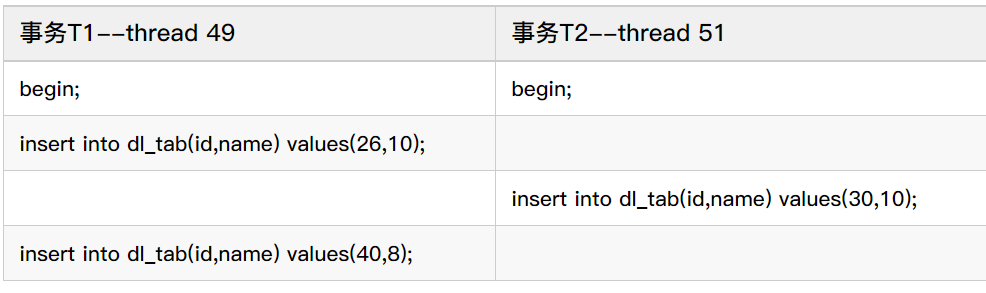
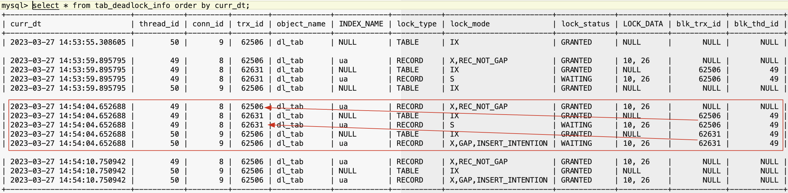
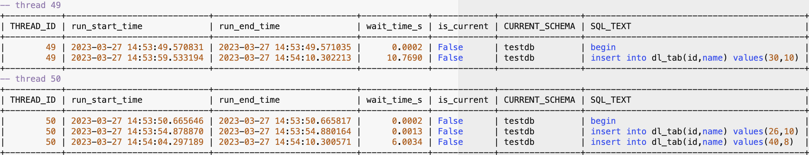
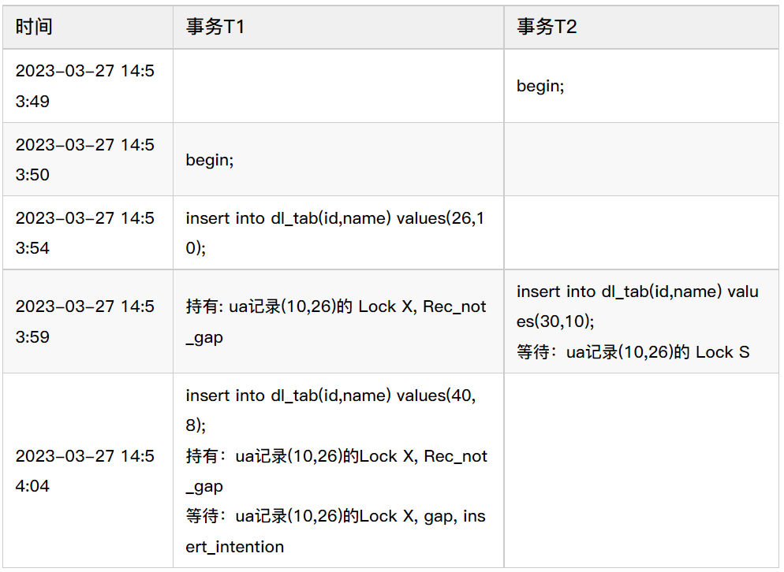
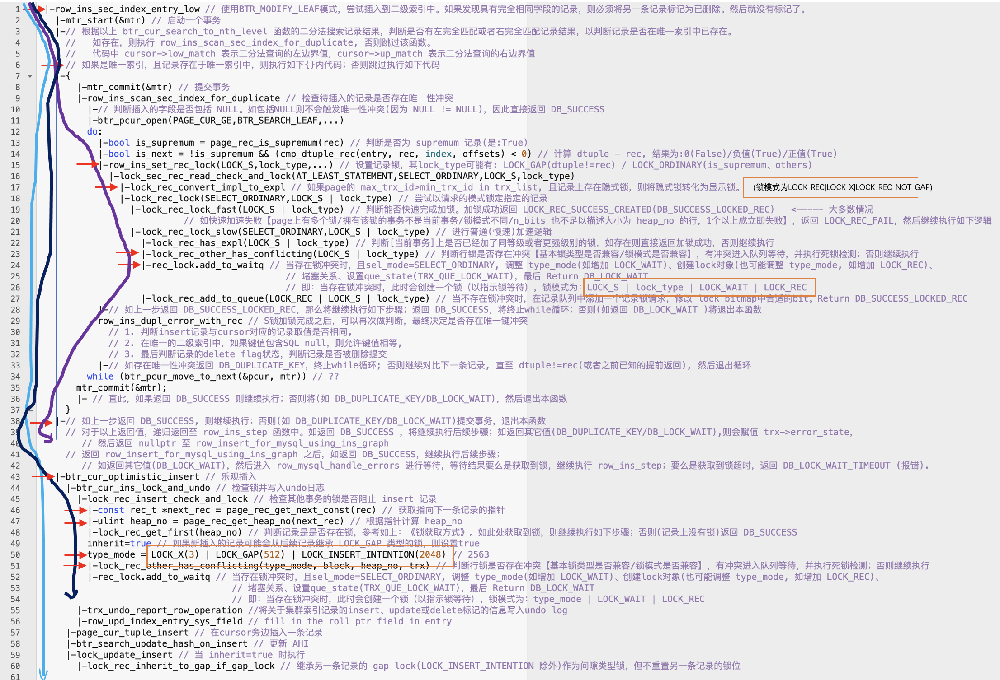
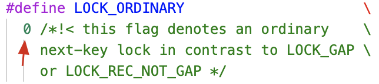

# 故障分析 | 从 Insert 并发死锁分析 Insert 加锁源码逻辑

**原文链接**: https://opensource.actionsky.com/20230423-insert/
**分类**: 技术干货
**发布时间**: 2023-04-22T23:11:42-08:00

---

作者：李锡超
一个爱笑的江苏苏宁银行 数据库工程师，主要负责数据库日常运维、自动化建设、DMP平台运维。擅长MySQL、Python、Oracle，爱好骑行、研究技术。
本文来源：原创投稿
*爱可生开源社区出品，原创内容未经授权不得随意使用，转载请联系小编并注明来源。
#### 一、前言
死锁，作为数据库一个常见的并发问题。此类问题：
1.触发原因往往与应用的逻辑相关，参与的事务可能是两个、三个、甚至更多；
2.由于不同数据库的锁实现机制几乎完全不同、实现逻辑复杂，还存在多种锁类型；
3.数据库发生死锁后，会立即终止部分事务，事后无法看到死锁前的等待状态。
即，死锁问题具有业务关联、机制复杂、类型多样等特点，导致当数据库发生死锁问题时，不是那么容易分析。
基于解决死锁问题存在的难点，本文以MySQL数据库一则并发Insert导致的死锁为例，从发现问题、重现问题、根因分析、解决问题4个步骤，期望能提供一套关于死锁的科学有效方案，供读者朋友参考。
#### 二、问题现象
某系统在进行上线前压测时，发现应用日志存在如下日志提示触发死锁问题：
Deadlock found when trying to get lock; try restarting transaction
好在压测时，就发现了问题，避免上线后影响生产。
随后，执行 show engine innodb status，有如下内容（脱敏后）：
------------------------
LATEST DETECTED DEADLOCK
------------------------
2023-03-24 19:07:50 140736694093568
*** (1) TRANSACTION:
TRANSACTION 56118, ACTIVE 6 sec inserting
mysql tables in use 1, locked 1
LOCK WAIT 2 lock struct(s), heap size 1192, 1 row lock(s), undo log entries 1
MySQL thread id 9, OS thread handle 140736685700864, query id 57 localhost root update
insert into dl_tab(id,name) values(30,10)
*** (1) HOLDS THE LOCK(S):
RECORD LOCKS space id 11 page no 5 n bits 72 index ua of table `testdb`.`dl_tab` trx id 56118 lock mode S waiting
Record lock, heap no 6 PHYSICAL RECORD: n_fields 2; compact format; info bits 0
0: len 4; hex 8000000a; asc     ;;  # 十进制: 10
1: len 4; hex 8000001a; asc     ;;  # 十进制: 26
*** (1) WAITING FOR THIS LOCK TO BE GRANTED:
RECORD LOCKS space id 11 page no 5 n bits 72 index ua of table `testdb`.`dl_tab` trx id 56118 lock mode S waiting
Record lock, heap no 6 PHYSICAL RECORD: n_fields 2; compact format; info bits 0
0: len 4; hex 8000000a; asc     ;;  # 十进制: 10
1: len 4; hex 8000001a; asc     ;;  # 十进制: 26
*** (2) TRANSACTION:
TRANSACTION 56113, ACTIVE 12 sec inserting
mysql tables in use 1, locked 1
LOCK WAIT 3 lock struct(s), heap size 1192, 2 row lock(s), undo log entries 2
MySQL thread id 8, OS thread handle 140736952903424, query id 58 localhost root update
insert into dl_tab(id,name) values(40,8)
*** (2) HOLDS THE LOCK(S):
RECORD LOCKS space id 11 page no 5 n bits 72 index ua of table `testdb`.`dl_tab` trx id 56113 lock_mode X locks rec but not gap
Record lock, heap no 6 PHYSICAL RECORD: n_fields 2; compact format; info bits 0
0: len 4; hex 8000000a; asc     ;; # 十进制: 10
1: len 4; hex 8000001a; asc     ;; # 十进制: 26
*** (2) WAITING FOR THIS LOCK TO BE GRANTED:
RECORD LOCKS space id 11 page no 5 n bits 72 index ua of table `testdb`.`dl_tab` trx id 56113 lock_mode X locks gap before rec insert intention waiting
Record lock, heap no 6 PHYSICAL RECORD: n_fields 2; compact format; info bits 0
0: len 4; hex 8000000a; asc     ;; # 十进制: 10
1: len 4; hex 8000001a; asc     ;; # 十进制: 26
*** WE ROLL BACK TRANSACTION (1)
------------
##### 1、死锁信息梳理
根据以上信息，发现是 dl_tab 执行insert操作导致死锁。初步梳理如下。
版本: 8.0.27
隔离级别: Read-Commited
表结构:
*************************** 1. row ***************************
Table: dl_tab
Create Table: CREATE TABLE `dl_tab` (
`id` int NOT NULL AUTO_INCREMENT,
`name` int NOT NULL,
PRIMARY KEY (`id`),
UNIQUE KEY `ua` (`name`)
) ENGINE=InnoDB AUTO_INCREMENT=41 DEFAULT CHARSET=utf8mb4 COLLATE=utf8mb4_0900_ai_ci
注意，以上innodb status 输出，不同的数据库版本会有差异。主要有:
A.在MySQL 8.0.18及之后，输出结果包括两个事务各自持有的锁、等待的锁，对分析死锁问题很有帮助。在 8.0.18之前，只包括事务1等待的锁，事务2持有的锁、等待的锁，而不包括事务1持有的锁信息；
B.以上示例还包括具体的索引记录值（如{10,26}：第一字段为索引记录的值，第二个字段为对应的主键记录）。如果没有索引记录值，可能只有heap no，该编号作为内部实现锁机制非常关键，但无法和具体的索引记录对应起来。此外，找了其它几个MySQL版本发现原生版本≥5.7.21 、≥8.0有这个功能，Percona mysql 5.7.21 居然没有这个功能；
C.事务T1 等待的锁从输出结果看到的是 LOCK S, 但其实获取的锁是 lock s next key lock,  这点从后面的源码分析结果中会进一步说明。
innodb status 日志梳理：
| 事务 | 事务T1 | 事务T2 |
| --- | --- | --- |
| 操作 | insert into dl_tab(id,name) values(40,8) | insert into dl_tab(id,name) values(30,10) |
| 关联的对象 | testdb.dl_tab 的唯一索引 ua | testdb.dl_tab 的唯一索引 ua |
| 持有的锁 | lock_mode X locks rec but not gapheap no 610,26 | lock mode S waitingheap no 610(16进制为a) , 26(16进制为1a) |
| 等待的锁 | lock_mode X locks gap before rec insert intention waitingheap no 610,26 | lock mode S waitingheap no 610,26 |
从以上innodb status输出。可以看到死锁发生在唯一索引 ua 上。这的确也是在RC隔离级别配置下，比较常见的死锁场景。进一步梳理死锁过程:
A.首先事务T1获取到了ua中记录10的 `lock x,rec not not gap` 锁
B.事务T2尝试获取ua中记录10的`lock s, next key lock`，由于T1持有了记录的独占锁，因此被T1堵塞
C.事务T1尝试获取ua中记录10的`lock x, gap before rec,insert intention`，但被堵塞
##### 2、提出问题
除了以上现象外，无法从输出结果得到更多的信息，比如：
Q1: T1为什么会持有 ua中记录10 的锁？
Q2: T1既然持有了锁，为什么又会等待锁？
Q3: T2持有和等待相同的锁，到底是持有还是在等待？
Q4: 死锁到底是如何产生的？
为此，与研发同学沟通，了解死锁发生的业务场景，并对问题进行了再次复现。
#### 三、重现问题
研发同学发现是在某业务的定时任务进行并发处理时触发，并很快在对应的开发环境复现了问题。问题复现后，同样在应用日志和innodb status输出看到对应日志，确认是同一问题。
**建议读者朋友思考1分钟，如何进一步分析**
##### 1、尝试解决
本着解决问题优先的原则，在唯一索引ua并发时产生的，那是否可以将唯一索引改为普通索引？如果不可以，是否可以降低并发（或者直接改为单并发）？不过很快研发同学就进行了确认，uname的唯一索引是核心框架依赖的，改不了！该功能的实时性要求很高，上线后业务量比较大，不能降低或调小并发。既然无法避免，那只能进一步分析死锁发生的原因，并据此确认解决方案！
研发在复现问题后，除了能看到应用日志和innodb status输出，还是没有更多的信息。此外，研发是参考测试环境，造了一批数据，然后进行模拟复现的。即: 虽然能复现这个死锁，但无法回答最初提出的问题（Q1,Q2,Q3,Q4）。
##### 2、跟踪死锁发生过程
随后找到Percona提供一篇文章（链接: How to deal with MySQL deadlocks），大致对死锁的问题的分析提供了思路:以应用日志和innodb status提供的数据为基础，结合events_statements_history、binlog(最好是statement格式)、 慢查询日志（slow log）、一般日志（general log）进行分析。
根据文章利用已有的功能(events_statements_history/slow log/general log)，去找到数据库连接运行过那些SQL语句。随后，总结了如下脚本：
-- 将events_statements_history 中的启动时间转换为标准时间
create database IF NOT EXISTS perf_db;
use perf_db;
DELIMITER //
create function f_convert_timer_to_utc(pi_timer bigint) returns timestamp(6)
DETERMINISTIC
begin
declare value_utc_time timestamp(6);
select FROM_UNIXTIME( (unix_timestamp(sysdate()) - variable_value) + pi_timer/1000000000000 )  from performance_schema.global_status where variable_name = 'Uptime' into value_utc_time;
return value_utc_time;
end;
//
DELIMITER ;
--innodb status 输出中，死锁信息中MySQL thread id，实际表示是PROCESSLIST ID。执行语句找到thread_id 与PROCESSLIST_ID的对应关系
select PROCESSLIST_ID,THREAD_ID,PROCESSLIST_INFO from performance_schema.threads where PROCESSLIST_ID in (8,10);
-- 找到上一步找到的线程ID找到运行过的SQL语句
select THREAD_ID,
perf_db.f_convert_timer_to_utc(TIMER_START) run_start_time,
perf_db.f_convert_timer_to_utc(TIMER_END) run_end_time,
TIMER_WAIT/1000000000000 wait_time_s,
'False' is_current,
CURRENT_SCHEMA,
SQL_TEXT
from performance_schema.events_statements_history where thread_id=51
union 
select THREAD_ID,
perf_db.f_convert_timer_to_utc(TIMER_START) run_start_time,
perf_db.f_convert_timer_to_utc(TIMER_END) run_end_time,
TIMER_WAIT/1000000000000 wait_time_s,
'True' is_current,
CURRENT_SCHEMA,
SQL_TEXT
from performance_schema.events_statements_current where thread_id=51
and (THREAD_ID,EVENT_ID,END_EVENT_ID) not in (select THREAD_ID,EVENT_ID,END_EVENT_ID from performance_schema.events_statements_history )
order by run_start_time;
注：以上脚本中红色文字，需要根据实际情况替换。
整理脚本后，研发同学再次尝试进行了复现死锁。查询得到如下结果：
select PROCESSLIST_ID,THREAD_ID,PROCESSLIST_INFO from performance_schema.threads where PROCESSLIST_ID in (8,10);
+----------------+-----------+------------------+
| PROCESSLIST_ID | THREAD_ID | PROCESSLIST_INFO |
+----------------+-----------+------------------+
|              8 |        49 | NULL             |  
|             10 |        51 | NULL             | 
+----------------+-----------+------------------+
thread_id=49的sql运行情况：
|        49 | 2023-03-25 02:15:59.173352 | 2023-03-25 02:15:59.173612 |      0.0003 | False      | testdb         | begin                                     |
|        49 | 2023-03-25 02:16:08.349311 | 2023-03-25 02:16:08.350678 |      0.0014 | False      | testdb         | insert into dl_tab(id,name) values(26,10) |
|        49 | 2023-03-25 02:16:26.824176 | 2023-03-25 02:16:26.826121 |      0.0019 | False      | testdb         | insert into dl_tab(id,name) values(40,8)  |
+-----------+----------------------------+----------------------------+-------------+------------+----------------+-------------------------------------------+
thread_id=51 的sql运行情况：
|        51 | 2023-03-25 02:15:58.040749 | 2023-03-25 02:15:58.041057 |      0.0003 | False      | testdb         | begin                                     |
|        51 | 2023-03-25 02:16:17.408110 | 2023-03-25 02:16:26.828374 |      9.4203 | False      | testdb         | insert into dl_tab(id,name) values(30,10) |
梳理结果如下：

根据上述梳理结果，通过人工方式在开发环境执行上述SQL语句，再次发生死锁，且innodb status的死锁信息与测试环境基本相同。
至此，回答了最开始提出的问题Q1：
> Q1: T1为什么会持有 ua中记录10 的锁？
答：因为该事务前面执行了语句如下语句，所以持有了记录(26,10)的锁：insert into dl_tab(id,name) values(26,10);
##### 3、关于跟踪死锁额外的思考
从这个死锁的发生过程，刚好是innodb status死锁信息输出结果中的两个会话导致了死锁。但参与死锁的可能涉及3个、4个或者更多的事务，因此还有如下几个额外的问题：
**Q5: 如果是3个或更多的事务参与死锁，如何跟踪？**
**Q6: 执行的SQL语句应该是导致死锁最直接的原因，其本质锁的是记录、锁类型及堵塞关系，如何查看？**
**Q7: 死锁发生后，由于MySQL死锁检测机制会自动发现死锁，并会挑选事务进行回退。事务被回退了之后，就破坏了死锁的第一现场。除了innodb status提供的最近一次死锁信息外（特别是8.0.18之前不包括事务1持有的锁信息），再无其它可用的分析数据。**
综合以上3个问题，总结了如下补充方案，以采集相关的性能数据：
- 针对Q7：在测试环境临时关闭死锁检测，然后再次复现：
innodb_deadlock_detect = off
innodb_lock_wait_timeout = 10
innodb_rollback_on_timeout = on
- 针对Q5,Q6：结合MySQL已有的实时锁与锁等待性能数据，总结了如下脚本：
-- 创建工作目录
cd <path-to-dir>
mkdir deadlock_data
cd deadlock_data
-- 创建死锁数据保存表
mysql -uroot -S /tmp/mysql.sock
create database IF NOT EXISTS perf_db;
use perf_db
CREATE TABLE `tab_deadlock_info` (
`id` int primary key auto_incrment,
`curr_dt` datetime(6) NOT NULL,
`thread_id` bigint unsigned DEFAULT NULL,
`conn_id` bigint unsigned DEFAULT NULL,
`trx_id` bigint unsigned DEFAULT NULL,
`object_name` varchar(64) DEFAULT NULL,
`INDEX_NAME` varchar(64) DEFAULT NULL,
`lock_type` varchar(32) NOT NULL,
`lock_mode` varchar(32) NOT NULL,
`lock_status` varchar(32) NOT NULL,
`LOCK_DATA` varchar(8192) CHARACTER SET utf8mb4 DEFAULT NULL,
`blk_trx_id` bigint unsigned DEFAULT NULL,
`blk_thd_id` bigint unsigned DEFAULT NULL,
index idx_curr_dt(curr_dt)
) ENGINE=InnoDB DEFAULT CHARSET=utf8mb4;
-- 查看当前存在的锁及锁堵塞信息
-- data_locks/data_lock_waits 自MySQL 8.0.1提供，之前版本查询information_schema.innodb_locks/ information_schema.innodb_lock_waits获取类似信息
vi save_lock_data.sql
insert into tab_deadlock_info(curr_dt,thread_id,conn_id,trx_id,object_name,index_name,
lock_type,lock_mode,lock_status,lock_data,blk_trx_id,blk_thd_id)
select NOW(6) curr_dt,a.thread_id,b.PROCESSLIST_ID conn_id,
ENGINE_TRANSACTION_ID trx_id, object_name,
INDEX_NAME,lock_type,lock_mode,lock_status,LOCK_DATA,
c.BLOCKING_ENGINE_TRANSACTION_ID blk_trx_id,
c.BLOCKING_THREAD_ID blk_thd_id
from performance_schema.data_locks a left join performance_schema.threads b 
on a.thread_id=b.thread_id
left join performance_schema.data_lock_waits c 
on a.ENGINE_TRANSACTION_ID=c.REQUESTING_ENGINE_TRANSACTION_ID and a.thread_id=c.REQUESTING_THREAD_ID
where a.thread_id=b.thread_id order by thread_id,trx_id;
-- 查询脚本
mysql -uroot -S /tmp/mysql.sock perf_db -e "source save_lock_data.sql"
-- 定时查询脚本
vi run_save_lock.sh
while true
do
sleep 0.1 # 指定查询间隔时间，结合实际需求调整
mysql -uroot -S /tmp/mysql.sock perf_db -e "source save_lock_data.sql" 2>>run_save_lock.err
done
-- 执行查询
sh run_save_lock.sh
##### 说明：
A.配置上述innodb_deadlock_detect参数关闭死锁检测，innodb status将不在会继续输出最后LATEST DETECTED DEADLOCK信息；
B.应用日志看到的告警为锁超时告警：Lock wait timeout exceeded; try restarting transaction。可以据此找到锁超时发生时间。
再次复现后使用使用tab_deadlock_info查询锁数据如下：

同时，使用步骤2)查询的语句信息如下：

综合上述查询结果，梳理得到如下结果：

再次梳理出了死锁的发生过程。
#### 四、根因分析
通过上述过程，可以看到死锁发生的过程，获取的锁及其属性信息。但要分析出为什么会发生死锁，还需要结合MySQL的锁实现机制。由于以上死锁场景，涉及唯一索引的插入实现逻辑，将结合源码进行解读。
##### 1、单列唯一索引插入逻辑
下图中：
蓝色线表示T1第一次插入执行的逻辑；
紫色线表示T2第一次插入执行的逻辑；
黑色线表示T1第二次插入执行的逻辑；
与唯一索引插入记录相关锁操作，使用了红色短箭头标记；
竖线与红色短尖头交叉表示执行了函数，否则表示未执行。

##### 2、最终死锁过程
以时间维度，结合以上的mysql加锁逻辑进行分析：
A. T1、T2开启了一个事务，随后T1执行了插入(26,10)的insert语句
B. T2执行了插入(30,10)的insert语句。进行唯一性冲突检查，尝试获取LOCK_S | LOCK_ORDINARY[line 15]。那为什么看到时LOCK S，是因为LOCK_ORDINARY对应的数字表示为0，任何与之进行“与”运算都等于本身，所以看不出来：

C. 然后T2所在的连接会将T1中的隐式锁转换为显示锁[line 17]，此时T1将获取LOCK_REC | LOCK_X | LOCK_REC_NOT_GAP，即看到的Lock X, Rec_not_gap。由于是T2所在的线程为T1创建的锁，因此该锁对应的thread_id为T2的线程ID，但trx_id为T1的事务ID
D. 但由于 T1的LOCK X|LOCK_REC_NOT_GAP与T2的LOCK S| LOCK_ORDINARY不兼容[line 23]，因此T2被堵塞
E. 当T2被堵塞时，内部函数add_to_waitq 在处理时，同样会记录创建一个锁，并设置属性 LOCK_S | LOCK_ORDINARY | LOCK_WAIT | LOCK_REC，以指示锁等待[line 24]。随后T2返回上层函数，以等待锁资源[line 38]
F. 随后，T1又执行了(40,8)的insert语句。由于其插入的唯一索引值是8（注意不是10），因此不存在主键冲突，直接执行乐观插入操作[line 43]。
G. 执行乐观插入时，需要检查其它事务是否堵塞insert操作。其核心是获取待插入记录的下一个值[line 46-47]（这里刚好是10），并获取该记录上的所有锁，与需要添加的锁（LOCK_X | LOCK_GAP | LOCK_INSERT_INTENTION）判断是否存在冲突[line 51]。
H. 第E步T2持有了记录10的LOCK_S | LOCK_ORDINARY | LOCK_WAIT | LOC
K_REC 锁与T1的LOCK_X | LOCK_GAP | LOCK_INSERT_INTENTION不兼容，因此T1被T2堵塞[line 51]
I. 死锁形成。
如需了解更多实现细节，大家可以结合源码进一步确认。
至此，回答了最开始提出的问题Q2,Q3,Q4：
> Q2: T1既然持有了锁，为什么又会等待锁？
答：持有锁应该没有疑问，在分析类似问题注意隐式锁转换为显示锁的机制(lock_rec_convert_impl_to_expl)。等待锁主要由于T2被堵塞后，会创建锁（LOCK_S | LOCK_ORDINARY | LOCK_WAIT | LOCK_REC）。然后T1在执行乐观插入时，需要遍历记录上存在的所有>锁进行锁冲突判断，由于锁模式不兼容，因此被堵塞
Q3: T2持有和等待相同的锁，到底是持有还是在等待？
答：虽然从innodb status看到T2持有和等待都是lock s, next key lock。但实际上等待lock s, next key lock；由于锁冲突，加入等待队列时会持有锁LOCK_S | LOCK_ORDINARY | LOCK_WAIT | LOCK_REC
Q4: 死锁到底是如何产生的？
答：见以上分析死锁过程分析
#### 五、解决问题
综合以上死锁发生的发生过程和原因，总结原因如下：
原因1：主要研发过度依赖唯一索引，插入的数据不符合唯一索引要求，需要进行唯一性冲突检查。
原因2：批量插入的数据不是有序的。两种情况同时存在，导致死锁发生。
原因2在并发场景下，控制起来较为复杂。原因1该场景为并发批量插入逻辑，可以在执行插入时，避免插入重复的uname。随后，研发同学进行逻辑优化后，问题不再发生。
对于死锁问题，建议结合业务情况尽量选择Read Committed隔离级别，适当的减少Unique索引。如确实发生死锁，读者朋友可以参考本次故障案例，合理利用性能数据来跟踪死锁问题，结合源码或者已有的案例分析死锁根本原因和解决方案。
以上信息仅左右交流，作者水平有限，如有不足之处，欢迎在评论区交流。