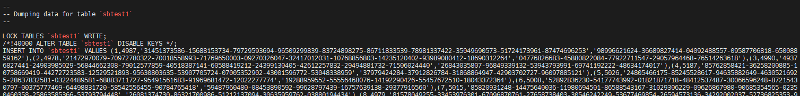
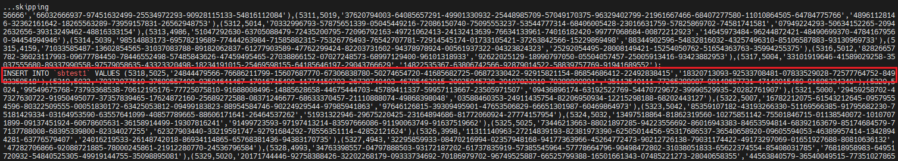
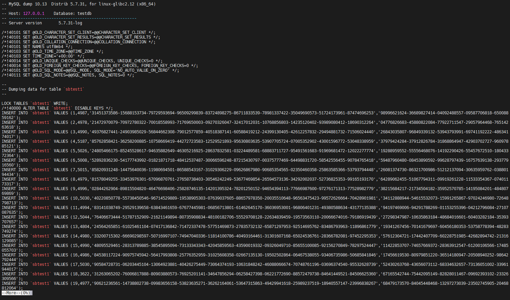

# 故障分析 | 使用 &#8211;force 批量导入数据导致部分数据丢失的问题

**原文链接**: https://opensource.actionsky.com/20220221-mysql/
**分类**: MySQL 新特性
**发布时间**: 2022-02-21T00:14:28-08:00

---

作者：姜宇
爱可生 DBA 成员，主要负责 MySQL 故障处理及 DMP 平台相关技术支持。追求技术，乐此不疲。
本文来源：原创投稿
*爱可生开源社区出品，原创内容未经授权不得随意使用，转载请联系小编并注明来源。
在一些数据补偿的场景中，使用备份导入表数据的时候，如果已知目标表存在冲突数据，会搭配 mysql 的 &#8211;force 参数来跳过冲突的行数据，防止批处理因为行冲突中断退出。但是在某些情况下可能会导致部分备份数据未导入的情况。
我们来复现一下具体的场景：
- 
首先准备一个 sbtest1 表
`mysql> select count(*) from testdb.sbtest1;
+----------+
| count(*) |
+----------+
|    10000 |
+----------+
1 row in set (0.01 sec)
mysql> desc sbtest1;
+-------+-----------+------+-----+---------+-------+
| Field | Type      | Null | Key | Default | Extra |
+-------+-----------+------+-----+---------+-------+
| id    | int(11)   | NO   | PRI | NULL    |       |
| k     | int(11)   | NO   |     | 0       |       |
| c     | char(120) | NO   |     |         |       |
| pad   | char(60)  | NO   |     |         |       |
+-------+-----------+------+-----+---------+-------+
4 rows in set (0.01 sec)
mysql> select * from sbtest1 limit 10;
+----+------+-------------------------------------------------------------------------------------------------------------------------+-------------------------------------------------------------+
| id | k    | c                                                                                                                       | pad                                                         |
+----+------+-------------------------------------------------------------------------------------------------------------------------+-------------------------------------------------------------+
|  1 | 4987 | 31451373586-15688153734-79729593694-96509299839-83724898275-86711833539-78981337422-35049690573-51724173961-87474696253 | 98996621624-36689827414-04092488557-09587706818-65008859162 |
|  2 | 4978 | 21472970079-70972780322-70018558993-71769650003-09270326047-32417012031-10768856803-14235120402-93989080412-18690312264 | 04776826683-45880822084-77922711547-29057964468-76514263618 |
|  3 | 4990 | 49376827441-24903985029-56844662308-79012577859-40518387141-60588419212-24399130405-42612257832-29494881732-71506024440 | 26843035807-96849339132-53943793991-69741192222-48634174017 |
|  4 | 5187 | 85762858421-36258200885-10758669419-44272723583-12529521893-95630803635-53907705724-07005352902-43001596772-53048338959 | 37979424284-37912826784-31868864947-42903702727-96097885121 |
|  5 | 5026 | 24805466175-85245528617-94635882649-46305216925-28637832581-03224489581-68883711727-95491561683-91969681472-12022277774 | 19288959552-55556468076-14192290426-55457672510-18043372364 |
|  6 | 5008 | 52892836230-54177743992-01821871718-48412537487-30066596248-87215430797-00375777469-64498831720-58542556455-90784765418 | 59487960480-08453890592-99628797439-16757639138-29377916560 |
|  7 | 5015 | 85820931248-14475640036-11980694501-86588543167-31029306229-09626867980-90685354565-02350460358-25863585366-53793794448 | 26081374730-86321700986-51212137094-30635959762-03880194434 |
|  8 | 4979 | 81578049255-33453976301-67096870761-27658738403-30546242249-53677469854-26594573136-34292002037-52736825353-99165193170 | 64289062455-51067794311-09919261228-11533354367-07401173317 |
|  9 | 4996 | 02844262904-89815504820-46476698406-25828746135-14201395324-78201250152-94654394113-77666987600-97276171313-77528982779 | 38215684217-21734504182-35952570785-14195084201-48480769869 |
| 10 | 5030 | 40220850778-55738450546-96714529889-19538905303-07639037605-88657978350-20035510648-96563475423-99572626664-70428901981 | 34112888944-54615532073-15991265867-97024246980-72648798713 |
+----+------+-------------------------------------------------------------------------------------------------------------------------+-------------------------------------------------------------+
10 rows in set (0.00 sec)
`
- 
使用 mysqldump &#8211;no-create-info 备份 sbtest1 的表数据
`mysqldump -h127.0.0.1 -P7777 -uroot -p --default-character-set=utf8mb4 --set-gtid-purged=off --single-transaction --no-create-info --tables testdb sbtest1 > sbtest1.sql
`
- 
手工删除数据，只保留个别数据行来模拟部分行数据冲突的场景
`mysql> delete from testdb.sbtest1 where id !=5000;
Query OK, 9999 rows affected (0.08 sec)
mysql> select * from testdb.sbtest1;
+------+------+-------------------------------------------------------------------------------------------------------------------------+-------------------------------------------------------------+
| id   | k    | c                                                                                                                       | pad                                                         |
+------+------+-------------------------------------------------------------------------------------------------------------------------+-------------------------------------------------------------+
| 5000 | 4997 | 88923911551-62811085158-27667899446-99179940770-00828015942-62702842719-18939469756-03432067751-32588369065-48213701836 | 39063801052-61512609987-53254072797-78688473347-53259431059 |
+------+------+-------------------------------------------------------------------------------------------------------------------------+-------------------------------------------------------------+
1 row in set (0.00 sec)
`
- 
我们来使用之前的备份文件来恢复表数据
`[root@jy-dmp08 ~]# mysql  -h127.0.0.1 -P7777 -uroot -p  testdb --force 
- 
我们查询一下导入了多少行数据
`mysql> select count(*) from testdb.sbtest1;
+----------+
| count(*) |
+----------+
|     4684 |
+----------+
1 row in set (0.00 sec)
`
- 
--force 会跳过冲突的行继续执行，为什么这里只有4684条数据呢，不应该是10000条吗？其实这里 --force跳过的是冲突报错数据所在的insert语句。
- 
这里要提到mysqldump的一个参数 extended-insert：此参数默认开启，使用多行的批量insert语句；可以使用--skip-extended-insert参数关闭多行批量插入。
` -e, --extended-insert
Use multiple-row INSERT syntax that include several
VALUES lists.
(Defaults to on; use --skip-extended-insert to disable.)
`
- 
分析到这问题差不多就找到了。extended-insert 参数默认开启，导入报错会跳过报错行所在的 insert 语句；缺失的部分数据也就是被跳过的多行 insert 语句中的数据。我们来验证一下猜想是否正确。
`#备份文件共有两个多行insert语句
[root@jy-dmp08 ~]# grep -i 'insert' sbtest1.sql |wc -l
2
`

- 
可以看到 id=5000 的报错行在第一个多行 insert 语句中，而第二个 insert 插入的行数 4683 加上已有的 id=5000 的行正好是 4684 行。
- 
我们使用 --skip-extended-insert 参数来看一下效果。
`mysqldump -h127.0.0.1 -P7777 -uroot -p --default-character-set=utf8mb4 --set-gtid-purged=off --single-transaction --no-create-info  --skip-extended-insert --tables testdb sbtest1 > sbtest1.sql
`

`[root@jy-dmp08 ~]#  mysql  -h127.0.0.1 -P7777 -uroot -p  testdb --force  select count(*) from sbtest1;
+----------+
| count(*) |
+----------+
|    10000 |
+----------+
1 row in set (0.00 sec)
`
- 
可以看到数据导入正常，没有数据丢失问题了。
### 使用建议：
#### --force的使用场景
- 
一般情况下不建议使用 -- force导入备份数据。
- 
在已知导入目标表中存在冲突数据的情况下使用 --force 参数来跳过报错的 SQL 语句避免导入中断退出。
- 
使用 --force 参数，可以得到所有冲突行数据的报错信息，方便之后冲突错误数据的排查。
#### --force的限制
- 
--force 会忽略掉冲突的数据行，此场景只适用于导入时允许只保留冲突旧数据的情况。
- 
使用 --force 导入表数据的前提是需要通过 mysqldump --skip-extended-insert 参数进行备份，此参数默认是关闭的；默认的多行插入模式搭配 --force 参数会跳过冲突数据所在的整条插入 SQL ，导致部分数据丢失。
- 
使用 skip-extended-insert 单行批量插入的模式会增加备份文件的大小和备份文件导入的时间，此方法只适用于表数据量不大的情况。若有收获，就点个赞吧