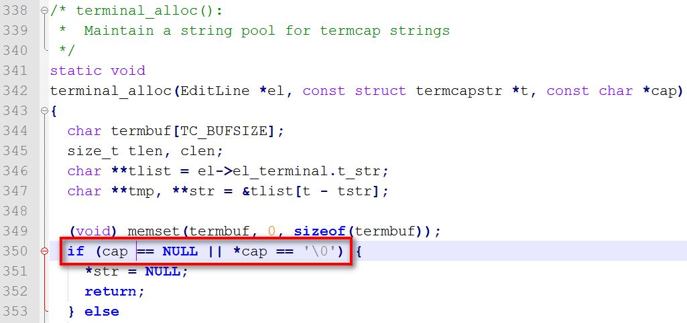
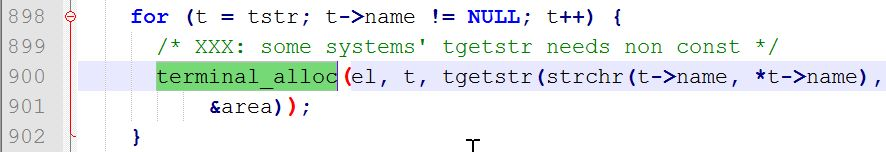
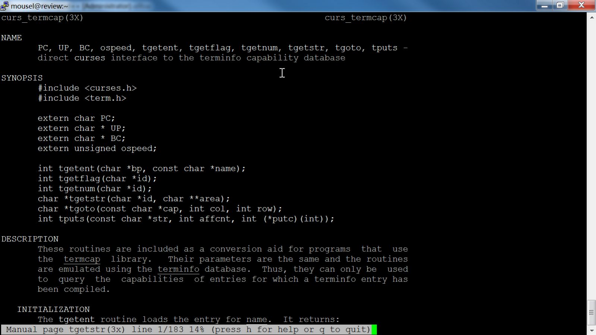
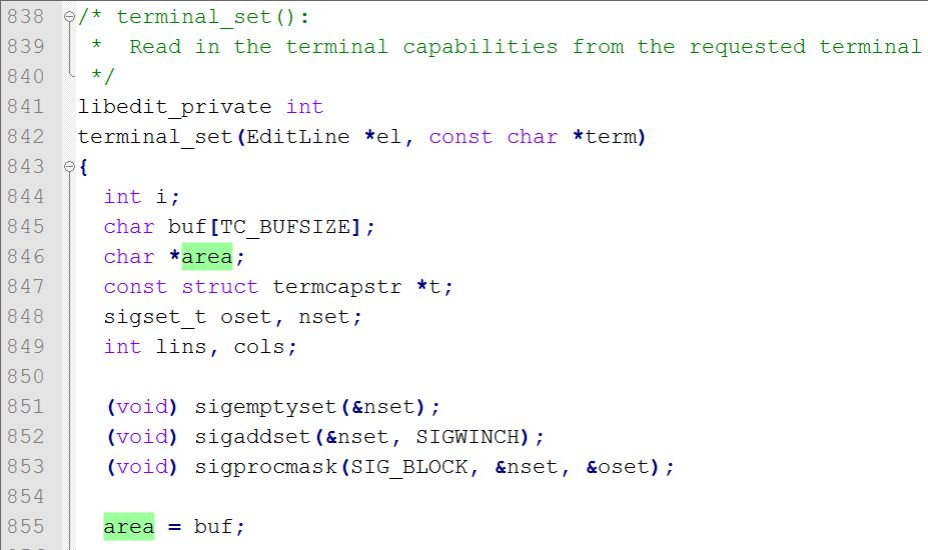
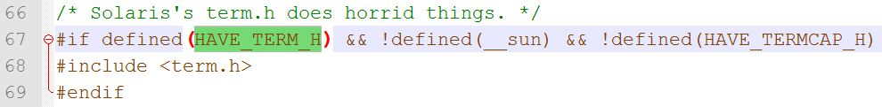
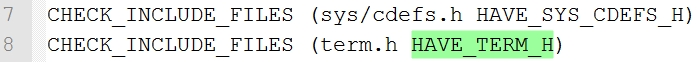

# 故障分析 | 命令行登录 MySQL 报 Segmentation fault 故障解决

**原文链接**: https://opensource.actionsky.com/20221031-mysql-2/
**分类**: MySQL 新特性
**发布时间**: 2022-10-30T22:33:21-08:00

---

作者：林浩
DBA ，专注于 MySQL ，擅长问题分析解决。
本文来源：原创投稿
*爱可生开源社区出品，原创内容未经授权不得随意使用，转载请联系小编并注明来源。
前段时间遇到一个 mysql 客户端 crash 的问题，这个 mysql 客户端是自己源码编译产生的。
为了解决这个问题，查阅了很多资料，涉及终端 ncurses 编程、进程的地址空间（堆和栈）、cmake、gcc 编译等，遇到不少“陷阱”，好在算是比较好的解决了这个问题。
> 环境：centos8.4 gcc8.4.1 mysql8.0.21 x86_64
问题描述：对 mysql8.0.21 源码进行 make，由于一开始没安装 ncurses 库，在链接时遇到错误 undefined reference to，后来安装了该库，再次 make 成功。于是将 mysqld 启动，再用 mysql -u root -p 连接，输好密码回车后 mysql 客户端发生 Segmentation fault。
第一次 make 时有编译警告（第二次 make 时不会有，因为.o 文件在第一次 make 时已经生成），摘要如下：
/opt/resource/mysql-8.0.21/extra/libedit/libedit-20190324-3.1/src/terminal.c: In function ‘ter
minal_set’:
/opt/resource/mysql-8.0.21/extra/libedit/libedit-20190324-3.1/src/terminal.c:877:6: warning: i
mplicit declaration of function ‘tgetent’; did you mean ‘getenv’? [-Wimplicit-function
-declaration]
i = tgetent(el->el_terminal.t_cap, term); 
^~~~~~~
getenv
/opt/resource/mysql-8.0.21/extra/libedit/libedit-20190324-3.1/src/terminal.c:899:15: warning:
implicit declaration of function ‘tgetflag’; did you mean ‘tigetflag’? [-Wimplicit-functi
on-declaration]
Val(T_am) = tgetflag("am"); 
^~~~~~~~
tigetflag
/opt/resource/mysql-8.0.21/extra/libedit/libedit-20190324-3.1/src/terminal.c:908:15: warning:
implicit declaration of function ‘tgetnum’; did you mean ‘tigetnum’? [-Wimplicit-fun
ction-declaration]
Val(T_co) = tgetnum("co"); 
^~~~~~~
tigetnum
/opt/resource/mysql-8.0.21/extra/libedit/libedit-20190324-3.1/src/terminal.c:917:19: warning:
implicit declaration of function ‘tgetstr’; did you mean ‘tigetstr’? [-Wimplicit-functio
n-declaration]
char *tmp = tgetstr(strchr(t->name, *t->name), &area); 
^~~~~~~
tigetstr
/opt/resource/mysql-8.0.21/extra/libedit/libedit-20190324-3.1/src/terminal.c:917:19: warning:
initialization of ‘ char * ’ from ‘ int ’ makes pointer from integer without a cast
[-Wint-conversion]
分析过程：
centos8.4 默认不能生成 core 文件，为了能临时生成 core 文件，需要对操作系统做如下配置：
`# echo "core-%t.%p" > /proc/sys/kernel/core_pattern`
意思是在执行程序的当前目录生成 core- 为前缀，再带上时间戳和进程号的 core 文件，比如：core-1637149273.2955 ，其中 1637149273 是时间戳，2955 是进程号。
修改 core_pattern 文件内容后，再次使 mysql 客户端发生  Segmentation fault ，于是就有了 core 文件了。
gdb 查看 core 文件的函数堆栈信息如下：
gdb bin/mysql ~/core-1637149273.2955
(gdb) bt
#0 0x00000000004e4eed in terminal_alloc (el=0x286eee0, t=<optimized out>, cap=0x52a9
aaa0 <error: Cannot access memory at address 0x52a9aaa0>)
at /opt/resource/mysql-8.0.21/extra/libedit/libedit-20190324-3.1/src/terminal.c:350
#1 0x00000000004e5da7 in terminal_set (el=el@entry=0x286eee0, term=<optimized out>,
term@entry=0x0)
at /opt/resource/mysql-8.0.21/extra/libedit/libedit-20190324-3.1/src/terminal.c:900
#2 0x00000000004e5ee1 in terminal_init (el=el@entry=0x286eee0) at /opt/resource/mysql
-8.0.21/extra/libedit/libedit-20190324-3.1/src/terminal.c:297
#3 0x00000000004ea220 in el_init_internal (prog=0x7ffd52a9c6c9 "./mysql", fin=0x7fcd6f9
c09c0 <_IO_2_1_stdin_>,
fout=0x7fcd6f9c16e0 <_IO_2_1_stdout_>, ferr=0x7fcd6f9c1600 <_IO_2_1_stderr_>, fdin=
0, fdout=fdout@entry=1, fderr=2, flags=128)
at /opt/resource/mysql-8.0.21/extra/libedit/libedit-20190324-3.1/src/el.c:139
#4 0x00000000004e22d5 in rl_initialize () at /opt/resource/mysql-8.0.21/extra/libedit/libedi
t-20190324-3.1/src/readline.c:297
#5 0x00000000004e2b55 in read_history (filename=filename@entry=0x286eec0 "/root/.my
sql_history")
at /opt/resource/mysql-8.0.21/extra/libedit/libedit-20190324-3.1/src/readline.c:1359
#6 0x000000000040924a in main (argc=<optimized out>, argv=<optimized out>) at /opt/r
esource/mysql-8.0.21/client/mysql.cc:1403
来看看 terminal.c 350 行附近的内容：

看这行的内容应该是内存地址非法访问造成 crash 的。再来看看 terminal.c 900 行附近的内容：

从第 900 行来看，应该是 tgetstr 函数返回值有问题。tgetstr 是 ncurse 库中的一个函数，为了更好的解决这个问题，有必要来了解一些终端编程的基本概念。
输入：`man 3 tgetstr` 来查看该函数的使用帮助，如下所示，我们可以知道终端能力有 3 种，分别是布尔值、数字值和字符串值，而该函数是用来获取字符串值的终端能力。同时，我们也可以知道，这个函数是给使用 termcap 库的应用使用的，后台会转换为 terminfo 库中的值。termcap 和 terminfo 都是描述终端能力的库，termcap 出现的比较早，已经被 terminfo 取代，但为了兼容性，termcap 的接口仍然保留。

在 centos6 中可以使用:cat /etc/termcap 来查看所有终端的能力，/etc/termcap 是一个 ASCII 文件，这个文件在 centos7 和 8 中已不存在。在 centos6/7/8 中可以使用：`infocmp` 来查看当前终端的能力，位于/usr/share/terminfo，terminfo 数据库保存的是编译后的内容。
这里引用一段 tgetstr 的使用说明(来源: https://www.gnu.org/software/termutils/manual/termcap-1.3/html_node/termcap_5.html )：
> tgetstr
Use tgetstr to get a string value. It returns a pointer to a string which is the capability v
alue, or a null pointer if the capability is not present in the terminal description. There
are two ways tgetstr can find space to store the string value:
`You can ask tgetstr to allocate the space.` Pass a null pointer for the argument area, and tgetstr will use malloc to allocate storage big enough for the value. Termcap will never free this storage or refer to it again; you should free it when you are finished with it. This method is more robust, since there is no need to guess how much space is needed. But it is supported only by the GNU termcap library.
`You can provide the space.`Provide for the argument area the address of a pointer variable of type char *. Before calling tgetstr, initialize the variable to point at available space. Then tgetstr will store the string value in that space and will increment the pointer variable to point after the space that has been used. You can use the same pointer variable for many calls to tgetstr. There is no way to determine how much space is needed for a single string, and no way for you to prevent or handle overflow of the area you have provided. However, you can be sure that the total size of all the string values you will obtain from the terminal description is no greater than the size of the description (unless you get the same capability twice). You can determine that size with strlen on the buffer you provided to tgetent. See below for an example. Providing the space yourself is the only method supported by the Unix version of termcap.
从下图中，我们可以看到第 900 行的 area 指向了 buf，是上面英文提到的第 2 种用法，也即调用方分配好存储。

在 terminal.c 中加上打印来看看 buf、area 和 tgetstr 的值的变化情况：
char buf[TC_BUFSIZE];
printf("buf addr:%p\n", buf);
... 
for (t = tstr; t->name != NULL; t++) {
/* XXX: some systems' tgetstr needs non const */
//terminal_alloc(el, t, tgetstr(strchr(t->name, *t->name),
// &area));
char *tmp = tgetstr(strchr(t->name, *t->name), &area);
printf("area:%p\n", area);
printf("tgetstr ret val:%p\n", tmp);
terminal_alloc(el, t, tmp);
}
打印结果如下：
> buf addr:0x7ffe0ec93660
area:0x7ffe0ec93664(第 1 次 for 循环)
tgetstr ret val:0xec93660(第 1 次 for 循环)
可以发现第 1 次 for 循环 tgetstr 的返回值是 buf 被截断低 4 个字节后的值，按道理应该和 buf 的值一样，所以会产生内存非法访问的错误，导致 segmentation fault。
问题到这里，令人百思不得其解，为什么就被截断了呢？
这时想起了编译时报的警告错误(写在文章开头): implicit declaration of function ，这个警告是缺少函数原型声明导致的，也就是第一次编译的时候没有安装依赖的 ncurse 库，从而缺少头文件 term.h ，从而缺少 tgetstr 的函数原型声明。那么这个警告和函数返回值截断有没有关系呢？
通过下面的程序来测试一下，
foo.h
#ifndef __FOO_H__
#define __FOO_H__
void foo();
#endif
foo.c
#include <stdlib.h>
#include <stdio.h>
void foo()
{
char buffer[1024];
printf("buffer:%p\n", buffer);
char *str = bar(buffer);
printf("str:%p\n", str);
printf("sizeof pointer:%d\n", sizeof(str));
printf("sizeof int:%d\n", sizeof(int));
}
bar.c
#include <stdio.h>
char *bar(char *buffer)
{
char *buf = buffer;
printf("buf:%p\n", buf);
return buf;
}
main.c
#include "foo.h"
int main(int argc, char *argv[])
{
foo();
return 0;
}
编译 foo.c 时报了如下警告 implicit declaration of function，
$ gcc foo.c -c -o foo.o
foo.c: In function ‘foo’:
foo.c:7:15: warning: implicit declaration of function ‘bar’ [-Wimplicit-function-declaration]
char *str = bar(buffer); 
^~~
foo.c:7:15: warning: initialization of ‘char *’ from ‘int’ makes pointer from integer
without a cast [-Wint-conversion]
执行结果:
$ ./main
buffer:0x7ffd563a8720
buf:0x7ffd563a8720
str:0x563a8720
sizeof pointer:8
sizeof int:4
通过输出结果不难看出，对于返回指针的 bar()函数，其返回值被截断，只保留了低 32 位。这里对于 64 位系统有“陷阱”，在 64 位系统中，由于 int 是 4 字节，指针是 8 字节，存在被截断的问题，容易导致程序 crash，32 位系统应该不存在该问题，所以在 64 位系统上要注意该编译警告带来的潜在问题，另外，就是养成一个良好的编译习惯，最好不要有警告。
#### 解决方法：
从该警告“implicit declaration of function”来看是由于缺少函数的原型声明，从 man 手册里知道 tgetstr 函数在 term.h 中有原型声明，只要 terminal.c 中 include 了这个头文件就可以了。在 terminal.c 中有如下代码，也就是说预编译 if 条件没成立。

在目录:extra\libedit\libedit-20191231-3.1\src 中打开 CMakeLists.txt，发现有如下内容：

也就是说由于第一次 make 时没有安装 ncurse 依赖库，导致缺少 term.h，导致 HAVE_TERM_H 没有被定义。所以怎么解决这个问题也就比较清楚了。
1.安装好 ncurses 库
sudo yum install -y ncurses-devel
2.清理 cmake 缓存：这一步很必要，如果不清理缓存，cmake 还是会认为没有相应头文件 term.h。进到相应的二进制目录，执行：rm CMakeCache.txt; rm -rf CMakeFiles
3.重新 cmake 和 make
不再出现编译警告“implicit declaration of function”，mysql 输入用户名和密码后也不再 crash 了。
以上是我的解决方法，我们也来看看其他的处理方法，这种方法在网上能搜到很多，即：编辑文件 terminal.c，把 terminal_set 方法中的 char buf[TC_BUFSIZE]; 这一行注释，再把 area = buf;改为 area = NULL;。
为什么这种方法可以呢？我们来分析一下。
这其实是那段 tgetstr 英文用法的第一种，由 tgetstr 函数自己去 malloc 一块足够大小的内存，tgetstr 函数返回 malloc 出来的内存地址，那么同样的问题来了，编译警告“implicit declaration of function”会导致 tgetstr 函数返回值被截断为低 4 个字节，为什么 mysql 客户端此时不会 crash 呢？
这里涉及到 linux 系统中进程的地址空间里的堆(Heap)和栈(Stack)的概念，malloc 分配出来的内存是放在堆上，terminal_set 方法中的 char buf[TC_BUFSIZE]是放在栈上。堆从进程的地址空间的低地址开始往高地址分配，栈从进程的地址空间的高地址开始往低地址分配。也就是说，堆的地址比栈的地址要低，我们来看一下打印出来的指针内容，
> buf addr:0x7ffd8cc1e1a0
area:(nil)(第 1 次 for 循环)
tgetstr ret val:0x23e72fa(第 1 次 for 循环)
我们看到 tgetstr 函数的返回值 0x23e72fa 没有 32 位，也即证实了堆从进程的地址空间的低地址开始分配，既然没到 32 位，那么截断后的内容没有改变。
在 mysql 的官网，我们可以找到这个问题: https://bugs.mysql.com/bug.php?id=58497 。好了，总结到此完毕。