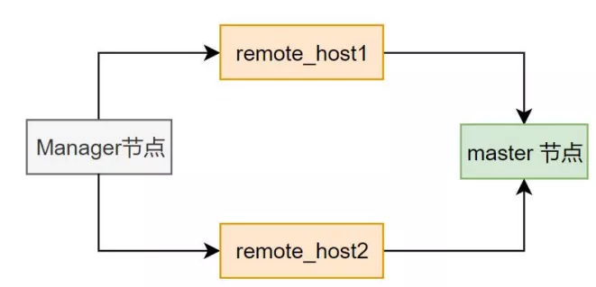

# 故障分析 | 如何提高 MHA 的网络容忍能力？（上）

**原文链接**: https://opensource.actionsky.com/20210315-mha/
**分类**: 技术干货
**发布时间**: 2021-03-15T00:46:02-08:00

---

作者：刘开洋
爱可生交付服务部团队北京 DBA，主要负责处理 MySQL 的 troubleshooting 和我司自研数据库自动化管理平台 DMP 的日常运维问题，对数据库及周边技术有浓厚的学习兴趣，喜欢看书，追求技术。
本文来源：原创投稿*爱可生开源社区出品，原创内容未经授权不得随意使用，转载请联系小编并注明来源。
## 一、问题说明
MHA 虽然停止更新了，但是其高可用的强大仍然为很多公司所青睐。我司客户由于一次网络故障，导致公司整体的网络通信出现问题，网络丢包严重，进而 MHA 管理下的 MySQL 主从集群发生切换。
众所周知，MHA 对数据库高可用集群的维护是一次性的，出现切换就要手工去重新加入集群，如果所有服务器网络再次出现问题，MHA 的频繁切换就会影响生产。
#### 客户咨询：如果再出现这种网络问题，如何提高 MHA 的容忍能力？
接下来我们就对该场景进行相关测试。
## 二、环境信息
在测试过程中，尽最大可能地和客户现场的配置信息尽量相同，达到接近生产环境的测试效果。
											
## 测试参数
- ping_interval
该参数表示 MHA manager 节点 ping（执行 select ping sql 语句）master 节点的间隔，如果连续三个丢失 ping 连接，MHA manager 就判定 master 宕掉了。
参数通过 4 次 ping 间隔(9s)的最大时间的机制来发现故障，从而进行 failover，默认参数值为 3，表示每次 ping 的间隔是 3 秒。
- secondary_check_script
默认情况下，MHA Manager 只会通过执行 select ping sql 语句来检查 Master 是否存活。通过 review 相关参数发现，可以通过使用外部 secondary_check_script 配置的脚本来做到从多个网络连接进行检查。
配置：
` secondary_check_script = masterha_secondary_check -s remote_host1 -s remote_host2
`原理：MHA 内置 masterha_secondary_check 容忍大多数网络场景现象，而不发生 failover。
											
上图所示 manager 通过 remote_host1 和 remote_host2 来检查 master 节点是否存活。
**只有在 manager 通过 remote_host1 和 remote_host2 检查 master 节点均失败的情况下，才会判定 master 节点不可用。其他情况，一律认为 master 还是活的。**
所以可以通过配置多条路由策略的方式，来提高 MHA 对网络问题的容忍能力。
## 三、测试结果及分析
测试网络丢包、坏包、重传、延迟等场景，发现网络丢包和坏包两种场景测试会满足 MHA 发生切换，因此针对这两种场景进行 MHA 参数对比测试。
在本次测试环境中使用 sysbench 压测工具模拟业务场景，在 Mnanger 节点和 MySQL 端，模拟配置丢包率、坏包率模拟网络通信问题，使得 MHA 因网络故障问题发生切换，以尽量复现生产的故障环境。
> 说明：在生产环境 MHA 参数配置相同的情况下，经多次测试，在以下场景中，5 分钟之内均会发生 MHA 的切换。因此默认观测时间为 5 分钟。
#### 3.1 坏包场景
仅坏包场景下，达到 70% 才开始切换。
											
> 测试说明：在模拟坏包 70% 的情况中，关闭 secondary_check_script 参数，将 ping_interval 调大可影响 MHA 的切换，提高网络容忍性。调高坏包率时与之前相同 ping_interval 值的场景做对比，可见坏包率增加，会促使 MHA 切换。
从实验结果上看，**在坏包率相同时，设置 ping_interval 的值不变，开启 secondary_check_script 参数调用相关脚本进行网络路由的多策略检查会增加 MHA 对网络的容忍性**，在调高坏包率的情况下，可观测到 manager 节点没有挂掉。
#### 3.2 丢包场景
仅丢包场景下，达到 50% 才开始切换。
											
> 测试说明：当前测试结果中，场景为模拟丢包 50%，故障主机为 manager 节点、主节点、从节点。ping_interval 参数值为 3（默认值）时在测试时间内 MHA 发生切换。以上场景中，随着 ping_interval 参数值的调大和配置 secondary_check_script 参数后在测试时间内 MHA 均没有切换。
#### 日志输出情况分析
#### ping_interval 日志输出信息
`10.186.63.40(10.186.63.40:7788) (current master)
+--10.186.63.153(10.186.63.153:7788)
+--10.186.63.52(10.186.63.52:7788)
Thu Jan 28 16:18:17 2021 - [warning] master_ip_failover_script is not defined.
Thu Jan 28 16:18:17 2021 - [warning] shutdown_script is not defined.
Thu Jan 28 16:18:17 2021 - [info] Set master ping interval 3 seconds.
Thu Jan 28 16:18:17 2021 - [warning] secondary_check_script is not defined. It is highly recommended setting it to check master reachability from two or more routes.
Thu Jan 28 16:18:17 2021 - [info] Starting ping health check on 10.186.63.40(10.186.63.40:7788)..
Thu Jan 28 16:18:17 2021 - [info] Ping(SELECT) succeeded, waiting until MySQL doesn't respond..
Thu Jan 28 16:19:32 2021 - [warning] Got timeout on MySQL Ping(SELECT) child process and killed it! at /usr/share/perl5/vendor_perl/MHA/HealthCheck.pm line 431.
Thu Jan 28 16:19:32 2021 - [info] Executing SSH check script: exit 0
Thu Jan 28 16:19:35 2021 - [warning] Got error on MySQL connect: 2003 (Can't connect to MySQL server on '10.186.63.40' (4))
Thu Jan 28 16:19:35 2021 - [warning] Connection failed 2 time(s)..
Thu Jan 28 16:19:37 2021 - [warning] HealthCheck: Got timeout on checking SSH connection to 10.186.63.40! at /usr/share/perl5/vendor_perl/MHA/HealthCheck.pm line 342.
Thu Jan 28 16:19:38 2021 - [warning] Got error on MySQL connect: 2003 (Can't connect to MySQL server on '10.186.63.40' (4))
Thu Jan 28 16:19:38 2021 - [warning] Connection failed 3 time(s)..
Thu Jan 28 16:19:41 2021 - [warning] Got error on MySQL connect: 2003 (Can't connect to MySQL server on '10.186.63.40' (4))
Thu Jan 28 16:19:41 2021 - [warning] Connection failed 4 time(s)..
Thu Jan 28 16:19:41 2021 - [warning] Master is not reachable from health checker!
Thu Jan 28 16:19:41 2021 - [warning] Master 10.186.63.40(10.186.63.40:7788) is not reachable!
Thu Jan 28 16:19:41 2021 - [warning] SSH is NOT reachable.
Thu Jan 28 16:19:41 2021 - [info] Connecting to a master server failed. Reading configuration file /etc/masterha_default.cnf and /data/masterha/app1.cnf again, and trying to connect to all servers to check server status..
`> 说明：在配置参数 ping_interval 后，manager 日志中可观测到每 3 秒进行一次 ping 操作连接 MySQL 的主实例，3 次无法连接后，判定 master 故障，进行 manager 配置文件检测，准备进行切换操作。
#### secondary_check_script 输出日志信息
`10.186.63.40(10.186.63.40:7788) (current master)
+--10.186.63.153(10.186.63.153:7788)
+--10.186.63.52(10.186.63.52:7788)
Mon Jan 25 15:51:36 2021 - [warning] master_ip_failover_script is not defined.
Mon Jan 25 15:51:36 2021 - [warning] shutdown_script is not defined.
Mon Jan 25 15:51:36 2021 - [info] Set master ping interval 3 seconds.
Mon Jan 25 15:51:36 2021 - [info] Set secondary check script: masterha_secondary_check -s 10.186.63.153 -s 10.186.63.52
Mon Jan 25 15:51:36 2021 - [info] Starting ping health check on 10.186.63.40(10.186.63.40:7788)..
Mon Jan 25 15:51:39 2021 - [warning] Got error on MySQL connect: 2003 (Can't connect to MySQL server on '10.186.63.40' (4))
Mon Jan 25 15:51:39 2021 - [warning] Connection failed 1 time(s)..
Mon Jan 25 15:51:39 2021 - [info] Executing secondary network check script:masterha_secondary_check -s 10.186.63.153 -s 10.186.63.52
--user=root
--master_host=10.186.63.40
--master_ip=10.186.63.40
--master_port=7788
--master_user=mha --master_password=123456 --ping_type=SELECT
Mon Jan 25 15:51:39 2021 - [info] Executing SSH check script: exit 0 Master is reachable from 10.186.63.153!
Mon Jan 25 15:51:41 2021 - [warning] Master is reachable from at least one of other monitoring servers. Failover should not happen.
Mon Jan 25 15:51:44 2021 - [warning] HealthCheck: SSH to 10.186.63.40 is NOT reachable.
Mon Jan 25 15:51:46 2021 - [info] Ping(SELECT) succeeded, waiting until MySQL doesn't respond..
Mon Jan 25 15:51:46 2021 - [warning] Got error on MySQL select ping: 2006 (MySQL server has gone away)
Mon Jan 25 15:51:49 2021 - [warning] Got error on MySQL connect: 2003 (Can't connect to MySQL server on '10.186.63.40' (4))
Mon Jan 25 15:51:49 2021 - [warning] Connection failed 3 time(s)..
Mon Jan 25 15:51:52 2021 - [info] Ping(SELECT) succeeded, waiting until MySQL doesn't respond..
Mon Jan 25 15:56:12 2021 - [warning] Got timeout on MySQL Ping(SELECT) child process and killed it! at /usr/share/perl5/vendor_perl/MHA/HealthCheck.pm line 431.
Mon Jan 25 15:56:12 2021 - [info] Executing secondary network check script:masterha_secondary_check -s 10.186.63.153 -s 10.186.63.52
--user=root
--master_host=10.186.63.40
--master_ip=10.186.63.40
--master_port=7788
--master_user=mha --master_password=123456 --ping_type=SELECT
...skipping...
Mon Jan 25 15:58:18 2021 - [info] Executing secondary network check script:
masterha_secondary_check -s 10.186.63.153 -s 10.186.63.52
--user=root
--master_host=10.186.63.40
--master_ip=10.186.63.40
--master_port=7788
--master_user=mha --master_password=123456 --ping_type=SELECT
Mon Jan 25 15:58:18 2021 - [info] Executing SSH check script: exit 0
Master is reachable from 10.186.63.153!
Mon Jan 25 15:58:20 2021 - [warning] Master is reachable from at least one of other
monitoring servers. Failover should not happen.
Mon Jan 25 15:58:21 2021 - [warning] Got error on MySQL connect: 2003 (Can't connect to MySQL server on '10.186.63.40' (4))
Mon Jan 25 15:58:21 2021 - [warning] Connection failed 2 time(s)..
Mon Jan 25 15:58:23 2021 - [warning] HealthCheck: Got timeout on checking SSH connection to 10.186.63.40! at /usr/share/perl5/vendor_perl/MHA/HealthCheck.pm line 342.
Mon Jan 25 15:58:24 2021 - [warning] Got error on MySQL connect: 2003 (Can't connect to MySQL server on '10.186.63.40' (4))
Mon Jan 25 15:58:24 2021 - [warning] Connection failed 3 time(s)..
Mon Jan 25 15:58:27 2021 - [warning] Got error on MySQL connect: 2003 (Can't connect to MySQL server on '10.186.63.40' (4))
Mon Jan 25 15:58:27 2021 - [warning] Connection failed 4 time(s)..
Mon Jan 25 15:58:27 2021 - [warning] Secondary network check script returned errors.
Failover should not start so checking server status again. Check network settings for details.
Mon Jan 25 15:58:30 2021 - [warning] Got error on MySQL connect: 2003 (Can't connect to MySQL server on '10.186.63.40' (4))
Mon Jan 25 15:58:30 2021 - [warning] Connection failed 1 time(s)..
Mon Jan 25 15:58:30 2021 - [info] Executing secondary network check script:masterha_secondary_check -s 10.186.63.153 -s 10.186.63.52
--user=root
--master_host=10.186.63.40
--master_ip=10.186.63.40
--master_port=7788
--master_user=mha --master_password=123456 --ping_type=SELECT
Mon Jan 25 15:58:30 2021 - [info] Executing SSH check script: exit 0
Mon Jan 25 15:58:35 2021 - [warning] HealthCheck: Got timeout on checking SSH connection to 10.186.63.40! at /usr/share/perl5/vendor_perl/MHA/HealthCheck.pm line 342.
Master is reachable from 10.186.63.153!
Mon Jan 25 15:58:37 2021 - [warning] Master is reachable from at least one of other monitoring servers. Failover should not happen.
Mon Jan 25 15:58:41 2021 - [info] Ping(SELECT) succeeded, waiting until MySQL doesn't respond..
Mon Jan 25 15:58:44 2021 - [warning] Got timeout on MySQL Ping(SELECT) child process and killed it! at /usr/share/perl5/vendor_perl/MHA/HealthCheck.pm line 431.
Mon Jan 25 15:58:47 2021 - [warning] Got error on MySQL connect: 2003 (Can't connect to MySQL server on '10.186.63.40' (4))
Mon Jan 25 15:58:47 2021 - [warning] Connection failed 3 time(s)..
Mon Jan 25 15:58:50 2021 - [warning] Got error on MySQL connect: 2003 (Can't connect to MySQL server on '10.186.63.40' (4))
Mon Jan 25 15:58:50 2021 - [warning] Connection failed 4 time(s)..
Mon Jan 25 15:58:50 2021 - [warning] Secondary network check script returned errors.
Failover should not start so checking server status again. Check network settings for details.
Mon Jan 25 15:58:53 2021 - [warning] Got error on MySQL connect: 2003 (Can't connect to MySQL server on '10.186.63.40' (4))
Mon Jan 25 15:58:53 2021 - [warning] Connection failed 1 time(s)..
Mon Jan 25 15:58:53 2021 - [info] Executing SSH check script: exit 0
Mon Jan 25 15:58:53 2021 - [info] Executing secondary network check script:masterha_secondary_check -s 10.186.63.153 -s 10.186.63.52
--user=root
--master_host=10.186.63.40
--master_ip=10.186.63.40
--master_port=7788
--master_user=mha --master_password=123456 --ping_type=SELECT
Mon Jan 25 15:58:56 2021 - [warning] Got error on MySQL connect: 2003 (Can't connect to MySQL server on '10.186.63.40' (4))
Mon Jan 25 15:58:56 2021 - [warning] Connection failed 2 time(s)..
Mon Jan 25 15:58:58 2021 - [warning] HealthCheck: Got timeout on checking SSH
connection to 10.186.63.40! at /usr/share/perl5/vendor_perl/MHA/HealthCheck.pm line 342.
Mon Jan 25 15:58:59 2021 - [warning] Got error on MySQL connect: 2003 (Can't connect to MySQL server on '10.186.63.40' (4))
`> 说明：在配置参数 secondary_check_script 后的 manager 日志中可观测到 MHA多次进行二次网络连接检测。
## 测试结论
根据以上单变量实验测试，在坏包丢包的场景下，从 manager 日志中可判断：**参数 ping_interval 和 secondary_check_script 在网络情况较差时，可延长 MHA 的判断时间和抑制切换频率。** MHA 集群在网络环境较差时，网络容忍性有所提高。但无法保证 MHA 不发生切换。
- 当前测试环境与生产存在差异，测试结果也有一定的随机概率，以上测试结果供参考。
- secondary_check_script 参数可以使 manager 有更多的网络连接策略去判断主从之间的网络连通性，可以在很大程度上提高 MHA 的网络容忍性。
- ping_interval 参数值提高会增加 MHA 对于故障的判断时间，可根据业务程度的不同，对故障容忍时间的不同进行调整。
参数弊端：将 ping_interval 的值增大，MHA 对于 MySQL master 节点的检测故障时间将会延长。
## 下期预告
关于 secondary_check_script 参数的具体说明，以及相关网络故障的模拟测试。
**相关推荐：**
[故障分析 | 全局读锁一直没有释放，发生了什么？](https://opensource.actionsky.com/20210111-mysql/)