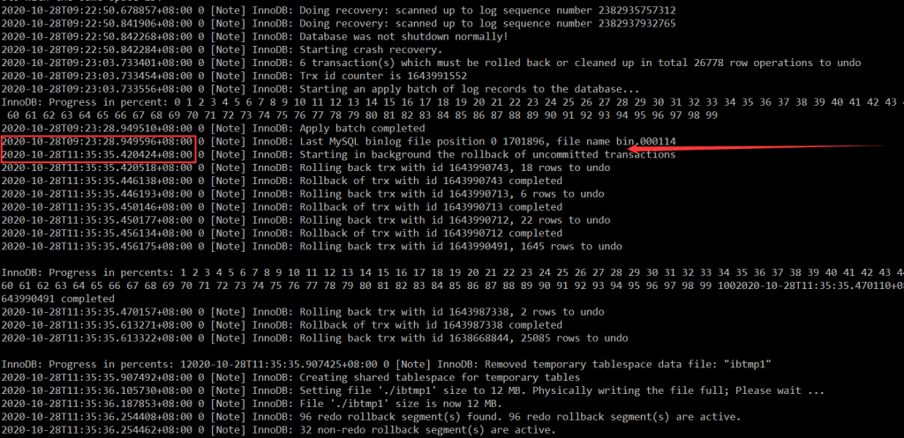
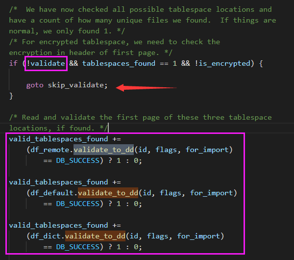
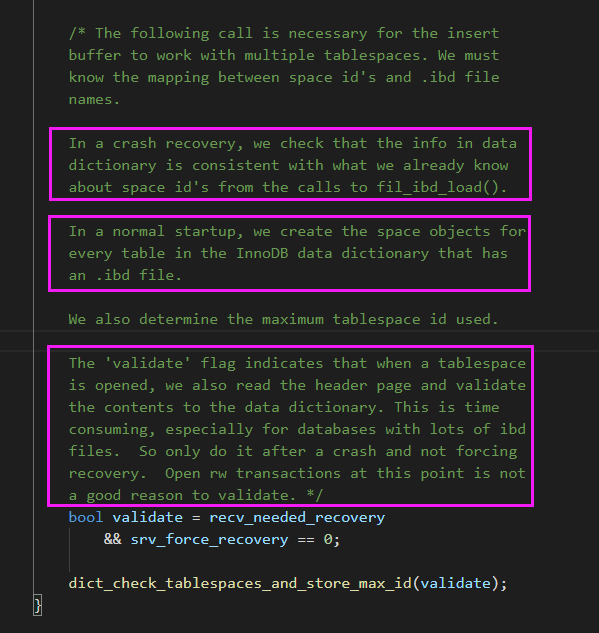
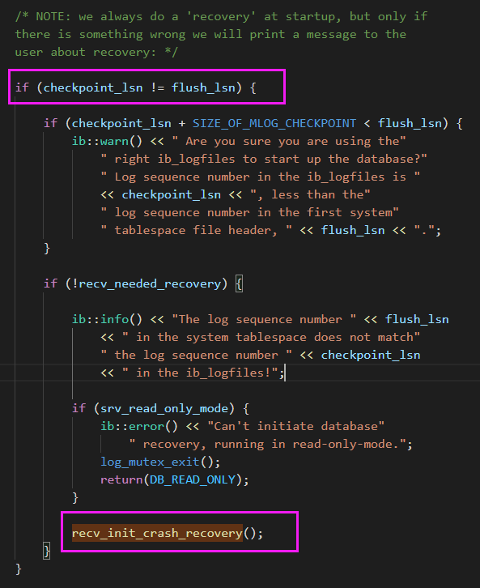
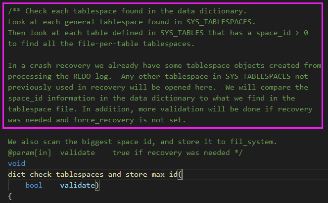
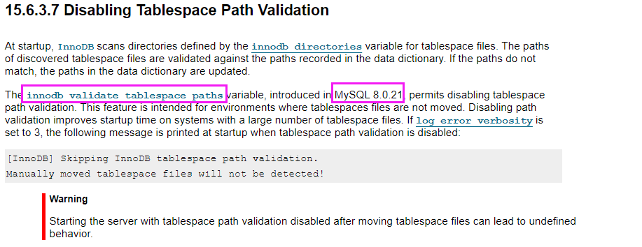
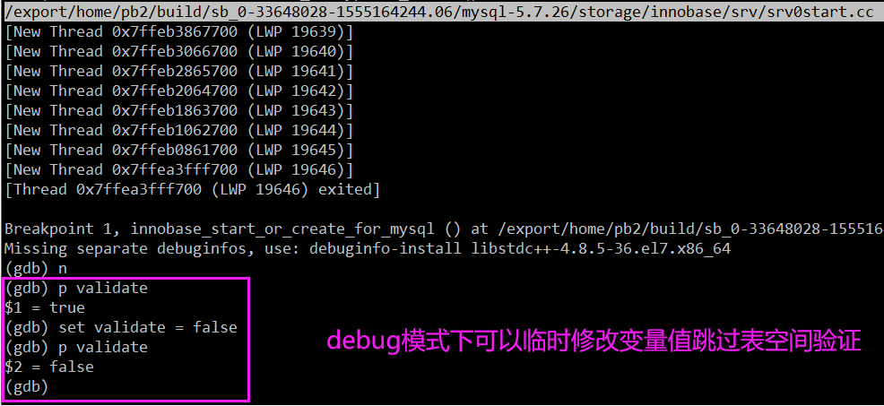
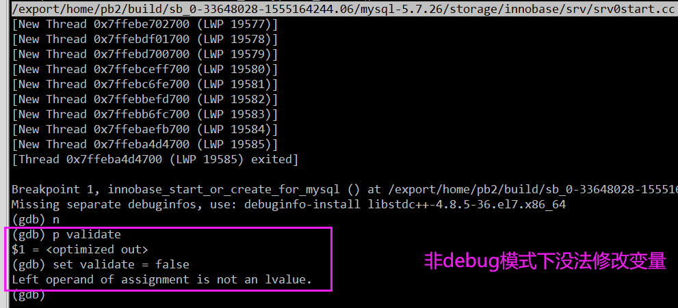

# 故障分析 | 崩溃恢复巨慢原因分析

**原文链接**: https://opensource.actionsky.com/20201113-mysql/
**分类**: MySQL 新特性
**发布时间**: 2020-11-12T23:31:36-08:00

---

作者：xuty
本文来源：原创投稿
*爱可生开源社区出品，原创内容未经授权不得随意使用，转载请联系小编并注明来源。
**一、现象**
有个 MySQL 5.7 开发库异常挂掉后，奔溃恢复一直处于如下位置，且持续了 2 小时左右才起来。非常疑惑这段时间 MySQL 到底做了什么事情？居然需要这么长时间。
虽说这里虚拟机的 IOPS 并不是很高，但也绝对不需要这么久吧？而且从日志输出来看，这块应该也不是在做真正的数据恢复，那么也可以排除是大事务回滚导致的耗时长，那么原因到底是啥呢？
值得注意的是，这台开发库上面有将近 1500 个库和上万张表，难道 **MySQL 崩溃恢复时长**和**表的数量**也存在一定关系嘛？
											
**二、分析栈帧**
在 MySQL 崩溃恢复时，用 **pstack** 打了栈帧，再用 **pt-pmp** 工具分析栈帧后显示如下：- 
- 
- 
- 
- 
- 
- 
- 
- 
- 
- 
`pread64(libpthread.so.0),os_file_io(os0file.cc:5435),``os_file_pread(os0file.cc:5612),os_file_read_page(os0file.cc:5612),``os_file_read_no_error_handling_func(os0file.cc:6069),``pfs_os_file_read_no_error_handling_func(os0file.ic:341),``Datafile::read_first_page(os0file.ic:341),Datafile::validate_first_page(fsp0file.cc:551),``Datafile::validate_to_dd(fsp0file.cc:404),fil_ibd_open(fil0fil.cc:3969),``dict_check_sys_tables(dict0load.cc:1465),dict_check_tablespaces_and_store_max_id(dict0load.cc:1525),``innobase_start_or_create_for_mysql(srv0start.cc:2329),innobase_init(ha_innodb.cc:4048),``ha_initialize_handlerton(handler.cc:838),plugin_initialize(sql_plugin.cc:1197),``plugin_init(sql_plugin.cc:1538),init_server_components(mysqld.cc:4033),``mysqld_main(mysqld.cc:4673),__libc_start_main(libc.so.6),_start`根据函数名字，感觉像是在**遍历校验每个表空间文件的有效性？**，难道 MySQL 崩溃恢复时会额外进行校验操作？貌似和表数量扯上点关系了。
**三、GDB 调试**
> Server version: 5.7.26-log MySQL Community Server (GPL)
直接去分析源码感觉有点找不到切入点，因为不知道正常启动是不是也是这样的函数调用。为了知道**正常启动**与**崩溃恢复**的区别，先在本地的 MySQL  5.7.26 环境中用 GDB 调试 MySQL 启动过程，看下正常启动和崩溃恢复的函数调用有哪些区别，再针对性的去分析源码比较好。- 
- 
- 
- 
- 
- 
- 
- 
- 
- 
- 
- 
- 
- 
`-- 将之前的栈帧弄成了树状，便于分析``>innobase_init``| >innobase_start_or_create_for_mysql``| | >dict_check_tablespaces_and_store_max_id``| | | >dict_check_sys_tables``| | | | >fil_ibd_open``| | | | | >Datafile::validate_to_dd``| | | | | | >Datafile::validate_first_page``| | | | | | | >Datafile::read_first_page``| | | | | | | | >pfs_os_file_read_no_error_handling_func``| | | | | | | | | >os_file_read_no_error_handling_func``| | | | | | | | | | >os_file_read_page``| | | | | | | | | | | >os_file_pread``| | | | | | | | | | | | >os_file_io`
正常启动 GDB 调试结果：
从上到下，每次打一个断点函数，发现到 **Datafile::validate_to_dd** 这个函数时，MySQL 正常启动就不会执行，看样子是 **fil_ibd_open** 函数中做了某些判断。
崩溃恢复 GDB 调试结果：
一边用 sysbench 压，一边直接 kill -9 进程就可以模拟崩溃恢复，同样从上到下，依次打断点函数，发现会走到 **Datafile::validate_to_dd** 这个函数中，Continue 后会一直断点在这个函数上，说明外层包装了一层循环会遍历所有表，如果继续增加断点函数的话，发现绝大部分表会继续走下去，直到 **os_file_io**，而小部分表则不会继续走下去。
**四、源码分析**
4.1. fil_ibd_open我们先去 **fil_ibd_open** 函数中看下，进入 **Datafile::validate_to_dd** 函数的判断条件，发现主要和一个 **validate** 参数有关，如果为 **false** 则可以跳过检测，为 **true** 则需要进入 **Datafile::validate_to_dd** 函数。
											
4.2. innobase_start_or_create_for_mysql
然后我们需要看下 **validate** 参数的定义，分析崩溃恢复与正常启动的区别。发现 **validate 参数** 最早是在 **innobase_start_or_create_for_mysql** 函数中定义的，并且其注释已经解释的非常详细。1. 正常启动：直接为每张表的创建 space object 即可，不需要打开 ibd 文件的 header page 进行表空间校验。2. 崩溃恢复：为了数据字典的一致性，需要遍历打开所有 ibd 文件的 header page 进行表空间校验。> validate 这个参数表明当一个表空间被打开时，同时会去读取其 ibd 文件的头页（header page）来验证数据字典的一致性，而当数据库包含许多 ibd 文件时，这个过程就会比较久，所以只在崩溃恢复且非强制恢复时执行表空间校验操作！
											
4.3. recv_needed_recovery & srv_force_recovery 
接着我们来看下决定 validate 值的 2 个参数：**recv_needed_recovery** 与 **srv_force_recovery**，默认崩溃恢复时，recv_needed_recovery = 1 而 srv_force_recovery = 0 ，所以 validate = true，即需要进行表空间校验。- 
- 
- 
- 
- 
`bool validate = recv_needed_recovery && srv_force_recovery == 0;``//跳过表空间校验``validate = false``//执行表空间校验``validate = true`先看下 **recv_needed_recovery** 参数，默认为 0。MySQL 在启动时会比对 **checkpoint_lsn** 与 **flush_lsn**。如果不相等，就会调用 **recv_init_crash_recovery** 方法将 **recv_needed_recovery** 置为 **1**。只有当 MySQL 正常关闭时，这 2 个 lsn 才会相等。另外一个小发现，MySQL 5.7 中服务起来后，什么操作都不做，checkpoint_lsn 永远会落后 9，所以即使你什么都不做，直接 kill -9 进程，也算是崩溃重启。- 
- 
- 
- 
- 
- 
```
LOG`---``Log sequence number 2563079308``Log flushed up to   2563079308``Pages flushed up to 2563079308``Last checkpoint at  2563079299
```
											
再来看下 **srv_force_recovery** 参数，默认值为 0，如果设置了 innodb_force_recovery ，那么 srv_force_recovery 的值就等于 innodb_force_recovery 的值，即只要配置了强制恢复，srv_force_recovery  就会大于 0。
4.4. dict_check_tablespaces_and_store_max_id
最后看下 **dict_check_tablespaces_and_store_max_id** 函数，根据注释介绍，这个函数会检查所有在数据字典中发现的表空间， 先检查每个共享表空间，然后检查每个独立表空间。在**崩溃恢复**中，部分表空间已经在处理 redolog 时被打开（对应之前 GDB 调试时部分表未继续走下去），而其他没有被打开的表空间，将会通过比较数据字典中的 space_id 与表空间文件是否一致的方式进行验证（也就是之前所说的**表空间校验过程**）。
											
**五、测试验证**
到这里，原理大概已经知道了，主要就是：MySQL 在崩溃恢复时，会遍历打开所有 ibd 文件的 header page 验证数据字典的准确性，如果 MySQL 中包含了大量表，这个校验过程就会比较耗时。
那么我们可以模拟下这个场景，进一步验证，比如在**测试库**中用 sysbench 建 50W 张空表，然后模拟非正常关闭，对比下崩溃恢复时长。
											
可以看到 MySQL 下崩溃恢复确实和表数量有关，表总数越大，崩溃恢复时间越长。另外磁盘 IOPS 也会影响崩溃恢复时间，像这里开发库的 HDD IOPS 较低，因此面对大量的表空间，校验速度就非常缓慢。
另外一个发现，MySQL 8 下正常启用时居然也会进行表空间校验，而故障恢复时则会额外再进行一次表空间校验，等于校验了 2 遍。不过 MySQL 8.0 里多了一个特性，即表数量超过 5W 时，会启用多线程扫描，加快表空间校验过程。
											
MySQL 8.0.21 开始可以通过 **innodb_validate_tablespace_paths** 参数关闭正常启动时的表空间校验过程。
											
**六、如何跳过校验**
MySQL 5.7 下有方法可以跳过崩溃恢复时的表空间校验过程嘛？查阅了资料，方法主要有两种：1. 配置 innodb_force_recovery可以使 srv_force_recovery != 0  ，那么 validate  = false，即可以跳过表空间校验。实际测试的时候设置 innodb_force_recovery =1，也就是强制恢复跳过坏页，就可以跳过校验，然后重启就是正常启动了。通过这种临时方式可以避免崩溃恢复后非常耗时的表空间校验过程，快速启动 MySQL，个人目前暂时未发现有什么隐患。2. 使用共享表空间替代独立表空间这样就不需要打开 N 个 ibd 文件了，只需要打开一个 ibdata 文件即可，大大节省了校验时间。自从听了姜老师讲过使用共享表空间替代独立表空间解决 drop 大表时性能抖动的原理后，感觉共享表空间在很多业务环境下，反而更有优势。- 
- 
- 
- 
- 
bool validate = recv_needed_recovery && srv_force_recovery == 0;``//跳过表空间校验``validate = false``//执行表空间校验``validate = true`临时冒出另外一种解决想法，即用 GDB 调试崩溃恢复，通过临时修改 validate 变量值让 MySQL 跳过表空间验证过程，然后让 MySQL 正常关闭，重新启动就可以正常启动了。
但是实际测试发现，如果以 debug 模式运行，确实可以临时修改 validate 变量，跳过表空间验证过程，但是 debug 模式下代码运行效率大打折扣，反而耗时更长。而以非 debug 模式运行，则无法修改 validate 变量，想法破灭。
											
											
**附录：**
https://dev.mysql.com/worklog/task/?id=7142
http://blog.symedia.pl/2015/11/mysql-56-and-57-crash-recovery.html
https://www.percona.com/community-blog/2019/07/23/impact-of-innodb_file_per_table-option-on-crash-recovery-time/
https://jira.mariadb.org/browse/MDEV-18733
相关推荐：
[故障分析 | MySQL 优化案例 &#8211; select count(*)](https://opensource.actionsky.com/20200707-mysql/)
[故障分析 | MySQL 优化案例 &#8211; 字符集转换](https://opensource.actionsky.com/20200630-mysql/)
[故障分析 | 有效解决 MySQL 行锁等待超时问题【建议收藏】](https://opensource.actionsky.com/20200421-mysql/)