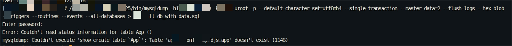
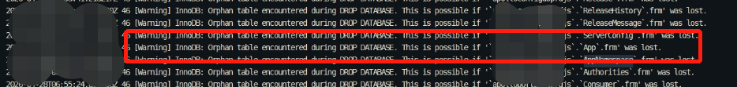
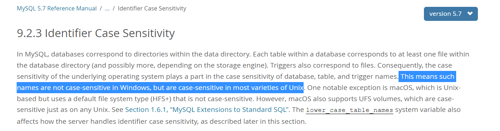
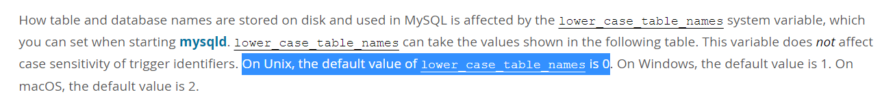
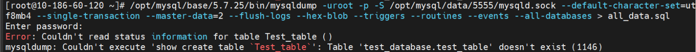

# 故障分析 | 库表名-大小写不规范，运维两行泪

**原文链接**: https://opensource.actionsky.com/2023111-mysql/
**分类**: MySQL 新特性
**发布时间**: 2023-01-10T21:16:00-08:00

---

作者：刘聪
爱可生华东交付服务部  DBA 成员，专职 MySQL 故障处理及相关技术支持。座右铭：好好学习，天天向上。
本文来源：原创投稿
*爱可生开源社区出品，原创内容未经授权不得随意使用，转载请联系小编并注明来源。
#### 一、问题描述
客户需要做一套库的迁移，因为库的数据量不大，40G左右，并且需要到远程机器上去做全量恢复。所以第一时间想到的自然是 mysqldump 工具来做。但是没想到会发生这种“惨案”。

mysqldump 备份失败，报错表不存在。
检查 MySQL 客户端去查看表信息以及表的物理文件包括环境信息（是否严格区分大小写），整理的现象如下：
- mysqldump 报错：table doesn&#8217;t exist；
- show tables 观察：db 存在，报错的 table 也存在；
- select 查看表数据：报错 table doesn&#8217;t exist ；
- 观察物理文件：db.opt 文件不存在；报错的 table，idb 文件不存在，仅有 frm 文件；
- 查看 mysql-error.log ：有 DROP database 的提示，且记录了报错 table 的 frm 文件 was lost ;
- MySQL 环境信息：lower_case_table_names = 1 。

#### 二、分析诊断
首先，我们看一下 MySQL 官网提供的信息（官网链接：https://dev.mysql.com/doc/refman/5.7/en/identifier-case-sensitivity.html）。
根据下面截图信息可以确定 Unix 平台上，lower_case_table_names 默认 = 0 ，是大小写敏感的。

从 mysqldump 报错所提示的表名中包含了大写，不难推断出：是在 lower_case_table_names = 0 条件下，创建了该表，所以表名和物理文件名也都包含大写。而当前的 MySQL 环境是 lower_case_table_names = 1（也就是不论 sql 中是否明确了表名的大小写，均按小写去匹配），可以确定此环境变量有做过变更。
结合 mysql-error.log 的报错信息提示，可能有 DROP database 动作执行过。且数据库目录中的 db.opt 文件缺失这点，更加增强了 DROP database 的可能性。
那么，我们不妨做出如下猜想：
在 lower_case_table_names = 1 环境下，下发了 DROP database 操作。由于操作系统 Linux 是大小写敏感的，MySQL 使用小写字母去匹配需要删除的库表文件，而.frm文件名中包含了大写，无法匹配，导致文件残留（mysql-error.log 此时记录，在删库过程中，无法找到对应.frm文件）。
#### 三、场景模拟
##### 测试环境：
| 操作系统 | CentOS Linux release 7.5.1804 (Core) |
| --- | --- |
| MySQL版本 | 5.7.25, for linux-glibc2.12 (x86_64) |
为了证实第二节的猜想是否准确，设计如下实验，模拟复现 mysqldump 报错。
- 在 lower_case_table_names=0 ，严格区分大小写条件下创建测试库‘test_database’和测试表‘Test_table’；
- 修改配置文件 lower_case_table_names=1 ，并重启 MySQL ；
- 在 lower_case_table_names=1 条件下，模拟删除数据库：test_database ；
- 查看物理文件信息以及 mysql-error.log 信息；
- 使用 mysqldump 触发备份动作，复现报错。

通过以上实验，可以论证第二节的推测是准确的，并总结如下结论：
- 操作系统 Linux 是大小写敏感的，在 lower_case_table_names=0（默认值）条件下，库表的物理文件会明确区分大小写；
- 在 lower_case_table_names=1 条件下，MySQL 使用小写字母（不论 sql 语句里是否明确使用大写表名）去匹配需要删除的库表文件；
- 在 lower_case_table_names=1 条件下，下发 Drop database 操作，由于表 frm 文件名包含大写，无法匹配，因此残留，而 idb 文件不论大小写都会被删除。
#### 四、报错解决方案
通过第三节的场景模拟可以推测出，应用人员其实本意是要将库下的数据全部删除掉，但是因 MySQL 的环境因素，以及运维人员的操作不当，导致遗留下.frm文件未被清理掉。那么我们可以直接跳过相关库的备份，从而绕过此报错。
#### 五、运维建议
运维中，难免有库表的迁移和改造的需求，这时需要特别注意 lower_case_table_names 的值以及库、表名的大小写，稍不留神就报错库或者表不存在。对此，整理如下两个场景以供大家运维参考。
##### 场景1：将 MySQL 的环境变量 lower_case_table_names 从默认的 0 ，修改为1
- 先将库名和表名转换为小写；
- 编辑配置文件，添加配置：lower_case_table_names = 1 ；
- 重启 MySQL 。
##### 场景2：将大写的表名、库名规范改成小写的：
- 表名改造：可以直接使用 RENAME TABLE 语句；
- 库名改造：需要先使用 mysqldump ，将数据全部导出后，重建库名，再将数据导入进去。
致谢：感谢爱可生DBA巨佬操盛春、晏泽的鼎力相助！