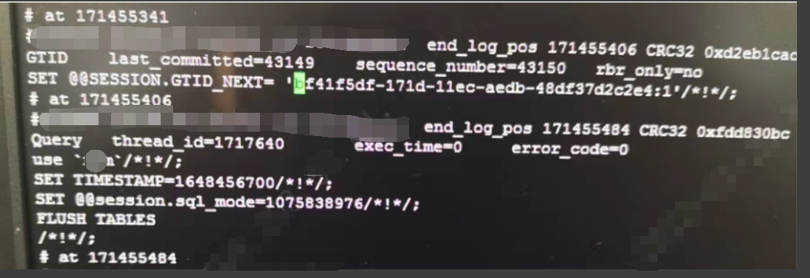
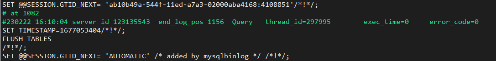

# 故障分析 | 我都只读了，你还能写入？

**原文链接**: https://opensource.actionsky.com/20230310-mysql/
**分类**: MySQL 新特性
**发布时间**: 2023-03-10T00:37:25-08:00

---

作者：秦福朗
爱可生 DBA 团队成员，负责项目日常问题处理及公司平台问题排查。热爱互联网，会摄影、懂厨艺，不会厨艺的 DBA 不是好司机，didi~
本文来源：原创投稿
*爱可生开源社区出品，原创内容未经授权不得随意使用，转载请联系小编并注明来源。
read_only：我都只读了，你还能写进来？ xxx：binlog，我写了哦~
#### 背景
业务运行中，高可用管理平台报错MySQL数据库的从库GTID与主库不一致了，从库踢出高可用集群，开启了read_only与super_read_only的从库怎么会GTID不一致呢？
## 发现问题
首先查看show master status与show slave status，发现从库确实多了一个GTID，然后拿着GTID去binlog里找问题：

发现从库binlog被写入FLUSH TABLES 语句，产生新的GTID号。
#### 本地测试
本地测试发现在开启read_only与super_read_only的实例里面执行 FLUSH TABLES 是可以写入binlog，产生新GTID的。

经业务反馈，这个时间点ClickHouse在从库同步数据，应该就是ClickHouse在某些状态下工作会对MySQL数据库实例下发FLUSH TABLES语句。
官网确实在一个不起眼的地方说这个语句会写入binlog：
> Some forms of the FLUSH statement are not logged because they could cause problems if replicated to a replica: FLUSH LOGS and FLUSH TABLES WITH READ LOCK. For a syntax example, see Section 13.7.6.3, “FLUSH Statement”. The FLUSH TABLES, ANALYZE TABLE, OPTIMIZE TABLE, and REPAIR TABLE statements are written to the binary log and thus replicated to replicas. This is not normally a problem because these statements do not modify table data.
However, this behavior can cause difficulties under certain circumstances. If you replicate the privilege tables in the mysql database and update those tables directly without using GRANT, you must issue a FLUSH PRIVILEGES on the replicas to put the new privileges into effect. In addition, if you use FLUSH TABLES when renaming a MyISAM table that is part of a MERGE table, you must issue FLUSH TABLES manually on the replicas. These statements are written to the binary log unless you specify NO_WRITE_TO_BINLOG or its alias LOCAL.
测试了其他语句：
- flush ENGINE LOGS ;
- flush ERROR LOGS ;
- flush GENERAL LOGS ;
- flush HOSTS ;
- flush PRIVILEGES ;
- flush OPTIMIZER_COSTS ;
- flush QUERY CACHE ;
- flush SLOW LOGS ;
- flush STATUS ;
- flush USER_RESOURCES ;
均会在read_only状态下写入从库的binlog中。
#### 总结
本文简短，主要是给没遇到该情况的同学提醒下，需要注意FLUSH的一些管理命令语句会被写入read_only状态下的从库binlog，从而造成主从GTID不一致；还有就是ClickHouse在同步数据时，某些情况会写入FLUSH TABLE，在使用ClickHouse需要注意（因没CK环境，此条没经过验证，有CK使用经验的同学可自行验证，评论回复^_^）。
如果还有其他语句会造成这种现象，也可以评论分享一下，大家一起注意下。