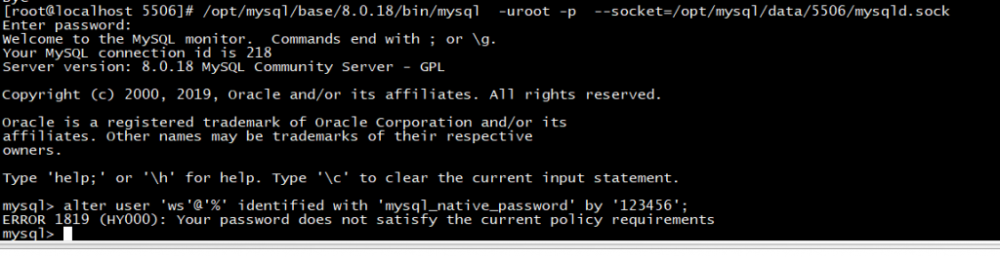
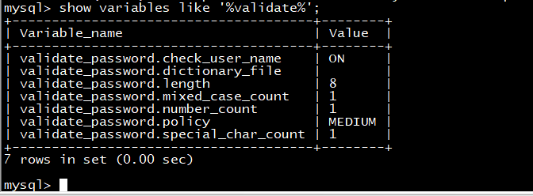
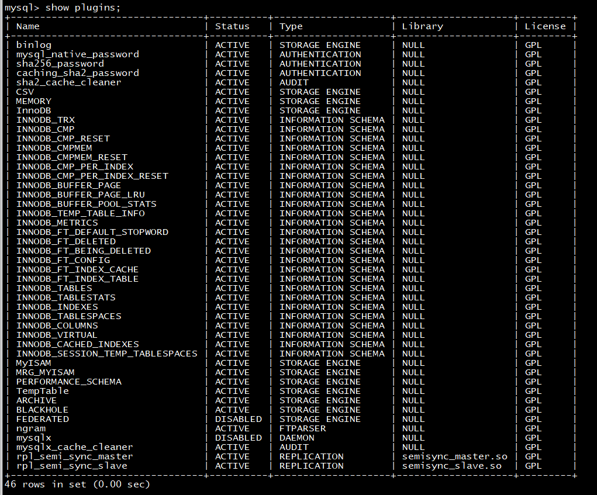
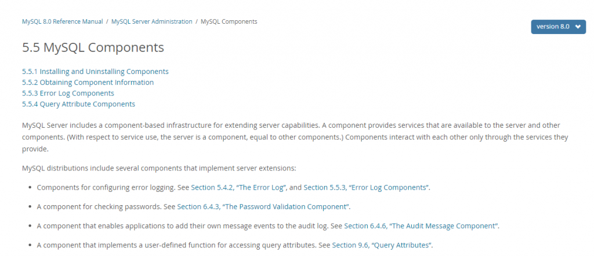
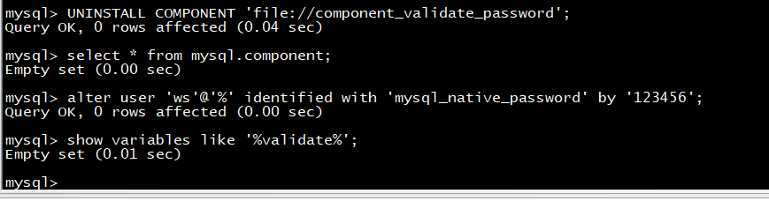

# 故障分析 | 没安装 validate_password 插件，为什么会有密码策略？

**原文链接**: https://opensource.actionsky.com/20210401-mysql/
**分类**: MySQL 新特性
**发布时间**: 2021-04-01T00:51:29-08:00

---

作者：王顺
爱可生 DBA 团队成员，在公司负责项目中处理数据库问题，喜欢学习技术，钻研技术问题。
本文来源：原创投稿
*爱可生开源社区出品，原创内容未经授权不得随意使用，转载请联系小编并注明来源。
## 背景
用户遇到问题，生产环境中统一脚本安装的 MySQL 8.0.18，为什么有的环境有密码策略，有的环境没有？
											
## 分析
检查配置文件 my.cnf 并没有 validate_password 参数配置。
检查数据库中的参数配置，查到密码策略。
											
检查数据库的插件并没有 validate_password。
											
奇怪，为什么配置文件里没有 validate_password 参数，也没有安装过插件，密码策略是怎么来的？
## 原因
查阅官方文档，找到了原因。
8.0 之后，可以用 validate_password 组件来实现密码策略。
MySQL Components 是 8.0 新功能，用于扩展服务器功能的基于组件的基础结构。组件提供服务器和其他组件可用的服务。（就服务使用而言，服务器是一个组件，与其他组件相同。）组件仅通过它们提供的服务进行交互。
MySQL 发行版包含几个实现服务器扩展的组件：
- 用于配置错误日志记录的组件。
- 用于检查密码的组件。
- 使应用程序能够将其自己的消息事件添加到审核日志的组件。
- 实现用于访问查询属性的用户定义功能的组件。
> https://dev.mysql.com/doc/refman/8.0/en/components.html
											
											
删除该组件后，密码策略就失效了。
											
## 结论
在 8.0 之前，validate_password 是个单独的插件。
8.0 后可单独安装 validate_password 插件，也可以安装 validate_password 组件来实现密码策略，用户的环境统一脚本安装数据库时，没有安装插件，但单独安装 validate_password 组件也实现了密码策略。
**文章推荐：**
[故障分析 | 如何提高 MHA 的网络容忍能力？（下）](https://opensource.actionsky.com/20210322-mha-%e7%9a%84%e7%bd%91%e7%bb%9c%e5%ae%b9%e5%bf%8d%e8%83%bd%e5%8a%9b%ef%bc%9f%ef%bc%88%e4%b8%8b%ef%bc%89/)
[故障分析 | 如何提高 MHA 的网络容忍能力？（上）](https://opensource.actionsky.com/20210315-mha/)
[故障分析 | 同一条 SQL 为何在 MariaDB 正常，MySQL 5.7 却很慢？](https://opensource.actionsky.com/20200422-mysql/)