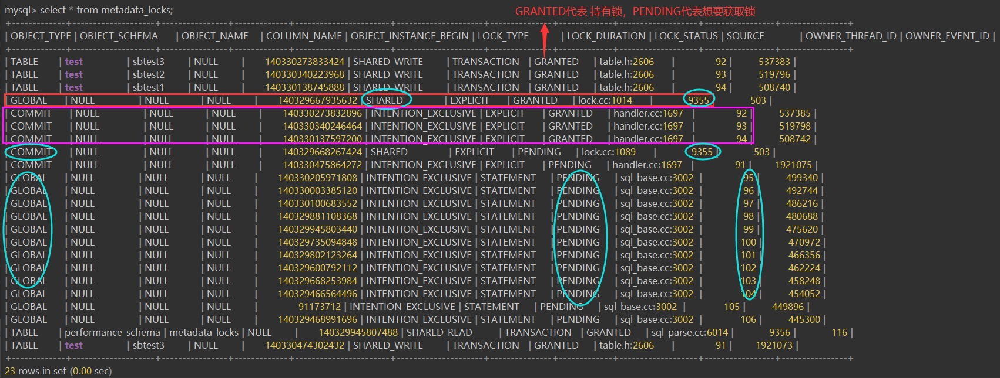

# 故障分析 | 记一次 MTS 并行复制导致的死锁排查

**原文链接**: https://opensource.actionsky.com/20210713-mts/
**分类**: 技术干货
**发布时间**: 2021-07-13T19:02:37-08:00

---

作者：刘开洋
爱可生交付服务团队北京 DBA，对数据库及周边技术有浓厚的学习兴趣，喜欢看书，追求技术。
本文来源：原创投稿
*爱可生开源社区出品，原创内容未经授权不得随意使用，转载请联系小编并注明来源。
前段时间在客户现场发现一个奇怪的锁问题，特地拿来和大家分享一下。
## 现象
MySQL 版本是 8.0.18 ，在从库的线程等待连接中观测到的现象是这样的：
`mysql> select * from threads;
+-----------+---------------------------------------------+------------+----------------+------------------+------------------+--------------------+---------------------+------------------+---------------------------------------------+----------------------------------------------------------------------------------------------------------+------------------+------+--------------+---------+-----------------+--------------+----------------+
| THREAD_ID | NAME                                        | TYPE       | PROCESSLIST_ID | PROCESSLIST_USER | PROCESSLIST_HOST | PROCESSLIST_DB     | PROCESSLIST_COMMAND | PROCESSLIST_TIME | PROCESSLIST_STATE                           | PROCESSLIST_INFO            | PARENT_THREAD_ID | ROLE | INSTRUMENTED | HISTORY | CONNECTION_TYPE | THREAD_OS_ID | RESOURCE_GROUP |
+-----------+---------------------------------------------+------------+----------------+------------------+------------------+--------------------+---------------------+------------------+---------------------------------------------+----------------------------------------------------------------------------------------------------------+------------------+------+--------------+---------+-----------------+--------------+----------------+
······
|        58 | thread/sql/event_scheduler   | FOREGROUND |          8    | NULL                | NULL                 | NULL       | Sleep         |                 NULL | Waiting on empty queue                               | NULL                                                           |                       1 | NULL | YES         | YES     | NULL            |        34147 | SYS_default    |
|        59 | thread/sql/signal_handler    | BACKGROUND |          NULL | NULL                | NULL                 | NULL      | NULL           |                NULL | NULL                                                              | NULL                                                           |                       1 | NULL | YES          | YES     | NULL            |        34148 | SYS_default    |
|        60 | thread/sql/compress_gtid_table| FOREGROUND |         10   | NULL                | NULL                 | NULL      | Daemon     |         33670997 | Suspending                                                   | NULL                                                           |                       1 | NULL | YES          | YES     | NULL            |        34149 | SYS_default    |
|        61 | thread/mysqlx/acceptor_network| BACKGROUND |         NULL | NULL               | NULL                 | NULL       | NULL          |                NULL | NULL                                                               | NULL                                                          |                     40 | NULL | YES          | YES     | NULL            |        34150 | SYS_default    |
|  46627729 | thread/mysqlx/worker          | BACKGROUND |         NULL | NULL                | NULL                 | NULL      | NULL            |               NULL | NULL                                                                | NULL                                                         |                 NULL | NULL | YES          | YES     | NULL            |        34132 | SYS_default    |
|  57810934 | thread/sql/one_connection     | FOREGROUND |     57808740 | proxy_monitor | 10.108.76.139 | NULL       | Query         |                 718 | Waiting for commit lock                                 | set global read_only=on                           |                 NULL | NULL | YES          | YES     | SSL/TLS       |        76945 | USR_default    |
|  47295992 | thread/sql/slave_io          | FOREGROUND |      47294234 | root                 | localhost            | NULL       | Connect     |         6285905 | Waiting for master to send event                 | NULL                                                           |         47294592 | NULL | YES          | YES     | NULL            |        75880 | SYS_default    |
|  47295993 | thread/sql/slave_sql         | FOREGROUND |      47294235 | root                 | localhost            | NULL       | Query         |            64768 | Waiting for dependent transaction to commit | NULL                                                         |         47294592 | NULL | YES          | YES     | NULL            |        75881 | SYS_default    |
|  47295994 | thread/sql/slave_worker      | FOREGROUND |       47294236 | root                 | localhost            | NULL       | Query         |            67415 | Waiting for global read lock                           | INSERT INTO `dcp_deci_acctflow_info` (······ |         47295993 | NULL | YES          | YES     | NULL            |        75882 | SYS_default    |
|  47295995 | thread/sql/slave_worker    | FOREGROUND |       47294237 | root                 | localhost            | NULL       | Query         |            67415 | Waiting for commit lock                                  | NULL                                                          |         47295993 | NULL | YES          | YES     | NULL            |        75883 | SYS_default    |
|  47295996 | thread/sql/slave_worker    | FOREGROUND |       47294238 | root                 | localhost            | NULL       | Query         |            67415 | Waiting for preceding transaction to commit | NULL                                                          |         47295993 | NULL | YES          | YES     | NULL            |        75884 | SYS_default    |
|  47295997 | thread/sql/slave_worker    | FOREGROUND |       47294239 | root                 | localhost            | NULL       | Query         |            67415 | Waiting for global read lock                            | INSERT INTO `dcp_deci_acctflow_info` (······ |         47295993 | NULL | YES          | YES     | NULL            |        75885 | SYS_default    |
|  47295998 | thread/sql/slave_worker    | FOREGROUND |       47294240 | root                 | localhost            | NULL       | Query         |            67415 | Waiting for global read lock                            | INSERT INTO `dcp_deci_acctflow_info` (······ |         47295993 | NULL | YES          | YES     | NULL            |        75886 | SYS_default    |
|  47295999 | thread/sql/slave_worker    | FOREGROUND |       47294241 | root                 | localhost            | NULL       | Query         |            67415 | Waiting for global read lock                            | INSERT INTO `dcp_deci_acctflow_info` (······ |         47295993 | NULL | YES          | YES     | NULL            |        75887 | SYS_default    |
|  47296000 | thread/sql/slave_worker    | FOREGROUND |       47294242 | root                 | localhost            | NULL       | Query         |            67415 | Waiting for an event from Coordinator           | NULL                                                           |         47295993 | NULL | YES          | YES     | NULL            |        75888 | SYS_default    |
|  47296001 | thread/sql/slave_worker    | FOREGROUND |       47294243 | root                 | localhost            | NULL       | Query         |            67415 | Waiting for an event from Coordinator           | NULL                                                           |         47295993 | NULL | YES          | YES     | NULL            |        75889 | SYS_default    |
|  47296002 | thread/sql/slave_worker    | FOREGROUND |       47294244 | root                 | localhost            | NULL       | Query         |            67415 | Waiting for an event from Coordinator           | NULL                                                           |         47295993 | NULL | YES          | YES     | NULL            |        75890 | SYS_default    |
|  47296003 | thread/sql/slave_worker    | FOREGROUND |       47294245 | root                 | localhost            | NULL       | Query         |            67415 | Waiting for an event from Coordinator           | NULL                                                           |         47295993 | NULL | YES          | YES     | NULL            |        75891 | SYS_default    |
|  47296004 | thread/sql/slave_worker    | FOREGROUND |       47294246 | root                 | localhost            | NULL       | Query         |            67415 | Waiting for an event from Coordinator           | NULL                                                           |         47295993 | NULL | YES          | YES     | NULL            |        75892 | SYS_default    |
|  47296005 | thread/sql/slave_worker    | FOREGROUND |       47294247 | root                 | localhost            | NULL       | Query         |            67415 | Waiting for an event from Coordinator           | NULL                                                           |         47295993 | NULL | YES          | YES     | NULL            |        75893| SYS_default    |
|  47296006 | thread/sql/slave_worker    | FOREGROUND |       47294248 | root                 | localhost            | NULL       | Query         |            67415 | Waiting for an event from Coordinator           | NULL                                                           |         47295993 | NULL | YES          | YES     | NULL            |        75894 | SYS_default    |
|  47296007 | thread/sql/slave_worker    | FOREGROUND |       47294249 | root                 | localhost            | NULL       | Query         |            67415 | Waiting for an event from Coordinator           | NULL                                                           |         47295993 | NULL | YES          | YES     | NULL            |        75895 | SYS_default    |
|  47296008 | thread/sql/slave_worker    | FOREGROUND |       47294250 | root                 | localhost            | NULL       | Query         |            67415 | Waiting for an event from Coordinator           | NULL                                                           |         47295993 | NULL | YES          | YES     | NULL            |        75896 | SYS_default    |
|  47296009 | thread/sql/slave_worker    | FOREGROUND |       47294251 | root                 | localhost            | NULL       | Query         |            67415 | Waiting for an event from Coordinator           | NULL                                                           |         47295993 | NULL | YES          | YES     | NULL            |        75897 | SYS_default    |
|  57811108 | thread/sql/one_connection  | FOREGROUND |       57808914 | proxy_monitor  | 10.108.76.140   | NULL     | Query          |              664 | Waiting for commit lock                                    | set global read_only=on                            |                 NULL | NULL | YES          | YES     | SSL/TLS        |        97442 | USR_default    |
|  57811279 | thread/sql/one_connection  | FOREGROUND |       57809085 | proxy_monitor  | 10.108.76.140   | NULL     | Query          |              610 | Waiting for commit lock                                    | set global read_only=on                            |                 NULL | NULL | YES          | YES     | SSL/TLS        |        98136 | USR_default    |
|  57811110 | thread/sql/one_connection  | FOREGROUND |       57808916 | proxy_monitor  | 10.108.76.139   | NULL     | Query          |              663 | Waiting for commit lock                                    | set global read_only=on                            |                 NULL | NULL | YES          | YES     | SSL/TLS        |        97419 | USR_default    |
······                                                                  
mysql> ^C
// 说明：由于连接接近2300条，为方便大家看起来没有那么枯燥，这里进行部分省略，大多数被省略的连接线程为set global read_only的连接
`
## 分析
从上面的连接可以观测到：这里存在着几个锁等待，有等全局读锁的，有等提交锁的，首先应该理清对应的锁等待顺序，看看究竟是“谁在等我，而我又在等谁”。
通过上面 threads 表的加锁线程，可以分析到有三条可以抓源头的线程：
- 
等全局读锁的线程
- 
等提交锁的线程
- 
等MTS顺序提交的线程
我们从最容易分析的全局读锁入手，以线程47295994为切入点进行追根溯源，看看线程47295994持有的锁是什么？这就需要借助 perfoemance_schema 库中的 metadata_locks ，即我们通常分析 DDL 阻塞的元数据锁表进行分析，
`mysql> select * from perfoemance_schema.metadata_locks where THREAD_ID = 47295994;
+-------------+---------------+-------------+-------------+-----------------------+-----------+---------------+-------------+--------------+-----------------+----------------+
| OBJECT_TYPE | OBJECT_SCHEMA | OBJECT_NAME | COLUMN_NAME | OBJECT_INSTANCE_BEGIN | LOCK_TYPE | LOCK_DURATION | LOCK_STATUS | SOURCE       | OWNER_THREAD_ID | OWNER_EVENT_ID |
+-------------+---------------+-------------+-------------+-----------------------+-----------+---------------+-------------+--------------+-----------------+----------------+
| GLOBAL     | NULL           | NULL        | NULL        |     140000636724432 | INTENTION_EXCLUSIVE | EXPLICIT | PENDING  | sql_base.cc:3002 |    47295994 |      149780492 |
+-------------+---------------+-------------+-------------+-----------------------+-----------+---------------+-------------+--------------+-----------------+----------------+
1 rows in set (0.00 sec)
`
线程47295994中的 SQL 是执行了一条 insert 语句，没有观察到该线程持有锁，只是在等全局读锁，我们接着分析全局读锁。
通过元数据锁表进一步确认线程，接下来就看看谁持有了全局读锁：
`mysql> select * from perfoemance_schema.metadata_locks where OBJECT_TYPE = 'GLOBAL' and LOCK_STATUS = 'GRANTED';
+-------------+---------------+-------------+-------------+-----------------------+-----------+---------------+-------------+--------------+-----------------+----------------+
| OBJECT_TYPE | OBJECT_SCHEMA | OBJECT_NAME | COLUMN_NAME | OBJECT_INSTANCE_BEGIN | LOCK_TYPE | LOCK_DURATION | LOCK_STATUS | SOURCE       | OWNER_THREAD_ID | OWNER_EVENT_ID |
+-------------+---------------+-------------+-------------+-----------------------+-----------+---------------+-------------+--------------+-----------------+----------------+
| GLOBAL      | NULL          | NULL        | NULL        |       139955200762880 | SHARED    | EXPLICIT      | GRANTED     | lock.cc:1014 |        57822380 |              3 |
| GLOBAL      | NULL          | NULL        | NULL        |       140006539051472 | SHARED    | EXPLICIT      | GRANTED     | lock.cc:1014 |        57822266 |              3 |
| GLOBAL      | NULL          | NULL        | NULL        |       139957819325888 | SHARED    | EXPLICIT      | GRANTED     | lock.cc:1014 |        57821979 |              3 |
······
+-------------+---------------+-------------+-------------+-----------------------+-----------+---------------+-------------+--------------+-----------------+----------------+
1104 rows in set (0.00 sec)
`
我们挑几条记录拉回 threads 表中看看能否找到对应的执行 SQL ：
`mysql> select * from perfoemance_schema.threads where THREAD_ID in (57822380,57822266,57821979);
+-----------+---------------------------------------------+------------+----------------+------------------+------------------+--------------------+---------------------+------------------+--------------------------------+---------------------+------------------+------+--------------+---------+-----------------+--------------+----------------+
| THREAD_ID | NAME                     | TYPE       | PROCESSLIST_ID | PROCESSLIST_USER | PROCESSLIST_HOST | PROCESSLIST_DB     | PROCESSLIST_COMMAND | PROCESSLIST_TIME | PROCESSLIST_STATE               | PROCESSLIST_INFO              | PARENT_THREAD_ID | ROLE | INSTRUMENTED | HISTORY | CONNECTION_TYPE | THREAD_OS_ID | RESOURCE_GROUP |
+-----------+---------------------------------------------+------------+----------------+------------------+------------------+--------------------+---------------------+------------------+--------------------------------+---------------------+------------------+------+--------------+---------+-----------------+--------------+----------------+
|  57821979 | thread/sql/one_connection   | FOREGROUND |   57808986 | proxy_monitor    | 10.108.76.140   | NULL               | Query               |              664 | Waiting for commit lock      | set global read_only=on              |             NULL | NULL | YES          | YES     | SSL/TLS         |        97442 | USR_default    |
|  57822266 | thread/sql/one_connection   | FOREGROUND |   57819228 | proxy_monitor    | 10.108.76.139   | NULL               | Query               |              679 | Waiting for commit lock      | set global read_only=on              |             NULL | NULL | YES          | YES     | SSL/TLS         |        97434 | USR_default    |
|  57822380 | thread/sql/one_connection   | FOREGROUND |   57829246 | proxy_monitor    | 10.108.76.140   | NULL               | Query               |              694 | Waiting for commit lock      | set global read_only=on              |             NULL | NULL | YES          | YES     | SSL/TLS         |        97476 | USR_default    |
+-----------+---------------------------------------------+------------+----------------+------------------+------------------+--------------------+---------------------+------------------+-----------------------------+------------------------+------------------+------+--------------+---------+-----------------+--------------+----------------+
3 rows in set (0.00 sec)
`
这里通过多次查询可以得到确认，全局读锁是 set global read_only=on 这条语句下发的，从 threads 表中，我们还能找到下发这条语句的用户 proxy_monitor 和连接IP 10.108.76.139/140 ，便可以进一步确认下发全局读锁的应用或者客户端。
通过了解，原来客户使用的 shell 脚本对从库进行监控并配置只读，只要从库不是只读状态，脚本就不停地下发命令去进行配置，由于前面产生的锁阻塞，上千根 set global read_only 连接在 MySQL 中产生等待。
在 threads 表中，我们还观察到一个现象，是所有下发全局读锁的线程都在等commit锁，那commit锁是被谁持有的呢？我们接着去元数据锁表中去检索：
`mysql> select * from perfoemance_schema.metadata_lockswhere OBJECT_TYPE = 'COMMIT' and LOCK_STATUS = 'GRANTED';
+-------------+---------------+-------------+-------------+-----------------------+-----------+---------------+-------------+--------------+-----------------+----------------+
| OBJECT_TYPE | OBJECT_SCHEMA | OBJECT_NAME | COLUMN_NAME | OBJECT_INSTANCE_BEGIN | LOCK_TYPE | LOCK_DURATION | LOCK_STATUS | SOURCE       | OWNER_THREAD_ID | OWNER_EVENT_ID |
+-------------+---------------+-------------+-------------+-----------------------+-----------+---------------+-------------+--------------+-----------------+----------------+
| COMMIT      | NULL          | NULL        | NULL        |       140011172675968 | INTENTION_EXCLUSIVE  | EXPLICIT | GRANTED | handler.cc:1697 |    47295996 |      89520430 |
| COMMIT      | NULL          | NULL        | NULL        |       140011035402992 | INTENTION_EXCLUSIVE  | EXPLICIT | GRANTED | handler.cc:1697 |    47295995 |     113911056 |
+-------------+---------------+-------------+-------------+-----------------------+-----------+---------------+-------------+--------------+-----------------+----------------+
2 rows in set (0.00 sec)
`
看来全局读锁在等线程47295995、47295996手中的commit锁释放，而47295994 在等全局读锁释放，这里还差一个知识点，那就是 线程47295994和47295995、47295996之间的等待关系是什么呢？
不知道大家对 “Waiting for preceding transaction to commit” 这个等待状态有没有了解，它的意思是指该线程中的事务要等待同一个事务提交组中靠前的事务优先完成提交，即同组事务顺序提交，在 MySQL 中有一个参数对从库的顺序提交进行配置（slave_preserve_commit_order）。
在客户现场并没有对 “线程号小的连接中事务优先提交”这个问题进行验证，我们稍后在本地环境中进行测试复现一下。
## 一“图”以蔽之

由于从库进行set global read_only = ON; 时持有MDL::global read lock，并进一步想要获取MDL::global commit lock，而且在LOCK_TYPE中显示的是MDL_SHARED锁。slave_preserve_commit_order=1时，relay log中事务的提交组中的顺序会严格按照在relay log中出现的顺序提交，所以事务的执行和set global read_only语句获得两个锁都不是原子的，并行复制模式下按以下的顺序就会出现死锁：
- 
以线程为例，线程47295994、47295995和47295996中的事务在并行复制的relay log中顺序提交，这一点在现场并没有进行观测，复现时给出证据。
- 
在从库中线程47295996执行较快，首先47295996线程获得commit锁，并进入waiting for preceding transaction to commit的状态，然后线程47295995也获得commit锁。
- 
客户端执行 set global read_only ,进入 waiting for commit 的状态。
- 
事务a的 insert 语句在获得 GRL 之后执行，那么事务a就进入 waiting for global read lock 的状态，也就是现场出现的现象。
- 
如果事务 a 的 insert 语句在获得 GRL 之前执行，同时获得 global commit 锁之后应用 Xid_event 提交事务，则进入 waiting for commit lock 的状态，即第二种死锁，也就是下面复现到的第二种死锁现象。
## 解决
- 
方案1：kill 掉加全局读锁的线程，但由于客户环境中加全局读锁的线程为 proxy_monitor 下发的数量高达上千条，也不是很容易解决掉，代价小但耗时较长。
- 
方案2：可以设置 slave_preserve_commit_order=0 关闭从库 binlog 的顺序提交，避免这个死锁的出现。关闭这个参数不需停止复制，只是影响并行复制的事务在从库的提交顺序，对汇算、风控业务可能存在影响，但对最终的数据一致性并无影响，所以如果无特别要求从库的 binlog 顺序必须与主库保持一致。
- 
在使用 shell 脚本进行从库只读的检测，可以修改下脚本逻辑：如果检测到从库没有关闭只读，可以先停止复制，再开启从库只读，从而不需更改从库事务提交一致性而避免再次发生相关问题。
从库执行以下语句均有可能发生上面的死锁情况：
set global read_only ;  grant all(FLUSH PRIVILEGES) ;  flush table with read lock ;
- 
上面的语句均会加 global read lock ，经过验证，这种死锁的出现存在一定几率，只有出现在同组提交的 relay log 中靠后的事务回放完成等待顺序提交的情况下，才会导致 slave_preserve_commit_order 的 MTS 复制执行时死锁。
- 
建议尽量避免业务高峰在从库执行以上语句，如果避免不了，关闭 slave_preserve_commit_order 参数，这个操作需要根据业务情况而定，可能会因为时序问题存在事中影响业务一致性，但不影响数据的最终一致性。
## 复现两种死锁
使用 sysbench 模拟业务压力，从库开一个窗口进行语句输入，多次执行 set global read_only=ON ;才会卡住，观测输出：

kill 掉 set global read_only=ON ;这条语句之后，复制恢复正常，我们看看在连接hang住时的情况。
**死锁1-客户现场**
查看对应 performance_schema.threads 表中的信息根据事务的提交顺序，确定对应线程提交顺序，说明客户现场线程号小的执行的事务提交顺序在线程号大的执行事务之前。根据事务的提交顺序，确定对应线程提交顺序，说明客户现场线程号小的执行的事务提交顺序在线程号大的执行事务之前。

查看 performance_schema.metadata_locks 表中锁持有关系

加锁模型和上面分析中的的死锁闭环相同。

根据事务的提交顺序，确定对应线程提交顺序，说明客户现场线程号小的执行的事务提交顺序在线程号大的执行事务之前。

**死锁2**
查看对应 performance_schema.threads 表中的信息

查看 performance_schema.metadata_locks 表中锁持有关

根据锁关系画出相应死锁闭环

除了必须的锁外，事务会额外请求 MDL_key::GLOBAL 锁的 MDL_INTENTION_EXCLUSIVE 锁；在事务提交前，会先请求 MDL_key::COMMIT 锁的 MDL_INTENTION_EXCLUSIVE 锁，这个锁是S锁，对于范围锁来说，IX锁和S锁是不兼容的。
根据事务的提交顺序，确定对应线程提交顺序

**参考：**
https://sq.163yun.com/blog/article/211685211777150976
http://dbaplus.cn/news-11-1874-1.html
http://mysql.taobao.org/monthly/2018/02/01/
bug工单：https://bugs.mysql.com/bug.php?id=95863