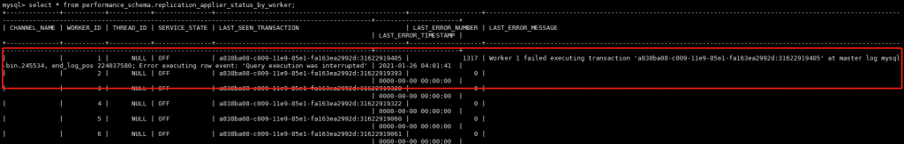
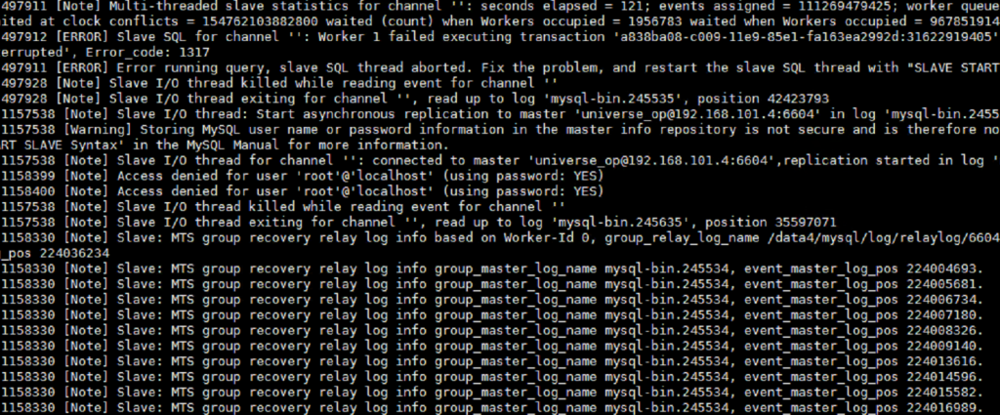
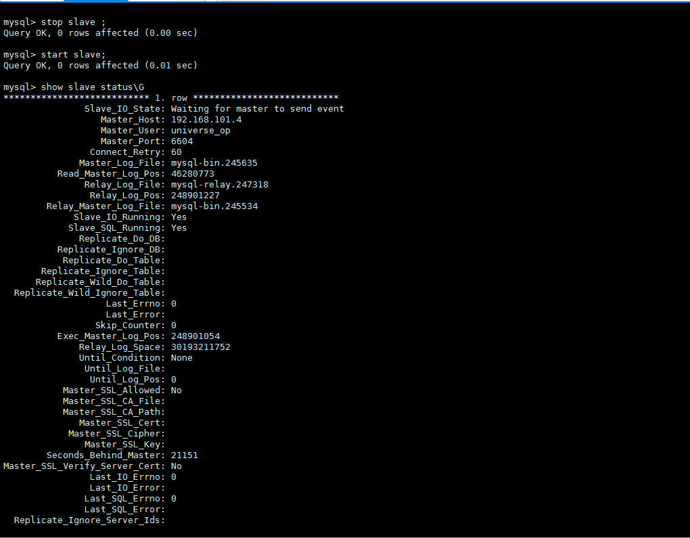
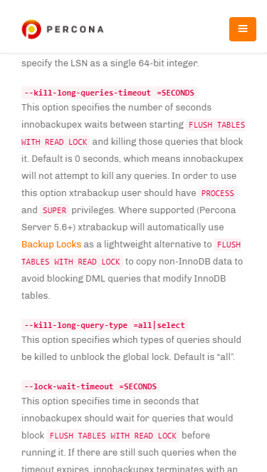
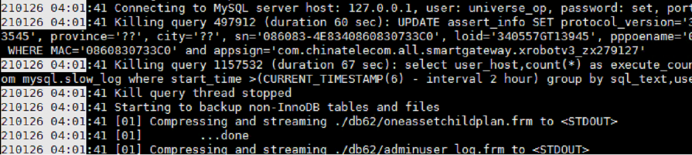

# 故障分析 | 记一次 MySQL 复制故障 -Error_code:1317

**原文链接**: https://opensource.actionsky.com/20210305-mysql/
**分类**: MySQL 新特性
**发布时间**: 2021-03-04T01:32:36-08:00

---

作者：侯晓阳
爱可生 DBA 团队成员，主要负责 MySQL 故障处理和 SQL 审核优化。对技术执着，为客户负责。
本文来源：原创投稿*爱可生开源社区出品，原创内容未经授权不得随意使用，转载请联系小编并注明来源。
## 问题背景
MySQL 从库报错如下：
											
错误信息如下：
`
...
Last_Errno:1317
Last_Error:Last_Error: Coordinator stopped because there were error(s) in the worker(s). The most recent failure being: Worker 1 failed executing transaction 'a838ba08-c009-11e9-85e1-fa163ea2992d:31622919405' at master log master-bin.005599, end_log_pos 2297. See error log and/or performance_schema.replication_applier_status_by_worker table for more details about this failure or others, if any.
...
Last_SQL_Errno:1317
Last_SQL_Error:Last_Error: Coordinator stopped because there were error(s) in the worker(s). The most recent failure being: Worker 1 failed executing transaction 'a838ba08-c009-11e9-85e1-fa163ea2992d:31622919405' at master log master-bin.005599, end_log_pos 2297. See error log and/or performance_schema.replication_applier_status_by_worker table for more details about this failure or others, if any.
`
## 排查方式
1. 首先我们先通过 performance_schema 查看一下造成报错的原因`mysql> select * from performance_schema.replication_applier_status_by_worker;`
											
从这里报错看到，某条语句在回放的时候查询执行被中断了。
2. 然后我们再查看 MySQL 的 error-log
											
日志中也提示了我们，因为工作线程被断开，查询中断，它在当前这个位置点停止了，如果想要恢复重新启动主从即可。
3. 尝试重新启动主从`mysql> stop slave;
mysql> start slave;`
											
重启复制通道后，复制确实正常了，接下来需要知道为什么查询被中断了。
4. 带着疑问，去看了下在报错的这个时间里 MySQL 或是服务器做了什么，然后发现了这个时间 MySQL 在做备份，之后查看 xtrabackup 备份参数是带着 &#8211;kill-long-queries-timeout=60 和 &#8211;kill-long-query-type=all。
											
简单来说就是，当 &#8211;kill-long-query-type=all，&#8211;kill-long-queries-timeout=60，从开始执行 FLUSH TABLES WITH READ LOCK 到 kill 掉阻塞它的这些查询之间等待的秒数为 60 秒，默认值为 0，不会 kill 任何查询，使用这个选项 xtrabackup 需要有 Process 和 super 权限。
5. 然后查看 xtrabackup 的备份日志，一切答案见了分晓。
											
**相关推荐：**
[故障分析 | 生产系统数据丢失后的恢复](https://opensource.actionsky.com/20210122-mysql/)
[故障分析 | 全局读锁一直没有释放，发生了什么？](https://opensource.actionsky.com/20210111-mysql/)
[故障分析 | 从库并行回放死锁问题分析](https://opensource.actionsky.com/20210104-mysql/)