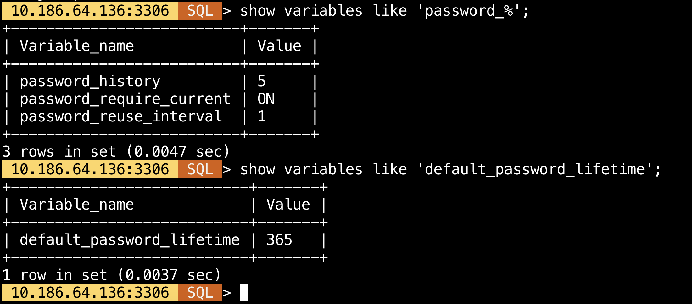
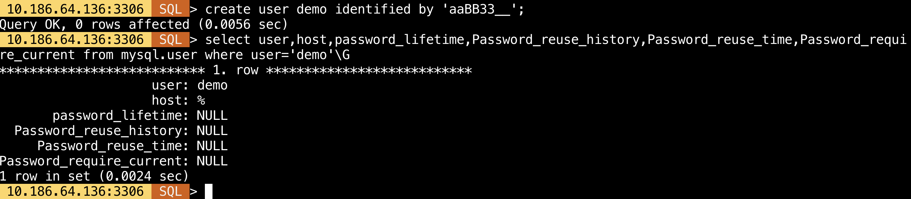
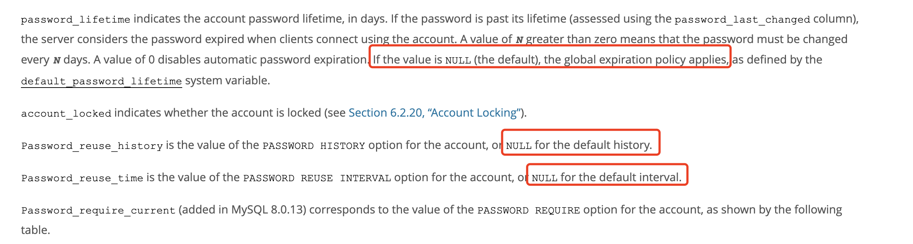
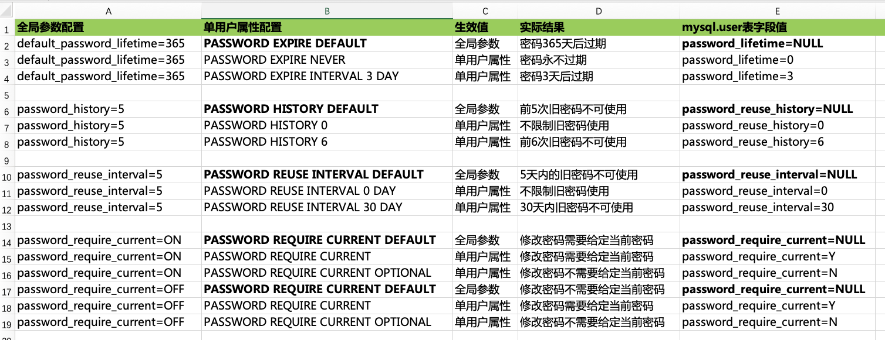
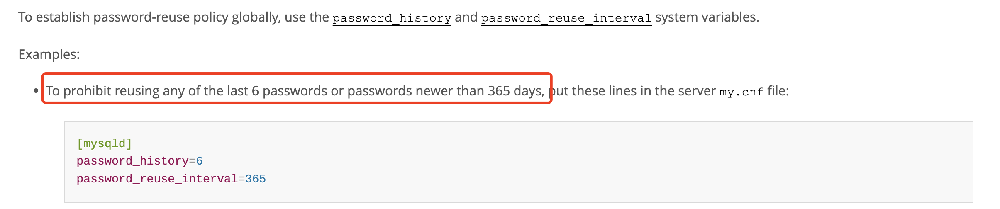

# 新特性 | MySQL 8.0 新密码策略的细节补充

**原文链接**: https://opensource.actionsky.com/%e6%96%b0%e7%89%b9%e6%80%a7-mysql-8-0-%e6%96%b0%e5%af%86%e7%a0%81%e7%ad%96%e7%95%a5%e7%9a%84%e7%bb%86%e8%8a%82%e8%a1%a5%e5%85%85/
**分类**: MySQL 新特性
**发布时间**: 2023-09-12T00:06:24-08:00

---

# 前情提要
MySQL 8.0 截⽌到⽬前已经发布到了 8.0.34 版本，经过一系列的版本更新，对于密码方面也做了较多的加强⼯作，这⾥我们不再过多介绍 MySQL 8.0 对于密码功能的加强，相关的介绍可以移步先前公众号的⽂章，这⾥给到相关链接：
[新特性解读 | MySQL 8.0 新密码策略（上）](http://mp.weixin.qq.com/s?__biz=MzU2NzgwMTg0MA==&mid=2247498570&idx=1&sn=f7b0a358c06ad8a4618dad61474fee6e&chksm=fc9519d5cbe290c3b22d0f24a8237e803f316d4929cf45b6905bfee080ec266515a79bb639c8&scene=21#wechat_redirect)
[新特性解读 | MySQL 8.0 新密码策略（中）](http://mp.weixin.qq.com/s?__biz=MzU2NzgwMTg0MA==&mid=2247498715&idx=1&sn=181b8193937065e07f667d04332556f0&chksm=fc951944cbe290527171e3af2243d31d12854b0661a58dacf8c72779134f48f722464639fd40&scene=21#wechat_redirect)
[新特性解读 | MySQL 8.0 新密码策略（下）](http://mp.weixin.qq.com/s?__biz=MzU2NzgwMTg0MA==&mid=2247498882&idx=1&sn=6db36b24e7523e020b6f1f5f250b39eb&chksm=fc951e1dcbe2970bbffc22c6459a92ac4b3b2c4c0539d9d85b8e2836fb689697fe57ecef6daf&scene=21#wechat_redirect)
[新特性解读 | MySQL 8.0 新密码策略（终篇）](http://mp.weixin.qq.com/s?__biz=MzU2NzgwMTg0MA==&mid=2247499608&idx=1&sn=43109dba8a31c27e5e093ad9732d16d2&chksm=fc951dc7cbe294d1d8eee4b7c712f3357dcf30dfaa845cef40149ea17d731b8e3c4d47ad5454&scene=21#wechat_redirect)
# 文章背景
这篇文章主要针对密码相关的几个参数的使用细节做一些验证和分析，给大家分享下实际使用的经验，首先我们看下 MySQL 8.0 版本的 `CREATE USER` 语法中 `password_option` 部分的语法结构。
`-- MySQL 8.0（新增了不同维度的密码控制）
password_option: {
PASSWORD EXPIRE [DEFAULT | NEVER | INTERVAL N DAY]
| PASSWORD HISTORY {DEFAULT | N}
| PASSWORD REUSE INTERVAL {DEFAULT | N DAY}
| PASSWORD REQUIRE CURRENT [DEFAULT | OPTIONAL]
| FAILED_LOGIN_ATTEMPTS N
| PASSWORD_LOCK_TIME {N | UNBOUNDED}
}
-- MySQL 5.7（只包含密码过期属性配置）
password_option: {
PASSWORD EXPIRE
| PASSWORD EXPIRE DEFAULT
| PASSWORD EXPIRE NEVER
| PASSWORD EXPIRE INTERVAL N DAY
}
`
其中 MySQL 8.0 版本 `CREATE USER` 语法的前 4 个密码属性则是本⽂第⼀个讨论的细节点，其属性对应的 MySQL 全局参数及含义分别为：
| 参数名 | 默认值 | mysql.user 表对应字段 | 含义 |
| --- | --- | --- | --- |
| default_password_lifetime | 0 | password_lifetime | 全局设置密码的有效期 |
| password_history | 0 | password_reuse_history | 全局设置历史密码使用过的密码不可被重用的条数 |
| password_reuse_interval | 0 | password_reuse_time | 全局设置历史密码要经过多长时间才能被重用 |
| password_require_current | OFF | password_require_current | 全局设置修改密码时需不需要提供当前密码 |
# 误区 1
表 `mysql.user` 中密码相关选项对应字段为 NULL 时的含义。
## 验证过程
我们基于这 4 个密码属性设置具体的值，设置后配置如下图所示。

创建⼀个新⽤户不指定任何⽤户密码属性。

在创建完⽤户后，查看 `mysql.user` 表中对应字段显示值均为 NULL。
**全局配置的 4个属性没生效？**
如果⽣效应该要自动在创建⽤户时配置为对应值才对。基于这个逻辑去理解还造成了另⼀层误解：新配置的密码全局属性对于历史已创建的⽤户不⽣效。
**是不是还需要对已存在的⽤户⽤ `ALTER USER` 单独做处理？**
随着这个疑问越想越不对，如果全局配置在新创建用户时还不生效，那什么时候生效，岂不是失去了意义？进一步查看[官⽅⽂档](https://dev.mysql.com/doc/refman/8.0/en/grant-tables.html) 对 `mysql.user` 表对应字段值含义的描述后得到了答案。 原⽂描述如下，翻译过来就是：**如果这 4 个值在表中为 NULL，并不是配置未生效，而是表示其继承全局密码策略配置。**

## 小结
官方文档看的不够仔细，误解了 NULL 值的含义（**关键原因**），但确实容易踩到这个“坑”。这里也贴一下全局参数和单⽤户属性配置的生效对应表做参考。

# 误区 2
这里虽然描述为误区，其实我理解是文档描述的不完善。我们先看下文档的描述，翻译过来是：可以⽤这 2 个参数来控制历史密码可被重用的策略：一个是基于次数策略，一个是基于时间策略。可以同时配置，如：禁止用最后 6 次密码或者 365 天内设置过的密码，可以看到两个参数是一个或者的逻辑。

## 实际验证场景
### 场景 1
password_history > 0 and password_reuse_interval = 0
结论：**历史密码次数** 控制策略生效，符合预期。
### 场景 2
password_history = 0 and password_reuse_interval > 0
结论：**历史密码时间** 控制策略生效，符合预期。
### 场景 3
password_history > 0 and password_reuse_interval > 0
结论：**历史密码时间** 控制策略生效，**历史密码次数** 控制策略不生效，**mysql.password_history 将记录指定时间内的所有密码且均不能被重用。**
## 小结
- `password_reuse_interval` 对于时间的控制策略优先级⾼于 `password_history` 对于次数的控制。
两者并不是同时⽣效，两个参数同时配置时，取的是更严格的那个配置作为⽣效的策略。
- 策略本质上对使⽤和功能上没影响。