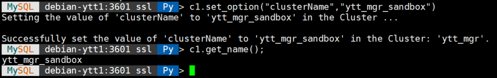
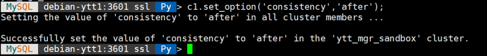
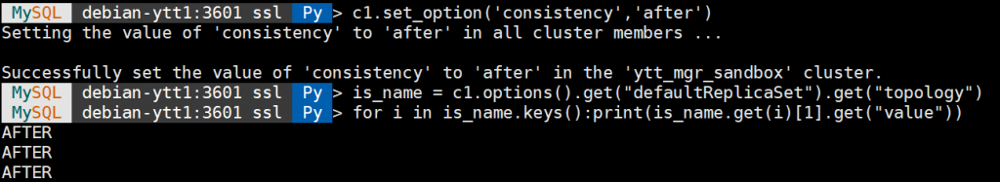
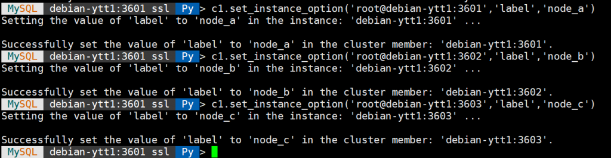
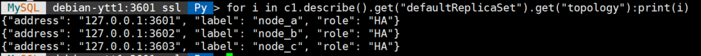
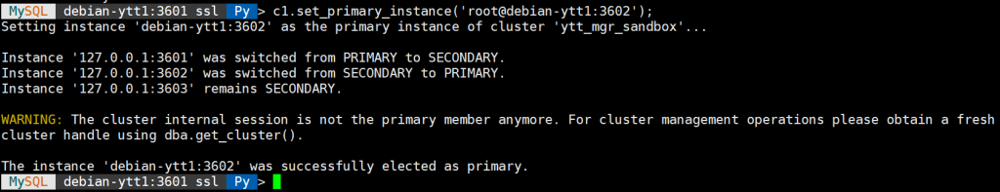
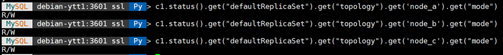
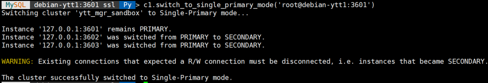
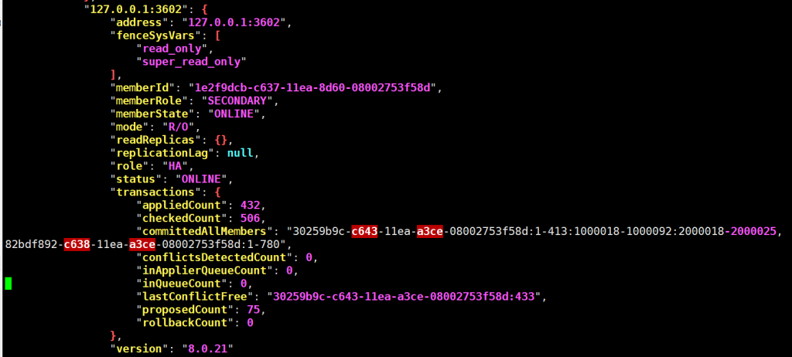

# 新特性解读 | InnoDB-Cluster 扫盲-日常运维

**原文链接**: https://opensource.actionsky.com/20200720-mysql/
**分类**: MySQL 新特性
**发布时间**: 2020-07-20T00:37:49-08:00

---

作者：杨涛涛
资深数据库专家，专研 MySQL 十余年。擅长 MySQL、PostgreSQL、MongoDB 等开源数据库相关的备份恢复、SQL 调优、监控运维、高可用架构设计等。目前任职于爱可生，为各大运营商及银行金融企业提供 MySQL 相关技术支持、MySQL 相关课程培训等工作。
本文来源：原创投稿
*爱可生开源社区出品，原创内容未经授权不得随意使用，转载请联系小编并注明来源。
本篇是[《innodb-cluster 扫盲-安装篇》](https://opensource.actionsky.com/20190820-mysql/)的续篇。 
我们知道，InnoDB Cluster 是 Oralce 官方发布的用来管理 MySQL 组复制的一套工具，有了 InnoDB Cluster，MySQL 原生组复制的部署、运维、开发等将会变得非常简单。
**InnoDB Cluster 测试环境如下：**
- 节点 A：192.168.2.210：3601（主节点）
- 节点 B：192.168.2.210：3602（从节点）
- 节点 C：192.168.2.210：3603（从节点）
接下来，看看 InnoDB Cluster 提供的一系列内置函数如何简化组复制的日常运维管理。
**1、get_cluster 方法**
获取集群对象，方便后续管理。- 
- 
- 
`MySQL  debian-ytt1:3601 ssl  Py > c1 = dba.get_cluster();``MySQL  debian-ytt1:3601 ssl  Py > c1``<Cluster:ytt_mgr`
**2、describe 方法**
用来获取集群目前状态，输出极简结果。
输出集群节点拓扑图，集群各个节点 IP 地址等。
- 
- 
- 
- 
- 
- 
- 
- 
- 
- 
- 
- 
- 
- 
- 
- 
- 
- 
- 
- 
- 
- 
- 
- 
- 
`MySQL  debian-ytt1:3601 ssl  Py > c1.describe()``{``    "clusterName": "ytt_mgr", ``    "defaultReplicaSet": {``        "name": "default", ``        "topology": [``            {``                "address": "127.0.0.1:3601", ``                "label": "127.0.0.1:3601", ``                "role": "HA"``            }, ``            {``                "address": "127.0.0.1:3602", ``                "label": "127.0.0.1:3602", ``                "role": "HA"``            }, ``            {``                "address": "127.0.0.1:3603", ``                "label": "127.0.0.1:3603", ``                "role": "HA"``            }``        ], ``        "topologyMode": "Single-Primary"``    }``}`
**3、list_routers 方法**
获取集群当前路由信息。输出当前 mysql router 路由信息，包含读写端口，版本等信息。- 
- 
- 
- 
- 
- 
- 
- 
- 
- 
- 
- 
- 
- 
- 
`MySQL  debian-ytt1:3601 ssl  Py > c1.list_routers()``{``    "clusterName": "ytt_mgr", ``    "routers": {``        "debian-ytt1::system": {``            "hostname": "debian-ytt1", ``            "lastCheckIn": "2020-07-15 11:43:18", ``            "roPort": 6447, ``            "roXPort": 64470, ``            "rwPort": 6446, ``            "rwXPort": 64460, ``            "version": "8.0.21"``        }``    }``}`
**4、set_option 方法**
用来设置集群的全局参数。比如改变集群的名字：名字由原来 ytt_mgr 更改为 ytt_mgr_sandbox。如下图：
											
再比如更改集群事务一致性由默认最终一致性级别更改为强一致性级别，如下图：
											
**5、options 方法**
获取集群当前所有运行参数的结果，过滤后来验证下效果，如下图：
											
当然也可以从 mysql router 层来验证效果。如下图，分别获取写节点和读节点的数据一致性参数结果。
											
**6、set_instance_option 方法**
单独设置某个节点的参数，不过目前还是不完善，不是每个参数都可以设置。
比如设置每个实例的标签，设置为可读性较强的标签，三个节点分别设置为 node_a、node_b、node_c。如下图：
											
查看设置好的标签，查看键值为 label 的值。
											
**7、set_primary_instance 方法**
提升一个从节点为主节点。
比如把节点 B 提升为主，节点 A 降级为从。如下图：
											
来验证下：此时 node_b 为主节点，node_a 降为从节点。- 
- 
- 
- 
- 
- 
- 
- 
- 
- 
- 
- 
- 
- 
- 
- 
- 
- 
- 
- 
- 
- 
- 
- 
- 
- 
- 
- 
- 
- 
` MySQL  debian-ytt1:3601 ssl  Py > c1.status().get("defaultReplicaSet").get("topology")``{``    "node_a": {``        "address": "127.0.0.1:3601", ``        "mode": "R/O", ``        "readReplicas": {}, ``        "replicationLag": null, ``        "role": "HA", ``        "status": "ONLINE", ``        "version": "8.0.21"``    }, ``    "node_b": {``        "address": "127.0.0.1:3602", ``        "mode": "R/W", ``        "readReplicas": {}, ``        "replicationLag": null, ``        "role": "HA", ``        "status": "ONLINE", ``        "version": "8.0.21"``    }, ``    "node_c": {``        "address": "127.0.0.1:3603", ``        "mode": "R/O", ``        "readReplicas": {}, ``        "replicationLag": null, ``        "role": "HA", ``        "status": "ONLINE", ``        "version": "8.0.21"``    }``}`
这时候 mysql router 会自动把写请求发送到新的主节点 B 上：- 
- 
- 
- 
- 
- 
- 
```
root@debian-ytt1:/home/ytt# mysql -uroot -proot -P6446 -hdebian-ytt1 -e "select @@port"`mysql: [Warning] Using a password on the command line interface can be insecure.``+--------+``| @@port |``+--------+``|   3602 |``+--------+
```
**8、switch_to_multi_primary_mode 方法**
设置集群模式为多主：- 
- 
- 
- 
- 
- 
- 
- 
MySQL  debian-ytt1:3601 ssl  Py > c1.switch_to_multi_primary_mode()``Switching cluster 'ytt_mgr_sandbox' to Multi-Primary mode...``
``Instance '127.0.0.1:3601' was switched from SECONDARY to PRIMARY.``Instance '127.0.0.1:3602' remains PRIMARY.``Instance '127.0.0.1:3603' was switched from SECONDARY to PRIMARY.``
``The cluster successfully switched to Multi-Primary mode.`验证下当前的集群模式。
所有节点均变为主，如下图：
											
**9、switch_to_single_primary_mode 方法**
切换集群为单主模式，如下图：
											
**10、status 方法**
可以查看集群更加详细的运行时信息，避免对 performance_schema.replication* 等一系列性能表进行额外查询。
**默认 c1.status 等价于 c1.status({&#8220;extended&#8221;:0})**
status() 方法参数为 JSON 对象有四个值：0，1，2，3。 - 0：禁止打印详细信息（默认）
- 1：打印集群元数据相关信息，集群组协议的版本，成员等简单的信息。
- 2：打印集群重放线程的相关事务执行信息。
- 3：打印集群内每个节点所属详细的信息。
**下图是执行 c1.status({&#8220;extended&#8221;:2}) 的结果**
											
从结果可以看到目前节点 B 的延迟时间，事务重放的数量，目前重放的 GTID 位置等等。
**11、dissolve() 方法**
用来解散集群。
dissolve 会删除集群所有元数据、组复制相关配置数据、组复制相关的日志文件（重放日志，恢复日志等）。- 
- 
- 
- 
- 
- 
- 
- 
- 
- 
- 
`MySQL  debian-ytt1:3601 ssl  Py > c1.dissolve()``...``
``Are you sure you want to dissolve the cluster? [y/N]: y``
``Instance '127.0.0.1:3602' is attempting to leave the cluster...``Instance '127.0.0.1:3603' is attempting to leave the cluster...``Instance '127.0.0.1:3601' is attempting to leave the cluster...``
``The cluster was successfully dissolved.``Replication was disabled but user data was left intact.`
**总结**
MySQL InnoDB Cluster 是一款非常好用的管理 MySQL 组复制的套件，熟悉它的使用方法会极大的简化我们对组复制的日常管理。
相关文章推荐：
[MySQL 8.0 新特性-副本集(replicaset)](https://opensource.actionsky.com/20200224-mysql/)