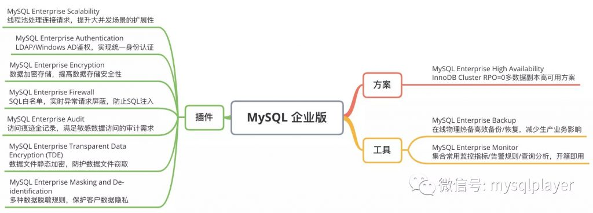
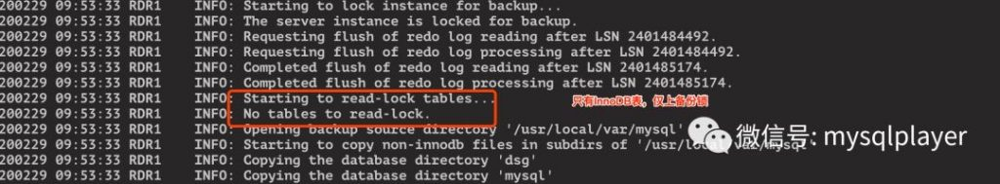
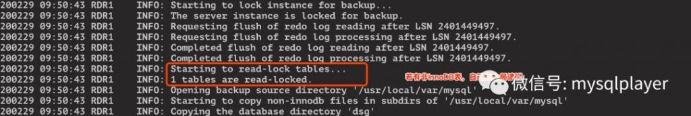
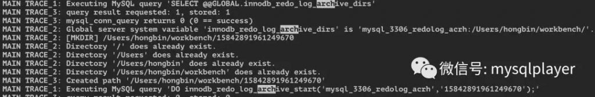
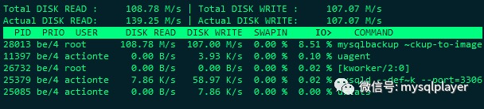
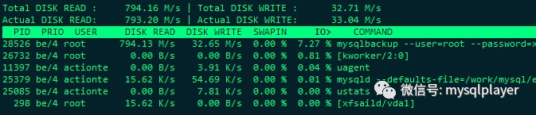

# 新特性解读 | MySQL 8 的备份工具该如何选择？

**原文链接**: https://opensource.actionsky.com/20200521-mysql/
**分类**: MySQL 新特性
**发布时间**: 2020-05-21T00:32:26-08:00

---

作者：洪斌
爱可生南区负责人兼技术服务总监，MySQL  ACE，擅长数据库架构规划、故障诊断、性能优化分析，实践经验丰富，帮助各行业客户解决 MySQL 技术问题，为金融、运营商、互联网等行业客户提供 MySQL 整体解决方案。
本文来源：转载自公众号-玩转MySQL
*爱可生开源社区出品，原创内容未经授权不得随意使用，转载请联系小编并注明来源。
数据备份是数据容灾的最后一道防线，即便有着两地三中心的架构，备份也依然重要。如果备份出问题，备份时影响了交易业务，备份数据无法恢复，这些也是企业难以承受的。所以选择合适的备份工具尤为重要。
每个企业级数据库都会有配套的备份工具，MEB(MySQL Enterprise Backup) 就是 MySQL 企业版中非常重要的工具之一，是为企业级客户提供的数据备份方案。
Xtrabackup 一直作为 MEB 开源版备胎而存在，从 MySQL 8.0 开始情况可能会变得有所不同。
在 MySQL 8.0 的 Backup Lock、Redo Log Archiving、Page Tracking 等新特性的加持下，MEB 备份/恢复体验会更好，目前 xtrabackup 还不支持这些特性。
**MySQL 企业版还有哪些功能？**
											
**特性 1：Backup Lock**
8.0 之前使用 xtrabackup 或 MEB 做物理备份，为了保证备份时 InnoDB 引擎表与其他引擎数据文件、及 binlog 日志的一致性会上全局读锁，再拷贝非 InnoDB 文件，这期间 MySQL 会变成只读，数据无法写入。表数量越多，可能加上时间越长，如果使用的 xtrabackup 不小心没加 rsync 参数，逐个拷贝 frm 文件，锁定时间会更长，对业务影响较大。
我曾遇到过部署在虚拟机的实例有 12000 多张表，当时使用的 xtrabackup，备份脚本中没加 rsync 参数，结果锁了十几分钟，而 MEB 就没有这样的问题。
MySQL 8.0 支持轻量级备份锁 LOCK INSTANCE FOR BACKUP，数据字典也重构了由 InnoDB 存储。若不创建非 InnoDB 表，MEB 默认使用备份锁获取 binlog 日志一致性位置，并阻止 DDL 操作，但不影响 DML 操作。
- 只有 InnoDB 表，仅上备份锁
											
- 若有非 InnoDB 表，上全局锁
											
**特性 2：Redo Log Archiving**
MEB 能做到在线热备，备份时不影响数据库读写，这是利用了 InnoDB 事务日志，在备份期间持续监视 redo log 的变化，读取增量变化，写入到 ibbackup_logfile，也就不需要上锁来保障备份一致性。（对非 InnoDB 的文件需要上读锁拷贝）
如果备份期间数据库写入负载特别大，而写入 ibbackup_logfile 速度较慢，redo log size 也不大，很可能会出现 ibbackup_logfile 的写入速度跟不上 redo log 记录生成速度，redo log 空间不够时需要覆写日志文件，那么来不及写入 ibbackup_logfile 的记录会丢失，导致备份失败。
MEB 4.1 对此做了优化，将 redo log 处理线程拆分成多线程分工合作，提高处理 redo log 的效率，降低了 redo log 覆写造成备份失败的概率，但 redo log 新增速度和 ibbackup_logfile 写入速度悬殊太大，问题依然会发生。
MySQL 8.0.17 支持了 redo log archiving 彻底解决了此问题，备份前设置 innodb_redo_log_archive_dirs，指定 redo log 归档目录。MEB 备份时自动开启日志归档，当 checkpoint 时会将旧记录归档到此目录，后续从归档文件中读取 redo 日志记录，避免了覆写可能导致的 redo 记录丢失。
											
注意：innodb_redo_log_archive_dirs 不能在数据目录下，目录权限要求是 700。
**特性 3：Page Tracking**
Page Tracking 是为优化增量备份效率，减少不必要的数据页扫描。
增量备份当前有 3 种扫描模式：- **page-track：**利用 LSN 精确跟踪上次备份之后被修改页面，仅复制这些页面，效率最快。
- **optimistic：**扫描上次备份之后被修改的 InnoDB 数据文件中，找出并拷贝修改的页面。依赖系统时间，使用存在限制。
- **full-scan：**扫描所有 InnoDB 数据文件，找出并拷贝自上次备份之后修改的页面，效率最慢
1、利用 page-track 增量备份，需先安装备份组件- 
`mysql> INSTALL COMPONENT "file://component_mysqlbackup";`
2、在全备前开启 page-track- 
```
SELECT mysqlbackup_page_track_set(true);
```
3、全备之后，做增量备份时指定若满足 page tracking 条件，默认会使用 page-track 模式，否则会使用 full-scan 模式，也可以指定 &#8211;incremental=page-track。- 
```
mysqlbackup --incremental-backup-dir=backup_incr --trace=3 --incremental=page-track --incremental-base=history:last_full_backup backup
```
incremental-base 有 3 种选择：- **last_backup：**基于前一次备份做增备，前一次备份可能是增备，也可能是全备。这种方式全备之间可能会有多个增备，每次增量可能比较小，但恢复时需要逐个合并。
- **last_full_backup：**基于前一次全备做增备。这种方式增备会越往后体积可能越大，但恢复时只需要合并最后一次增量备份。
- **dir：**基于前一次的备份目录，前一次备份可能是增备，也可能是全备。
测试对比 full-scan 和 page-track，在变更页小于总体 50% 的情况下 ，备份效率至少能有 1 倍的速度提升。
- page-track 模式：磁盘读写均衡，说明读写的都是修改页面。
											
- full-scan 模式：磁盘读写差别很大，说明读了很多未修改的页面。
