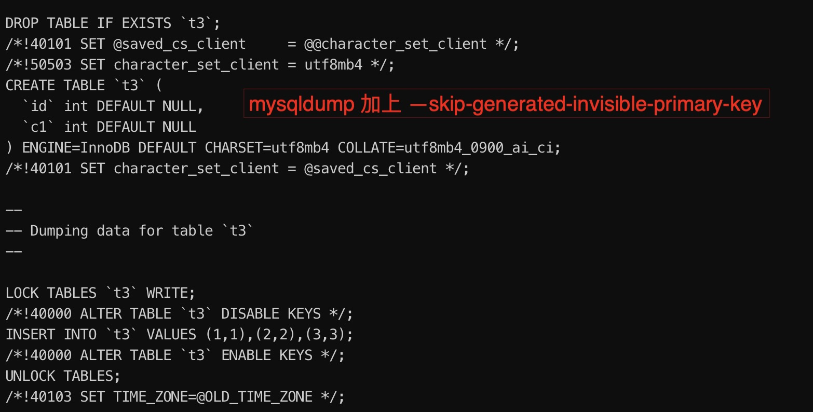
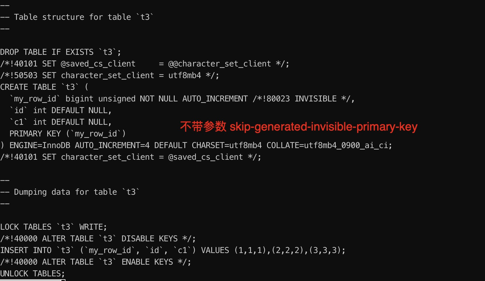

# 新特性解读 | MySQL 8.0 GIPK 不可见主键

**原文链接**: https://opensource.actionsky.com/20220802-mysql/
**分类**: MySQL 新特性
**发布时间**: 2022-08-01T19:12:39-08:00

---

作者：杨奇龙
网名“北在南方”，资深 DBA，主要负责数据库架构设计和运维平台开发工作，擅长数据库性能调优、故障诊断。
本文来源：原创投稿
*爱可生开源社区出品，原创内容未经授权不得随意使用，转载请联系小编并注明来源。
#### 一、前言
作为 MySQL DBA ，相信大家都经历过在复制模式下，如果没有主键，遇到 load data ，大事务，ddl 等有大量表数据行扫描的行为时，会带来严重的主从延迟，给数据库稳定性和数据一致性带来隐患。
MySQL 8.0.30 已于近日 GA ，新版本为我们提供了一个令人惊喜的特性 -（Generated Invisible Primary Keys）简称 GIPK 。一句概况就是: **当开启GIPK模式后，MySQL 会在没有显示定义主键的InnoDB表上自动生成不可见的主键**。
> 对于已经使用云RDS的朋友，可能很早就享受到云 RDS MySQL 提供的**隐式主键**特性。但是对于自建数据库的企业，GIPK 依然是一个比较期待特性，（当然有和用起来是两码事！）
长话短说，本文基于实际测试案例来学校 如何使用 GIPK 。
#### 二 实践出真知
##### 2.1 开启
GIPK 由参数`sql_generate_invisible_primary_key` 控制，默认关闭，表示禁用，如果需要使用该特性，则需显式开启。
master [localhost:22031]> show variables like 'sql_generate_invisible_primary_key';
+------------------------------------+-------+
| Variable_name                      | Value |
+------------------------------------+-------+
| sql_generate_invisible_primary_key | OFF   |
+------------------------------------+-------+
1 row in set (0.00 sec)
master [localhost:22031]> set sql_generate_invisible_primary_key=on;
Query OK, 0 rows affected (0.00 sec)
master [localhost:22031]> show variables like 'sql_generate_invisible_primary_key';
+------------------------------------+-------+
| Variable_name                      | Value |
+------------------------------------+-------+
| sql_generate_invisible_primary_key | ON    |
+------------------------------------+-------+
1 row in set (0.00 sec)
##### 2.2 测试
我们分别在关闭和开启该特性下创建两个无主键表:
master [localhost:22031]> create table t1(id int ,c1 int);
Query OK, 0 rows affected (0.00 sec)
master [localhost:22031] {msandbox} (test) > show create table t1 \G
*************************** 1. row ***************************
Table: t1
Create Table: CREATE TABLE `t1` (
`id` int DEFAULT NULL,
`c1` int DEFAULT NULL
) ENGINE=InnoDB DEFAULT CHARSET=utf8mb4 COLLATE=utf8mb4_0900_ai_ci
1 row in set (0.00 sec)
开启 GIPK 并创建无主键表 t3 。
master [localhost:22031]> set sql_generate_invisible_primary_key=on;
Query OK, 0 rows affected (0.00 sec)
master [localhost:22031] {msandbox} (test) > show variables like 'sql_generate_invisible_primary_key';
+------------------------------------+-------+
| Variable_name                      | Value |
+------------------------------------+-------+
| sql_generate_invisible_primary_key | ON    |
+------------------------------------+-------+
1 row in set (0.00 sec)
master [localhost:22031]> create table t3(id int ,c1 int);
Query OK, 0 rows affected (0.01 sec)
master [localhost:22031]>
master [localhost:22031]> show create table t3 \G
*************************** 1. row ***************************
Table: t3
Create Table: CREATE TABLE `t3` (
`my_row_id` bigint unsigned NOT NULL AUTO_INCREMENT /*!80023 INVISIBLE */,
`id` int DEFAULT NULL,
`c1` int DEFAULT NULL,
PRIMARY KEY (`my_row_id`)
) ENGINE=InnoDB DEFAULT CHARSET=utf8mb4 COLLATE=utf8mb4_0900_ai_ci
1 row in set (0.00 sec)
我们可以通过 show create table 发现 t3 的表结构，出现名为 `my_row_id` 的不可见主键。对两个表插入数据查看差异:
master [localhost:22031]> insert into t1 values(1,1),(2,2),(3,3);
Query OK, 3 rows affected (0.00 sec)
Records: 3  Duplicates: 0  Warnings: 0
master [localhost:22031]> select * from t1;
+------+------+
| id   | c1   |
+------+------+
|    1 |    1 |
|    2 |    2 |
|    3 |    3 |
+------+------+
3 rows in set (0.00 sec)
master [localhost:22031]> insert into t3 values(1,1),(2,2),(3,3);
Query OK, 3 rows affected (0.00 sec)
Records: 3  Duplicates: 0  Warnings: 0
master [localhost:22031]> select * from t3;
+------+------+
| id   | c1   |
+------+------+
|    1 |    1 |
|    2 |    2 |
|    3 |    3 |
+------+------+
3 rows in set (0.00 sec)
直接通过 select * from table 查询时，t3 和普通表t1无差异。 因为 GIPK 是基于不可见列实现的，如果我们显式指定访问 `my_row_id` ,则可以查看到隐藏的主键 `my_row_id`。
master [localhost:22031]> select my_row_id,id,c1 from t3;
+-----------+------+------+
| my_row_id | id   | c1   |
+-----------+------+------+
|         1 |    1 |    1 |
|         2 |    2 |    2 |
|         3 |    3 |    3 |
+-----------+------+------+
3 rows in set (0.00 sec)
> 总的来说，从业务程序访问数据库的角度来看，开启 GIPK 对业务是透明的。
##### 2.3 关于 DDL
当开启 GIPK 特性时，MySQL 生成的主键不能更改，只能在 VISIBLE 和 INVISIBLE 之间进行切换。比如：
使 GIPK 主键可见: alter table `TALBE_NAME` alter column `my_row_id` set visible;
master [localhost:22031]> alter table t3 alter column my_row_id set visible;
Query OK, 0 rows affected (0.01 sec)
Records: 0  Duplicates: 0  Warnings: 0
master [localhost:22031]> show create table t3 \G
*************************** 1. row ***************************
Table: t3
Create Table: CREATE TABLE `t3` (
`my_row_id` bigint unsigned NOT NULL AUTO_INCREMENT, ### 显式可见 
`id` int DEFAULT NULL,
`c1` int DEFAULT NULL,
PRIMARY KEY (`my_row_id`)
) ENGINE=InnoDB AUTO_INCREMENT=4 DEFAULT CHARSET=utf8mb4 COLLATE=utf8mb4_0900_ai_ci
1 row in set (0.00 sec)
### 而且可以被直接查询到
master [localhost:22031]> select * from t3;
+-----------+------+------+
| my_row_id | id   | c1   |
+-----------+------+------+
|         1 |    1 |    1 |
|         2 |    2 |    2 |
|         3 |    3 |    3 |
+-----------+------+------+
3 rows in set (0.00 sec)
关闭起可见性 :  alter table `TABLE_NAME` alter column `my_row_id` set invisible;
master [localhost:22031]> alter table t3 alter column my_row_id set invisible;
Query OK, 0 rows affected (0.00 sec)
Records: 0  Duplicates: 0  Warnings: 0
master [localhost:22031]> show create table t3 \G
*************************** 1. row ***************************
Table: t3
Create Table: CREATE TABLE `t3` (
`my_row_id` bigint unsigned NOT NULL AUTO_INCREMENT /*!80023 INVISIBLE */,
`id` int DEFAULT NULL,
`c1` int DEFAULT NULL,
PRIMARY KEY (`my_row_id`)
) ENGINE=InnoDB AUTO_INCREMENT=4 DEFAULT CHARSET=utf8mb4 COLLATE=utf8mb4_0900_ai_ci
1 row in set (0.00 sec)
## 再次通过select * 查询则看不到 my_row_id
master [localhost:22031]> select * from t3;
+------+------+
| id   | c1   |
+------+------+
|    1 |    1 |
|    2 |    2 |
|    3 |    3 |
+------+------+
3 rows in set (0.00 sec)
另外就是开启 GIPK 之后 ，`my_row_id` 是系统关键字，我们创建无主键的表时，不能包含名为 `my_row_id` 的字段 。
master [localhost:22031]> create table t6(my_row_id int not null   ,c1 int);
ERROR 4108 (HY000): Failed to generate invisible primary key. Column 'my_row_id' already exists.
当然如果 MySQL 允许创建包含名为 `my_row_id` 的主键的表 ：
master [localhost:22031]> create table t5(my_row_id int not null auto_increment primary key  ,c1 int);
Query OK, 0 rows affected (0.01 sec)
当开启 GIPK 模式时，如不能直接删除不可见主键。必须显式增加一个新的主键然后再删除 GIPK
master [localhost:22031]> alter table t3 drop PRIMARY KEY;
ERROR 1235 (42000): This version of MySQL doesn't yet support 'existing primary key drop without adding a new primary key. In @@sql_generate_invisible_primary_key=ON mode table should have a primary key. Please add a new primary key to be able to drop existing primary key.'
master [localhost:22031]> alter table t3 drop PRIMARY KEY,add primary key(id);
ERROR 4111 (HY000): Please drop primary key column to be able to drop generated invisible primary key.
master [localhost:22031]> alter table t3 drop column my_row_id,add primary key(id);
Query OK, 0 rows affected (0.02 sec)
Records: 0  Duplicates: 0  Warnings: 0
##### 2.4 关于主从复制
需要注意的是 `set sql_generate_invisible_primary_key=on|off ` 并不会被复制到从库，主库上开启该特性的话，从库并不会开启 GIPK 。也就是说从库也不会为任何在源库上没有创建主键的表创建主键。可能会有读者疑问**如果主库关闭该特性，但是从库显示开启呢？** 做个测试看看
在 master 上关闭该特性并且创建无主键表t6
master [localhost:22031]> set sql_generate_invisible_primary_key=off;
Query OK, 0 rows affected (0.00 sec)
master [localhost:22031]>
master [localhost:22031]>show variables like 'sql_generate_invisible_primary_key';
+------------------------------------+-------+
| Variable_name                      | Value |
+------------------------------------+-------+
| sql_generate_invisible_primary_key | OFF   |
+------------------------------------+-------+
1 row in set (0.00 sec)
master [localhost:22031]> show tables;
+----------------+
| Tables_in_test |
+----------------+
| t1             |
| t2             |
| t3             |
| t4             |
| t5             |
+----------------+
5 rows in set (0.00 sec)
master [localhost:22031]> create table t6(id int ,c1 int);
Query OK, 0 rows affected (0.01 sec)
master [localhost:22031]> show create table t6\G
*************************** 1. row ***************************
Table: t6
Create Table: CREATE TABLE `t6` (
`id` int DEFAULT NULL,
`c1` int DEFAULT NULL
) ENGINE=InnoDB DEFAULT CHARSET=utf8mb4 COLLATE=utf8mb4_0900_ai_ci
1 row in set (0.00 sec)
在从库上开启该特性
slave1 [localhost:22032]> show tables;
+----------------+
| Tables_in_test |
+----------------+
| t1             |
| t2             |
| t3             |
| t4             |
| t5             |
+----------------+
5 rows in set (0.00 sec)
slave1 [localhost:22032]> set sql_generate_invisible_primary_key=on;
Query OK, 0 rows affected (0.00 sec)
slave1 [localhost:22032]> show variables like 'sql_generate_invisible_primary_key';
+------------------------------------+-------+
| Variable_name                      | Value |
+------------------------------------+-------+
| sql_generate_invisible_primary_key | ON    |
+------------------------------------+-------+
1 row in set (0.00 sec)
slave1 [localhost:22032]> show create table t6\G
*************************** 1. row ***************************
Table: t6
Create Table: CREATE TABLE `t6` (
`id` int DEFAULT NULL,
`c1` int DEFAULT NULL
) ENGINE=InnoDB DEFAULT CHARSET=utf8mb4 COLLATE=utf8mb4_0900_ai_ci
1 row in set (0.00 sec)
> 结果: 主库关闭 GIPK ，从库开启 GIPK ，源库上创建无主键表，从库上并不会主动为该表创建主键。
##### 2.5 逻辑备份
大多数实例会进行逻辑备份，如果 开启GIPK 模式时，MySQL 8.0.30 版本的  mysqldump 提供的 `--skip-generated-invisible-primary-key` 选项会忽略 GIPK 信息。简单来说，mysqldump 时 不带该参数，逻辑导出的数据会包含隐式主键，如果带上该参数，则不带隐式主键。

##### 2.6 限制
- 只支持 InnoDB 存储引擎。
- 支持 row 模式复制，不支持 statement 模式复制。
- `my_row_id` 成为系统关键字。
#### 三 小结
总体而言，该特性绝对是强需求。毕竟林子大了，什么样的情况都可能会发生。运(chu)维(li)经(gu)验(zhang)比较丰富 DBA 而言，MySQL 数据库稳定性深受无主键之苦，对于自建场景尤其是没有审核流程的公司而言，该特性能提升数据库系统稳定性和安全性。
#### 参考文档
- https://dev.mysql.com/doc/refman/8.0/en/create-table-gipks.html
- https://dev.mysql.com/doc/refman/8.0/en/invisible-columns.html