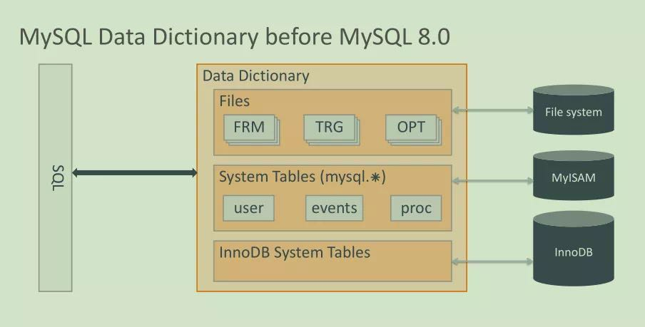
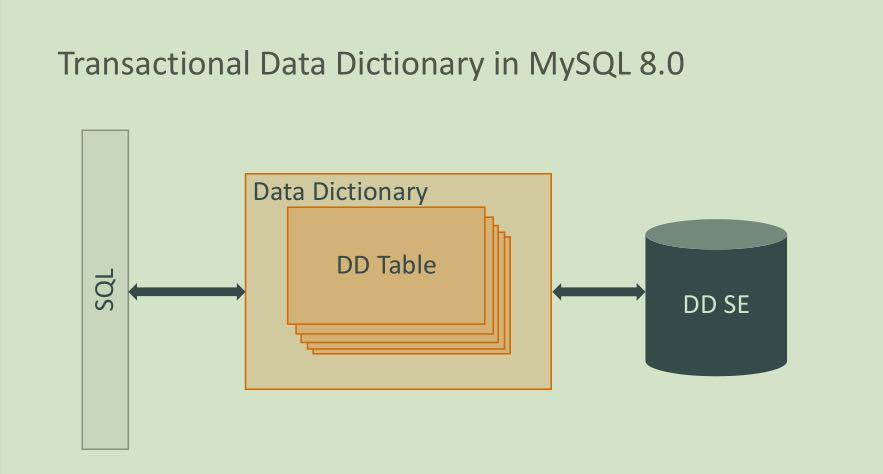
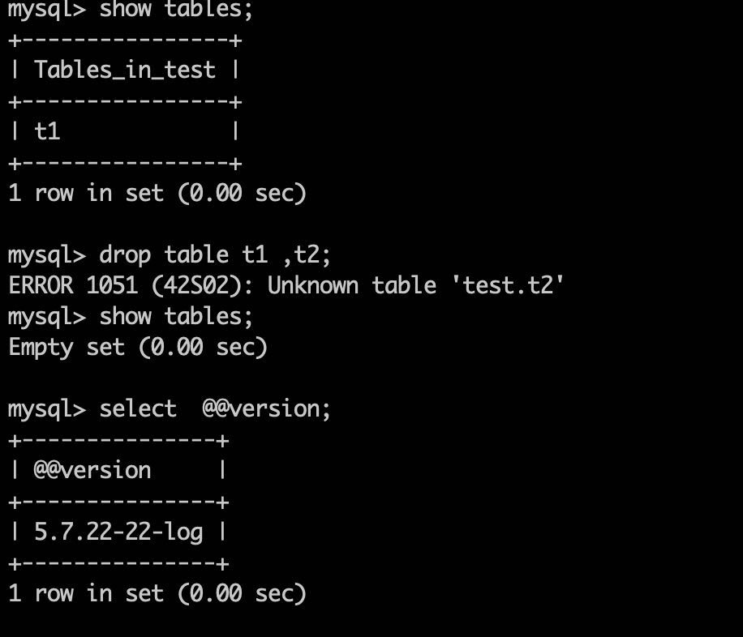
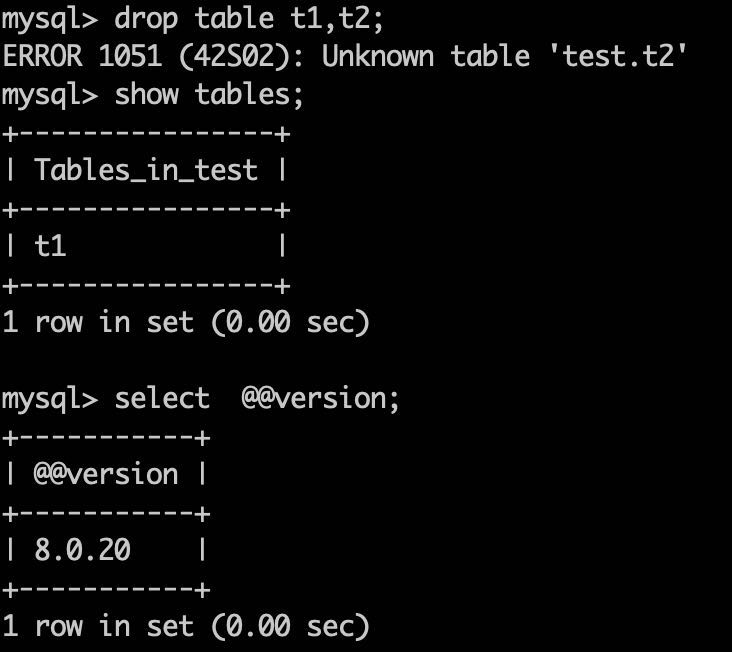
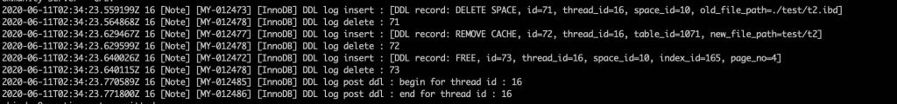

# 新特性解读 | MySQL 8.0 之原子 DDL

**原文链接**: https://opensource.actionsky.com/20200709-mysql/
**分类**: MySQL 新特性
**发布时间**: 2020-07-09T00:30:58-08:00

---

作者：杨奇龙
网名“北在南方”，8 年 DBA 老兵，目前任职于杭州有赞科技 DBA，主要负责数据库架构设计和运维平台开发工作，擅长数据库性能调优、故障诊断。
本文来源：转载自公众号-yangyidba
*爱可生开源社区出品，原创内容未经授权不得随意使用，转载请联系小编并注明来源。
本文关键字：原子 DDL 、数据字典
**原子 DDL**
听到**原子**这个关键字大家是不是联想到事务的 ACID 的原子性？
两者相似，**事务/语句**执行要么全部成功，要么全部失败。MySQL 8.0 之前的版本 DDL 是非原子性的，对于多条 sql 构成的ddl语句比如 `rename table t1 to t1_bak,t2 to t2_bak;` 
执行过程中如果遇到系统异常 crash，有可能出现表 t1 被 rename，但是 t2 没有被 rename 的情况。出现该情况的原因就是 MySQL 不支持原子的 DDL。
#### MySQL 8.0 之前的数据字典结构图：
											
从图中我们可以看出，元数据信息在存储于 `.FRM` `.TRG` `.OPT`文件系统，MyISAM 引擎的系统表里，以及 Innodb 存储引擎的系统表。分裂成多处这样的架构导致在系统异常的情况下很容易造成数据的不一致。
#### MySQL 8.0 的数据字典结构图：
											
从图中我们明显可以看出 Data Dictionary 全部存在于由 InnoDB 表构成的系统表中
Data Dictionary Table。
当遇到 crash recovery 的时候，系统可以安全的进行事务回滚，保障 DDL 语句的原子性。
说了这么多，我们动手实践一下 。
**案例实践**
对比 5.7 vs 8.0 的测试图，
MySQL 5.7.22  DDL 操作删除两个表，其中一个 t2 不存在。
											
MySQL 8.0.20 的原子性操作，
											
MySQL 8.0 支持原子性，DDL 失败之后 t1 还在，但是5.7 版本中 t1 就被删除了。
**原子 DDL 操作步骤**
InnoDB 存储引擎执行 DDL 时是分阶段进行的。比如 ALTER TABLE，可能会在执行提交阶段之前多次执行准备阶段和执行阶段的操作。
- 准备：创建所需的对象，并且将 DDL 日志写入 mysql.innodb_ddl_log 表中。DDL 日志定义了如何前滚和回滚相应的 DDL 操作。
- 执行：执行 DDL 操作。例如，为 CREATE TABLE 执行创建操作。
- 提交：更数据字典并提交数据字典事务。
- Post-DDL：重放并删除 mysql.innodb_ddl_log 表中的 DDL 日志。为了能够安全地执行回滚操作而不会导致不一致性，对于文件的操作，例如重命名数据文件或移动数据文件，放在这个最后的阶段执行。这个阶段还会为 DROP TABLE、TRUNCATE TABLE 以及其他重建表的 DDL 操作删除数据字典表 mysql.innodb_dynamic_metadata 中的动态元数据。
无论事务被提交还是回滚，在 Post-DDL 阶段都会重放并删除 `mysql.innodb_ddl_log` 表中的 DDL 日志。只有当服务器在执行 DDL 操作的过程中出现故障时，才会在 `mysql.innodb_ddl_log` 表中保留 DDL 日志。这种情况下，在服务器恢复之后执行 DDL 日志的重放和删除。
对于需要进行恢复的情况，服务器重启之后，可能执行 DDL 事务的提交，也可能执行事务的回滚。如果在提交阶段执行的数据字典事务已经记录在重做日志和二进制日志中，就会认为 DDL 操作已经成功，并且执行前滚操作。否则，当 InnoDB 重放数据字典重做日志的时候，将会回滚不完整的数据字典事务，并且回滚 DDL 事务。
**查看 DDL 日志**
为了支持 原子 DDL，InnoDB 在执行 DDL 语句时将日志写入隐藏的数据字典表`mysql.innodb_ddl_log`中，该表存储在 mysql.ibd 数据字典表空间。所谓隐藏数据字典表，就是在不能以正常的方式直接访问，得在调试 debug 模式下访问隐藏表。- 
- 
- 
- 
- 
- 
- 
- 
- 
- 
- 
`CREATE TABLE mysql.innodb_ddl_log (``  id BIGINT UNSIGNED NOT NULL AUTO_INCREMENT PRIMARY KEY,#每条 DDL 日志记录的唯一标识符。``  thread_id BIGINT UNSIGNED NOT NULL,``  type INT UNSIGNED NOT NULL,``  space_id INT UNSIGNED,``  page_no INT UNSIGNED,``  index_id BIGINT UNSIGNED,``  table_id BIGINT UNSIGNED,``  old_file_path VARCHAR(512) COLLATE UTF8_BIN,``  new_file_path VARCHAR(512) COLLATE UTF8_BIN,``  KEY(thread_id));`
各个字段的注释，- 
- 
- 
- 
- 
- 
- 
- 
- 
```
id：每条 DDL 日志记录的唯一标识符。`thread_id：每个 DDL 日志记录都与一个 thread_id 相关联，用于重放和删除某个特定 DDL 事务的 DDL 日志。涉及多个数据文件操作的 DDL 事务将会生成多条 DDL 日志记录。``type：DDL 操作的类型。包括 FREE （删除一棵索引树）、DELETE（删除一个文件）、RENAME （重命名文件）或者 DROP（从数据字典表 mysql.innodb_dynamic_metadata 中删除元数据）。``space_id：表空间 ID.``page_no：包含分配信息的页面；例如，索引树的根页面。``index_id：索引 ID。``table_id：表 ID。``old_file_path：旧的表空间文件路径。用于创建或删除表空间文件的 DDL 操作；以及重命名表空间的 DDL 操作。``new_file_path：新的表空间文件路径。用于重命名表空间文件的 DDL 操作。
```
另外就是我们可以通过设置 innodb_print_ddl_logs=1` 和 `log_error_verbosity=3` 在 MySQL 的 系统日志里面查看 DDL log，比如我运行的 MySQL 8.0 是在 docker 中 ，使用 `docker logs mysql8.0` 。
											
日志表示执行 create table t2 的 ddl 日志过程。
**MySQL 8.0 原子 DDL 使用范围**
#### 支持的 ddl 范围
- #### 与表相关的原子 DDL 包括：
#### 数据库、表空间、表、索引的 CREATE、ALTER 以及 DROP 语句，以及 TRUNCATE TABLE 语句。
- #### 与表无关的原子 DDL 包括：
#### 存储过程、触发器、视图以及用户定义函数 UDF 的 CREATE 和 DROP 语句，以及适用的 ALTER 语句。  
#### 帐户管理语句：用户和角色的 CREATE、ALTER、DROP 语句，以及适用的 RENAME 语句，以及 GRANT 和 REVOKE 语句。
#### 不支持的 ddl 范围
- 非 InnoDB 存储引擎上的表相关 DDL 语句。
- INSTALL PLUGIN 和 UNINSTALL PLUGIN 语句。
- INSTALL COMPONENT 和 UNINSTALL COMPONENT 语句。
- CREATE SERVER、ALTER SERVER 以及 DROP SERVER 语句。
**小结**
本文基本就是官方文档加上系统开发团队 blog 内容的二道贩子，理解不正确的，大家可以积极指正。其他的还是推荐看看官方文档。