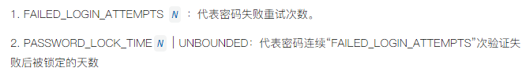

# 新特性解读 | MySQL 8.0 新密码策略（终篇）

**原文链接**: https://opensource.actionsky.com/20220125-mysql8-0/
**分类**: MySQL 新特性
**发布时间**: 2022-01-25T01:16:38-08:00

---

作者：杨涛涛
资深数据库专家，专研 MySQL 十余年。擅长 MySQL、PostgreSQL、MongoDB 等开源数据库相关的备份恢复、SQL 调优、监控运维、高可用架构设计等。目前任职于爱可生，为各大运营商及银行金融企业提供 MySQL 相关技术支持、MySQL 相关课程培训等工作。
本文来源：原创投稿
*爱可生开源社区出品，原创内容未经授权不得随意使用，转载请联系小编并注明来源。
我们时常会遇到的场景： 用银行卡在 ATM 机取款、在 APP 上转账、网购付款等等环节，因密码连续输错一定的次数，银行卡即被锁定而无法使用，除非拿着有效证件去银行柜台人工解锁才可正常使用。
随着MySQL 数据库被越来越多的金融场景使用，类似连续输错银行卡密码而导致的锁卡功能呼之欲出。MySQL 从 8.0.19 开始，就推出了类似策略：Failed-Login Tracking and Temporary Account Locking 。 翻译过来就是 失败登录追踪和临时密码锁定，后面我们简称为：FLTTAL 。
##### 和之前几个密码策略不同，FLTTAL 没有全局参数匹配，只能在创建用户或者是更改用户属性时被匹配。 有两个选项：

##### FLTTAL 有以下几个需要注意的点：
- 
###### failed_login_attempts 和 password_lock_time 必须同时不为 0 ，FLTTAL 才能生效。
- 
###### 创建新用户不指定 failed_login_attempts 和 password_lock_time ，则默认关闭 FLTTAL 。
- 
###### 已使用FLTTAL的用户，管理员对其 alter user 后不改变原有密码验证策略。
- 
###### 一旦账户被锁定，即使输入正确密码也无法登录。
- 
###### 还有最重要的一点：由于 FLTTAL 对密码验证正确与否的连续性，任意一次成功登录，FLTTAL 计数器重置。例如 failed_login_attempts 设置为 3 ，前两次密码连续输错，第三次输入正确的密码，FLTTAL 计数器重置。
##### 那接下来我们来看下如何具体使用这个密码验证策略：
- 
###### 对于普通用户的使用方法：
管理员创建用户 test1@&#8217;localhost&#8217; ，并且设置 FLTTAL 策略：失败重试次数为 3 ，密码锁定时间为 3 天。
`   mysql:(none)>create user test1@'localhost' identified by 'test' failed_login_attempts 3 password_lock_time 3;
Query OK, 0 rows affected (0.14 sec)
`
密码连续输错 3 次，test1@&#8217;localhost&#8217; 账号被锁定：
`   root@ytt-ubuntu:/home/ytt# mysql -utest1  -p -S /opt/mysql/mysqld.sock
Enter password: 
ERROR 1045 (28000): Access denied for user 'test1'@'localhost' (using password: NO)
root@ytt-ubuntu:/home/ytt# mysql -utest1  -p -S /opt/mysql/mysqld.sock
Enter password: 
ERROR 1045 (28000): Access denied for user 'test1'@'localhost' (using password: NO)
root@ytt-ubuntu:/home/ytt# mysql -utest1  -p -S /opt/mysql/mysqld.sock
Enter password: 
ERROR 3955 (HY000): Access denied for user 'test1'@'localhost'. Account is blocked for 3 day(s) (3 day(s) remaining) due to 3 consecutive failed logins.
`
管理员解锁账户方能正常使用：（或者忘记密码，让管理员解锁账号并且重置新密码。）
`   mysql:(none)>alter user test1@'localhost' account unlock;
Query OK, 0 rows affected (0.00 sec)
`
用正确密码再次登录： 登录成功。
`   root@ytt-ubuntu:/home/ytt# mysql -utest1  -p -S /opt/mysql/mysqld.sock -e "select 'hello world\!'"
Enter password: 
+--------------+
| hello world! |
+--------------+
| hello world! |
+--------------+
`
- 
###### 对于代理用户的使用方法：
对于代理用户来讲，FLTTAL 只影响代理用户本身，并不影响隐藏的真实用户。
代理用户介绍详见我之前的文章：https://mp.weixin.qq.com/s/gw_yoF57-WPcUpy18MiigQ
之前创建的代理用户：
`   mysql:(none)>show grants for ytt_fake;
+-------------------------------------------------+
| Grants for ytt_fake@%                           |
+-------------------------------------------------+
| GRANT USAGE ON *.* TO `ytt_fake`@`%`            |
| GRANT PROXY ON `ytt_real`@`%` TO `ytt_fake`@`%` |
+-------------------------------------------------+
2 rows in set (0.00 sec)
`
把真实用户插件改为mysql_native_password 让其可以正常登录：
`   mysql:(none)>alter user ytt_real identified with mysql_native_password;
Query OK, 0 rows affected (0.10 sec)
`
给代理用户 ytt_fake 设定 FLTTAL 策略：失败重试次数为 2 ，密码锁定时间为 7 天。
`   mysql:(none)>alter user ytt_fake failed_login_attempts 2 password_lock_time 7;
Query OK, 0 rows affected (0.14 sec)
`
代理用户连续输错两次密码，账号被锁住：
`   root@ytt-ubuntu:/home/ytt# mysql -u ytt_fake -p -hytt-ubuntu
Enter password: 
ERROR 1045 (28000): Access denied for user 'ytt_fake'@'ytt-ubuntu' (using password: YES)
root@ytt-ubuntu:/home/ytt# mysql -u ytt_fake -p -hytt-ubuntu
Enter password: 
ERROR 3955 (HY000): Access denied for user 'ytt_fake'@'ytt-ubuntu'. Account is blocked for 7 day(s) (7 day(s) remaining) due to 2 consecutive failed logins.
`
使用真实用户登录，不受代理用户影响： 真实用户可以正常登录。
`   root@ytt-ubuntu:/home/ytt# mysql -u ytt_real -p -hytt-ubuntu -e "select 'hello world\!'";
Enter password: 
+--------------+
| hello world! |
+--------------+
| hello world! |
+--------------+
`
##### 用户账号被锁定并且禁止登录后，除了管理员通过手动解锁重置计数器外，还可以有以下几种方法重置计数器：
- 
MySQLD 服务重启。
- 
执行 FLUSH PRIVILEGES，对用户权限数据刷盘。
- 
一次成功的账户登录。
- 
锁定时间过期。 例如锁定时间为 7 天，7 天内管理员没做任何处理，FLTTAL 计数器重置。
- 
管理员重新更改 failed_login_attempts 或者 password_lock_time 选项，FLTTAL 计数器重置。
##### 总结：
这里讲解了 MySQL 8.0 的失败登录追踪和临时密码锁定策略， 结合之前介绍过的其他密码验证策略一起使用，可以弥补 MySQL 数据库在这块领域的不足。