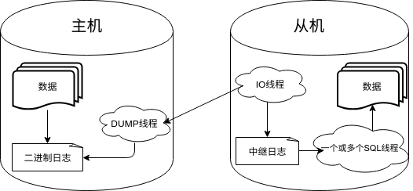

# 新特性解读 | MySQL 8.0 新特性-副本集(replicaset)

**原文链接**: https://opensource.actionsky.com/20200224-mysql/
**分类**: MySQL 新特性
**发布时间**: 2020-02-24T02:15:16-08:00

---

**引言**
之前，我介绍过一篇[《MySQL Innodb Cluster 扫盲篇》](https://opensource.actionsky.com/20190820-mysql/)。
MySQL Innodb Cluster = MySQL Shell + MySQL Router + MySQL Group Replication(MGR)全程由 MySQL Shell 来管理操作 MGR 的聚合套件。MySQL 8.0.19 发布后，这种组合延伸到 MySQL Replication（主从复制），也就是 MySQL Shell + MySQL Router + MySQL Replication。
MySQL 主从复制，相信大家已经非常了解了，原理大概如下图：
											
**一、环境准备**
举个例子，搭建主从的基本步骤大概如下：- 主机 A：192.168.2.171:4010
- 从机 B：192.168.2.171:4011
- 从机 C：192.168.2.171:4012
主机和从机经过简单的配置，后期其他配置自己任意搭配（不同的主机要将 server-id 分别改成不同的就行了）
- `# my.cnf`
- `server-id = 4010`
- 
- `log-bin=ytt`
- 
- `enforce_gtid_consistency=on`
- `gtid_mode=on`
- 
- `log_slave_updates=on`
- 
- `master-info-repository=table`
- `relay-log-info-repository=table`
- `slave_parallel_type=logical`
- `slave_parallel_workers=4`
重启所有实例- `systemctl restart mysql@{4010,4011,4012}`
然后在 A 上创建主从需要的用户，并且分别在 B 和 C 上执行 `change master to` 命令配置从机即可。
我上面只是涉及到主从从零开始的场景，如果说主机 A 有数据，还得重加步骤。关于这点资料很多，我这里也就不多介绍了。那么对主从的管理没有搭建这么简单，稍微要繁琐些，譬如要实现如下的功能点：1. 主从级别互换：主机降级为从机；从机升级为主机。2. 从机由于异常，无法恢复正常；或者恢复正常了，发现数据和主机有差异，必须要重做从机，恢复主从关系。3. 列出主从关系，可能要自己写个小脚本或者是利用 MySQL Utility 工具集或者是其他的工具集合。
那接下来来看看 MySQL 8.0.19 中 MySQL Shell 新特性：副本集以及管理。
**二、副本集**
副本集也就是极度简化了对 MySQL 主从的相关管理操作。
那接下来还是用刚才那三个实例举例说明 MySQL Shell 怎么简化了相关操作。
进入 MySQL X 端口 40100- `root@ytt-pc:/home/ytt/scripts# mysqlsh mysqlx://ytt@ytt-pc:40100`
- `MySQL Shell 8.0.19`
- 
- `Copyright (c) 2016, 2019, Oracle and/or its affiliates. All rights reserved.`
- `Oracle is a registered trademark of Oracle Corporation and/or its affiliates.`
- `Other names may be trademarks of their respective owners.`
- 
- `Type '\help' or '\?' for help; '\quit' to exit.`
- `Creating an X protocol session to 'ytt@ytt-pc:40100'`
- `Fetching schema names for autocompletion... Press ^C to stop.`
- `Your MySQL connection id is 12 (X protocol)`
- `Server version: 8.0.19 MySQL Community Server - GPL`
- `No default schema selected; type \use <schema> to set one.`
- 
**2.1 创建副本集 ytt_replicaset**
- `MySQL  ytt-pc:40100+ ssl  JS > var c1 = dba.createReplicaSet("ytt_replicaset")`
- `A new replicaset with instance 'ytt-pc:4010' will be created.`
- 
- `* Checking MySQL instance at ytt-pc:4010`
- 
- `This instance reports its own address as ytt-pc:4010`
- `ytt-pc:4010: Instance configuration is suitable.`
- 
- `* Updating metadata...`
- 
- `ReplicaSet object successfully created for ytt-pc:4010.`
- `Use rs.addInstance() to add more asynchronously replicated instances to this replicaset and rs.status() to check its status.`
**查看帮助**
可以看到所有的方法：c1.help()
**查看当前副本集的状态**
默认 RW，单机运行- ` MySQL  ytt-pc:40100+ ssl  JS > c1.status()`
- `{`
- `    "replicaSet": {`
- `        "name": "ytt_replicaset",`
- `        "primary": "ytt-pc:4010",`
- `        "status": "AVAILABLE",`
- `        "statusText": "All instances available.",`
- `        "topology": {`
- `            "ytt-pc:4010": {`
- `                "address": "ytt-pc:4010",`
- `                "instanceRole": "PRIMARY",`
- `                "mode": "R/W",`
- `                "status": "ONLINE"`
- `            }`
- `        },`
- `        "type": "ASYNC"`
- `    }`
- `}`
**添加从机**
默认用克隆的方式复制数据- `  MySQL  ytt-pc:40100+ ssl  JS > c1.addInstance('ytt@ytt-pc:4011')`
- `Adding instance to the replicaset...`
- 
- `* Performing validation checks`
- 
- `This instance reports its own address as ytt-pc:4011`
- `ytt-pc:4011: Instance configuration is suitable.`
- 
- `* Checking async replication topology...`
- 
- `* Checking transaction state of the instance...`
- 
- `WARNING: A GTID set check of the MySQL instance at 'ytt-pc:4011' determined that it contains transactions that do not originate from the replicaset, which must be discarded before it can join the replicaset.`
- 
- `ytt-pc:4011 has the following errant GTIDs that do not exist in the replicaset:`
- `a19a4ac4-3a98-11ea-8f47-9cb6d0e27d15:1-7`
- 
- `WARNING: Discarding these extra GTID events can either be done manually or by completely overwriting the state of ytt-pc:4011 with a physical snapshot from an existing replicaset member. To use this method by default, set the 'recoveryMethod' option to 'clone'.`
- 
- `Having extra GTID events is not expected, and it is recommended to investigate this further and ensure that the data can be removed prior to choosing the clone recovery method.`
- 
- `Please select a recovery method [C]lone/[A]bort (default Abort): C`
- `* Updating topology`
- `Waiting for clone process of the new member to complete. Press ^C to abort the operation.`
- `* Waiting for clone to finish...`
- `NOTE: ytt-pc:4011 is being cloned from ytt-pc:4010`
- `** Stage DROP DATA: Completed`
- `** Clone Transfer`
- `    FILE COPY  ############################################################  100%  Completed`
- `    PAGE COPY  ############################################################  100%  Completed`
- `    REDO COPY  ############################################################  100%  Completed`
- 
- `NOTE: ytt-pc:4011 is shutting down...`
- 
- `* Waiting for server restart... ready`
- `* ytt-pc:4011 has restarted, waiting for clone to finish...`
- `* Clone process has finished: 59.64 MB transferred in about 1 second (~1.00 B/s)`
- 
- `** Configuring ytt-pc:4011 to replicate from ytt-pc:4010`
- `** Waiting for new instance to synchronize with PRIMARY...`
- 
- `The instance 'ytt-pc:4011' was added to the replicaset and is replicating from ytt-pc:4010.`
用同样的方法添加实例 C- `MySQL  ytt-pc:40100+ ssl  JS > c1.addInstance('ytt@ytt-pc:4012')`
接下来看看新的主从状态，此时 ytt-pc:4010 为主机，ytt-pc:4011 和 ytt-pc:4012 为从机，并且状态都正常- ` MySQL  ytt-pc:40100+ ssl  JS > c1.status()`
- `{`
- `    "replicaSet": {`
- `        "name": "ytt_replicaset",`
- `        "primary": "ytt-pc:4010",`
- `        "status": "AVAILABLE",`
- `        "statusText": "All instances available.",`
- `        "topology": {`
- `            "ytt-pc:4010": {`
- `                "address": "ytt-pc:4010",`
- `                "instanceRole": "PRIMARY",`
- `                "mode": "R/W",`
- `                "status": "ONLINE"`
- `               },`
- `            "ytt-pc:4011": {`
- `                "address": "ytt-pc:4011",`
- `                "instanceRole": "SECONDARY",`
- `                "mode": "R/O",`
- `                "replication": {`
- `                    "applierStatus": "APPLIED_ALL",`
- `                    "applierThreadState": "Waiting for an event from Coordinator",`
- `                    "applierWorkerThreads": 4,`
- `                    "receiverStatus": "ON",`
- `                    "receiverThreadState": "Waiting for master to send event",`
- `                    "replicationLag": null`
- `                },`
- `                "status": "ONLINE"`
- `            },`
- `            "ytt-pc:4012": {`
- `                "address": "ytt-pc:4012",`
- `                "instanceRole": "SECONDARY",`
- `                "mode": "R/O",`
- `                "replication": {`
- `                    "applierStatus": "APPLIED_ALL",`
- `                    "applierThreadState": "Waiting for an event from Coordinator",`
- `                    "applierWorkerThreads": 4,`
- `                    "receiverStatus": "ON",`
- `                    "receiverThreadState": "Waiting for master to send event",`
- `                    "replicationLag": null`
- `                },`
- `                "status": "ONLINE"`
- `            }`
- `        },`
- `        "type": "ASYNC"`
- `    }`
- `}`
- ` MySQL  ytt-pc:40100+ ssl  JS >`
**2.2 配置 MySQLRouter 路由实例**
先用 MySQLrouter 来配置读写分离，并且分配虚拟端口- `root@ytt-pc:/home/ytt/scripts# mysqlrouter --bootstrap ytt@ytt-pc:4010 --user=mysqlrouter --force-password-validation --report-host ytt-pc`
- `Please enter MySQL password for ytt:`
- 
- `# Bootstrapping system MySQL Router instance...`
- 
- `- Creating account(s) (only those that are needed, if any)`
- `- Verifying account (using it to run SQL queries that would be run by Router)`
- `- Storing account in keyring`
- `- Adjusting permissions of generated files`
- `- Creating configuration /etc/mysqlrouter/mysqlrouter.conf`
- 
- `Existing configuration backed up to '/etc/mysqlrouter/mysqlrouter.conf.bak'`
- 
- `# MySQL Router configured for the InnoDB ReplicaSet 'ytt_replicaset'`
- 
- `After this MySQL Router has been started with the generated configuration`
**重启 mysqlrouter**
- `$ /etc/init.d/mysqlrouter restart`
- `or`
- `$ systemctl start mysqlrouter`
- `or`
- `$ mysqlrouter -c /etc/mysqlrouter/mysqlrouter.conf`
- `//重启完毕`
- `the cluster 'ytt_replicaset' can be reached by connecting to:`
- 
- `## MySQL Classic protocol`
- 
- `- Read/Write Connections: ytt-pc:6446`
- `- Read/Only Connections:  ytt-pc:6447`
- 
- `## MySQL X protocol`
- 
- `- Read/Write Connections: ytt-pc:64460`
- `- Read/Only Connections:  ytt-pc:64470`
- 
- `重启mysqlrouter`
- `root@ytt-pc:/home/ytt/scripts# systemctl restart mysqlrouter`
**查看 router 路由**
用 listRouters 方法详细的展示出 mysqlrouter 的路由信息，写端口为 6446/64460，读端口为 6447/64470- ` MySQL  ytt-pc:40100+ ssl  JS > c1.listRouters()`
- `{`
- `    "replicaSetName": "ytt_replicaset",`
- `    "routers": {`
- `        "ytt-pc::system": {`
- `            "hostname": "ytt-pc",`
- `            "lastCheckIn": "2020-01-19 17:26:08",`
- `            "roPort": 6447,`
- `            "roXPort": 64470,`
- `            "rwPort": 6446,`
- `            "rwXPort": 64460,`
- `            "version": "8.0.19"`
- `        }`
- `    }`
- `}`
**2.3 测试读写端口**
连接 6446，路由到实例 4010- `root@ytt-pc:/home/ytt/scripts# mysql -uytt -p -hytt-pc -P6446 -e "select @@port" -ss`
- `Enter password:`
- `4010`
连接到 6447，随机路由到实例 4011 或者 4012- `root@ytt-pc:/home/ytt/scripts# mysql -uytt -p -hytt-pc -P6447 -e "select @@port" -ss`
- `Enter password:`
- `4011`
- `root@ytt-pc:/home/ytt/scripts# mysql -uytt -p -hytt-pc -P6447 -e "select @@port" -ss`
- `Enter password:`
- `4012`
以上简单的演示下 mysql shell 操作主从复制的基本方法，下来分别看看主从级别互换、从实例删除、从实例加入场景。
**2.4 场景实验**断开连接
- `MySQL  ytt-pc:40100+ ssl  JS > c1.disconnect();`
重新得到副本集的名称
- `MySQL  ytt-pc:40100+ ssl  JS > var c1 = dba.getReplicaSet()`
- `You are connected to a member of replicaset 'ytt_replicaset'.`
提升从机为新主机，这里操作的实例是 ytt-pc:4012- ` MySQL  ytt-pc:40100+ ssl  JS > c1.setPrimaryInstance('ytt@ytt-pc:4012');`
- `ytt-pc:4012 will be promoted to PRIMARY of 'ytt_replicaset'.`
- `The current PRIMARY is ytt-pc:4010.`
- 
- `- Connecting to replicaset instances`
- `  ** Connecting to ytt-pc:4010`
- `  ** Connecting to ytt-pc:4011`
- `  ** Connecting to ytt-pc:4012`
- `  ** Connecting to ytt-pc:4010`
- `  ** Connecting to ytt-pc:4011`
- `  ** Connecting to ytt-pc:4012`
- `- Performing validation checks`
- `  ** Checking async replication topology...`
- `  ** Checking transaction state of the instance...`
- `- Synchronizing transaction backlog at ytt-pc:4012`
- `- Updating metadata`
- `- Acquiring locks in replicaset instances`
- `  ** Pre-synchronizing SECONDARIES`
- `  ** Acquiring global lock at PRIMARY`
- `  ** Acquiring global lock at SECONDARIES`
- `- Updating replication topology`
- `  ** Configuring ytt-pc:4010 to replicate from ytt-pc:4012`
- `  ** Changing replication source of ytt-pc:4011 to ytt-pc:4012`
- 
- `ytt-pc:4012 was promoted to PRIMARY.`
查看新状态，4012 为新的主机，4011 和 4010 为从机- ` MySQL  ytt-pc:40100+ ssl  JS > c1.status()`
- `{`
- `    "replicaSet": {`
- `        "name": "ytt_replicaset",`
- `        "primary": "ytt-pc:4012",`
- `        "status": "AVAILABLE",`
- `        "statusText": "All instances available.",`
- `        "topology": {`
- `            "ytt-pc:4010": {`
- `                "address": "ytt-pc:4010",`
- `                "instanceRole": "SECONDARY",`
- `                "mode": "R/O",`
- `                "replication": {`
- `                    "applierStatus": "APPLIED_ALL",`
- `                    "applierThreadState": "Waiting for an event from Coordinator",`
- `                    "applierWorkerThreads": 4,`
- `                    "receiverStatus": "ON",`
- `                    "receiverThreadState": "Waiting for master to send event",`
- `                    "replicationLag": null`
- `                },`
- `                "status": "ONLINE"`
- `            },`
- `            "ytt-pc:4011": {`
- `                "address": "ytt-pc:4011",`
- `                "instanceRole": "SECONDARY",`
- `                "mode": "R/O",`
- `                "replication": {`
- `                    "applierStatus": "APPLIED_ALL",`
- `                    "applierThreadState": "Waiting for an event from Coordinator",`
- `                    "applierWorkerThreads": 4,`
- `                    "receiverStatus": "ON",`
- `                    "receiverThreadState": "Waiting for master to send event",`
- `                    "replicationLag": null`
- `                },`
- `                "status": "ONLINE"`
- `            },`
- `            "ytt-pc:4012": {`
- `                "address": "ytt-pc:4012",`
- `                "instanceRole": "PRIMARY",`
- `                "mode": "R/W",`
- `                "status": "ONLINE"`
- `            }`
- `        },`
- `        "type": "ASYNC"`
- `    }`
- `}`
- ` MySQL  ytt-pc:40100+ ssl  JS >`
从副本集中移除实例 4010- `  MySQL  ytt-pc:40100+ ssl  JS > c1.removeInstance("ytt@ytt-pc:4010");`
- `The instance 'ytt-pc:4010' was removed from the replicaset.`
从结果看到，4010 被成功移除，接下来再把 4010 添加进去- ` MySQL  ytt-pc:40100+ ssl  JS > c1.addInstance("ytt@ytt-pc:4010")`
- `Adding instance to the replicaset...`
- `* Updating topology`
- `** Configuring ytt-pc:4010 to replicate from ytt-pc:4012`
- `** Waiting for new instance to synchronize with PRIMARY...`
- 
- `The instance 'ytt-pc:4010' was added to the replicaset and is replicating from ytt-pc:4012.`
**三、总结**
这篇介绍了 MySQL Shell 的新特性，管理 MySQL 主从复制，可以看到比传统的方式要简单的多。