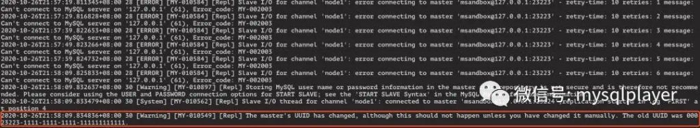

# 新特性解读 | MySQL 8.0.22 新特性 Async Replication Auto failover

**原文链接**: https://opensource.actionsky.com/20201102-mysql/
**分类**: MySQL 新特性
**发布时间**: 2020-11-02T00:24:19-08:00

---

作者：洪斌
爱可生南区负责人兼技术服务总监，MySQL  ACE，擅长数据库架构规划、故障诊断、性能优化分析，实践经验丰富，帮助各行业客户解决 MySQL 技术问题，为金融、运营商、互联网等行业客户提供 MySQL 整体解决方案。
本文来源：转载自公众号-玩转MySQL
*爱可生开源社区出品，原创内容未经授权不得随意使用，转载请联系小编并注明来源。
MGR 具备了 RPO=0 的高可用容灾能力，但并不适合跨 WAN 场景下使用，像有两地三中心容灾需求的场景，单纯靠 MGR 是无法满足的，必须要拉上异步复制。
同城双中心距离在百十公里内，网络延迟可接受，要求 RPO=0，那么部署一组 MGR；
异地容灾中心距离在上百公里，网络延迟较大，接受 RPO>0，通过异步复制，部署单节点或对称部署一组 MGR。
在两地三中心架构下，如果同城双中心的集群主节点发生切换，异地容灾的节点并不能自动的跟随新的主节点继续同步。
**Asynchronous Replication Automatic failover**
其原理是在一条异步复制通道上配置多个可用复制源，当某个复制源不可用时（宕机、复制链路中断），且 slave 的 IO 线程尝试重连无效，自动根据权重选择新的源继续同步。
1. 准备一个 MGR 集群和单实例，模拟复制链路切换，当 primary 故障，slave 自动切换到其他节点。
- 
- 
`dbdeployer deploy replication --topology=group 8.0.22 --single-primary``dbdeployer deploy single 8.0.22`
2. 在从机上建立指向 MGR 主节点的复制通道，
- 
- 
- 
- 
- 
- 
- 
- 
- 
`change master to master_user='msandbox',``master_password='msandbox', ``master_host='127.0.0.1',``master_auto_position=1,``source_connection_auto_failover=1,``master_port=23223,``master_retry_count=6,``master_connect_retry=10 ``for channel 'mgr-single';`在 master_retry_count 和 master_connect_retry 的设置上要考虑尝试重连多久才切换复制源。
3. 在从机上配置 asynchronous connection auto failover
配置 asynchronous connection auto failover 的两个函数：- **asynchronous_connection_failover_****add****_source(channel-name,host,port,network-namespace,weight)**
- **asynchronous_connection_failover_****delete****_source(channel-name,host,port,network-namespace)**
权重值大的被优先级选择，可以配合MGR的选举权重配置 asynchronous_connection_failover 的权重。当 MGR 节点切换，异步复制也能切换到新的主节点。- 
- 
- 
- 
`SELECT asynchronous_connection_failover_add_source('mgr-single','127.0.0.1',23223,null,100); ``SELECT asynchronous_connection_failover_add_source('mgr-single','127.0.0.1',23224,null,80); ``SELECT asynchronous_connection_failover_add_source('mgr-single','127.0.0.1',23225,null,50);``start slave for channel 'mgr-single';`
4. 检查异步复制通道是否启用 failover。
- 
- 
- 
- 
- 
- 
- 
`mysql> SELECT CHANNEL_NAME, SOURCE_CONNECTION_AUTO_FAILOVER FROM performance_schema.replication_connection_configuration; ``+--------------+---------------------------------+``| CHANNEL_NAME | SOURCE_CONNECTION_AUTO_FAILOVER |``+--------------+---------------------------------+``| mgr-single   |  1                              |``+--------------+---------------------------------+``1 row in set (0.01 sec`
5. 把 MGR 的 primary 节点 kill 掉，这个从节点会在尝试几轮重连失败后自动切换到次权重的复制源，其日志中会输出切换信息。
											
注意：当主节点故障，一旦复制链路成功 failover 后，在新的复制链路没有故障时，如果原主节点恢复，是不会回切的。如果当前复制链路发生故障，会再次选择权重高的进行切换。
相关推荐：
[技术分享 | MySQL 史上最快逻辑备份工具](https://opensource.actionsky.com/20200804-mysql/)
[技术分享 | MySQL 8.0.21 Disable Redo Log 性能测试](https://opensource.actionsky.com/20200727-mysql/)
[技术分享 | MySQL 主机该如何配置 fs.aio-max-nr](https://opensource.actionsky.com/20200701-mysql/)