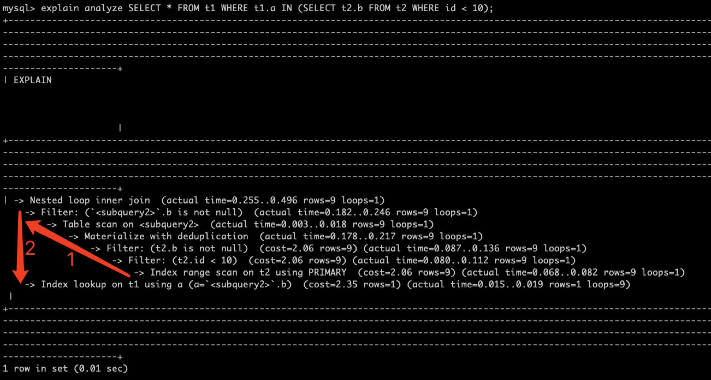

# 新特性解读 | MySQL 8.0：explain analyze 分析 SQL 执行过程

**原文链接**: https://opensource.actionsky.com/20210112-mysql8-0/
**分类**: MySQL 新特性
**发布时间**: 2022-01-12T20:49:26-08:00

---

作者：胡呈清
爱可生 DBA 团队成员，擅长故障分析、性能优化，个人博客：https://www.jianshu.com/u/a95ec11f67a8，欢迎讨论。
本文来源：原创投稿
*爱可生开源社区出品，原创内容未经授权不得随意使用，转载请联系小编并注明来源。
## 介绍
MySQL 8.0.16 引入一个实验特性：explain format=tree ，树状的输出执行过程，以及预估成本和预估返回行数。在 MySQL8.0.18 又引入了 EXPLAIN ANALYZE，在 format=tree 基础上，使用时，会执行 SQL ，并输出迭代器（感觉这里用“算子”更容易理解）相关的实际信息，比如执行成本、返回行数、执行时间，循环次数。
文档链接：https://dev.mysql.com/doc/refman/8.0/en/explain.html#explain-analyze
示例：
`mysql> explain format=tree SELECT * FROM t1 WHERE t1.a IN (SELECT t2.b FROM t2 WHERE id  Nested loop inner join  (cost=4.95 rows=9)
-> Filter: (``.b is not null)  (cost=2.83..1.80 rows=9)
-> Table scan on   (cost=0.29..2.61 rows=9)
-> Materialize with deduplication  (cost=3.25..5.58 rows=9)
-> Filter: (t2.b is not null)  (cost=2.06 rows=9)
-> Filter: (t2.id  Index range scan on t2 using PRIMARY  (cost=2.06 rows=9)
-> Index lookup on t1 using a (a=``.b)  (cost=2.35 rows=1)
1 row in set (0.01 sec)
mysql> explain analyze SELECT * FROM t1 WHERE t1.a IN (SELECT t2.b FROM t2 WHERE id  Nested loop inner join  (cost=4.95 rows=9) (actual time=0.153..0.200 rows=9 loops=1)
-> Filter: (``.b is not null)  (cost=2.83..1.80 rows=9) (actual time=0.097..0.100 rows=9 loops=1)
-> Table scan on   (cost=0.29..2.61 rows=9) (actual time=0.001..0.002 rows=9 loops=1)
-> Materialize with deduplication  (cost=3.25..5.58 rows=9) (actual time=0.090..0.092 rows=9 loops=1)
-> Filter: (t2.b is not null)  (cost=2.06 rows=9) (actual time=0.037..0.042 rows=9 loops=1)
-> Filter: (t2.id  Index range scan on t2 using PRIMARY  (cost=2.06 rows=9) (actual time=0.035..0.038 rows=9 loops=1)
-> Index lookup on t1 using a (a=``.b)  (cost=2.35 rows=1) (actual time=0.010..0.010 rows=1 loops=9)
1 row in set (0.01 sec)
`
可以看出 explain format=tree 与传统的执行计划相比，展示了比较清晰的执行过程。而 explain analyze 则会在此基础上多输出实际的执行时间、返回行数和循环次数。
## 阅读顺序
- 
从右到左：没有遇到并列的迭代器之前，都是从右边开始执行；
- 
从上到下：遇到并列的迭代器，都是上边的先开始执行
上述示例阅读顺序如下图（注意最好不要\G输出，否则第一行的缩进不准确），SQL 的执行顺序为：
- 
使用 Nested loop inner join 算法；
- 
t2 先取数据（Index range scan）、筛选（Filter）、物化成临时表（Materialize），作为驱动表；
- 
将驱动表数据带入到 t1 进行查询（Index lookup on t1），循环执行 9 次。

## 重要信息
以下面为例：
`Index lookup on t1 using a (a=``.b)  (cost=2.35 rows=1) (actual time=0.015..0.017 rows=1 loops=9)
`
### cost
预估的成本信息，计算比较复杂。如果想了解，可以查看：explain format=json 详解
### rows
第一个 rows 是预估值，第二个 rows 是实际返回行数。
### actual time
“0.015..0.017”，注意这里有两个值，第一个值是获取第一行的实际时间，第二个值获取所有行的时间，如果循环了多次就是平均时间，单位毫秒。
### loops
因为这里使用了 Nested loop inner join 算法，按照阅读顺序，t2 是驱动表，先进行查询被物化成临时表；t1 表做为被驱动表，循环查询的次数是 9 次，即 loops=9。