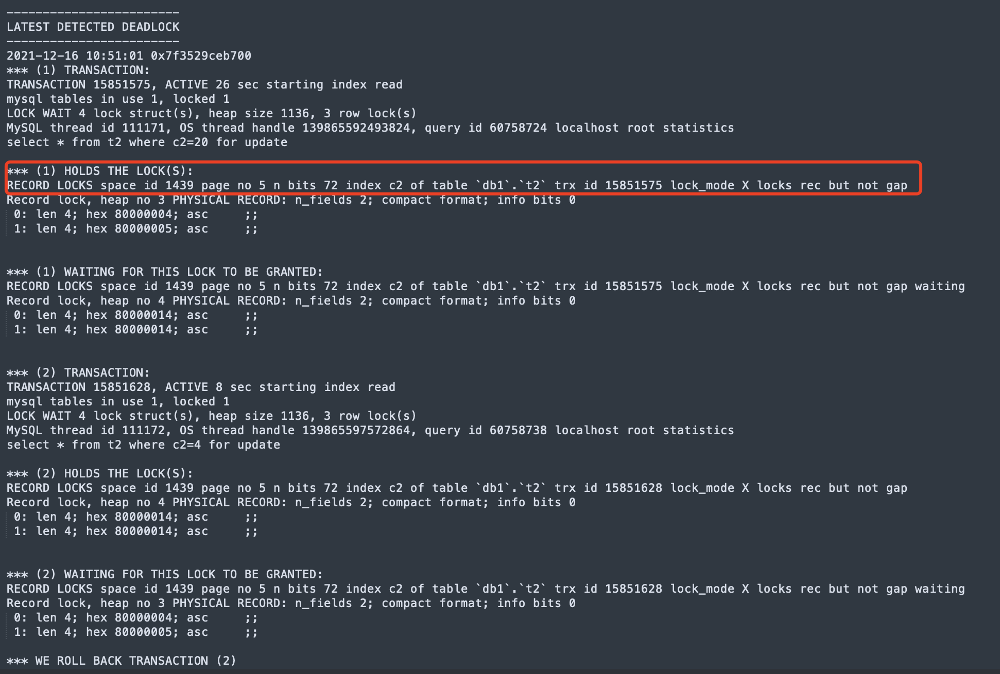
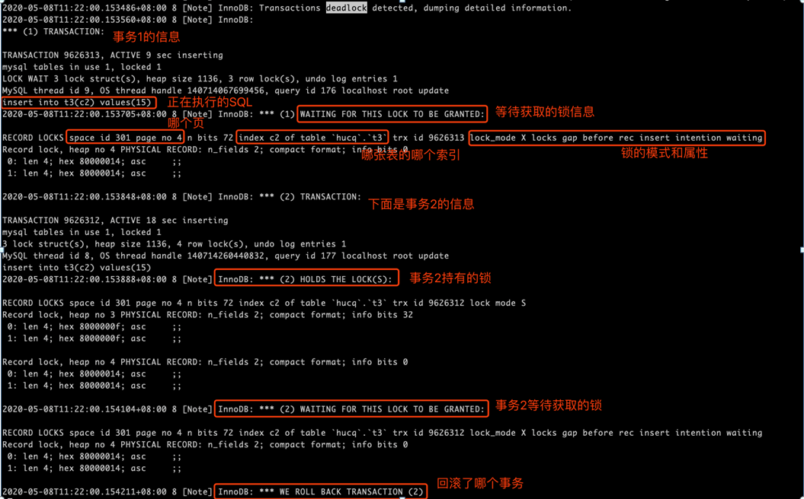
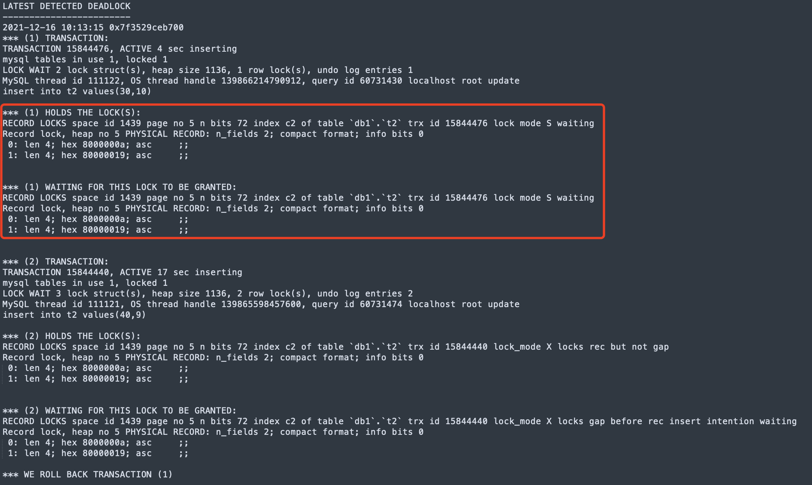
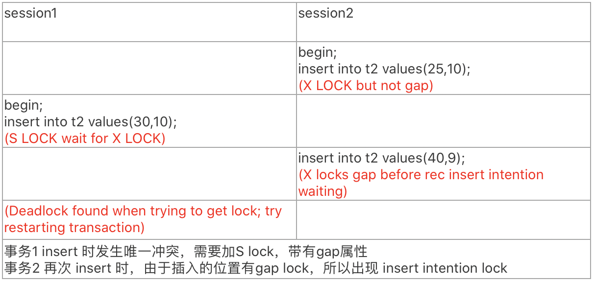

# 新特性解读 | MySQL 8.0：死锁日志改进

**原文链接**: https://opensource.actionsky.com/20211223-mysql-8-0/
**分类**: MySQL 新特性
**发布时间**: 2021-12-22T22:26:37-08:00

---

作者：胡呈清
爱可生 DBA 团队成员，擅长故障分析、性能优化，个人博客：https://www.jianshu.com/u/a95ec11f67a8，欢迎讨论。
本文来源：原创投稿
*爱可生开源社区出品，原创内容未经授权不得随意使用，转载请联系小编并注明来源。
## 重要改进
MySQL8.0 的死锁日志可以看到事务1持有的锁信息了：

这对我们分析死锁无疑是个很好的帮助，而在 MySQL5.7 是没有这个信息的，一直饱受诟病：

## 注意事项
但是这在某些情况下可能会产生一些误会，比如事务1持有锁和等待锁是同一个锁：

#### 为什么会出现这种情况？这是不是bug？
必须不是bug，我们来复现这一死锁场景：
`##设置RC隔离级别
CREATE TABLE `t2` (
`c1` int(11) NOT NULL,
`c2` int(11) DEFAULT NULL,
PRIMARY KEY (`c1`),
UNIQUE KEY `c2` (`c2`));
insert into t2 values(1,1),(5,4),(20,20);
`

死锁逻辑：
- 
session2 插入成功，对 c2 索引 10 这一记录加 X Lock，即死锁日志中的lock_mode X locks rec but not gap；
- 
session1 插入时，发生唯一键冲突，需要对 c2 索引 10 这一记录加 S Lock，带 gap 属性，即锁的范围为 (4,10]。但是由于 session2 已经对记录加了 X Lock，与 S Lock 互斥，所以必须等待 session 2 先释放锁，也就是死锁日志中的lock mode S waiting；
- 
session2 再次插入 9，在 (4,10] 范围内，这个位置有 session1 的 gap 锁（虽然还在锁队列中，没有加上），插入意向锁会被 gap 锁阻塞，即死锁日志中的 lock_mode X locks gap before rec insert intention waiting。session1、session2 互相等待，所以形成死锁。
session1 等待获取的锁 S Lock 阻塞了 session2 将要获取的锁，这在 MySQL8.0 中就会显示成 session1 持有的锁，同时也是 session1 等待的锁。就是这样。