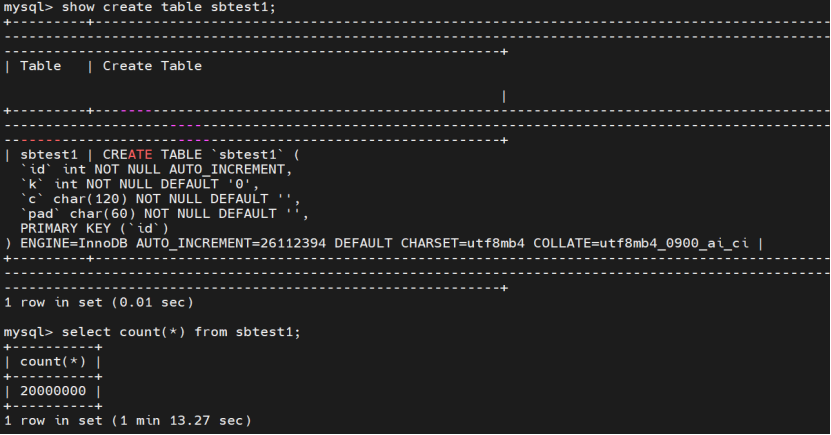
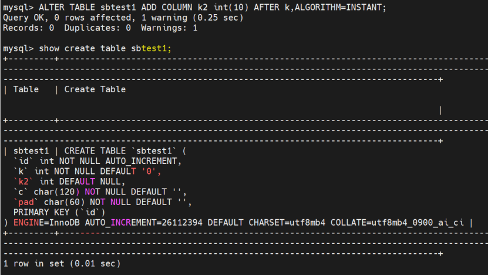
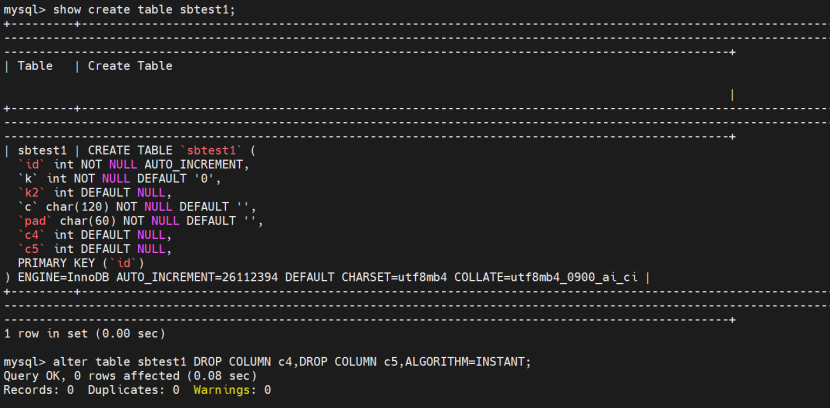
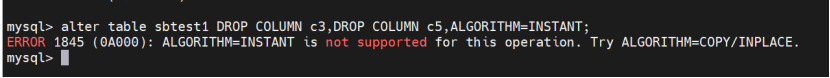
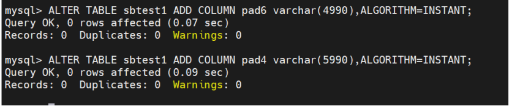
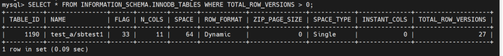
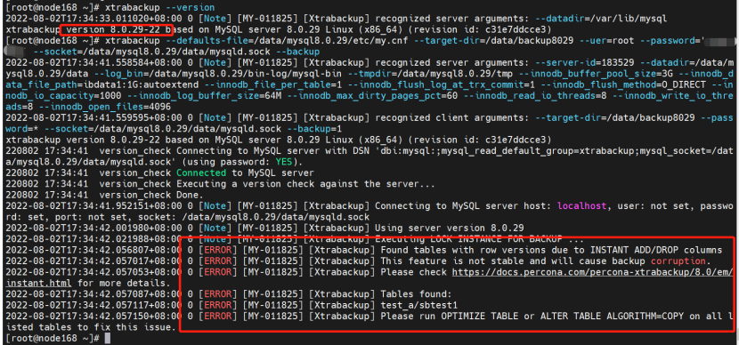

# 新特性解读 | MySQL8.0 ALTER TABLE … ALGORITHM=INSTANT

**原文链接**: https://opensource.actionsky.com/20220809-mysql/
**分类**: MySQL 新特性
**发布时间**: 2022-08-10T19:05:53-08:00

---

作者：张娜
爱可生南区DBA组成员，负责MySQL、TiDB日常维护、故障处理。
本文来源：原创投稿
*爱可生开源社区出品，原创内容未经授权不得随意使用，转载请联系小编并注明来源。
#### 一、前言
MySQL 8.0.29之前，在线 DDL 操作中即时添加列只能添加在表的最后一列，对于在某个具体列后面快速添加列很不方便，MySQL 8.0.29 扩展了对 ALTER TABLE … ALGORITHM=INSTANT 的支持：用户可以在表的任何位置即时添加列、即时删除列、添加列时评估行大小限制。
每次即时添加或删除列都会创建一个新的行版本。MySQL 8.0.29 在 INFORMATION_SCHEMA.INNODB_TABLES 表中添加了一个新的列 TOTAL_ROW_VERSIONS 列来跟踪行版本的数量，每个表最多允许 64 行版本。
另外 XtraBackup 8.0.29 在备份 MySQL 8.0.29 时会有个小插曲，这个小插曲就跟 ALTER TABLE … ALGORITHM=INSTANT 有关。接下来我们来一一体验一下。
#### 二、新特性体验：
首先创建一张2千万的表 sbtest1 ：
sysbench ./oltp_read_write.lua --mysql-host=10.186.61.168  
--mysql-user=root 
--mysql-password='XXXXXX' 
--mysql-port=3388 
--mysql-socket=/data/mysql8.0.29/data/mysqld.sock 
--mysql-db=test_a --tables=1 
--table-size=20000000 
--report-interval=2 
--threads=10 prepare
##### 1、任一位置即时添加列
原始表结构如下：

在表sbtest1任一位置即时添加列：k列后面添加k2列：
mysql> ALTER TABLE sbtest1 ADD COLUMN k2 int(10) AFTER k,ALGORITHM=INSTANT;

可以看到，2千万的表在任一位置即时添加列在秒级内完成。
而在8.0.29之前的版本，仅支持在表最后一列即时添加列，不支持在表任一位置即时添加列，如下8.0.27中操作：

可以看到，同样2千万行的表通过默认的ALGORITHM在任一位置添列耗时7分22秒，而ALGORITHM=INSTANT仅支持默认在最后一列即时添加列。
##### 2、即时删除列
MySQL 8.0.29 开始，ALTER TABLE … ALGORITHM=INSTANT支持删除某列。如下先添加两列，再删除两列：
mysql> ALTER TABLE sbtest1 ADD COLUMN c4 int(10) ,ADD COLUMN c5 int(10),ALGORITHM=INSTANT;
Query OK, 0 rows affected, 2 warnings (0.10 sec)
Records: 0  Duplicates: 0  Warnings: 2
mysql> alter table sbtest1 DROP COLUMN c4,DROP COLUMN c5,ALGORITHM=INSTANT;
Query OK, 0 rows affected (0.09 sec)
Records: 0  Duplicates: 0  Warnings: 0

而在8.0.29之前的版本，ALTER TABLE … ALGORITHM=INSTANT不支持支持删除某列，否则会有报错提示 ERROR 1845 (0A000): ALGORITHM=INSTANT is not supported for this operation. Try ALGORITHM=COPY/INPLACE.
8.0.27中操作报错：

##### 3、添加列时评估行大小限制
在 MySQL 8.0.29 之前，添加列时不会评估行大小限制。但是，在插入和更新表中的行的 DML 操作期间会检查行大小限制。从 8.0.29 开始，添加列时会检查行大小限制。如果超出限制，则会报错。
例如我们添加一个超出行大小限制的列：
mysql> ALTER TABLE sbtest1 ADD COLUMN pad6 varchar(4990),ALGORITHM=INSTANT;
ERROR 1118 (42000): Row size too large. The maximum row size for the used table type, not counting BLOBs, is 65535. This includes storage overhead, check the manual. You have to change some columns to TEXT or BLOBs

在 8.0.29 之前中操作，添加列时不会评估行大小限制，如下 8.0.27 中同样 varchar(4990) ，可以添加成功。

这种情况下会给日后更新数据时埋坑。
ALTER TABLE &#8230; ALGORITHM=INSTANT 在每次添加一或多列、删除一或多列或在同一操作中添加和删除一或多列的操作之后，都会创建一个新的行版本 。
MySQL 8.0.29 在 INFORMATION_SCHEMA.INNODB_TABLES 表中新添加了 TOTAL_ROW_VERSIONS 列来跟踪表的行版本数。每次立即添加或删除列时，该值都会增加。初始值为 0。
上面的操作中我们对表 sbtest1 进行了多次 ALTER TABLE &#8230; ALGORITHM=INSTANT 。INFORMATION_SCHEMA.INNODB_TABLES 已经记录了 sbtest1 的行版本数。
mysql> SELECT * FROM INFORMATION_SCHEMA.INNODB_TABLES WHERE TOTAL_ROW_VERSIONS > 0;

##### 4、XtraBackup 8.0.29 备份社区版 MySQL 8.0.29
XtraBackup 8.0.29 备份社区版 MySQL 8.0.29 中具有 INSTANT ADD/DROP COLUMNS的表 ，会有如下的报错提示。
[root@node168 ~]# xtrabackup --version
2022-08-02T17:34:33.011020+08:00 0 [Note] [MY-011825] [Xtrabackup] recognized server arguments: --datadir=/var/lib/mysql
xtrabackup version 8.0.29-22 based on MySQL server 8.0.29 Linux (x86_64) (revision id: c31e7ddcce3)
[root@node168 ~]# xtrabackup 
--defaults-file=/data/mysql8.0.29/etc/my.cnf 
--target-dir=/data/backup8029 
--uer=root 
--password='xxxxxxxxx' 
--socket=/data/mysql8.0.29/data/mysqld.sock 
--backup

这是因为为了支持 ALTER TABLE … ALGORITHM=INSTANT 的新特性，InnoDB redo log 格式对于所有DML操作都发生了变化。新的 redo 日志格式引入了一个设计缺陷，会导致 instant add/drop columns 的表数据损坏。据说这个缺陷已在 Percona 版 MySQL 8.0.29 中已修复，但在当前的社区版本 MySQL 8.0.29 仍然有缺陷。
由于 XtraBackup 无法处理社区版 MySQL 8.0.29 生成的损坏的 redo log ，因此，如果 XtraBackup 8.0.29 版本检测到具有 INSTANT ADD/DROP 列的表，它将不会进行备份，并且会生成错误信息列出受影响表的列表并提供将它们转换为常规表的说明。
因此在备份之前可以通过 INFORMATION_SCHEMA.INNODB_TABLES 表检查是否有 INSTANT ADD/DROP 列的表，如果有，可以先执行 optimize table 操作，再去备份。
如下：
mysql> SELECT * FROM INFORMATION_SCHEMA.INNODB_TABLES WHERE TOTAL_ROW_VERSIONS > 0;
+----------+----------------+------+--------+-------+------------+---------------+------------+--------------+--------------------+
| TABLE_ID | NAME           | FLAG | N_COLS | SPACE | ROW_FORMAT | ZIP_PAGE_SIZE | SPACE_TYPE | INSTANT_COLS | TOTAL_ROW_VERSIONS |
+----------+----------------+------+--------+-------+------------+---------------+------------+--------------+--------------------+
|     1190 | test_a/sbtest1 |   33 |     11 |    64 | Dynamic    |             0 | Single     |            0 |                 27 |
+----------+----------------+------+--------+-------+------------+---------------+------------+--------------+--------------------+
1 row in set (0.09 sec)
mysql> OPTIMIZE TABLE test_a.sbtest1;
+----------------+----------+----------+-------------------------------------------------------------------+
| Table          | Op       | Msg_type | Msg_text                                                          |
+----------------+----------+----------+-------------------------------------------------------------------+
| test_a.sbtest1 | optimize | note     | Table does not support optimize, doing recreate + analyze instead |
| test_a.sbtest1 | optimize | status   | OK                                                                |
+----------------+----------+----------+-------------------------------------------------------------------+
2 rows in set (7 min 12.49 sec)
之后就可以用 XtraBackup 备份社区版 MySQL 8.0.29 了。
#### 三、小结
ALTER TABLE … ALGORITHM=INSTANT 的新特性，可以在表的任一位置添加一列或多列，也可以快速的删除某列，极大的提高了在线 DDL 的效率。