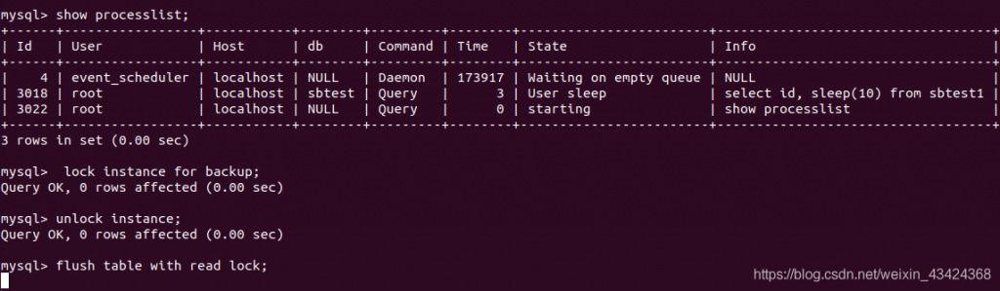
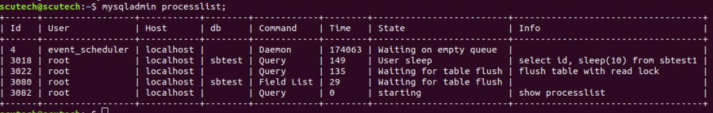

# 新特性解读 | 备份锁

**原文链接**: https://opensource.actionsky.com/20200828-mysql/
**分类**: MySQL 新特性
**发布时间**: 2020-08-28T00:33:49-08:00

---

作者：姚远
专注于 Oracle、MySQL 数据库多年，Oracle 10G 和 12C OCM，MySQL 5.6 ，5.7，8.0 OCP。现在鼎甲科技任顾问，为同事和客户提高数据库培训和技术支持服务。
本文来源：原创投稿
*爱可生开源社区出品，原创内容未经授权不得随意使用，转载请联系小编并注明来源。
MySQL8.x 中新增了一个轻量级的备份锁，它允许在 online 备份的时候进行 DML 操作，同时可防止快照不一致。
这个锁禁止的操作很少，它禁止的操作包括：- 文件的创建、删除、改名
- 账户的管理
- REPAIR TABLE
- TRUNCATE TABLE
- OPTIMIZE TABLE
备份锁由 **lock instance for backup** 和 **unlock instance** 语法组成。使用这些语句需要 BACKUP_ADMIN 权限。
											
从图里面看长查询对 FTWRL（flush tables with read lock） 是有影响的，整个系统会 hung 住，此时其它的数据库查询也不能用，包括 **use database。**
											
可以看到大家都在等这个锁释放。而 lock instance for backup 则没有这个问题。Oracle 自己的备份产品（MySQL Enterprise Backup 8）就用这个锁，Percona 的 Xtrabackup 在 8 的版本也是用这个锁。
顺便提一下，Percona 自己的 MySQL 也有一种轻量级的备份锁“LOCK TABLES FOR BACKUP”也是一种比 FTWRL 要轻量级的锁。它不会刷新表，即存储引擎不会强制关闭表，并且表不会从表缓存中排出。因此，LOCK TABLES FOR BACKUP 仅等待冲突的语句完成，它不会等待 SELECT 或更新 InnoDB 表来完成。
> **参考：**
https://dev.mysql.com/doc/refman/8.0/en/lock-instance-for-backup.html
https://www.percona.com/doc/percona-server/8.0/management/backup_locks.html