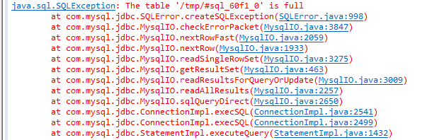

# 深度分析 | JDBC与MySQL临时表空间的分析

**原文链接**: https://opensource.actionsky.com/20190325-jdbc/
**分类**: 技术干货
**发布时间**: 2019-03-25T00:00:50-08:00

---

背景
应用 JDBC 连接参数采用 useCursorFetch=true，查询结果集存放在 mysqld 临时表空间中，导致ibtmp1 文件大小暴增到90多G，耗尽服务器磁盘空间。为了限制临时表空间的大小，设置了：
> 
innodb_temp_data_file_path = ibtmp1:12M:autoextend:max:2G
问题描述
## 
## 在限制了临时表空间后，当应用仍按以前的方式访问时，ibtmp1文件达到2G后，程序一直等待直到超时断开连接。 SHOW PROCESSLIST显示程序的连接线程为sleep状态，state和info信息为空。 这个对应用开发来说不太友好，程序等待超时之后要分析原因也缺少提示信息。
问题分析过程
为了分析问题，我们进行了以下测试
**测试环境：**
- 
mysql：5.7.16
- 
java：1.8u162
- 
jdbc 驱动：5.1.36
- 
OS：Red Hat 6.4
### 1. 手工模拟临时表超过最大限制的场景
模拟以下环境：
- 
ibtmp1:12M:autoextend:max:30M
- 
将一张 500万行的 sbtest 表的 k 字段索引删除
运行一条 group by 的查询，产生的临时表大小超过限制后，会直接报错：
> select sum(k) from sbtest1 group by k; 
ERROR 1114 (HY000): The table &#8216;/tmp/#sql_60f1_0&#8217; is full 
### 2. 检查驱动对 MySQL 的设置
我们上一步看到，SQL手工执行会返回错误，但是 jdbc 不返回错误，导致连接一直 sleep，怀疑是 mysql 驱动做了特殊设置，驱动连接 mysql，通过 general_log 查看做了哪些设置。未发现做特殊设置。
### 3. 测试 JDBC 连接
问题的背景中有对JDBC做特殊配置：useCursorFetch=true，不知道是否与隐藏报错有关，接下来进行测试：

发现以下现象：
- 
#### 加参数 useCursorFetch=true时，做同样的查询确实不会报错
这个参数是为了防止返回结果集过大而采用分段读取的方式。即程序下发一个 sql 给 mysql 后，会等 mysql 可以读结果的反馈，由于 mysql 在执行sql时，返回结果达到 ibtmp 上限后报错，但没有关闭该线程，该线程处理 sleep 状态，程序得不到反馈，会一直等，没有报错。如果 kill 这个线程，程序则会报错。
- 
#### 不加参数 useCursorFetch=true时，做同样的查询则会报错

结论
- 
正常情况下，sql 执行过程中临时表大小达到 ibtmp 上限后会报错；
- 
当JDBC设置 useCursorFetch=true，sql 执行过程中临时表大小达到 ibtmp 上限后不会报错。
解决方案
- 
进一步了解到使用 useCursorFetch=true 是为了防止查询结果集过大撑爆 jvm；
- 
但是使用 useCursorFetch=true 又会导致普通查询也生成临时表，造成临时表空间过大的问题；
- 
临时表空间过大的解决方案是限制 ibtmp1 的大小，然而 useCursorFetch=true 又导致JDBC不返回错误。
- 
所以需要使用其它方法来达到相同的效果，且 sql 报错后程序也要相应的报错。除了 useCursorFetch=true 这种段读取的方式外，还可以使用**流读取**的方式。流读取程序详见附件部分。
- 
#### 报错对比
- 
段读取方式，sql 报错后，程序不报错
- 
流读取方式，sql 报错后，程序会报错
- 
#### 内存占用对比
这里对比了普通读取、段读取、流读取三种方式，初始内存占用 28M 左右：
- 
普通读取后，内存占用 100M 多
- 
段读取后，内存占用 60M 左右
- 
流读取后，内存占用 60M 左右
## 
补充知识点
## 
## MySQL共享临时表空间知识点
MySQL 5.7在 temporary tablespace上做了改进，已经实现将 temporary tablespace 从 ibdata（共享表空间文件）中分离。并且可以重启重置大小，避免出现像以前 ibdata 过大难以释放的问题。
其参数为：innodb_temp_data_file_path
#### 1. 表现
MySQL启动时 datadir 下会创建一个 ibtmp1 文件，初始大小为 12M，默认值下会无限扩展：
通常来说，查询导致的临时表（如group by）如果超出 tmp_table_size、max_heap_table_size 大小限制则创建 innodb 磁盘临时表（MySQL5.7默认临时表引擎为 innodb），存放在共享临时表空间；
如果某个操作创建了一个大小为100 M的临时表，则临时表空间数据文件会扩展到 100M大小以满足临时表的需要。当删除临时表时，释放的空间可以重新用于新的临时表，但 ibtmp1 文件保持扩展大小。
#### 2. 查询视图
可查询共享临时表空间的使用情况：
> 
SELECT FILE_NAME, TABLESPACE_NAME, ENGINE, INITIAL_SIZE, TOTAL_EXTENTS*EXTENT_SIZE AS TotalSizeBytes, DATA_FREE,MAXIMUM_SIZE FROM INFORMATION_SCHEMA.FILES WHERE TABLESPACE_NAME = &#8216;innodb_temporary&#8217;G
*************************** 1. row ***************************
FILE_NAME:    /data/mysql5722/data/ibtmp1
TABLESPACE_NAME:    innodb_temporary
ENGINE:    InnoDB
INITIAL_SIZE:    12582912
TotalSizeBytes:    31457280
DATA_FREE:    27262976
MAXIMUM_SIZE:    31457280
1 row in set (0.00 sec)
#### 3. 回收方式
重启 MySQL 才能回收
#### 4. 限制大小
为防止临时数据文件变得过大，可以配置该 innodb_temp_data_file_path （需重启生效）选项以指定最大文件大小，当数据文件达到最大大小时，查询将返回错误：
> 
innodb_temp_data_file_path=ibtmp1:12M:autoextend:max:2G
#### 5. 临时表空间与 tmpdir 对比
共享临时表空间用于存储非压缩InnoDB临时表(non-compressed InnoDB temporary tables)、关系对象(related objects)、回滚段(rollback segment)等数据；
tmpdir 用于存放指定临时文件(temporary files)和临时表(temporary tables)，与共享临时表空间不同的是，tmpdir存储的是compressed InnoDB temporary tables。
可通过如下语句测试：
> 
CREATE TEMPORARY TABLE compress_table (id int, name char(255)) ROW_FORMAT=COMPRESSED;
CREATE TEMPORARY TABLE uncompress_table (id int, name char(255)) ;
## 
附件
**
**
**SimpleExample.java**
**
**
| `import` `java.sql.Connection;`
`import` `java.sql.DriverManager;`
`import` `java.sql.PreparedStatement;`
`import` `java.sql.ResultSet;`
`import` `java.sql.SQLException;`
`import` `java.sql.Statement;`
`import` `java.util.Properties;`
`import` `java.util.concurrent.CountDownLatch;`
`import` `java.util.concurrent.atomic.AtomicLong;`
`public` `class` `SimpleExample {`
`    ``public` `static` `void` `main(String[] args) ``throws` `Exception {`
`        ``Class.forName(``"com.mysql.jdbc.Driver"``);`
`        ``Properties props = ``new` `Properties();`
`        ``props.setProperty(``"user"``, ``"root"``);`
`        ``props.setProperty(``"password"``, ``"root"``);`
`        ``SimpleExample engine = ``new` `SimpleExample();`
`//      engine.execute(props,"jdbc:mysql://10.186.24.31:3336/hucq?useSSL=false");`
`        ``engine.execute(props,``"jdbc:mysql://10.186.24.31:3336/hucq?useSSL=false&useCursorFetch=true"``);`
`    ``}`
`    ``final` `AtomicLong tmAl = ``new` `AtomicLong();`
`    ``final` `String tableName=``"test"``;`
`    ``public` `void` `execute(Properties props,String url) {`
`        ``CountDownLatch cdl = ``new` `CountDownLatch(``1``);`
`        ``long` `start = System.currentTimeMillis();`
`        ``for` `(``int` `i = ``0``; i ``1``; i++) {`
`            ``TestThread insertThread = ``new` `TestThread(props,cdl, url);`
`            ``Thread t = ``new` `Thread(insertThread);`
`            ``t.start();`
`            ``System.out.println(``"Test start"``);`
`        ``}`
`        ``try` `{`
`            ``cdl.await();`
`            ``long` `end = System.currentTimeMillis();`
`            ``System.out.println(``"Test end,total cost:"` `+ (end-start) + ``"ms"``);`
`        ``} ``catch` `(Exception e) {`
`        ``}`
`    ``}`
`    ``class` `TestThread ``implements` `Runnable {`
`        ``Properties props;`
`        ``private` `CountDownLatch countDownLatch;`
`        ``String url;`
`        ``public` `TestThread(Properties props,CountDownLatch cdl,String url) {`
`            ``this``.props = props;`
`            ``this``.countDownLatch = cdl;`
`            ``this``.url = url;`
`        ``}`
`        ``public` `void` `run() {`
`            ``Connection connection = ``null``;`
`            ``PreparedStatement ps = ``null``;`
`            ``Statement st = ``null``;`
`            ``long` `start = System.currentTimeMillis();`
`            ``try` `{`
`                ``connection = DriverManager.getConnection(url,props);`
`                ``connection.setAutoCommit(``false``);`
`                ``st = connection.createStatement();`
`                ` 
`                ``//st.setFetchSize(500);`
`                ``st.setFetchSize(Integer.MIN_VALUE);  ``//仅修改此处即可`
`                ` 
`                ``ResultSet rstmp;`
`                ` 
`                ``st.executeQuery(``"select sum(k) from sbtest1 group by k"``); `
`                ``rstmp = st.getResultSet();`
`                ``while``(rstmp.next()){`
`                    ` 
`                ``}`
`            ``} ``catch` `(Exception e) {`
`                ``System.out.println(System.currentTimeMillis() - start);`
`                ``System.out.println(``new` `java.util.Date().toString());`
`                ``e.printStackTrace();`
`            ``} ``finally` `{`
`                ``if` `(ps != ``null``)`
`                    ``try` `{`
`                        ``ps.close();`
`                    ``} ``catch` `(SQLException e1) {`
`                        ``e1.printStackTrace();`
`                    ``}`
`                ``if` `(connection != ``null``)`
`                    ``try` `{`
`                        ``connection.close();`
`                    ``} ``catch` `(SQLException e1) {`
`                        ``e1.printStackTrace();`
`                    ``}`
`                ``this``.countDownLatch.countDown();`
`            ``}`
`        ``}`
`    ``}`
`}` |
| --- |
精选系列
**| MySQL分布式中间件使用指南**
[DBLE系列公开课第一课 DBLE概述](http://mp.weixin.qq.com/s?__biz=MzU2NzgwMTg0MA==&#038;mid=2247483982&#038;idx=2&#038;sn=db357b92832b370fff641ec9df096de0&#038;chksm=fc96e0d1cbe169c7361a72827412d1e7a9be2edbc4795f0b20641f72a396436eb26ec4d69bd6&#038;scene=21#wechat_redirect)
[DBLE系列公开课第二课 DBLE的配置及使用](http://mp.weixin.qq.com/s?__biz=MzU2NzgwMTg0MA==&#038;mid=2247484037&#038;idx=1&#038;sn=31f412ea48c0d39a4a037c6f8a067a93&#038;chksm=fc96e01acbe1690cc392af460459f888c7afdb8965e5d7b1d6ff8a37b4e8f2fcf8aea34fd31a&#038;scene=21#wechat_redirect)
[DBLE系列公开课第三课 DBLE的管理端口](http://mp.weixin.qq.com/s?__biz=MzU2NzgwMTg0MA==&#038;mid=2247484097&#038;idx=1&#038;sn=0bc93b692a54ae95b9946ac094217472&#038;chksm=fc96e05ecbe16948936bdd1928b51d0225dbfd0e1b33c7238a7554dcb3f386467bd497f23e65&#038;scene=21#wechat_redirect)
[MyCat的坑如何在分布式中间件DBLE上改善](http://mp.weixin.qq.com/s?__biz=MzU2NzgwMTg0MA==&#038;mid=2247484080&#038;idx=1&#038;sn=db508378b9f5b232754bdf3baccb8b80&#038;chksm=fc96e02fcbe16939b226c990302b0ef4a2af561fc26aaae43c8b55fac6fcf9f2431d0436b6ea&#038;scene=21#wechat_redirect)
**| DBLE 快速入门**
[深度分析 | MyCat与DBLE的对比性能调](http://mp.weixin.qq.com/s?__biz=MzU2NzgwMTg0MA==&#038;mid=2247483939&#038;idx=1&#038;sn=9fae6eb26565b4de2c6c01b778369254&#038;chksm=fc96e0bccbe169aa9d38cbe4cb137137425d81982f3901b611a1621f002b4f0e543a0d87b5a4&#038;scene=21#wechat_redirect)优
[开源分布式中间件 DBLE 快速入门指南](http://mp.weixin.qq.com/s?__biz=MzU2NzgwMTg0MA==&#038;mid=2247483801&#038;idx=1&#038;sn=850eb0b8837ffaa904fd952c8d64895a&#038;chksm=fc96e306cbe16a101513930d388011dbfdcc6aba2347fc6c5954c57425e5a55257b8fb4f8c0e&#038;scene=21#wechat_redirect)
[DBLE 自定义拆分算法](http://mp.weixin.qq.com/s?__biz=MzU2NzgwMTg0MA==&#038;mid=2247483889&#038;idx=1&#038;sn=a15bc961c77ca93476d9ddba06f12c3b&#038;chksm=fc96e36ecbe16a7811fc70f8619a5ff89e2d2d8f0bd16573ad5a73b9fd2683fe0e05850edc8e&#038;scene=21#wechat_redirect)
[DBLE Server.xml 配置解析](http://mp.weixin.qq.com/s?__biz=MzU2NzgwMTg0MA==&#038;mid=2247483905&#038;idx=1&#038;sn=45cb37beb33876f28a4cd9a72b3558e6&#038;chksm=fc96e09ecbe169884356ea61a211ba355f27474ba8bd6954468835605a12dfc22d79ffab713b&#038;scene=21#wechat_redirect)
[DBLE Schema.xml 配置解析](http://mp.weixin.qq.com/s?__biz=MzU2NzgwMTg0MA==&#038;mid=2247483828&#038;idx=1&#038;sn=279340398ab44106bea22db6a2d1aff7&#038;chksm=fc96e32bcbe16a3dfb9c5b4970f101c4ec006757c7d21d9f3800d9fe264fb793c3e610dfdfa4&#038;scene=21#wechat_redirect)
[DBLE rule.xml 配置解析](http://mp.weixin.qq.com/s?__biz=MzU2NzgwMTg0MA==&#038;mid=2247483873&#038;idx=1&#038;sn=5a9c314bc4f31c9d279158c5cd04672f&#038;chksm=fc96e37ecbe16a68753b5dd6b668189ff320027ef342826dd9513be1e6b1f3794611355e499d&#038;scene=21#wechat_redirect)
**| MySQL深度分析**
[MGR相同GTID产生不同transaction故障分析](http://mp.weixin.qq.com/s?__biz=MzU2NzgwMTg0MA==&#038;mid=2247484085&#038;idx=1&#038;sn=b4ac557d8dafaba7bb04caec9d9a9040&#038;chksm=fc96e02acbe1693c0563d837853be0bbfae6909c5eafdac3181f12216a888785000e8061ff0e&#038;scene=21#wechat_redirect)
[DBLE和Mycat跨分片查询结果不一致案例分析](http://mp.weixin.qq.com/s?__biz=MzU2NzgwMTg0MA==&#038;mid=2247483856&#038;idx=1&#038;sn=1cce9aa9b3f9bdfab00da8cc967f5e93&#038;chksm=fc96e34fcbe16a59405251700f96de098cae50a23b4fcc92c5c2dc8e20135bd29b9aaf01c920&#038;scene=21#wechat_redirect)
[基于Xtrabackup及可传输表空间实现多源数据恢复](http://mp.weixin.qq.com/s?__biz=MzU2NzgwMTg0MA==&#038;mid=2247483969&#038;idx=1&#038;sn=1d75cd926a9bd78fb03cb316dbee70cb&#038;chksm=fc96e0decbe169c80b194a73edeed79bc735ee9484580b4cbe04389c537402e0ea16accfbe0f&#038;scene=21#wechat_redirect)
[多从库时半同步复制不工作的BUG分析](http://mp.weixin.qq.com/s?__biz=MzU2NzgwMTg0MA==&#038;mid=2247484081&#038;idx=1&#038;sn=7514e1f5ae7720a34e4485885b66e5fa&#038;chksm=fc96e02ecbe16938ab5d08ce6c4099b738445ad9ac7f0ad5c6ac51e405541180e52859c448e6&#038;scene=21#wechat_redirect)
[[缺陷分析]半同步下多从库复制异常](http://mp.weixin.qq.com/s?__biz=MzU2NzgwMTg0MA==&#038;mid=2247484087&#038;idx=1&#038;sn=f1a89287bbf44460601d10d81d7837d0&#038;chksm=fc96e028cbe1693e4732955ae8e7be1f0f6d5d6d4e2d5c37436294709b88c44da07d27f7b5e4&#038;scene=21#wechat_redirect)
[[缺陷分析] Table cache 导致 MySQL 崩溃](http://mp.weixin.qq.com/s?__biz=MzU2NzgwMTg0MA==&#038;mid=2247483988&#038;idx=1&#038;sn=e8fb7b73eec6cb787cdcf09dcee3ff2b&#038;chksm=fc96e0cbcbe169ddf83e45ded7217f9bef8dea76a94ecf31ade77968549d2647752f9c486276&#038;scene=21#wechat_redirect)

> 
**开源分布式中间件DBLE**
社区官网：https://opensource.actionsky.com/
GitHub主页：https://github.com/actiontech/dble
技术交流群：669663113
> 
**开源数据传输中间件DTLE**
社区官网：https://opensource.actionsky.com/
GitHub主页：https://github.com/actiontech/dtle
技术交流群：852990221

**喜欢点****“****分享”，不行就****“****在****看”**

**多喝热水，重启试试**