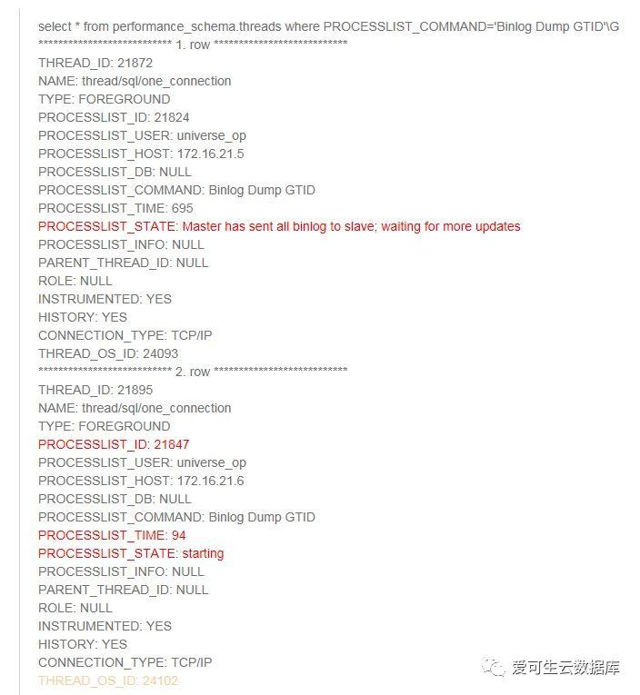
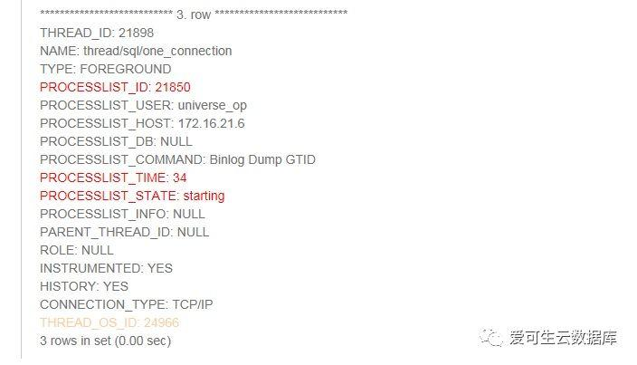
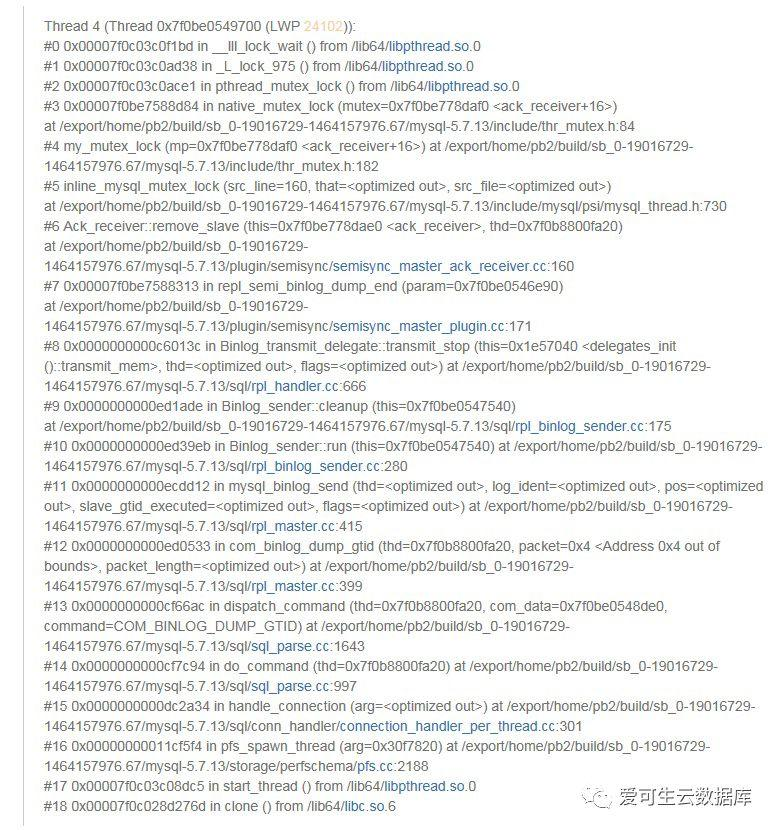
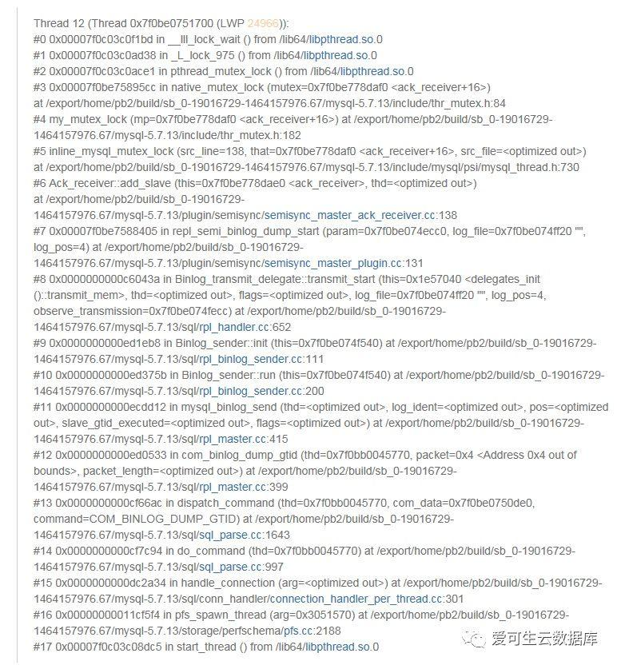

# 深度分析 | 多从库时半同步复制不工作的BUG分析

**原文链接**: https://opensource.actionsky.com/20190319-rpl_semi-bug/
**分类**: 技术干货
**发布时间**: 2019-03-19T00:00:50-08:00

---

前  言
本文是由爱可生运维团队出品的「MySQL专栏」系列文章，内容来自于运维团队一线实战经验，涵盖MySQL各种特性的实践，优化案例，数据库架构，HA，监控等，有扫雷功效。
爱可生开源社区持续运营维护的小目标：
- 
每周至少推送一篇高质量技术文章
- 
每月研发团队发布开源组件新版
- 
每年1024开源一款企业级组件
- 
2019年至少25场社区活动
欢迎大家持续关注～
**问题描述**
**
**
> 
**MySQL版本：5.7.16，5.7.17，5.7.21**
存在多个半同步从库时，如果参数 rpl_semi_sync_master_wait_for_slave_count=1，启动第1个半同步从库时可以正常启动，启动第2个半同步从库后有很大概率 slave_io_thread 停滞,（复制状态正常，Slave_IO_Running: Yes，Slave_SQL_Running: Yes，但是完全不同步主库 binlog ）
**复现步骤**
1. 主库配置参数如下：
`rpl_semi_sync_master_wait_for_slave_count = 1
rpl_semi_sync_master_wait_no_slave = OFF
rpl_semi_sync_master_enabled = ON
rpl_semi_sync_master_wait_point = AFTER_SYNC`
2. 启动从库A的半同步复制 start slave，查看从库A复制正常
3. 启动从库B的半同步复制 start slave，查看从库B，复制线程正常，但是不同步主库 binlog
**分析过程**
首先弄清楚这个问题 ，需要先结合MySQL其他的一些状态信息，尤其是主库的 dump 线程状态来进行分析：
**1. 从库A启动复制后，主库的半同步状态已启动：**
`show global status like '%semi%';
+--------------------------------------------+-----------+
| Variable_name | Value |
+--------------------------------------------+-----------+
| Rpl_semi_sync_master_clients | 1 
....
| Rpl_semi_sync_master_status | ON 
...
`
再看主库的 dump 线程，也已经启动：
`select * from performance_schema.threads where PROCESSLIST_COMMAND='Binlog Dump GTID'G
*************************** 1. row ***************************
THREAD_ID: 21872
NAME: thread/sql/one_connection
TYPE: FOREGROUND
PROCESSLIST_ID: 21824
PROCESSLIST_USER: universe_op
PROCESSLIST_HOST: 172.16.21.5
PROCESSLIST_DB: NULL
PROCESSLIST_COMMAND: Binlog Dump GTID
PROCESSLIST_TIME: 300
PROCESSLIST_STATE: Master has sent all binlog to slave; waiting for more updates
PROCESSLIST_INFO: NULL
PARENT_THREAD_ID: NULL
ROLE: NULL
INSTRUMENTED: YES
HISTORY: YES
CONNECTION_TYPE: TCP/IP
THREAD_OS_ID: 24093`
再看主库的 error log，也显示 dump 线程（21824）启动成功，其启动的半同步复制：
`2018-05-25T11:21:58.385227+08:00 21824 [Note] Start binlog_dump to master_thread_id(21824) slave_server(1045850818), pos(, 4)
2018-05-25T11:21:58.385267+08:00 21824 [Note] Start semi-sync binlog_dump to slave (server_id: 1045850818), pos(, 4)
2018-05-25T11:21:59.045568+08:00 0 [Note] Semi-sync replication switched ON at (mysql-bin.000005, 81892061)`
**2. 从库B启动复制后，主库的半同步状态，还是只有1个半同步从库 **Rpl_semi_sync_master_clients=1：
`show global status like '%semi%';
+--------------------------------------------+-----------+
| Variable_name | Value |
+--------------------------------------------+-----------+
| Rpl_semi_sync_master_clients | 1 
...
| Rpl_semi_sync_master_status | ON 
...`
再看主库的 dump 线程，这时有3个 dump 线程，但是新起的那两个一直为 starting 状态：

再看主库的 error log，21847 这个新的 dump 线程一直没起来，直到1分钟之后从库 retry ( Connect_Retry 和 Master_Retry_Count 相关)，主库上又启动了1个 dump 线程 21850，还是起不来，并且 21847 这个僵尸线程还停不掉：
`2018-05-25T11:31:59.586214+08:00 21847 [Note] Start binlog_dump to master_thread_id(21847) slave_server(873074711), pos(, 4)
2018-05-25T11:32:59.642278+08:00 21850 [Note] While initializing dump thread for slave with UUID f4958715-5ef3-11e8-9271-0242ac101506>, found a zombie dump thread with the same UUID. Master is killing the zombie dump thread(21847).
2018-05-25T11:32:59.642452+08:00 21850 [Note] Start binlog_dump to master_thread_id(21850) slave_server(873074711), pos(, 4)`
**3. 到这里我们可以知道，从库B  slave_io_thread 停滞的根本原因是因为主库上对应的 dump 线程启动不了。**如何进一步分析线程调用情况？推荐使用 gstack 或者 pstack（实为gstack软链）来查看线程调用栈，其用法很简单：gstack 
**4. 看主库的 gstack，可以看到 24102 线程（旧的复制 dump 线程）堆栈**：

可以看到 24966 线程（新的复制 dump 线程）堆栈：

两线程都在等待 Ack_Receiver 的锁，而线程 21875 在持有锁，等待select：
`Thread 15 (Thread 0x7f0bce7fc700 (LWP 21875)):
#0 0x00007f0c028c9bd3 in select () from /lib64/libc.so.6
#1 0x00007f0be7589070 in Ack_receiver::run (this=0x7f0be778dae0 ) at /export/home/pb2/build/sb_0-19016729-1464157976.67/mysql-5.7.13/plugin/semisync/semisync_master_ack_receiver.cc:261
#2 0x00007f0be75893f9 in ack_receive_handler (arg=0x7f0be778dae0 ) at /export/home/pb2/build/sb_0-19016729-1464157976.67/mysql-5.7.13/plugin/semisync/semisync_master_ack_receiver.cc:34
#3 0x00000000011cf5f4 in pfs_spawn_thread (arg=0x2d68f00) at /export/home/pb2/build/sb_0-19016729-1464157976.67/mysql-5.7.13/storage/perfschema/pfs.cc:2188
#4 0x00007f0c03c08dc5 in start_thread () from /lib64/libpthread.so.0
#5 0x00007f0c028d276d in clone () from /lib64/libc.so.6`
理论上 select 不应hang， Ack_receiver 中的逻辑也不会死循环，请教公司大神黄炎进行一波源码分析。
**5.  semisync_master_ack_receiver.cc 的以下代码形成了对互斥锁的抢占, 饿死了其他竞争者：**
`void Ack_receiver::run()
{
...
while(1)
{
mysql_mutex_lock(&m_mutex);
...
select(...);
...
mysql_mutex_unlock(&m_mutex);
}
...
}`
在 mysql_mutex_unlock 调用后，应适当增加其他线程的调度机会。
**试验:** 在 mysql_mutex_unlock 调用后增加 sched_yield();，可验证问题现象消失。
**结论**
- 
从库 slave_io_thread 停滞的根本原因是主库对应的 dump thread 启动不了；
- 
rpl_semi_sync_master_wait_for_slave_count=1 时，启动第一个半同步后，主库 ack_receiver 线程会不断的循环判断收到的 ack 数量是否 >= rpl_semi_sync_master_wait_for_slave_count，此时判断为 true，ack_receiver基本不会空闲一直持有锁。此时启动第2个半同步，对应主库要启动第2个 dump thread，启动 dump thread 要等待 ack_receiver 锁释放，一直等不到，所以第2个 dump thread 启动不了。
相信各位DBA同学看了后会很震惊，“什么？居然还有这样的bug&#8230;”，**这里要说明一点，****这个bug 触发是有几率的，但是几率又很大。**这个问题已经由我司大神提交了 bug 和 patch：https://bugs.mysql.com/bug.php?id=89370，加上本人提交SR后时不时的催一催，官方终于确认修复在 5.7.23（官方最终另有修复方法，没采纳这个 patch）。
最后或许会有疑问“既然是概率，有没有办法降低概率呢？”，尤其是不具备及时升级版本条件的同学，**欢迎社区交流群（669663113）讨论**~
使用指南系列
**| DBLE系列公开课**
[DBLE核心研发主讲：MySQL分布式中间件公开课开课啦](http://mp.weixin.qq.com/s?__biz=MzU2NzgwMTg0MA==&#038;mid=2247483982&#038;idx=2&#038;sn=db357b92832b370fff641ec9df096de0&#038;chksm=fc96e0d1cbe169c7361a72827412d1e7a9be2edbc4795f0b20641f72a396436eb26ec4d69bd6&#038;scene=21#wechat_redirect)
[技术分享 | MyCat的坑如何在分布式中间件DBLE上改善（内含视频链接）](http://mp.weixin.qq.com/s?__biz=MzU2NzgwMTg0MA==&#038;mid=2247484080&#038;idx=1&#038;sn=db508378b9f5b232754bdf3baccb8b80&#038;chksm=fc96e02fcbe16939b226c990302b0ef4a2af561fc26aaae43c8b55fac6fcf9f2431d0436b6ea&#038;scene=21#wechat_redirect)
**| 使用指南**
[深度分析 | MyCat与DBLE的对比性能调](http://mp.weixin.qq.com/s?__biz=MzU2NzgwMTg0MA==&#038;mid=2247483939&#038;idx=1&#038;sn=9fae6eb26565b4de2c6c01b778369254&#038;chksm=fc96e0bccbe169aa9d38cbe4cb137137425d81982f3901b611a1621f002b4f0e543a0d87b5a4&#038;scene=21#wechat_redirect)优
[开源分布式中间件 DBLE 快速入门指南](http://mp.weixin.qq.com/s?__biz=MzU2NzgwMTg0MA==&#038;mid=2247483801&#038;idx=1&#038;sn=850eb0b8837ffaa904fd952c8d64895a&#038;chksm=fc96e306cbe16a101513930d388011dbfdcc6aba2347fc6c5954c57425e5a55257b8fb4f8c0e&#038;scene=21#wechat_redirect)
[DBLE 自定义拆分算法](http://mp.weixin.qq.com/s?__biz=MzU2NzgwMTg0MA==&#038;mid=2247483889&#038;idx=1&#038;sn=a15bc961c77ca93476d9ddba06f12c3b&#038;chksm=fc96e36ecbe16a7811fc70f8619a5ff89e2d2d8f0bd16573ad5a73b9fd2683fe0e05850edc8e&#038;scene=21#wechat_redirect)
[DBLE Server.xml 配置解析](http://mp.weixin.qq.com/s?__biz=MzU2NzgwMTg0MA==&#038;mid=2247483905&#038;idx=1&#038;sn=45cb37beb33876f28a4cd9a72b3558e6&#038;chksm=fc96e09ecbe169884356ea61a211ba355f27474ba8bd6954468835605a12dfc22d79ffab713b&#038;scene=21#wechat_redirect)
[DBLE Schema.xml 配置解析](http://mp.weixin.qq.com/s?__biz=MzU2NzgwMTg0MA==&#038;mid=2247483828&#038;idx=1&#038;sn=279340398ab44106bea22db6a2d1aff7&#038;chksm=fc96e32bcbe16a3dfb9c5b4970f101c4ec006757c7d21d9f3800d9fe264fb793c3e610dfdfa4&#038;scene=21#wechat_redirect)
[DBLE rule.xml 配置解析](http://mp.weixin.qq.com/s?__biz=MzU2NzgwMTg0MA==&#038;mid=2247483873&#038;idx=1&#038;sn=5a9c314bc4f31c9d279158c5cd04672f&#038;chksm=fc96e37ecbe16a68753b5dd6b668189ff320027ef342826dd9513be1e6b1f3794611355e499d&#038;scene=21#wechat_redirect)
**| 深度分析**
[DBLE和Mycat跨分片查询结果不一致案例分析](http://mp.weixin.qq.com/s?__biz=MzU2NzgwMTg0MA==&#038;mid=2247483856&#038;idx=1&#038;sn=1cce9aa9b3f9bdfab00da8cc967f5e93&#038;chksm=fc96e34fcbe16a59405251700f96de098cae50a23b4fcc92c5c2dc8e20135bd29b9aaf01c920&#038;scene=21#wechat_redirect)
[基于Xtrabackup及可传输表空间实现多源数据恢复](http://mp.weixin.qq.com/s?__biz=MzU2NzgwMTg0MA==&#038;mid=2247483969&#038;idx=1&#038;sn=1d75cd926a9bd78fb03cb316dbee70cb&#038;chksm=fc96e0decbe169c80b194a73edeed79bc735ee9484580b4cbe04389c537402e0ea16accfbe0f&#038;scene=21#wechat_redirect)
[[缺陷分析] Table cache 导致 MySQL 崩溃](http://mp.weixin.qq.com/s?__biz=MzU2NzgwMTg0MA==&#038;mid=2247483988&#038;idx=1&#038;sn=e8fb7b73eec6cb787cdcf09dcee3ff2b&#038;chksm=fc96e0cbcbe169ddf83e45ded7217f9bef8dea76a94ecf31ade77968549d2647752f9c486276&#038;scene=21#wechat_redirect)

> 
**开源分布式中间件DBLE**
社区官网：https://opensource.actionsky.com/
GitHub主页：https://github.com/actiontech/dble
技术交流群：669663113
> 
**开源数据传输中间件DTLE**
社区官网：https://opensource.actionsky.com/
GitHub主页：https://github.com/actiontech/dtle
技术交流群：852990221

**喜欢点****“****分享”，不行就****“****好看”**

**多喝热水，重启试试**