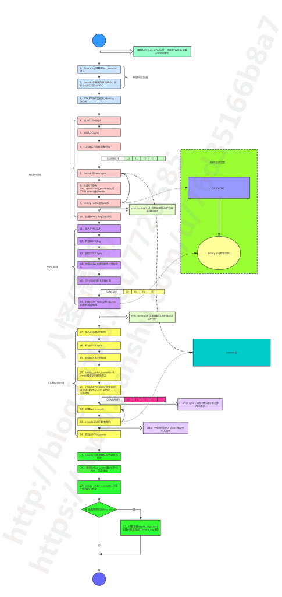

# 社区投稿 | MySQL 层事务提交流程简析

**原文链接**: https://opensource.actionsky.com/20190827-mysql/
**分类**: MySQL 新特性
**发布时间**: 2019-08-27T00:36:12-08:00

---

作者：高鹏 
文章末尾有他著作的《深入理解MySQL主从原理 32讲》,深入透彻理解MySQL主从，GTID相关技术知识。
**本文节选自《深入理解MySQL主从原理》第15节**本节包含一个笔记如下：
https://www.jianshu.com/writer#/notebooks/37013486/notes/50142567
**本文提要**
本节将解释 MySQL 层详细的提交流程，但是由于能力有限，这里不可能包含全部的步骤，只是包含了一些重要的、并且我学习过的步骤。
我们首先需要来假设参数设置，因为某些参数的设置会直接影响到提交流程，我们也会逐一解释这些参数的含义。本节介绍的大部分内容都集中在函数 MYSQL_BIN_LOG::prepare和MYSQL_BIN_LOG::ordered_commit 之中。
**一、参数设置**本部分假定参数设置为：- binlog_group_commit_sync_delay：0 
- binlog_group_commit_sync_no_delay_count：0 
- binlog_order_commits：ON
- sync_binlog：1
- binlog_transaction_dependency_tracking：COMMIT_ORDER
关于参数 binlog_transaction_dependency_tracking 需要重点说明一下。我们知道 Innodb 的行锁是在语句运行期间就已经获取，因此如果多个事务同时进入了提交流程（prepare阶段），在 Innodb 层提交释放 Innodb 行锁资源之前各个事务之间肯定是没有行冲突的，因此可以在从库端并行执行。在基于 COMMIT_ORDER 的并行复制中，last commit 和 seq number 正是基于这种思想生成的，如果 last commit 相同则视为可以在从库并行回放，在19节我们将解释从库判定并行回放的规则。而在基于 WRITESET 的并行复制中，last commit 将会在 WRITESET 的影响下继续降低，来使从库获得更好的并行回放效果，但是它也是 COMMIT_ORDER 为基础的，这个下一节将讨论。我们这节只讨论基于COMMIT_ORDER 的并行复制中 last commit 和 seq number 的生成方式。
而sync_binlog参数则有两个功能：
- sync_binlog=0：binary log 不 sync 刷盘，依赖于 OS 刷盘机制。同时会在flush阶段后通知DUMP线程发送Event。
- sync_binlog=1：binary log 每次 sync 队列形成后都进行sync刷盘，约等于每次group commit 进行刷盘。同时会在 sync 阶段后通知DUMP线程发送 Event。注意sync_binlog 非1的设置可能导致从库比主库多事务。
- sync_binlog>1：binary log 将在指定次 sync 队列形成后进行 sync 刷盘，约等于指定次 group commit 后刷盘。同时会在 flush 阶段后通知 DUMP 线程发送 Event。
第二功能将在第17节还会进行介绍。
**二、总体流程图**这里我们先展示整个流程，如下（图15-1，高清原图包含在文末原图中）：
											
**三、步骤解析第一阶段（图中蓝色部分）**
**注意：**在第1步之前会有一个获取 MDL_key::COMMIT 锁的操作，因此 FTWRL 将会堵塞 commit 操作，堵塞状态为 Waiting for commit lock ，这个可以参考 FTWRL 调用的函数make_global_read_lock_block_commit。（1）binlog 准备。将上一次 COMMIT 队列中最大的 seq number 写入到本次事务的 last_commit 中。可参考 binlog_prepare 函数。
（2）Innodb 准备。更改事务的状态为准备并且将事务的状态和 XID 写入到 Undo 中。可参考 trx_prepare 函数。
（3）XID_EVENT 生成并且写到 binlog cache 中。在第10节中我们说过实际上 XID 来自于query_id，早就生成了，这里只是生成Event而已。可参考 MYSQL_BIN_LOG::commit 函数。
**四、步骤解析第二阶段（图中粉色部分）**（4）形成 FLUSH 队列。这一步正在不断的有事务加入到这个 FLUSH 队列。第一个进入 FLUSH 队列的为本阶段的 leader，非 leader 线程将会堵塞，直到 COMMIT 阶段后由 leader 线程的唤醒。
（5）获取 LOCK log 锁。
（6）这一步就是将 FLUSH 阶段的队列取出来准备进行处理。也就是这个时候本 FLUSH 队列就不能在更改了。可参考 stage_manager.fetch_queue_for 函数。
（7）这里事务会进行 Innodb 层的 redo 持久化，并且会帮助其他事务进行 redo 的持久化。可以参考 MYSQL_BIN_LOG::process_flush_stage_queue 函数。下面是注释和一小段代码：- `/*`
- `  We flush prepared records of transactions to the log of storage`
- `  engine (for example, InnoDB redo log) in a group right before`
- `  flushing them to binary log.`
- `*/`
- `ha_flush_logs(NULL, true);//做innodb redo持久化`
（8）生成 GTID 和 seq number ，并且连同前面的 last commit 生成 GTID_EVENT ，然后直接写入到 binary log 中。我们注意到这里直接写入到了 binary log 而没有写入到 binlog cache ，因此 GTID_EVENT 是事务的第一个 Event 。参考函数 binlog_cache_data::flush 中下面一段：
- `trn_ctx->sequence_number= mysql_bin_log.m_dependency_tracker.step();`
- `//int64 state +1`
- `...`
- `    if (!error)`
- `      if ((error= mysql_bin_log.write_gtid(thd, this, &writer)))`
- `//生成GTID 写入binary log文件`
- `        thd->commit_error= THD::CE_FLUSH_ERROR;`
- `    if (!error)`
- `      error= mysql_bin_log.write_cache(thd, this, &writer);`
- `//将其他Event写入到binary log文件`
而对于 seq number 和 last commit 的取值来讲，实际上在 MySQL 内部维护着一个全局的结构 Transaction_dependency_tracker。其中包含三种可能取值方式，如下 ：- Commit_order_trx_dependency_tracker
- Writeset_trx_dependency_tracker
- Writeset_session_trx_dependency_tracker
到底使用哪一种取值方式，由参数 binlog_transaction_dependency_tracking 来决定的。这里我们先研究参数设置为 COMMIT_ORDER 的取值方式，对于 WRITESET 取值的方式下一节专门讨论。对于设置为 COMMIT_ORDER 会使用 Commit_order_trx_dependency_tracker 的取值方式，有如下特点：
											
其次 seq number 和 last commit 这两个值类型都为 Logical_clock ，其中维护了一个叫做 offsets 偏移量的值，用来记录每次binary log切换时 sequence_number 的相对偏移量。因此 seq number 和 last commit 在每个 binary log 总是重新计数，下面是 offset 的源码注释：- `/*`
- `  Offset is subtracted from the actual "absolute time" value at`
- `  logging a replication event. That is the event holds logical`
- `  timestamps in the "relative" format. They are meaningful only in`
- `  the context of the current binlog.`
- `  The member is updated (incremented) per binary log rotation.`
- `*/`
- `int64 offset;`
下面是我们计算 seq number 的方式，可以参考 Commit_order_trx_dependency_tracker::get_dependency 函数。- `  sequence_number=`
- `    trn_ctx->sequence_number - m_max_committed_transaction.get_offset();`
- `//这里获取seq number`
我们清楚的看到这里有一个减去 offset 的操作，这也是为什么我们的 seq number 和 last commit 在每个 binary log 总是重新计数的原因。
（9）这一步就会将我们的 binlog cache 里面的所有Event写入到我们的 binary log 中了。对于一个事务来讲，我们这里应该很清楚这里包含的Event有：- QUERY_EVENT
- MAP_EVENT
- DML EVENT
- XID_EVENT
注意 GTID_EVENT 前面已经写入到的 binary logfile 。这里我说的写入是调用的 Linux 的 write 函数，正常情况下它会进入图中的 OS CACHE 中。实际上这个时候可能还没有真正写入到磁盘介质中。重复 7 ~ 9步 把FLUSH队列中所有的事务做同样的处理。**注意：**如果 sync_binlog != 1 这里将会唤醒 DUMP 线程进行 Event 的发送。
（10）这一步还会判断 binary log 是否需要切换，并且设置一个切换标记。依据就是整个队列每个事务写入的 Event 总量加上现有的 binary log 大小是否超过了 max_binlog_size。可参考 MYSQL_BIN_LOG::process_flush_stage_queue函数，如下部分：- ` if (total_bytes > 0 && my_b_tell(&log_file) >= (my_off_t) max_size)`
- `    *rotate_var= true; //标记需要切换`
但是注意这里是先将所有的 Event 写入 binary log ，然后才进行的判断。因此对于大事务来讲其 Event 肯定都包含在同一个 binary log 中。到这里 FLUSH 阶段就结束了。
**五、步骤解析第三阶段（图中紫色部分）**（11）FLUSH 队列加入到 SYNC 队列。第一个进入的 FLUSH 队列的 leader 为本阶段的leader。其他 FLUSH 队列加入 SYNC 队列，且其他FLUSH队列的leader会被 LOCK sync 堵塞，直到 COMMIT 阶段后由 leader 线程的唤醒。
（12）释放 LOCK log。
（13）获取 LOCK sync。
（14）这里根据参数 delay 的设置来决定是否等待一段时间。我们从图中我们可以看出如果 delay 的时间越久那么加入 SYNC 队列的时间就会越长，也就可能有更多的 FLUSH 队列加入进来，那么这个 SYNC 队列的事务就越多。这不仅会提高 sync 效率，并且增大了 GROUP COMMIT 组成员的数量**（因为 last commit 还没有更改，时间拖得越长那么一组事务中事务数量就越多）**，从而提高了从库MTS的并行效率。但是缺点也很明显可能导致简单的 DML 语句时间拖长，因此不能设置过大，下面是我简书中的一个案列就是因为delay参数设置不当引起的，如下：
https://www.jianshu.com/p/bfd4a88307f2
参数delay一共包含两个参数如下：
- binlog_group_commit_sync_delay：通过人为的设置 delay 时长来加大整个 GROUP COMMIT 组中事务数量，并且减少进行磁盘刷盘 sync 的次数，但是受到 binlog_group_commit_sync_no_delay_count 的限制。单位为1/1000000秒，最大值1000000也就是1秒。
- binlog_group_commit_sync_no_delay_count：在 delay 的时间内如果 GROUP COMMIT 中的事务数量达到了这个设置就直接跳出等待，而不需要等待 binlog_group_commit_sync_delay 的时长。单位是事务的数量。
（15）这一步就是将 SYNC 阶段的队列取出来准备进行处理。也就是这个时候 SYNC 队列就不能再更改了。这个队列和 FLUSH 队列并不一样，事务的顺序一样但是数量可能不一样。
（16）根据 sync_binlog 的设置决定是否刷盘。可以参考函数 MYSQL_BIN_LOG::sync_binlog_file ，逻辑也很简单。
到这里 SYNC 阶段就结束了。
**注意：**如果 sync_binlog = 1 这里将会唤醒 DUMP 线程进行 Event 的发送。
**六、步骤解析第四阶段（图中黄色部分）**（17）SYNC 队列加入到 COMMIT 队列。第一个进入的 SYNC 队列的 leader 为本阶段的 leader 。其他 SYNC 队列加入 COMMIT 队列，且其他 SYNC 队列的 leader 会被 LOCK commit 堵塞，直到 COMMIT 阶段后由leader线程的唤醒。
（18）释放 LOCK sync 。
（19）获取 LOCK commit 。
（20）根据参数 binlog_order_commits 的设置来决定是否按照队列的顺序进行 Innodb 层的提交，如果 binlog_order_commits=1 则按照队列顺序提交则事务的可见顺序和提交顺序一致。如果 binlog_order_commits=0 则下面21步到23步将不会进行，也就是这里不会进行 Innodb 层的提交。（21）这一步就是将 COMMIT 阶段的队列取出来准备进行处理。也就是这个时候 COMMIT 队列就不能在更改了。这个队列和 FLUSH 队列和 SYNC 队列并不一样，事务的顺序一样，数量可能不一样。**注意：**如果 rpl_semi_sync_master_wait_point 参数设置为  AFTERSYNC ，这里将会进行 ACK 确认，可以看到实际的 Innodb 层提交操作还没有进行，等待期间状态为  Waiting for semi-sync ACK from slave 。（22）在 Innodb 层提交之前必须要更改 last_commit 了。COMMIT 队列中每个事务都会去更新它，如果大于则更改，小于则不变。可参考Commit_order_trx_dependency_tracker::update_max_committed 函数，下面是这一小段代码：- `{`
- `  m_max_committed_transaction.set_if_greater(sequence_number);`
- `//如果更大则更改`
- `}`
（23）COMMI T队列中每个事务按照顺序进行 Innodb 层的提交。可参考 innobase_commit 函数。
这一步 Innodb 层会做很多动作，比如：- Readview 的更新
- Undo 的状态的更新
- Innodb 锁资源的释放
完成这一步，实际上在 Innodb 层事务就可以见了。我曾经遇到过一个由于 leader 线程唤醒本组其他线程出现问题而导致整个 commit 操作 hang 住，但是在数据库中这些事务的修改已经可见的案例。循环22~23直到 COMMIT 队列处理完。**注意：**如果 rpl_semi_sync_master_wait_point 参数设置为  AFTER_COMMIT ，这里将会进行 ACK 确认，可以看到实际的Innodb层提交操作已经完成了，等待期间状态为 Waiting for semi-sync ACK from slave 。
（24） 释放 LOCK commit。
到这里 COMMIT 阶段就结束了。
**七、步骤解析第五阶段（图中绿色部分）**（25）这里 leader 线程会唤醒所有的组内成员，各自进行各自的操作了。
（26）每个事务成员进行 binlog cache 的重置，清空 cache 释放临时文件。
（27）如果 binlog_order_commits 设置为0，COMMIT 队列中的每个事务就各自进行 Innodb 层提交（不按照 binary log 中事务的的顺序）。
（28）根据前面第10步设置的切换标记，决定是否进行 binary log 切换。
（29）如果切换了 binary log，则还需要根据 expire_logs_days 的设置判断是否进行 binlog log 的清理。
**八、总结**- 整个过程我们看到生成 last commit 和 seq number 的过程并没有其它的开销，但是下一节介绍的基于 WRITESET 的并行复制就有一定的开销了。
- 我们需要明白的是 FLUSH/SYNC/COMMIT 每一个阶段都有一个相应的队列，每个队列并不一样。但是其中的事务顺序却是一样的，是否能够在从库进行并行回放完全取决于准备阶段获取的 last_commit ，这个我们将在第19节详细描述。
- 对于 FLUSH/SYNC/COMMIT 三个队列事务的数量实际有这样关系，即 COMMIT 队列 >=SYNC队列>=FLUSH 队列。如果压力不大它们三者可能相同且都只包含一个事务。
- 从流程中可以看出基于 COMMIT_ORDER 的并行复制如果数据库压力不大的情况下可能出现每个队列都只有一个事务的情况。这种情况就不能在从库并行回放了，但是下一节我们讲的基于WRITESET的并行复制却可以改变这种情况。
- 这里我们也更加明显的看到大事务的 Event 会在提交时刻一次性的写入到 binary log 。如果 COMMIT 队列中包含了大事务，那么必然堵塞本队列中的其它事务提交，后续的提交操作也不能完成。我认为这也是 MySQL 不适合大事务的一个重要原因。
最后推荐高鹏的专栏《深入理解MySQL主从原理 32讲》，想要透彻了解学习MySQL 主从原理的朋友不容错过。
											
**社区近期动态**
**No.1**
**Mycat 问题免费诊断**
诊断范围支持：
Mycat 的故障诊断、源码分析、性能优化
服务支持渠道：
- 技术交流群，进群后可提问
QQ群（669663113）
- 社区通道，邮件&电话
osc@actionsky.com
- 现场拜访，线下实地，1天免费拜访
关注“爱可生开源社区”公众号，回复关键字“Mycat”，获取活动详情。
**No.2**
**社区技术内容征稿**
征稿内容：
- 格式：.md/.doc/.txt
- 主题：MySQL、分布式中间件DBLE、数据传输组件DTLE相关技术内容
- 要求：原创且未发布过
- 奖励：作者署名；200元京东E卡+社区周边
投稿方式：
- 邮箱：osc@actionsky.com
- 格式：[投稿]姓名+文章标题
- 以附件形式发送，正文需注明姓名、手机号、微信号，以便小编及时联系