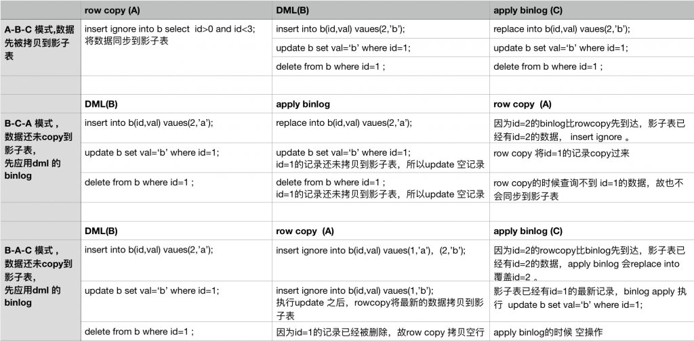

# 社区投稿 | gh-ost 原理剖析

**原文链接**: https://opensource.actionsky.com/20190918-mysql/
**分类**: MySQL 新特性
**发布时间**: 2019-09-18T00:56:59-08:00

---

**作者简介**
杨奇龙，网名“北在南方”，7年DBA老兵，目前任职于杭州有赞科技DBA，主要负责数据库架构设计和运维平台开发工作，擅长数据库性能调优、故障诊断。
**一、简介**
 上一篇文章[（gh-ost 在线 ddl 变更工具）](https://opensource.actionsky.com/20190917-mysql/)介绍 gh-ost 参数和具体的使用方法、核心特性（可动态调整暂停）、动态修改参数等等。本文分几部分从源码方面解释 gh-ost 的执行过程、数据迁移、切换细节设计。
**二、原理****2.1 执行过程**本例基于在主库上执行 DDL 记录的核心过程。核心代码在 github.com/github/gh-ost/go/logic/migrator.go 的 Migrate()- `func (this *Migrator) Migrate() //Migrate executes the complete migration logic. This is the major gh-ost function.`
1. 检查数据库实例的基础信息- `a 测试db是否可连通,`
- `b 权限验证`
- `  show grants for current_user()`
- `c 获取binlog相关信息,包括row格式和修改binlog格式后的重启replicate`
- `  select @@global.log_bin, @@global.binlog_format`
- `  select @@global.binlog_row_image`
- `d 原表存储引擎是否是innodb,检查表相关的外键,是否有触发器,行数预估等操作，需要注意的是行数预估有两种方式  一个是通过explain 读执行计划 另外一个是select count(*) from table ,遇到几百G的大表，后者一定非常慢。`
- `explain select /* gh-ost */ * from `test`.`b` where 1=1`
2. 模拟 slave，获取当前的位点信息，创建 binlog streamer 监听 binlog- `2019-09-08T22:01:20.944172+08:00    17760 Query show /* gh-ost readCurrentBinlogCoordinates */ master status`
- `2019-09-08T22:01:20.947238+08:00    17762 Connect   root@127.0.0.1 on  using TCP/IP`
- `2019-09-08T22:01:20.947349+08:00    17762 Query SHOW GLOBAL VARIABLES LIKE 'BINLOG_CHECKSUM'`
- `2019-09-08T22:01:20.947909+08:00    17762 Query SET @master_binlog_checksum='NONE'`
- `2019-09-08T22:01:20.948065+08:00    17762 Binlog Dump   Log: 'mysql-bin.000005'  Pos: 795282`
3. 创建 日志记录表 `xx_ghc` 和影子表 `xx_gho` 并且执行 alter 语句将影子表变更为目标表结构。如下日志记录了该过程，gh-ost 会将核心步骤记录到 _b_ghc 中。- `2019-09-08T22:01:20.954866+08:00    17760 Query create /* gh-ost */ table `test`.`_b_ghc` (`
- `            id bigint auto_increment,`
- `            last_update timestamp not null DEFAULT CURRENT_TIMESTAMP ON UPDATE CURRENT_TIMESTAMP,`
- `            hint varchar(64) charset ascii not null,`
- `            value varchar(4096) charset ascii not null,`
- `            primary key(id),`
- `            unique key hint_uidx(hint)`
- `        ) auto_increment=256`
- `2019-09-08T22:01:20.957550+08:00    17760 Query create /* gh-ost */ table `test`.`_b_gho` like `test`.`b``
- `2019-09-08T22:01:20.960110+08:00    17760 Query alter /* gh-ost */ table `test`.`_b_gho` engine=innodb`
- `2019-09-08T22:01:20.966740+08:00    17760 Query`
- `   insert /* gh-ost */ into `test`.`_b_ghc`(id, hint, value)values (NULLIF(2, 0), 'state', 'GhostTableMigrated') on duplicate key update last_update=NOW(),value=VALUES(value)`
4. insert into `xx_gho` select * from xx 拷贝数据
获取当前的最大主键和最小主键，然后根据命令行传参 chunk 获取数据 insert 到影子表里面- `获取最小主键 select `id` from `test`.`b` order by `id` asc limit 1;`
- `获取最大主键 soelect `id` from `test`.`b` order by `id` desc limit 1;`
- `获取第一个 chunk:`
- `select  /* gh-ost `test`.`b` iteration:0 */ `id` from `test`.`b` where ((`id` > _binary'1') or ((`id` = _binary'1'))) and ((`id` < _binary'21') or ((`id` = _binary'21'))) order by `id` asc limit 1 offset 999;`
- 
- `循环插入到目标表:`
- `insert /* gh-ost `test`.`b` */ ignore into `test`.`_b_gho` (`id`, `sid`, `name`, `score`, `x`) (select `id`, `sid`, `name`, `score`, `x` from `test`.`b` force index (`PRIMARY`)  where (((`id` > _binary'1') or ((`id` = _binary'1'))) and ((`id` < _binary'21') or ((`id` = _binary'21')))) lock in share mode;`
- 
- `循环到最大的id，之后依赖binlog 增量同步`
需要注意的是> rowcopy 过程中是对原表加上 **lock in share mode**，防止数据在 copy 的过程中被修改。这点对后续理解整体的数据迁移非常重要。因为 gh-ost 在 copy 的过程中不会修改这部分数据记录。对于解析 binlog 获得的 INSERT，UPDATE，DELETE 事件我们只需要分析 copy 数据之前 log before copy 和 copy 数据之后 log after copy。整体的数据迁移会在后面做详细分析。
5. 增量应用 binlog 迁移数据> 核心代码在 gh-ost/go/sql/builder.go 中，这里主要做 DML 转换的解释，当然还有其他函数做辅助工作，比如数据库，表名校验 以及语法完整性校验。
**解析到 delete 语句对应转换为 delete 语句**- `func BuildDMLDeleteQuery(databaseName, tableName string, tableColumns, uniqueKeyColumns *ColumnList, args []interface{}) (result string, uniqueKeyArgs []interface{}, err error) {`
- `   ....省略代码...`
- `    result = fmt.Sprintf(``
- `            delete /* gh-ost %s.%s */`
- `                from`
- `                    %s.%s`
- `                where`
- `                    %s`
- `        `, databaseName, tableName,`
- `        databaseName, tableName,`
- `        equalsComparison,`
- `    )`
- `    return result, uniqueKeyArgs, nil`
- `}`
**解析到 insert 语句对应转换为 replace into 语句**
- `func BuildDMLInsertQuery(databaseName, tableName string, tableColumns, sharedColumns, mappedSharedColumns *ColumnList, args []interface{}) (result string, sharedArgs []interface{}, err error) {`
- `   ....省略代码...`
- `    result = fmt.Sprintf(``
- `            replace /* gh-ost %s.%s */ into`
- `                %s.%s`
- `                    (%s)`
- `                values`
- `                    (%s)`
- `        `, databaseName, tableName,`
- `        databaseName, tableName,`
- `        strings.Join(mappedSharedColumnNames, ", "),`
- `        strings.Join(preparedValues, ", "),`
- `    )`
- `    return result, sharedArgs, nil`
- `}`
**解析到 update 语句 对应转换为语句**- `func BuildDMLUpdateQuery(databaseName, tableName string, tableColumns, sharedColumns, mappedSharedColumns, uniqueKeyColumns *ColumnList, valueArgs, whereArgs []interface{}) (result string, sharedArgs, uniqueKeyArgs []interface{}, err error) {`
- `   ....省略代码...`
- `    result = fmt.Sprintf(``
- `             update /* gh-ost %s.%s */`
- `                     %s.%s`
- `                set`
- `                    %s`
- `                where`
- `                     %s`
- `         `, databaseName, tableName,`
- `        databaseName, tableName,`
- `        setClause,`
- `        equalsComparison,`
- `    )`
- `    return result, sharedArgs, uniqueKeyArgs, nil`
- `}`
**数据迁移的数据一致性分析**gh-ost 做 DDL 变更期间对原表和影子表的操作有三种：对原表的 row copy （我们用 A 操作代替），业务对原表的 DML 操作(B)，对影子表的 apply binlog(C)。而且 binlog 是基于 DML 操作产生的，因此对影子表的 apply binlog 一定在 对原表的 DML 之后，共有如下几种顺序：
											
通过上面的几种组合操作的分析，我们可以看到数据最终是一致的。尤其是当copy 结束之后，只剩下apply binlog，情况更简单。
6. copy 完数据之后进行原始表和影子表 cut-over 切换gh-ost 的切换是原子性切换，基本是通过两个会话的操作来完成。作者写了三篇文章解释 cut-over 操作的思路和切换算法。详细的思路请移步到下面的链接。> http://code.openark.org/blog/mysql/solving-the-non-atomic-table-swap-take-iii-making-it-atomic
[Solving the non-atomic table swap, Take II](http://code.openark.org/blog/mysql/solving-the-non-atomic-table-swap-take-ii)
http://code.openark.org/blog/mysql/solving-the-facebook-osc-non-atomic-table-swap-problem
这里将第三篇文章描述核心切换逻辑摘录出来。其原理是基于 MySQL 内部机制：被 lock table 阻塞之后，执行 rename 的优先级高于 DML，也即先执行 rename table ，然后执行 DML。假设 gh-ost 操作的会话是 c10 和 c20，其他业务的 DML 请求的会话是 c1-c9，c11-c19，c21-c29。- `1 会话 c1..c9: 对b表正常执行DML操作。`
- `2 会话 c10 : 创建_b_del 防止提前rename 表，导致数据丢失。`
- `      create /* gh-ost */ table `test`.`_b_del` (`
- `            id int auto_increment primary key`
- `        ) engine=InnoDB comment='ghost-cut-over-sentry'`
- 
- `3 会话 c10 执行LOCK TABLES b WRITE, `_b_del` WRITE。`
- `4 会话c11-c19 新进来的dml或者select请求，但是会因为表b上有锁而等待。`
- `5 会话c20:设置锁等待时间并执行rename`
- `    set session lock_wait_timeout:=1`
- `    rename /* gh-ost */ table `test`.`b` to `test`.`_b_20190908220120_del`, `test`.`_b_gho` to `test`.`b``
- `  c20 的操作因为c10锁表而等待。`
- 
- `6 c21-c29 对于表 b 新进来的请求因为lock table和rename table 而等待。`
- `7 会话c10 通过sql 检查会话c20 在执行rename操作并且在等待mdl锁。`
- `select id`
- `            from information_schema.processlist`
- `            where`
- `                id != connection_id()`
- `                and 17765 in (0, id)`
- `                and state like concat('%', 'metadata lock', '%')`
- `                and info  like concat('%', 'rename', '%')`
- 
- `8 c10 基于步骤7 执行drop table `_b_del` ,删除命令执行完，b表依然不能写。所有的dml请求都被阻塞。`
- 
- `9 c10 执行UNLOCK TABLES; 此时c20的rename命令第一个被执行。而其他会话c1-c9,c11-c19,c21-c29的请求可以操作新的表b。`
**划重点（敲黑板）**
> 1. 创建 `_b_del` 表是为了防止 cut-over 提前执行，导致数据丢失。
2. 同一个会话先执行 write lock 之后还是可以 drop 表的。
3. 无论 rename table 和 DML 操作谁先执行，被阻塞后 rename table 总是优先于 DML 被执行。大家可以一边自己执行 gh-ost ，一边开启 general log 查看具体的操作过程。
- `2019-09-08T22:01:24.086734    17765   create /* gh-ost */ table `test`.`_b_20190908220120_del` (`
- `            id int auto_increment primary key`
- `        ) engine=InnoDB comment='ghost-cut-over-sentry'`
- `2019-09-08T22:01:24.091869    17760 Query lock /* gh-ost */ tables `test`.`b` write, `test`.`_b_20190908220120_del` write`
- `2019-09-08T22:01:24.188687    17765   START TRANSACTION`
- `2019-09-08T22:01:24.188817    17765   select connection_id()`
- `2019-09-08T22:01:24.188931    17765   set session lock_wait_timeout:=1`
- `2019-09-08T22:01:24.189046    17765   rename /* gh-ost */ table `test`.`b` to `test`.`_b_20190908220120_del`, `test`.`_b_gho` to `test`.`b``
- `2019-09-08T22:01:24.192293+08:00    17766 Connect   root@127.0.0.1 on test using TCP/IP`
- `2019-09-08T22:01:24.192409    17766   SELECT @@max_allowed_packet`
- `2019-09-08T22:01:24.192487    17766   SET autocommit=true`
- `2019-09-08T22:01:24.192578    17766   SET NAMES utf8mb4`
- `2019-09-08T22:01:24.192693    17766   select id`
- `            from information_schema.processlist`
- `            where`
- `                id != connection_id()`
- `                and 17765 in (0, id)`
- `                and state like concat('%', 'metadata lock', '%')`
- `                and info  like concat('%', 'rename', '%')`
- `2019-09-08T22:01:24.193050    17766 Query select is_used_lock('gh-ost.17760.lock')`
- `2019-09-08T22:01:24.193194    17760 Query drop /* gh-ost */ table if exists `test`.`_b_20190908220120_del``
- `2019-09-08T22:01:24.194858    17760 Query unlock tables`
- `2019-09-08T22:01:24.194965    17760 Query ROLLBACK`
- `2019-09-08T22:01:24.197563    17765 Query ROLLBACK`
- `2019-09-08T22:01:24.197594    17766 Query show /* gh-ost */ table status from `test` like '_b_20190908220120_del'`
- `2019-09-08T22:01:24.198082    17766 Quit`
- `2019-09-08T22:01:24.298382    17760 Query drop /* gh-ost */ table if exists `test`.`_b_ghc``
**如果 cut-over 过程的各个环节执行失败会发生什么？**其实除了安全，什么都不会发生。- `如果c10的create `_b_del` 失败，gh-ost 程序退出。`
- `如果c10的加锁语句失败，gh-ost 程序退出，因为表还未被锁定，dml请求可以正常进行。`
- `如果c10在c20执行rename之前出现异常`
- ` A. c10持有的锁被释放，查询c1-c9，c11-c19的请求可以立即在b执行。`
- ` B. 因为`_b_del`表存在,c20的rename table b to  `_b_del`会失败。`
- ` C. 整个操作都失败了，但没有什么可怕的事情发生，有些查询被阻止了一段时间，我们需要重试。`
- `如果c10在c20执行rename被阻塞时失败退出,与上述类似，锁释放，则c20执行rename操作因为——b_old表存在而失败，所有请求恢复正常。`
- `如果c20异常失败，gh-ost会捕获不到rename，会话c10继续运行，释放lock，所有请求恢复正常。`
- `如果c10和c20都失败了，没问题：lock被清除，rename锁被清除。c1-c9，c11-c19，c21-c29可以在b上正常执行。`
**整个过程对应用程序的影响**应用程序对表的写操作被阻止，直到交换影子表成功或直到操作失败。如果成功，则应用程序继续在新表上进行操作。如果切换失败，应用程序继续继续在原表上进行操作。
**对复制的影响**slave 因为 binlog 文件中不会复制 lock 语句，只能应用 rename 语句进行原子操作，对复制无损。
7. 处理收尾工作
最后一部分操作其实和具体参数有一定关系。最重要必不可少的是> 关闭 binlogsyncer 连接
至于中间表，其实和参数有关 `--initially-drop-ghost-table` `--initially-drop-old-table`
**三、小结**纵观 gh-ost 的执行过程，查看源码算法设计，尤其是 cut-over 设计思路之精妙，原子操作，任何异常都不会对业务有严重影响。欢迎已经使用过的朋友分享各自遇到的问题，也欢迎还未使用过该工具的朋友大胆尝试。
**参考文章**
https://www.cnblogs.com/mysql-dba/p/9901589.html
**相关文章**
[技术分享 | gh-ost 在线 ddl 变更工具](https://opensource.actionsky.com/20190917-mysql/)
**社区近期动态**
**No.1**
**10.26 DBLE 用户见面会 北京站**
											
爱可生开源社区将在 2019 年 10 月 26 日迎来在北京的首场 DBLE 用户见面会，以线下**互动分享**的会议形式跟大家见面。
时间：10月26日 9:00 &#8211; 12:00 AM
地点：HomeCafe 上地店（北京市海淀区上地二街一号龙泉湖酒店对面）
重要提醒：
1. 同日下午还有 dbaplus 社群举办的沙龙：聚焦数据中台、数据架构与优化。
2. 爱可生开源社区会在每年10.24日开源一款高质量产品。本次在 dbaplus 沙龙会议上，爱可生的资深研发工程师闫阿龙，将为大家带来《金融分布式事务实践及txle概述》，并在现场开源。
**No.2**
**Mycat 问题免费诊断**
诊断范围支持：
Mycat 的故障诊断、源码分析、性能优化
服务支持渠道：
- 技术交流群，进群后可提问
QQ群（669663113）
- 社区通道，邮件&电话
osc@actionsky.com
- 现场拜访，线下实地，1天免费拜访
关注“爱可生开源社区”公众号，回复关键字“Mycat”，获取活动详情。
**No.3**
**社区技术内容征稿**
征稿内容：
- 格式：.md/.doc/.txt
- 主题：MySQL、分布式中间件DBLE、数据传输组件DTLE相关技术内容
- 要求：原创且未发布过
- 奖励：作者署名；200元京东E卡+社区周边
投稿方式：
- 邮箱：osc@actionsky.com
- 格式：[投稿]姓名+文章标题
- 以附件形式发送，正文需注明姓名、手机号、微信号，以便小编及时联系