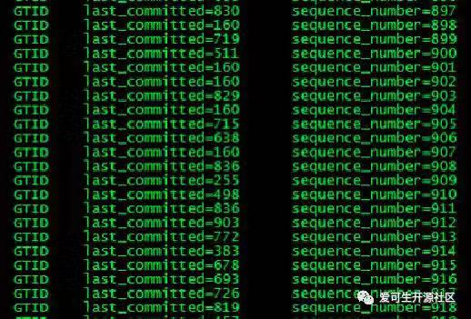
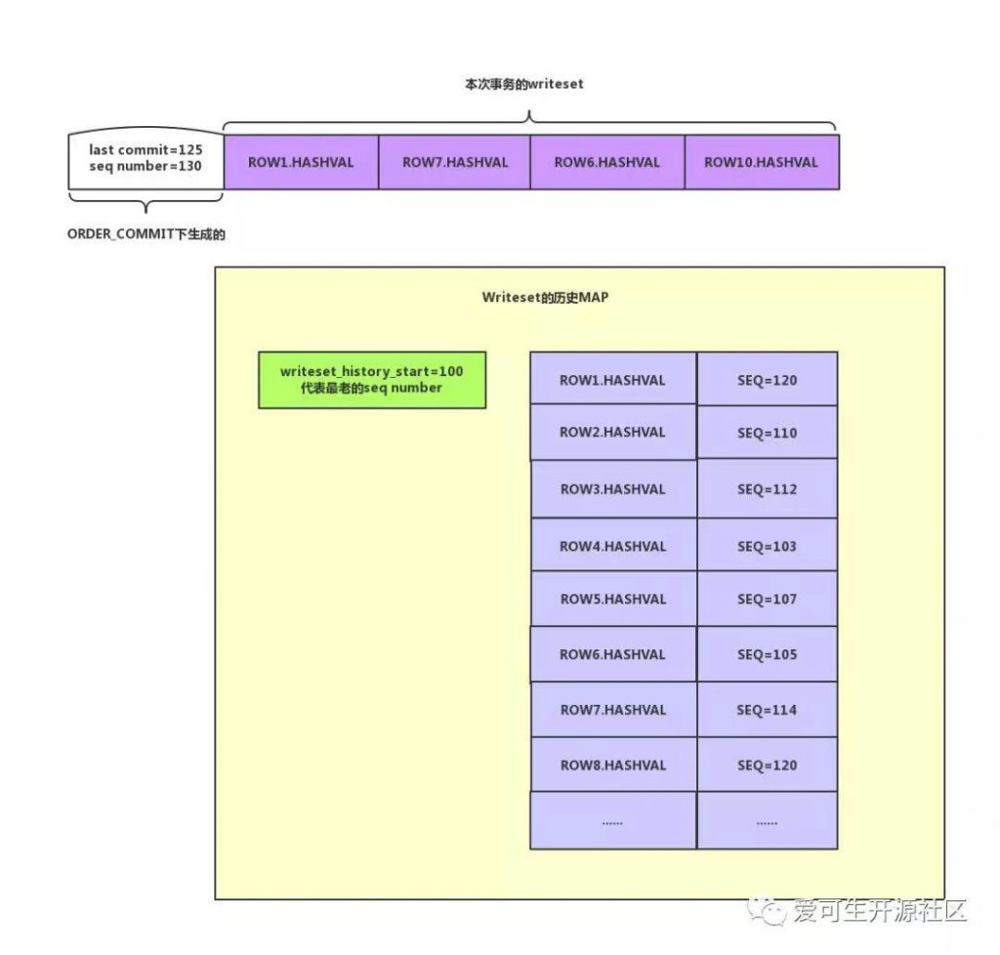
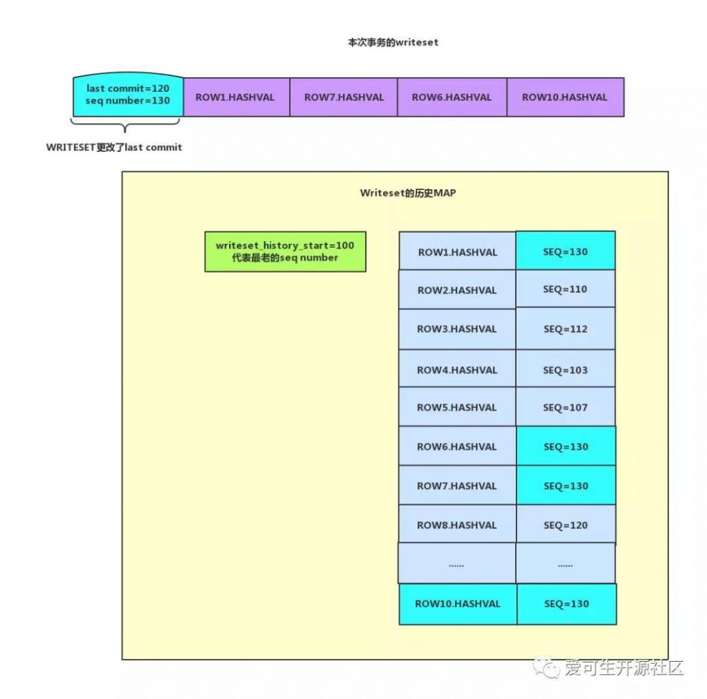

# 社区投稿 | 基于 WRITESET 的并行复制方式

**原文链接**: https://opensource.actionsky.com/20190902-mysql/
**分类**: MySQL 新特性
**发布时间**: 2019-09-02T00:30:12-08:00

---

作者：高鹏 
文章末尾有他著作的《深入理解MySQL主从原理 32讲》，深入透彻理解MySQL主从，GTID相关技术知识。
**本文节选自《深入理解MySQL主从原理》第16节**
注意：本文分为正文和附件两部分，都是图片格式，如果正文有图片不清晰可以将附件的图片保存到本地查看。
**背景**基于 COMMIT_ORDER 的并行复制只有在有压力的情况下才可能会形成一组，压力不大的情况下在从库的并行度并不会高。但是基于 WRITESET 的并行复制目标就是在ORDER_COMMIT 的基础上再尽可能的降低 last commit ，这样在从库获得更好的并行度（即便在主库串行执行的事务在从库也能并行应用）。它使用的方式就是通过扫描 Writeset 中的每一个元素（行数据的 hash 值）在一个叫做 Writeset 的历史 MAP（行数据的 hash 值和 seq number 的一个MAP）中进行比对，寻找是否有冲突的行，然后做相应的处理，后面我们会详细描述这种行为。如果要使用这种方式我们需要在主库设置如下两个参数：- transaction_write_set_extraction=XXHASH64
- binlog_transaction_dependency_tracking=WRITESET
它们是在5.7.22才引入的。
**一、奇怪的 last commit**我们先来看一个截图，仔细观察其中的 last commit：
											
我们可以看到其中的 last commit 看起来是乱序的，这种情况在基于 COMMIT_ORDER 的并行复制方式下是不可能出现的。实际上它就是我们前面说的基于 WRITESET 的并行复制再尽可能降低的 last commit 的结果。这种情况会在 MTS 从库获得更好的并行回放效果，第19节将会详细解释并行判定的标准。
**二、Writeset 是什么**
实际上 Writeset 是一个集合，使用的是 C++ STL 中的 set 容器，在类 Rpl_transaction_write_set_ctx 中包含了如下定义：- `std::set<uint64> write_set_unique;`
集合中的每一个元素都是 hash 值，这个 hash 值和我们的 transaction_write_set_extraction 参数指定的算法有关，其来源就是行数据的主键和唯一键。每行数据包含了两种格式：- 字段值为二进制格式
- 字段值为字符串格式
每行数据的具体格式为：
											
在 Innodb 层修改一行数据之后会将这上面的格式的数据进行 hash 后写入到 Writeset 中。可以参考函数 add_pke ，后面我也会以伪代码的方式给出部分流程。
但是需要注意一个事务的所有的行数据的 hash 值都要写入到一个 Writeset。如果修改的行比较多那么可能需要更多内存来存储这些 hash 值。虽然8字节比较小，但是如果一个事务修改的行很多，那么还是需要消耗较多的内存资源的。为了更直观的观察到这种数据格式，可以使用 debug 的方式获取。下面我们来看一下。
**三、Writeset 的生成**我们使用如下表：- `mysql> use test`
- `Database changed`
- `mysql> show create table jj10 \G`
- `*************************** 1. row ***************************`
- `       Table: jj10`
- `Create Table: CREATE TABLE `jj10` (`
- `  `id1` int(11) DEFAULT NULL,`
- `  `id2` int(11) DEFAULT NULL,`
- `  `id3` int(11) NOT NULL,`
- `  PRIMARY KEY (`id3`),`
- `  UNIQUE KEY `id1` (`id1`),`
- `  KEY `id2` (`id2`)`
- `) ENGINE=InnoDB DEFAULT CHARSET=latin1`
- `1 row in set (0.00 sec)`
我们写入一行数据：
- `insert into jj10 values(36,36,36);`
这一行数据一共会生成4个元素分别为：**注意：****这里显示的?是分隔符**
**1. 主键二进制格式**- `$1 = "PRIMARY?test?4jj10?4\200\000\000$?4"`
- 
- `**注意：\200\000\000$ ：为3个八进制字节和ASCII字符 $，`
- `其转换为16进制就是“0X80 00 00 24 ”**`
分解为：
											
**2. 主键字符串格式：**
- `$2 = "PRIMARY?test?4jj10?436?2"`
分解为：
											
**3. 唯一键二进制格式**
- `$3 = "id1?test?4jj10?4\200\000\000$?4"`
解析同上
**4. 唯一键字符串格式：**- `$4 = "id1?test?4jj10?436?2"`
解析同上最终这些数据会通过hash算法后写入到 Writeset 中。
**四、函数 add_pke 的大概流程**下面是一段伪代码，用来描述这种生成过程：- `如果表中存在索引：`
- `   将数据库名，表名信息写入临时变量`
- `   循环扫描表中每个索引：`
- `        如果不是唯一索引：`
- `             退出本次循环继续循环。`
- `        循环两种生成数据的方式(二进制格式和字符串格式)：`
- `             将索引名字写入到pke中。`
- `             将临时变量信息写入到pke中。`
- `             循环扫描索引中的每一个字段：`
- `                将每一个字段的信息写入到pke中。`
- `                如果字段扫描完成：`
- `                   将pke生成hash值并且写入到写集合中。`
- `    如果没有找到主键或者唯一键记录一个标记，后面通过这个标记来`
- `    判定是否使用Writeset的并行复制方式`
**五、Writeset 设置对 last commit 的处理方式**前一节我们讨论了基于 ORDER_COMMIT 的并行复制是如何生成 last_commit 和 seq number 的。实际上基于 WRITESET 的并行复制方式只是在 ORDER_COMMIT 的基础上对 last_commit 做更进一步处理，并不影响原有的 ORDER_COMMIT 逻辑，因此如果要回退到 ORDER_COMMIT 逻辑非常方便。可以参考 MYSQL_BIN_LOG::write_gtid 函数。根据 binlog_transaction_dependency_tracking 取值的不同会做进一步的处理，如下：- ORDER_COMMIT：调用m_commit_order.get_dependency函数。这是前面我们讨论的方式。
- WRITESET：调用m_commit_order.get_dependency函数，然后调用m_writeset.get_dependency。可以看到m_writeset.get_dependency函数会对原有的last commit做处理。
- WRITESET_SESSION：调用m_commit_order.get_dependency函数，然后调用m_writeset.get_dependency再调用m_writeset_session.get_dependency。m_writeset_session.get_dependency会对last commit再次做处理。
这段描述的代码对应：- `case DEPENDENCY_TRACKING_COMMIT_ORDER:`
- `      m_commit_order.get_dependency(thd, sequence_number, commit_parent);`
- `      break;`
- `case DEPENDENCY_TRACKING_WRITESET:`
- `      m_commit_order.get_dependency(thd, sequence_number, commit_parent);`
- `      m_writeset.get_dependency(thd, sequence_number, commit_parent);`
- `      break;`
- `case DEPENDENCY_TRACKING_WRITESET_SESSION:`
- `      m_commit_order.get_dependency(thd, sequence_number, commit_parent);`
- `      m_writeset.get_dependency(thd, sequence_number, commit_parent);`
- `      m_writeset_session.get_dependency(thd, sequence_number, commit_parent);`
- `      break;`
**六、Writeset 的历史 MAP**我们到这里已经讨论了 Writeset 是什么，也已经说过如果要降低 last commit 的值我们需要通过对事务的 Writeset 和 Writeset 的历史MAP进行比对，看是否冲突才能决定降低为什么值。那么必须在内存中保存一份这样的一个历史 MAP 才行。在源码中使用如下方式定义：- `/*`
- `Track the last transaction sequence number that changed each row`
- `in the database, using row hashes from the writeset as the index.`
- `*/`
- `typedef std::map<uint64,int64> Writeset_history; //map实现`
- `Writeset_history m_writeset_history;`
我们可以看到这是 C++ STL 中的 map 容器，它包含两个元素：- Writeset 的 hash 值
- 最新一次本行数据修改事务的 seq number
它是按照 Writeset 的 hash 值进行排序的。其次内存中还维护一个叫做 m_writeset_history_start 的值，用于记录 Writeset 的历史 MAP 中最早事务的 seq number。如果 Writeset 的历史 MAP 满了就会清理这个历史 MAP 然后将本事务的 seq number 写入 m_writeset_history_start ，作为最早的 seq number 。后面会看到对于事务 last commit 的值的修改总是从这个值开始然后进行比较判断修改的，如果在 Writeset 的历史 MAP 中没有找到冲突那么直接设置 last commit 为这个 m_writeset_history_start 值即可。下面是清理 Writeset 历史 MAP 的代码：- `if (exceeds_capacity || !can_use_writesets)`
- `//Writeset的历史MAP已满`
- `  {`
- `    m_writeset_history_start= sequence_number;`
- `//如果超过最大设置，清空writeset history。从当前seq number 重新记录， 也就是最小的那个事务seq number`
- `    m_writeset_history.clear();`
- `//清空历史MAP`
- `  }`
**七、Writeset 的并行复制对 last commit 的处理流程**这里介绍一下整个处理的过程，假设如下：- 当前通过基于 ORDER_COMMIT 的并行复制方式后，构造出来的是（last commit=125，seq number=130）。
- 本事务修改了4条数据，我分别使用 ROW1/ROW7/ROW6/ROW10代表。
- 表只包含主键没有唯一键，并且我的图中只保留行数据的二进制格式的hash值，而没有包含数据的字符串格式的hash值。
初始化情况如下图（图16-1，高清原图请关注文末课程）：
											
1. 第一步 设置 last commit为writeset_history_start 的值也就是100。
2. 第二步 ROW1.HASHVAL 在 Writeset 历史 MAP 中查找，找到冲突的行ROW1.HASHVAL 将历史 MAP 中这行数据的 seq number 更改为130。同时设置 last commit为120。
3. 第三步 ROW7.HASHVAL 在 Writeset 历史MAP中查找，找到冲突的行 ROW7.HASHVAL 将 Writeset 历史MAP中这行数据的 seq number 更改为130。由于历史 MAP 中对应的 seq number 为114，小于120不做更改。last commit 依旧为120。
4. 第四步 ROW6.HASHVAL 在 Writeset 历史 MAP 中查找，找到冲突的行 ROW6.HASHVAL 将 Writeset 历史 MAP 中这行数据的 seq number 更改为130。由于历史 MAP 中对应的 seq number 为105，小于120不做更改。last commit 依旧为120。
5. 第五步 ROW10.HASHVAL在Writeset 历史 MAP 中查找，没有找到冲突的行，因此需要将这一行插入到 Writeset 历史 MAP 中查找（需要判断是否导致历史 MAP 占满，如果占满则不需要插入，后面随即要清理掉）。即要将 ROW10.HASHVAL 和 seq number=130 插入到 Writeset 历史 MAP 中。
整个过程结束。last commit 由以前的125降低为120，目的达到了。实际上我们可以看出 Writeset 历史 MAP 就相当于保存了一段时间以来修改行的快照，如果保证本次事务修改的数据在这段时间内没有冲突，那么显然是可以在从库并行执行的。last commit 降低后如下图（图16-2，高清原图请关注文末课程）：
											
整个逻辑就在函数 Writeset_trx_dependency_tracker::get_dependency 中，下面是一些关键代码，代码稍多：
- `if (can_use_writesets) //如果能够使用writeset 方式`
- `  {`
- `    /*`
- `     Check if adding this transaction exceeds the capacity of the writeset`
- `     history. If that happens, m_writeset_history will be cleared only after  而 add_pke`
- `     using its information for current transaction.`
- `    */`
- `    exceeds_capacity=`
- `      m_writeset_history.size() + writeset->size() > m_opt_max_history_size;`
- `//如果大于参数binlog_transaction_dependency_history_size设置清理标记`
- `    /*`
- `     Compute the greatest sequence_number among all conflicts and add the`
- `     transaction's row hashes to the history.`
- `    */`
- `    int64 last_parent= m_writeset_history_start;`
- `//临时变量，首先设置为最小的一个seq number`
- `    for (std::set<uint64>::iterator it= writeset->begin(); it != writeset->end(); ++it)`
- `//循环每一个Writeset中的每一个元素`
- `    {`
- `      Writeset_history::iterator hst= m_writeset_history.find(*it);`
- `//是否在writeset history中 已经存在了。map中的元素是 key是writeset 值是sequence number`
- `      if (hst != m_writeset_history.end()) //如果存在`
- `      {`
- `        if (hst->second > last_parent && hst->second < sequence_number)`
- `          last_parent= hst->second;`
- `//如果已经大于了不需要设置`
- `        hst->second= sequence_number;`
- `//更改这行记录的sequence_number`
- `      }`
- `      else`
- `      {`
- `        if (!exceeds_capacity)`
- `          m_writeset_history.insert(std::pair<uint64, int64>(*it, sequence_number));`
- `//没有冲突则插入。`
- `      }`
- `    }`
- 
- `......`
- `    if (!write_set_ctx->get_has_missing_keys())`
- `//如果没有主键和唯一键那么不更改last commit`
- `    {`
- `      /*`
- `       The WRITESET commit_parent then becomes the minimum of largest parent`
- `       found using the hashes of the row touched by the transaction and the`
- `       commit parent calculated with COMMIT_ORDER.`
- `      */；`
- `      commit_parent= std::min(last_parent, commit_parent);`
- `//这里对last commit做更改了。降低他的last commit`
- `    }`
- `  }`
- `    }`
- `  }`
- 
- `  if (exceeds_capacity || !can_use_writesets)`
- `  {`
- `    m_writeset_history_start= sequence_number;`
- `//如果超过最大设置 清空writeset history。从当前sequence 重新记录 也就是最小的那个事务seqnuce number`
- `    m_writeset_history.clear();//清空真个MAP`
- `  }`
**八、WRITESET_SESSION 的方式**前面说过这种方式就是在 WRITESET 的基础上继续处理，实际上它的含义就是同一个 session 的事务不允许在从库并行回放。代码很简单，如下：- `  int64 session_parent= thd->rpl_thd_ctx.dependency_tracker_ctx().`
- `                        get_last_session_sequence_number();`
- `//取本session的上一次事务的seq number`
- `  if (session_parent != 0 && session_parent < sequence_number)`
- `//如果本session已经做过事务并且本次当前的seq number大于上一次的seq number`
- `    commit_parent= std::max(commit_parent, session_parent);`
- `//说明这个session做过多次事务不允许并发，修改为order_commit生成的last commit`
- `  thd->rpl_thd_ctx.dependency_tracker_ctx().`
- `    set_last_session_sequence_number(sequence_number);`
- `//设置session_parent的值为本次seq number的值`
经过这个操作后，我们发现这种情况最后 last commit 恢复成了 ORDER_COMMIT 的方式。
**九、关于 binlog_transaction_dependency_history_size 参数说明**本参数默认值为25000。代表的是我们说的 Writeset 历史 MAP 中元素的个数。如前面分析的 Writeset 生成过程中修改一行数据可能会生成多个 HASH 值，因此这个值还不能完全等待于修改的行数，可以理解为如下：- binlog_transaction_dependency_history_size/2=修改的行数 * （1+唯一键个数）
我们通过前面的分析可以发现如果这个值越大那么在 Writeset 历史 MAP 中能容下的元素也就越多，生成的 last commit 就可能更加精确（更加小），从库并发的效率也就可能越高。但是我们需要注意设置越大相应的内存需求也就越高了。
**十、没有主键的情况**实际上在函数 add_pke 中就会判断是否有主键或者唯一键，如果存在唯一键也是可以。 Writeset 中存储了唯一键的行数据 hash 值。参考函数 add_pke ，下面是判断：- `if (!((table->key_info[key_number].flags & (HA_NOSAME )) == HA_NOSAME))`
- `//跳过非唯一的KEY`
- `        continue;`
如果没有主键或者唯一键那么下面语句将被触发：- `if (writeset_hashes_added == 0)`
- `    ws_ctx->set_has_missing_keys();`
然后我们在生成 last commit 会判断这个设置如下：- `if (!write_set_ctx->get_has_missing_keys())`
- `//如果没有主键和唯一键那么不更改last commit`
- `    {`
- `      /*`
- `       The WRITESET commit_parent then becomes the minimum of largest parent`
- `       found using the hashes of the row touched by the transaction and the`
- `       commit parent calculated with COMMIT_ORDER.`
- `      */；`
- `      commit_parent= std::min(last_parent, commit_parent);//这里对last commit做更改了。降低他的last commit`
- `    }`
- `  }`
因此没有主键可以使用唯一键，如果都没有的话 WRITESET 设置就不会生效回退到老的 ORDER_COMMIT 方式。
**十一、为什么同一个 session 执行的事务也能生成同样的 last commit**有了前面的基础，我们就很容易解释这种现象了。其主要原因就是 Writeset 的历史 MAP 的存在，只要这些事务修改的行没有冲突，也就是主键/唯一键不相同，那么在基于WRITESET的并行复制方式中就可以存在这种现象，但是如果 binlog_transaction_dependency_tracking 设置为 WRITESET_SESSION 则不会出现这种现象。
**写在最后**好了到这里我们明白了基于 WRITESET 的并行复制方式的优点，但是它也有明显的缺点如下：- Writeset 中每个 hash 值都需要和 Writeset 的历史 MAP 进行比较。
- Writeset 需要额外的内存空间。
- Writeset 的历史 MAP 需要额外的内存空间。
如果从库没有延迟，则不需要考虑这种方式，即便有延迟我们也应该先考虑其他方案。第28节我们将会描述有哪些导致延迟的可能。
最后推荐高鹏的专栏《深入理解MySQL主从原理 32讲》，想要透彻了解学习MySQL 主从原理的朋友不容错过。
											
**社区近期动态**
**No.1**
**Mycat 问题免费诊断**
诊断范围支持：
Mycat 的故障诊断、源码分析、性能优化
服务支持渠道：
- 技术交流群，进群后可提问
QQ群（669663113）
- 社区通道，邮件&电话
osc@actionsky.com
- 现场拜访，线下实地，1天免费拜访
关注“爱可生开源社区”公众号，回复关键字“Mycat”，获取活动详情。
**No.2**
**社区技术内容征稿**
征稿内容：
- 格式：.md/.doc/.txt
- 主题：MySQL、分布式中间件DBLE、数据传输组件DTLE相关技术内容
- 要求：原创且未发布过
- 奖励：作者署名；200元京东E卡+社区周边
投稿方式：
- 邮箱：osc@actionsky.com
- 格式：[投稿]姓名+文章标题
- 以附件形式发送，正文需注明姓名、手机号、微信号，以便小编及时联系