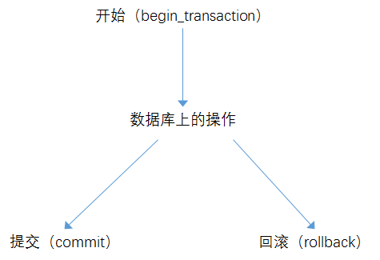
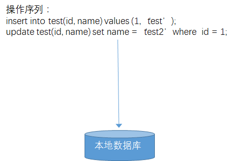
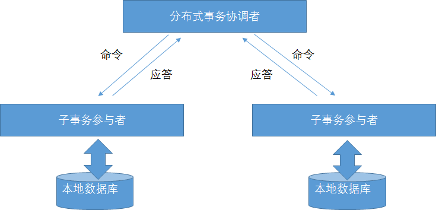
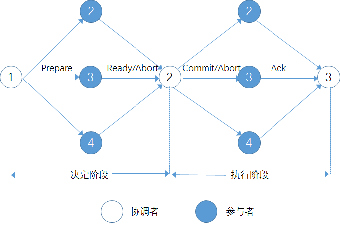
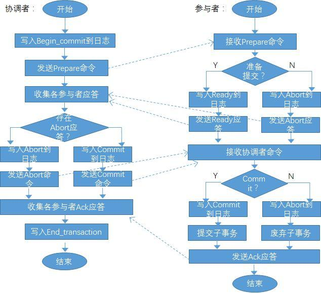

# 社区投稿 | 谈谈分布式事务基础概念

**原文链接**: https://opensource.actionsky.com/20190402-tr/
**分类**: 技术干货
**发布时间**: 2019-04-02T00:00:50-08:00

---

**作者简介**
苏仕祥，浩鲸科技PaaS组件团队成员，长期从事分库分表中间件的相关解决方案工作，热爱技术，乐于分享。
# 
**1 前言**
知道数据库的同学肯定都知道事务的概念，事务指的是一系列数据库操作，它是保证数据库正确性的基本逻辑单元，拥有ACID四个特性：原子性、一致性、隔离性与持久性。在分布式数据库系统中，分布式事务继承了传统事务的定义，但也因为自身的分布式特性而有其独特特点。
**本文将由浅入深，先从介绍传统单机事务开始，然后继续介绍分布式事务的概念、特性以及常用的分布式事务协议，最后谈谈自己对分布式事务的一些想法。**
希望通过阅读本文，让大家对分布式事务有个基本的认知。
**2 事务的基本概念**
在谈分布式事务之前，我们先来说说传统的单机数据库中的事务概念吧，包括事务的定义以及事务的特性。
**2.1 事务的定义**
经常听人说，学会数据库的增删改查，就能够解决业务系统中百分之六七十的问题了。这里说的增删改查，对应的就是数据库的数据存取操作，这些操作对于数据库来说，就是事务了。
关于事务，先来说说概念性的东西：我们将对数据库的单个或多个操作序列的执行定义为事务，这些操作要么全做，要么全不做，是一个不可分割的工作单位。举个例子，下面这两种组成情况都叫做事务：
- 
**由单个操作序列（一条SQL语句）组成的事务**
`select * from test``;`
- 
**由多个操作序列（SQL语句）组成的事务**
```select * from test where id = 1;`
`update test(id, name) set name = 'john' where id = 1`;
当然，如果我们没有显式声明事务的话，数据库则会给我们自动地划分事务，对于MySQL来说，没有显式声明事务，则一条SQL语句就是一个事务，执行完便会自动提交。
一个事务由开始标识(begin_transaction)、数据库操作和结束标识(commit或rollback)三部分组成。如下图所示：

（事务的基本模型）
关于上图的相关说明如下：
- 
事务开始：begin_transaction，说明事务的开始；
- 
数据库上的操作：表现为一条或多条SQL语句；
- 
事务提交：commit_transaction，提交事务操作，操作生效；
- 
事务回滚：rollback_transaction，事务取消，操作废弃。
## 
**2.2 事务的特性**
事务是对数据库的一系列操作，是保证数据库正确性的基本逻辑单元，这句话就决定了事务必须具备ACID四个特性，才能保证数据库的正确性。下面我们简要说明下ACID四个特性的基本概念：
- 
**原子性**
事务的原子性主要体现在事务中包含的操作要么全部完成，要么全部放弃，不存在中间状态，即一部分操作成功，一部分操作失败的状态。
- 
**一致性**
事务的一致性是指事务的执行结果必须使数据库从一种一致性状态变化到另一种一致性状态，而不会停留在某种中间状态上。也就是说无论事务执行前还是执行后，数据库状态均为一致性状态，处于这种状态的数据库才被认为是正确的。由此可见，事务的一致性与原子性是密切相关的。

（事务的一致性）
- 
**隔离性**
当多个事务的操作交叉执行时，若不加控制，一个事务的操作及其所使用的数据可能会对其他事务造成影响。事务的隔离性是指：一个事务的执行既不能被其他事务所干扰，同时也不能干扰其他事务。具体来讲，一个没有结束的事务在提交之前不允许将其结果暴露给其他事务，这是因为未提交的事务有可能在以后的执行中回滚，因此，当前结果不一定是最终结果，而是一个无效的数据，不允许其他事务使用这种无效数据。
- 
**持久性**
事务的持久性体现在当一个事物提交后，系统保证该事务的结果不会因以后的故障而丢失，也就是说，事务一旦提交，它对数据库的更改将是永久性的。
上述即为事务的四个特性，ACID这四条特性起到了保证事务操作的正确性、维护数据库的一致性及完整性的作用。
**3 分布式事务**
讲完了事务的基本概念，我们正式开始谈谈分布式事务。
分布式事务与单机事务一样都是由一组操作序列组成，不同的是单机事务只是在单机上执行，而分布式事务则是在多台机器上执行。下面我们将介绍分布式事务的定义、分布式事务的提交协议（2PC、3PC）以及我对分布式事务的一些看法。
**3.1 分布式事务的定义**
我们都知道事务是由一系列操作序列组成，对于单机事务，所有的这些操作序列都是在单机上面执行的，
如下图所示：

（单机事务）
而对于分布式数据库系统，事务的一系列操作序列会被拆分为子操作序列，然后在多台机器上执行，如下图所示：

（分布式事务）
在分布式数据库中的事务即被称为分布式事务，也叫全局事务，被拆分为在各个机器上执行的子操作序列，称为子事务。
分布式事务同样具有ACID四个特性，但是因为分布式数据库的分布特性，使其又有一些不同。例如，为了保证分布式事务的原子性，必须保证组成该全局事务的所有子事务要么全部提交，要么全部回滚，不允许出现有些场地上的子事务提交，而有些场地上的子事务回滚。
因此，在分布式事务执行的过程中，要比单机事务复杂的多，因为分布式事务除了要保证各个子事务的ACID特性外，还需要对这些子事务进行协调，决定各个子事务的提交与回滚，以保证全局事务的ACID特性。另外，在分布式事务中，还涉及大量的网络通信，需要考虑到网络的影响。
通过上文，相信大家应该对分布式事务有了一些概念上的了解，下面我们将介绍分布式事务的提交协议。
**3.2 分布式事务的提交协议**
对于分布式事务来讲，全局事务的正确执行依赖各个子事务的正确执行。只有当各个局部操作都正确执行后，全局事务才可以提交，当发生异常要回滚全局事务时，所有局部操作也应回滚。因此，所有子事务均正确提交是分布式事务提交的前提。为实现分布式事务的提交，普遍采用两阶段提交协议（2 Phase Commit），简称2PC协议。
我们已经知道分布式事务在执行时会被分解为多个场地上的子事务来执行。为协调各个场地上的子事务的执行，我们需要一个协调者，而各个子事务的具体执行，需要本地的参与者来完成。为进一步理解两阶段提交协议，我们先了解下协调者与参与者这两个概念：
- 
**协调者**：协调各个子事务的执行，负责决定所有子事务的提交或回滚；
- 
**参与者**：负责各个子事务的提交与回滚，并向协调者提出子事务的提交或回滚意向。
协调者与参与者的关系如下图所示：

（协调者与参与者的关系）
**协调者和每个参与者均拥有一个本地日志文件，用来记录各自的执行过程**。无论是协调者还是参与者，他们在进行操作前都必须将该操作记录到相应的日志文件中，以用来进行事务故障恢复。
**协调者可以向各个参与者发送命令**，使各个参与者在协调者的领导下执行命令，各个**参与者也可以将自身的命令执行状态以应答的形式反馈给协调者**，由协调者收集并分析这些应答以决定下一步的操作。
- 
### 3.2.1 两阶段提交协议的基本思想
两阶段提交协议是为了实现分布式事务提交而采用的协议。其基本思想是把全局事务的提交分为如下两个阶段：
- 
决定阶段：由协调者向各个参与者发出“预提交”（Prepare）命令，然后等待应答，若所有的参与者返回“准备提交”（Ready）应答，则该事务满足提交条件。如果至少有一个子事务返回“准备废弃”（Abort）应答，则该事务不能提交；
- 
执行阶段：在事务具备提交条件的情况下，协调者向各个参与者发出“提交”（Commit）命令，各个参与者执行提交；否则，协调者向各个参与者发出“废弃”（Abort）命令，各个参与者执行回滚，放弃对数据库的修改。无论是“提交”还是“废弃”，各参与者执行完毕后都需要向协调者返回“确认”（ACK）应答，通知协调者事务执行结束。
两阶段提交协议的基本思想可以用下图表示：

（两阶段提交协议示意图）
### 
- 
### 3.2.2 两阶段提交协议的基本流程
说完了两阶段提交协议的基本思想，我们来具体看看两阶段提交协议的基本流程。
两阶段提交协议的基本流程如下图所示：

（两阶段提交协议的基本流程）
关于上图的步骤说明如下：
- 
协调者在征求各参与者的意见之前，首先要在它的日志文件中写入一条“开始提交”（Begin_commit）的记录。然后，协调者向所有参与者发送“预提交”（Prepare）命令，此时协调者进入等待状态，等待收集各参与者的应答；
- 
各个参与者接收到“预提交”（Prepare）命令后，根据情况判断其是否已经准备好提交子事务。若可以提交，则在参与者日志文件中写入一条“准备提交”（Ready）的记录，并将“准备提交”（Ready）的应答发送给协调者，否则，在参与者的日志文件中写入一条“准备废弃”（Abort）的记录，并将“准备废弃”（Abort）的应答发送给协调者。发送应答后，参与者将进入等待状态，等待协调者所做出的最终决定；
- 
协调者收集各参与者发来的应答，判断是否存在某个参与者发来“准备废弃”的应答，若存在，则采取两阶段提交协议的“一票否决制”，在其日志文件中写入一条“决定废弃”（Abort）的记录，并发送“全局废弃”（Abort）命令给各个参与者，否则，在其日志中写入一条“决定提交”（Commit）的记录，向所有参与者发送“全局提交”（Commit）命令。此时，协调者再次进入等待状态，等待收集各参与者的确认信息；
- 
各个参与者接收到协调者发来的命令后，判断该命令类型，若为“全局提交”命令，则在其日志文件中写入一条“提交”（Commit）的记录，并对子事务实施提交，否则，参与者在其日志文件中写入一条“废弃”（Abort）的记录，并对子事务实施废弃。实施完毕后，各个参与者要向协调者发送确认信息（Ack）；
- 
当协调者接收到所有参与者发送的确认信息后，在其日志文件中写入“事务结束”（End_transaction）记录，全局事务终止。
**3.3 对分布式事务的一点思考**
## 
上文对分布式事务的基本概念及常用的分布式提交协议（2PC）进行了一些说明，下面谈谈我对分布式事务的一些看法。
关于两阶段提交协议，若参与者收到了协调者发送的“提交”命令时，说明其他参与者均已向协调者发送了“准备提交”的应答，则参与者可以提交其子事务，但是**两阶段提交协议有一点不足**，就是如果协调者故障或者网络故障，导致参与者不能及时收到协调者发送的“提交”命令时，那么参与者将处于等待状态，直到获得所需要的信息后才可以做出决定。
在故障恢复前，参与者的行为将始终停留不前，子事务所占用的系统资源也不能被释放，这时我们称事务进入了阻塞状态，阻塞状态会降低系统的可靠性与可用性。
因为两阶段提交协议的上述缺点，所以三阶段提交协议（3PC）被提出，三阶段提交协议在一定程度上解决了两阶段提交协议中的阻塞问题，这是因为当协调者故障或是网络故障时，参与者长时间未收到协调者的命令，参与者可以通过启动恢复处理过程，不必进入等待状态而可以独立的做出决定。
**三阶段提交协议虽然可以在一定程度上解决两阶段提交协议中的阻塞问题，但因为流程逻辑复杂，代码编写难度太高，也很难用于实际应用。**
同时，为了保证分布式数据库的正确性，除了需要分布式事务的提交协议，我们还需要分布式事务的恢复策略，在发生故障的时候对事务进行恢复，在分布式数据库系统中，除了会出现单机数据库中的故障外，还会出现网络故障、参与者故障这些分布式数据库系统中特有的故障，针对每种故障发生的情况，都需要有特定的恢复策略，可见分布式事务的恢复更是一个复杂的问题。
从个人看来，我认为完美的实现分布式事务是一件颇具挑战的事情，这可能也是目前很多产品都明确表示不建议开启分布式事务的原因吧。
**4 结语**
本文主要讨论了数据库系统中事务相关的一些概念与知识，包括单机事务与分布式事务以及个人对于分布式事务的一些看法。
最后，本人能力有限，文中有不正确的地方还望大家能够指出，同时也希望本文能对大家有所帮助。
**参考资料**
> 
《分布式数据库系统》.于戈 申德荣.机械工业出版社.2016年1月第2版
精选系列
**| MySQL分布式中间件使用指南**
[DBLE系列公开课第一课 DBLE概述](http://mp.weixin.qq.com/s?__biz=MzU2NzgwMTg0MA==&#038;mid=2247483982&#038;idx=2&#038;sn=db357b92832b370fff641ec9df096de0&#038;chksm=fc96e0d1cbe169c7361a72827412d1e7a9be2edbc4795f0b20641f72a396436eb26ec4d69bd6&#038;scene=21#wechat_redirect)
[DBLE系列公开课第二课 DBLE的配置及使用](http://mp.weixin.qq.com/s?__biz=MzU2NzgwMTg0MA==&#038;mid=2247484037&#038;idx=1&#038;sn=31f412ea48c0d39a4a037c6f8a067a93&#038;chksm=fc96e01acbe1690cc392af460459f888c7afdb8965e5d7b1d6ff8a37b4e8f2fcf8aea34fd31a&#038;scene=21#wechat_redirect)
[DBLE系列公开课第三课 DBLE的管理端口](http://mp.weixin.qq.com/s?__biz=MzU2NzgwMTg0MA==&#038;mid=2247484097&#038;idx=1&#038;sn=0bc93b692a54ae95b9946ac094217472&#038;chksm=fc96e05ecbe16948936bdd1928b51d0225dbfd0e1b33c7238a7554dcb3f386467bd497f23e65&#038;scene=21#wechat_redirect)
[DBLE系列公开课第四课 DBLE的分布式特性](http://mp.weixin.qq.com/s?__biz=MzU2NzgwMTg0MA==&#038;mid=2247484154&#038;idx=1&#038;sn=fb400602e9582130ce80f6f69287d24b&#038;chksm=fc96e065cbe169731a336bae875ef912bab8fafb4718af98f2fb56a51f82e8aab6881fffe41c&#038;scene=21#wechat_redirect)
[MyCat的坑如何在分布式中间件DBLE上改善](http://mp.weixin.qq.com/s?__biz=MzU2NzgwMTg0MA==&#038;mid=2247484080&#038;idx=1&#038;sn=db508378b9f5b232754bdf3baccb8b80&#038;chksm=fc96e02fcbe16939b226c990302b0ef4a2af561fc26aaae43c8b55fac6fcf9f2431d0436b6ea&#038;scene=21#wechat_redirect)
**| DBLE 快速入门**
[深度分析 | MyCat与DBLE的对比性能调](http://mp.weixin.qq.com/s?__biz=MzU2NzgwMTg0MA==&#038;mid=2247483939&#038;idx=1&#038;sn=9fae6eb26565b4de2c6c01b778369254&#038;chksm=fc96e0bccbe169aa9d38cbe4cb137137425d81982f3901b611a1621f002b4f0e543a0d87b5a4&#038;scene=21#wechat_redirect)优
[开源分布式中间件 DBLE 快速入门指南](http://mp.weixin.qq.com/s?__biz=MzU2NzgwMTg0MA==&#038;mid=2247483801&#038;idx=1&#038;sn=850eb0b8837ffaa904fd952c8d64895a&#038;chksm=fc96e306cbe16a101513930d388011dbfdcc6aba2347fc6c5954c57425e5a55257b8fb4f8c0e&#038;scene=21#wechat_redirect)
[DBLE Server.xml 配置解析](http://mp.weixin.qq.com/s?__biz=MzU2NzgwMTg0MA==&#038;mid=2247483905&#038;idx=1&#038;sn=45cb37beb33876f28a4cd9a72b3558e6&#038;chksm=fc96e09ecbe169884356ea61a211ba355f27474ba8bd6954468835605a12dfc22d79ffab713b&#038;scene=21#wechat_redirect)
[DBLE Schema.xml 配置解析](http://mp.weixin.qq.com/s?__biz=MzU2NzgwMTg0MA==&#038;mid=2247483828&#038;idx=1&#038;sn=279340398ab44106bea22db6a2d1aff7&#038;chksm=fc96e32bcbe16a3dfb9c5b4970f101c4ec006757c7d21d9f3800d9fe264fb793c3e610dfdfa4&#038;scene=21#wechat_redirect)
[DBLE rule.xml 配置解析](http://mp.weixin.qq.com/s?__biz=MzU2NzgwMTg0MA==&#038;mid=2247483873&#038;idx=1&#038;sn=5a9c314bc4f31c9d279158c5cd04672f&#038;chksm=fc96e37ecbe16a68753b5dd6b668189ff320027ef342826dd9513be1e6b1f3794611355e499d&#038;scene=21#wechat_redirect)
**| MySQL深度分析**
[GDB定位MySQL5.7特定版本hang死的故障分析#92108](http://mp.weixin.qq.com/s?__biz=MzU2NzgwMTg0MA==&#038;mid=2247484150&#038;idx=1&#038;sn=538f034b76c792383e08be8f2a80c272&#038;chksm=fc96e069cbe1697fb7695e57de65abf3be59a10735258c983e532b3ea15df5f93bf79410eeaa&#038;scene=21#wechat_redirect)
[MGR相同GTID产生不同transaction故障分析](http://mp.weixin.qq.com/s?__biz=MzU2NzgwMTg0MA==&#038;mid=2247484085&#038;idx=1&#038;sn=b4ac557d8dafaba7bb04caec9d9a9040&#038;chksm=fc96e02acbe1693c0563d837853be0bbfae6909c5eafdac3181f12216a888785000e8061ff0e&#038;scene=21#wechat_redirect)
[基于Xtrabackup及可传输表空间实现多源数据恢复](http://mp.weixin.qq.com/s?__biz=MzU2NzgwMTg0MA==&#038;mid=2247483969&#038;idx=1&#038;sn=1d75cd926a9bd78fb03cb316dbee70cb&#038;chksm=fc96e0decbe169c80b194a73edeed79bc735ee9484580b4cbe04389c537402e0ea16accfbe0f&#038;scene=21#wechat_redirect)

> 
**开源分布式中间件DBLE**
社区官网：https://opensource.actionsky.com/
GitHub主页：https://github.com/actiontech/dble
技术交流群：669663113
> 
**开源数据传输中间件DTLE**
社区官网：https://opensource.actionsky.com/
GitHub主页：https://github.com/actiontech/dtle
技术交流群：852990221


**喜欢点****“****分享”，不行就****“****好看”**

**多喝热水，重启试试**