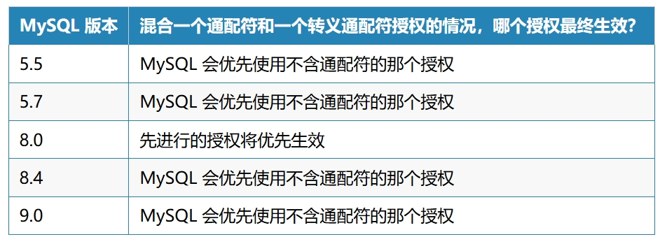
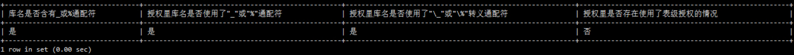

# 紧急避坑 | MySQL 含有下划线的数据库名在特殊情况下导致权限丢失

**原文链接**: https://opensource.actionsky.com/%e7%b4%a7%e6%80%a5%e9%81%bf%e5%9d%91-mysql-%e5%90%ab%e6%9c%89%e4%b8%8b%e5%88%92%e7%ba%bf%e7%9a%84%e6%95%b0%e6%8d%ae%e5%ba%93%e5%90%8d%e5%9c%a8%e7%89%b9%e6%ae%8a%e6%83%85%e5%86%b5%e4%b8%8b%e5%af%bc/
**分类**: MySQL 新特性
**发布时间**: 2024-09-24T18:36:20-08:00

---

在 MySQL 的授权操作中，通配符 &#8220;_&#8221; 和 &#8220;%&#8221; 用于匹配单个或多个字符的数据库对象名。然而，许多 DBA 在进行授权时可能忽视了这些通配符的特殊作用，导致数据库权限错配。这篇文章将讨论通配符误用所带来的潜在风险，并提供避免此类问题的解决方案。
> 作者：芬达， 【芬达的数据库学习笔记】公众号作者，开源爱好者，擅长 MySQL、ansible。
爱可生开源社区出品，原创内容未经授权不得随意使用，转载请联系小编并注明来源。
本文约 3300 字，预计阅读需要 12 分钟。
在 MySQL 的授权操作中，通配符 &#8220;_&#8221; 和 &#8220;%&#8221; 用于匹配单个或多个字符的数据库对象名。然而，许多 DBA 在进行授权时可能忽视了这些通配符的特殊作用，导致数据库权限错配。这篇文章将讨论通配符误用所带来的潜在风险，并提供避免此类问题的解决方案。
## 误用通配符导致权限授予错误
在授权数据库权限时，如果数据库名中含有下划线 `_`，可能会引发意想不到的结果。我们来看一个常见的授权语句：
`GRANT ALL ON `db_1`.* test_user;
`
表面上看，这个语句似乎是授予用户 `test_user` 对数据库 `db_1` 的全部权限。然而，通配符 `_` 在 MySQL 中具有特殊含义，它用于匹配任意单个字符。因此，这条授权语句实际上可能会匹配多个数据库，而不仅仅是 `db_1`。例如，以下数据库名都可能被匹配：
- **数据库名匹配数字**：`db01`，`db11`，`db21`，…，`db91`
- **数据库名匹配英文字符**：`dba1`，`dbb1`
- **数据库名匹配特殊字符**：`db-1`，`db+1`，`db?1`，等等
这种误操作可能导致某些用户意外获得了不该有的权限，从而带来严重的安全隐患。实际上，按照常见的数据库命名规范，数据库名中的字符通常是 26 个英文小写字母或 10 个数字，也包括 2 种特殊字符(中划线或下划线)。因此，这个授权错误可能将权限的应用范围扩大到 38 倍之多。这是基于对命名模式的分析得出的估算，具体情况可能因实际使用的命名规则而有所不同。
## 授权带来的隐患
当库名中有多个 &#8220;_&#8221; 时，情况更为复杂。假设数据库名称是 `db_1_1`，那么授权就不仅是扩大到 38 倍，而是 38 * 38 = *1444 倍*，权限扩大的规模超出想象。如果这些库中有不应该公开的敏感数据，安全性风险将非常严重。
## 如何避免这个问题？
**正确的做法：转义通配符**
为了避免这种授权滥用的风险，我们应该将通配符作为普通字符来处理。MySQL 支持使用反斜杠（`\`）对通配符进行转义，例如：
`GRANT ALL ON `db\_1`.* TO 'test_user';
`
通过这种方式，`_` 将被解释为字面量，而不是通配符，从而确保授权的仅是特定的 `db_1` 数据库。
> 接下来，文章会多次提到“**通配符（_）**”和“**转义通配符（\_）**”这两个术语，理解它们的区别有助于避免常见授权错误。
**阿里云 DMS 等连接工具的优势**
值得注意的是，在使用阿里云 DMS 授权时，系统底层会自动将通配符进行转义，这也就是为什么很多 DBA 并没有意识到自己授权时遇到的潜在风险。阿里云的这种机制为用户省去了手动转义的烦恼，保证了授权的准确性。
> 然而，阿里云允许你绕过 DMS，底层手动授权，所以本篇文章内容依然适用于使用阿里云的 DBA。
## 整改过程中的风险
在你意识到这个问题后，可能会急于对现有授权进行整改，但需要注意两种场景：
- **遗漏整改**： 部分库可能没有彻底整改，仍然使用了通配符授权
- **保留通配符功能**： 有些场景下，你希望保留部分通配符授权
**在这两种场景下，会碰到我这篇文章要讲的正餐 —— 含有下划线的数据库名在特殊情况下会有权限丢失的坑。**
## 模拟场景：遗漏整改导致权限丢失
现在我们来模拟一个场景，展示如何由于遗漏整改而导致权限问题的发生。
假设在权限整改过程中，你不需要保留通配符的授权，于是你对几百个数据库的授权进行了整改，但你还是遗漏了其中一个数据库，我认为这类情况很有可能发生。该数据库名为 `app_db`，其授权如下：
`GRANT SELECT, INSERT, UPDATE, DELETE ON `app_db`.* TO `app_user`@`%`;
`
然后，随着业务的扩展，你意识到应用程序需要自动维护分区表的能力，因此你希望新增 *CREATE*、*DROP*、*ALTER* 权限。因为你的授权平台已经经过改造，可以正确地对通配符进行转义，所以新的授权语句如下：
`GRANT CREATE, DROP, ALTER ON `app\_db`.* TO `app_user`@`%`;
`
之后，`app_user` 的授权状态如下：
`mysql> show grants for app_user;
+----------------------------------------------------------------------+
| Grants for app_user@%                                                |
+----------------------------------------------------------------------+
| GRANT USAGE ON *.* TO `app_user`@`%`                                 |
| GRANT CREATE, DROP, ALTER ON `app\_db`.* TO `app_user`@`%`           |
| GRANT SELECT, INSERT, UPDATE, DELETE ON `app_db`.* TO `app_user`@`%` |
+----------------------------------------------------------------------+
3 rows in set (0.01 sec)
`
于是，产生了一种，通配符（`_`）和转义通配符（`\_`）混合使用的场景。
表面上看，两个授权并没有合并到一条语句，但根据我们前面学到的知识，不难理解，这两个授权是希望表达：
- `app_user` 拥有对 `app_db` 的 *CREATE*、*DROP*、*ALTER* 权限。
- `app_user` 也拥有对 `app_db` 本身及其他符合通配符匹配的数据库的 *SELECT*、*INSERT*、*UPDATE*、*DELETE* 权限。
表面看似一切正常，但实际上在操作中却发现了问题。
### 权限测试
我们来实际测试一下授权效果：
`ERROR 1142 (42000): SELECT command denied to user 'app_user'@'127.0.0.1' for table 't'
mysql> insert into `app_db`.t values (1);
ERROR 1142 (42000): INSERT command denied to user 'app_user'@'127.0.0.1' for table 't'
mysql> update `app_db`.t set a=1;
ERROR 1142 (42000): UPDATE command denied to user 'app_user'@'127.0.0.1' for table 't'
mysql> delete from `app_db`.t;
ERROR 1142 (42000): DELETE command denied to user 'app_user'@'127.0.0.1' for table 't'
mysql> create table `app_db`.t2(a int);
Query OK, 0 rows affected (0.01 sec)
mysql> alter table `app_db`.t2 engine=innodb;
Query OK, 0 rows affected (0.02 sec)
Records: 0  Duplicates: 0  Warnings: 0
mysql> drop table `app_db`.t2;
Query OK, 0 rows affected (0.01 sec)
`
尽管新增的 *CREATE*、*DROP*、*ALTER* 权限生效了，但原来的 *SELECT*、*INSERT*、*UPDATE* 和 *DELETE* 权限却全部丢失了！
### 解释与分析
**这显然会在生产环境中引发严重问题。**
那么这是一个 MySQL 的 Bug 吗？
最初，我也认为这可能是个 S2 级别的 Bug，并向官方提交了[报告](https://bugs.mysql.com/bug.php?id=116161)。
但深入调查后发现，这实际上是 MySQL 授权机制的一个已知行为，而不是 Bug。根据[官方文档](https://dev.mysql.com/doc/refman/8.4/en/grant.html)：
*The use of the wildcard characters `%` and `_` as described in the next few paragraphs is deprecated, and thus subject to removal in a future version of MySQL.*
*【翻译】重要提示： 接下来几段中描述的使用通配符 `%` 和 `_` 的方式已被弃用，因此在未来的 MySQL 版本中可能会被移除。*
这意味着 MySQL 未来会彻底废弃通配符在授权中的使用。更进一步的，官方文档提到：
*Issuing multiple `GRANT` statements containing wildcards may not have the expected effect on DML statements; when resolving grants involving wildcards, MySQL takes only the first matching grant into consideration. In other words, if a user has two database-level grants using wildcards that match the same database, the grant which was created first is applied. Consider the database `db` and table `t` created using the statements shown here:*
*【懒人版翻译】当多个授权中涉及通配符时，MySQL 只会考虑第一个匹配的授权。*
### 我的案例
**我遇到的情况与官方文档中描述的多个通配符授权略有不同。**
官方文档提到，当涉及多个通配符授权时，MySQL 只会应用第一个匹配的授权，后续的通配符授权将不会生效。然而，在我的案例中，情况有所不同：我只使用了一个通配符授权，之后又添加了一个经过正确转义的授权。结果是，MySQL 仅识别并应用了转义后的授权，而原本的通配符授权则被忽略。
这表明，MySQL 在处理通配符和转义字符时存在文档不完善的情况。尽管官方文档中提到通配符授权的局限性，但并未具体说明在混合使用通配符和转义后的授权时，通配符授权可能会被转义后的授权所取代。这种情况下，开发者容易误认为这是一种 Bug，而实际上是 MySQL 授权机制的已知行为。
### 更进一步测试
上述是基于 MySQL 5.7 测试的结论:
- **单一授权生效**：测试和官方文档一致，MySQL 只会匹配并生效其中一条授权，不会同时应用两条授权。—— **这是我的案例里踩到的陷阱**。
- **优先级问题**：当通配符授权和转义通配符授权混合使用时，MySQL 优先应用不含通配符的授权。
然而，在 MySQL 8.0 的测试中，结果又有所不同：哪个授权生效取决于 `mysql.db` 的加载顺序，先进行的授权将优先生效。
为更清楚说明这一问题，我在多个 MySQL 版本中进行了进一步测试，结论如下表所示：


**关于通配符还有一些奇怪的“例外”设置。**
*In privilege assignments, MySQL interprets occurrences of unescaped `_` and `%` SQL wildcard characters in database names as literal characters under these circumstances:*
- *When a database name is not used to grant privileges at the database level, but as a qualifier for granting privileges to some other object such as a table or routine (for example, `GRANT ... ON db_name.tbl_name`).*
- *Enabling partialrevokes causes MySQL to interpret unescaped `*`and`%`wildcard characters in database names as literal characters, just as if they had been escaped as`_`and`\%`. Because this changes how MySQL interprets privileges, it may be advisable to avoid unescaped wildcard characters in privilege assignments for installations where partial_revokes may be enabled. For more information, see Section 8.2.12, “Privilege Restriction Using Partial Revokes”.
换句话说，如果库名中的 `_` 未转义，它会被解释为通配符；但是库名只是用作表名（表级授权场景）、函数、存储过程的限定符时，库名里的 `_` 就不再是通配符，而是字面量。

此外，如果你启用了 MySQL 的部分撤销授权参数 `partial_revokes`，数据库名中的 `_` 不需要转义，它会被直接解释为字面量。

一会儿是字面量，一会儿又是通配符，难怪官方打算放弃这个功能，连他们自己可能都被搞晕了。通配符的设定确实让人难以理解
## 隐患排查
我们应该和官方一样，放弃使用通配符授权，使用正确的转义授权。排查所有使用了 `_` 或 `%` 通配符的情况，统一整改为 `\_` 或 `\%`。
以下 SQL 脚本由 AI 生成，请测试和谨慎使用。
`SELECT
-- 库名是否含有 _ 或 % 通配符
CASE
WHEN EXISTS (
SELECT 1
FROM information_schema.schemata
WHERE INSTR(schema_name, '_') > 0 OR INSTR(schema_name, '%') > 0
) THEN '是'
ELSE '否'
END AS '库名是否含有_或%通配符',
-- 授权里库名是否使用了 "_" 或 "%" 通配符
CASE
WHEN EXISTS (
SELECT 1
FROM mysql.db
WHERE (INSTR(Db, '_') > 0 OR INSTR(Db, '%') > 0)
AND (INSTR(Db, '\\_') = 0 AND INSTR(Db, '\\%') = 0)
) THEN '是'
ELSE '否'
END AS '授权里库名是否使用了"_"或"%"通配符',
-- 授权里库名是否使用了 "\_" 或 "\%" 转义通配符
CASE
WHEN EXISTS (
SELECT 1
FROM mysql.db
WHERE INSTR(Db, '\\_') > 0 OR INSTR(Db, '\\%') > 0
) THEN '是'
ELSE '否'
END AS '授权里库名是否使用了"\\_"或"\\%"转义通配符',
-- 授权里是否存在使用了表级授权的情况（排除指定的两条记录）
CASE
WHEN EXISTS (
SELECT 1
FROM mysql.tables_priv
WHERE NOT (
(Host = 'localhost' AND Db = 'mysql' AND User = 'mysql.session' AND Table_name = 'user')
OR
(Host = 'localhost' AND Db = 'sys' AND User = 'mysql.sys' AND Table_name = 'sys_config')
)
) THEN '是'
ELSE '否'
END AS '授权里是否存在使用了表级授权的情况';
`

## 如何规避
- 不要使用通配符授权，多数人不知道这个是通配符，用错了，要转义！
- 不要使用通配符授权，这是官方打算放弃的功能。
- 如果仍然需要使用通配符授权，不要混合使用，包括不要混合使用转义通配符授权，不要混合使用多个通配符授权。
- 如果仍然需要使用通配符授权，仍然打算混合使用，要考虑清楚我文章里的测试结论，测试清楚，例如我的案例里，我可以保留通配符授权情况下，这样授权。
```
mysql> SHOW GRANTS FOR app_user;
+-----------------------------------------------------------------------------------------------------+
| Grants for app_user@%                                                                               |
+-----------------------------------------------------------------------------------------------------+
| GRANT USAGE ON *.* TO `app_user`@`%`                                                                |
| GRANT SELECT, INSERT, UPDATE, DELETE, CREATE, DROP, ALTER ON `app\_db`.* TO `app_user`@`%`          |
| GRANT SELECT, INSERT, UPDATE, DELETE ON `app_db`.* TO `app_user`@`%`                                |
+-----------------------------------------------------------------------------------------------------+
3 rows in set (0.01 sec)
```