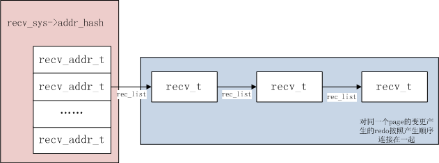

# MySQL · 引擎特性 · InnoDB 崩溃恢复过程

**Date:** 2015/06
**Source:** http://mysql.taobao.org/monthly/2015/06/01/
**Images:** 2 images downloaded

---

数据库内核月报

 [
 # 数据库内核月报 － 2015 / 06
 ](/monthly/2015/06)

 * 当期文章

 MySQL · 引擎特性 · InnoDB 崩溃恢复过程
* MySQL · 捉虫动态 · 唯一键约束失效
* MySQL · 捉虫动态 · ALTER IGNORE TABLE导致主备不一致
* MySQL · 答疑解惑 · MySQL Sort 分页
* MySQL · 答疑解惑 · binlog event 中的 error code
* PgSQL · 功能分析 · Listen/Notify 功能
* MySQL · 捉虫动态 · 任性的 normal shutdown
* PgSQL · 追根究底 · WAL日志空间的意外增长
* MySQL · 社区动态 · MariaDB Role 体系
* MySQL · TokuDB · TokuDB数据文件大小计算

 ## MySQL · 引擎特性 · InnoDB 崩溃恢复过程 
 Author: 印风 

 在前面两期月报中，我们详细介绍了 InnoDB redo log 和 undo log 的相关知识，本文将介绍 InnoDB 在崩溃恢复时的主要流程。

本文代码分析基于 MySQL 5.7.7-RC 版本，函数入口为 `innobase_start_or_create_for_mysql`，这是一个非常冗长的函数，本文只涉及和崩溃恢复相关的代码。

在阅读本文前，强烈建议翻阅我们之前的两期月报：

1. MySQL · 引擎特性 · InnoDB undo log 漫游
2. MySQL · 引擎特性 · InnoDB redo log漫游

## 初始化崩溃恢复

首先初始化崩溃恢复所需要的内存对象：

` recv_sys_create();
 recv_sys_init(buf_pool_get_curr_size());
`

当InnoDB正常shutdown，在flush redo log 和脏页后，会做一次完全同步的checkpoint，并将checkpoint的LSN写到ibdata的第一个page中（`fil_write_flushed_lsn`）。

在重启实例时，会打开系统表空间ibdata，并读取存储在其中的LSN：

` err = srv_sys_space.open_or_create(
 false, &sum_of_new_sizes, &flushed_lsn);
`

上述调用将从ibdata中读取的LSN存储到变量flushed_lsn中，表示上次shutdown时的checkpoint点，在后面做崩溃恢复时会用到。另外这里也会将double write buffer内存储的page载入到内存中(`buf_dblwr_init_or_load_pages`)，如果ibdata的第一个page损坏了，就从dblwr中恢复出来。

 Tips：注意在MySQL 5.6.16之前的版本中，如果InnoDB的表空间第一个page损坏了，就认为无法确定这个表空间的space id，也就无法决定使用dblwr中的哪个page来进行恢复，InnoDB将崩溃恢复失败(bug#70087)，
由于每个数据页上都存储着表空间id，因此后面将这里的逻辑修改成往后多读几个page，并尝试不同的page size，直到找到一个完好的数据页， (参考函数`Datafile::find_space_id()`)。因此为了能安全的使用double write buffer保护数据，建议使用5.6.16及之后的MySQL版本。

## 恢复truncate操作

为了保证对 undo log 独立表空间和用户独立表空间进行 truncate 操作的原子性，InnoDB 采用文件日志的方式为每个 truncate 操作创建一个独特的文件，如果在重启时这个文件存在，说明上次 truncate 操作还没完成实例就崩溃了，在重启时，我们需要继续完成truncate操作。

这一块的崩溃恢复是独立于redo log系统之外的。

对于 undo log 表空间恢复，在初始化 undo 子系统时完成：

`err = srv_undo_tablespaces_init(
 create_new_db,
 srv_undo_tablespaces,
 &srv_undo_tablespaces_open);
`

对于用户表空间，扫描数据目录，找到 truncate 日志文件：如果文件中没有任何数据，表示truncate还没开始；如果文件中已经写了一个MAGIC NUM，表示truncate操作已经完成了；这两种情况都不需要处理。

`err = TruncateLogParser::scan_and_parse(srv_log_group_home_dir);
`

但对用户表空间truncate操作的恢复是redo log apply完成后才进行的，这主要是因为恢复truncate可能涉及到系统表的更新操作（例如重建索引），需要在redo apply完成后才能进行。

## 进入redo崩溃恢复开始逻辑

入口函数：

`err = recv_recovery_from_checkpoint_start(flushed_lsn);
`

传递的参数flushed_lsn即为从ibdata第一个page读取的LSN，主要包含以下几步：

**Step 1**: 为每个buffer pool instance创建一棵红黑树，指向`buffer_pool_t::flush_rbt`，主要用于加速插入flush list (`buf_flush_init_flush_rbt`)；
**Step 2**: 读取存储在第一个redo log文件头的CHECKPOINT LSN，并根据该LSN定位到redo日志文件中对应的位置，从该checkpoint点开始扫描。

在这里会调用三次`recv_group_scan_log_recs`扫描redo log文件：

**1. 第一次的目的是找到MLOG_CHECKPOINT日志**

MLOG_CHECKPOINT 日志中记录了CHECKPOINT LSN，当该日志中记录的LSN和日志头中记录的CHECKPOINT LSN相同时，表示找到了符合的MLOG_CHECKPOINT LSN，将扫描到的LSN号记录到 `recv_sys->mlog_checkpoint_lsn` 中。(在5.6版本里没有这一次扫描)

MLOG_CHECKPOINT在[WL#7142](http://dev.mysql.com/worklog/task/?id=7142)中被引入，其目的是为了简化 InnoDB 崩溃恢复的逻辑，根据WL#7142的描述，包含几点改进：

1. 避免崩溃恢复时读取每个ibd的第一个page来确认其space id;
2. 无需检查$datadir/*.isl，新的日志类型记录了文件全路径，并消除了isl文件和实际ibd目录的不一致可能带来的问题;
3. 自动忽略那些还没有导入到InnoDB的ibd文件（例如在执行IMPORT TABLESPACE时crash）;
4. 引入了新的日志类型MLOG_FILE_DELETE来跟踪ibd文件的删除操作。

这里可能会产生的问题是，如果MLOG_CHECKPOINT日志和文件头记录的CHECKPOINT LSN差距太远的话，在第一次扫描时可能花费大量的时间做无谓的解析，感觉这里还有优化的空间。

在我的测试实例中，由于崩溃时施加的负载比较大，MLOG_CHECKPOINT和CHECKPOINT点的LSN相差约1G的redo log。

**2. 第二次扫描，再次从checkpoint点开始重复扫描，存储日志对象**

日志解析后的对象类型为`recv_t`，包含日志类型、长度、数据、开始和结束LSN。日志对象的存储使用hash结构，根据 space id 和 page no 计算hash值，相同页上的变更作为链表节点链在一起，大概结构可以表示为：

扫描的过程中，会基于MLOG_FILE_NAME 和MLOG_FILE_DELETE 这样的redo日志记录来构建`recv_spaces`，存储space id到文件信息的映射（`fil_name_parse` –> `fil_name_process`），这些文件可能需要进行崩溃恢复。（实际上第一次扫描时，也会向`recv_spaces`中插入数据，但只到MLOG_CHECKPOINT日志记录为止）

 Tips：在一次checkpoint后第一次修改某个表的数据时，总是先写一条MLOG_FILE_NAME 日志记录；通过该类型的日志可以跟踪一次CHECKPOINT后修改过的表空间，避免打开全部表。
在第二次扫描时，总会判断将要修改的表空间是否在`recv_spaces`中，如果不存在，则认为产生列严重的错误，拒绝启动（`recv_parse_or_apply_log_rec_body`）

默认情况下，Redo log以一批64KB（RECV_SCAN_SIZE）为单位读入到`log_sys->buf`中，然后调用函数`recv_scan_log_recs`处理日志块。这里会判断到日志块的有效性：是否是完整写入的、日志块checksum是否正确， 另外也会根据一些标记位来做判断：

* 在每次写入redo log时，总会将写入的起始block头的flush bit设置为true，表示一次写入的起始位置，因此在重启扫描日志时，也会根据flush bit来推进扫描的LSN点；
* 每次写redo时，还会在每个block上记录下一个checkpoint no（每次做checkpoint都会递增），由于日志文件是循环使用的，因此需要根据checkpoint no判断是否读到了老旧的redo日志。

对于合法的日志，会拷贝到缓冲区`recv_sys->buf`中，调用函数`recv_parse_log_recs`解析日志记录。 这里会根据不同的日志类型分别进行处理，并尝试进行apply，堆栈为：

`recv_parse_log_recs
 --> recv_parse_log_rec
 --> recv_parse_or_apply_log_rec_body
`

如果想理解InnoDB如何基于不同的日志类型进行崩溃恢复的，非常有必要细读函数`recv_parse_or_apply_log_rec_body`，这里是redo日志apply的入口。

例如如果解析到的日志类型为MLOG_UNDO_HDR_CREATE，就会从日志中解析出事务ID，为其重建undo log头（`trx_undo_parse_page_header`）；如果是一条插入操作标识（MLOG_REC_INSERT 或者 MLOG_COMP_REC_INSERT），就需要从中解析出索引信息（`mlog_parse_index`）和记录信息（`page_cur_parse_insert_rec`）；或者解析一条IN-PLACE UPDATE (MLOG_REC_UPDATE_IN_PLACE)日志，则调用函数`btr_cur_parse_update_in_place`。

第二次扫描只会应用MLOG_FILE_*类型的日志，记录到`recv_spaces`中，对于其他类型的日志在解析后存储到哈希对象里。然后调用函数`recv_init_crash_recovery_spaces`对涉及的表空间进行初始化处理：

* 首先会打印两条我们非常熟悉的日志信息：

 ` [Note] InnoDB: Database was not shutdown normally!
 [Note] InnoDB: Starting crash recovery.
`
* 如果`recv_spaces`中的表空间未被删除，且ibd文件存在时，则表明这是个普通的文件操作，将该table space加入到`fil_system->named_spaces`链表上（`fil_names_dirty`），后续可能会对这些表做redo apply操作；
* 对于已经被删除的表空间，我们可以忽略日志apply，将对应表的space id在`recv_sys->addr_hash`上的记录项设置为RECV_DISCARDED;
* 调用函数`buf_dblwr_process()`，该函数会检查所有记录在double write buffer中的page，其对应的数据文件页是否完好，如果损坏了，则直接从dblwr中恢复;
* 最后创建一个临时的后台线程，线程函数为`recv_writer_thread`，这个线程和page cleaner线程配合使用，它会去通知page cleaner线程去flush崩溃恢复产生的脏页，直到`recv_sys`中存储的redo记录都被应用完成并彻底释放掉(`recv_sys->heap == NULL`)

**3. 如果第二次扫描hash表空间不足，无法全部存储到hash表中，则发起第三次扫描，清空hash，重新从checkpoint点开始扫描。**

hash对象的空间最大一般为buffer pool size - 512个page大小。

第三次扫描不会尝试一起全部存储到hash里，而是一旦发现hash不够了，就立刻apply redo日志。但是…如果总的日志需要存储的hash空间略大于可用的最大空间，那么一次额外的扫描开销还是非常明显的。

**简而言之，第一次扫描找到正确的MLOG_CHECKPOINT位置；第二次扫描解析 redo 日志并存储到hash中；如果hash空间不够用，则再来一轮重新开始，解析一批，应用一批。**

三次扫描后，hash中通常还有redo日志没有被应用掉。这个留在后面来做，随后将`recv_sys->apply_log_recs` 设置为true，并从函数`recv_recovery_from_checkpoint_start`返回。

对于正常shutdown的场景，一次checkpoint完成后是不记录MLOG_CHECKPOINT日志的，如果扫描过程中没有找到对应的日志，那就认为上次是正常shutdown的，不用考虑崩溃恢复了。

 Tips：偶尔我们会看到日志中报类似这样的信息：
“The log sequence number xxx in the system tablespace does not match the log sequence number xxxx in the ib_logfiles!”
从内部逻辑来看是因为ibdata中记录的lsn和iblogfile中记录的checkpoint lsn不一致，但系统又判定无需崩溃恢复时会报这样的错。单纯从InnoDB实例来看是可能的，因为做checkpint 和更新ibdata不是原子的操作，这样的日志信息一般我们也是可以忽略的。

## 初始化事务子系统（trx_sys_init_at_db_start）

这里会涉及到读入undo相关的系统页数据，在崩溃恢复状态下，所有的page都要先进行日志apply后，才能被调用者使用，例如如下堆栈：

`trx_sys_init_at_db_start
 --> trx_sysf_get -->
 ....->buf_page_io_complete --> recv_recover_page
`
因此在初始化回滚段的时候，我们通过读入回滚段页并进行redo log apply，就可以将回滚段信息恢复到一致的状态，从而能够 “复活”在系统崩溃时活跃的事务，维护到读写事务链表中。对于处于prepare状态的事务，我们后续需要做额外处理。

关于事务如何从崩溃恢复中复活，参阅4月份的月报 “[MySQL · 引擎特性 · InnoDB undo log 漫游](http://mysql.taobao.org/monthly/2015/05/01/)“最后一节。

## 应用redo日志(`recv_apply_hashed_log_recs`)

根据之前搜集到`recv_sys->addr_hash`中的日志记录，依次将page读入内存，并对每个page进行崩溃恢复操作（`recv_recover_page_func`）：

* 已经被删除的表空间，直接跳过其对应的日志记录；
* 在读入需要恢复的文件页时，会主动尝试采用预读的方式多读点page (`recv_read_in_area`)，搜集最多连续32个（RECV_READ_AHEAD_AREA）需要做恢复的page no，然后发送异步读请求。 page 读入buffer pool时，会主动做崩溃恢复逻辑；
* 只有LSN大于数据页上LSN的日志才会被apply; 忽略被truncate的表的redo日志；
* 在恢复数据页的过程中不产生新的redo 日志；
* 在完成修复page后，需要将脏页加入到buffer pool的flush list上；由于innodb需要保证flush list的有序性，而崩溃恢复过程中修改page的LSN是基于redo 的LSN而不是全局的LSN，无法保证有序性；InnoDB另外维护了一颗红黑树来维持有序性，每次插入到flush list前，查找红黑树找到合适的插入位置，然后加入到flush list上。（`buf_flush_recv_note_modification`）

## 完成崩溃恢复(`recv_recovery_from_checkpoint_finish`)

在完成所有redo日志apply后，基本的崩溃恢复也完成了，此时可以释放资源，等待recv writer线程退出 (崩溃恢复产生的脏页已经被清理掉)，释放红黑树，回滚所有数据词典操作产生的非prepare状态的事务 (`trx_rollback_or_clean_recovered`)

### 无效数据清理及事务回滚：

调用函数`recv_recovery_rollback_active`完成下述工作：

* 删除临时创建的索引，例如在DDL创建索引时crash时的残留临时索引(`row_merge_drop_temp_indexes()`)；
* 清理InnoDB临时表 (`row_mysql_drop_temp_tables`)；
* 清理全文索引的无效的辅助表(`fts_drop_orphaned_tables()`)；
* 创建后台线程，线程函数为`trx_rollback_or_clean_all_recovered`，和在`recv_recovery_from_checkpoint_finish`中的调用不同，该后台线程会回滚所有不处于prepare状态的事务。

至此InnoDB层的崩溃恢复算是告一段落，只剩下处于prepare状态的事务还有待处理，而这一部分需要和Server层的binlog联合来进行崩溃恢复。

## Binlog/InnoDB XA Recover

回到Server层，在初始化完了各个存储引擎后，如果binlog打开了，我们就可以通过binlog来进行XA恢复:

* 首先扫描最后一个binlog文件，找到其中所有的XID事件，并将其中的XID记录到一个hash结构中（`MYSQL_BIN_LOG::recover`）；
* 然后对每个引擎调用接口函数`xarecover_handlerton`, 拿到每个事务引擎中处于prepare状态的事务xid，如果这个xid存在于binlog中，则提交；否则回滚事务。

很显然，如果我们弱化配置的持久性(`innodb_flush_log_at_trx_commit != 1` 或者 `sync_binlog != 1`)， 宕机可能导致两种丢数据的场景：

1. 引擎层提交了，但binlog没写入，备库丢事务；
2. 引擎层没有prepare，但binlog写入了，主库丢事务。

即使我们将参数设置成`innodb_flush_log_at_trx_commit =1` 和 `sync_binlog = 1`，也还会面临这样一种情况：主库crash时还有binlog没传递到备库，如果我们直接提升备库为主库，同样会导致主备不一致，老主库必须根据新主库重做，才能恢复到一致的状态。针对这种场景，我们可以通过开启semisync的方式来解决，一种可行的方案描述如下：

1. 设置双1强持久化配置;
2. 我们将semisync的超时时间设到极大值，同时使用semisync AFTER_SYNC模式，即用户线程在写入binlog后，引擎层提交前等待备库ACK；
3. 基于步骤1的配置，我们可以保证在主库crash时，所有老主库比备库多出来的事务都处于prepare状态；
4. 备库完全apply日志后，记下其执行到的relay log对应的位点，然后将备库提升为新主库；
5. 将老主库的最后一个binlog进行截断，截断的位点即为步骤3记录的位点;
6. 启动老主库，那些已经传递到备库的事务都会提交掉，未传递到备库的binlog都会回滚掉。

 阅读： - 

本作品采用[知识共享署名-非商业性使用-相同方式共享 3.0 未本地化版本许可协议](http://creativecommons.org/licenses/by-nc-sa/3.0/)进行许可。

 