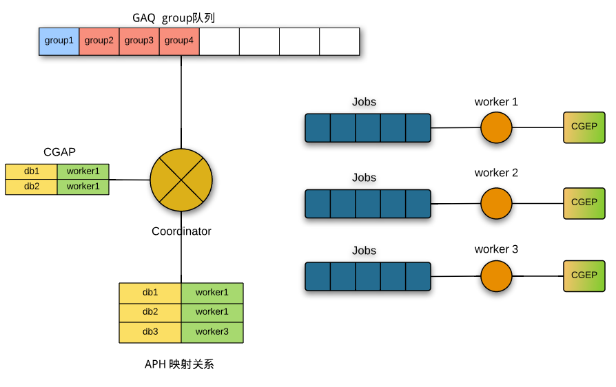
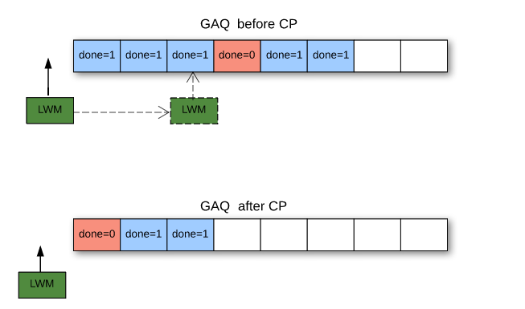

# MySQL · 功能分析 · 5.6 并行复制实现分析

**Date:** 2015/08
**Source:** http://mysql.taobao.org/monthly/2015/08/09/
**Images:** 4 images downloaded

---

数据库内核月报

 [
 # 数据库内核月报 － 2015 / 08
 ](/monthly/2015/08)

 * 当期文章

 MySQL · 社区动态 · InnoDB Page Compression
* PgSQL · 答疑解惑 · RDS中的PostgreSQL备库延迟原因分析
* MySQL · 社区动态 · MySQL5.6.26 Release Note解读
* PgSQL · 捉虫动态 · 执行大SQL语句提示无效的内存申请大小
* MySQL · 社区动态 · MariaDB InnoDB表空间碎片整理
* PgSQL · 答疑解惑 · 归档进程cp命令的core文件追查
* MySQL · 答疑解惑 · open file limits
* MySQL · TokuDB · 疯狂的 filenum++
* MySQL · 功能分析 · 5.6 并行复制实现分析
* MySQL · 功能分析 · MySQL表定义缓存

 ## MySQL · 功能分析 · 5.6 并行复制实现分析 
 Author: 襄洛 

 ## 背景
我们知道MySQL的主备同步是通过binlog在备库重放进行的，IO线程把主库binlog拉过去存入relaylog，然后SQL线程重放 relaylog 中的event，然而这种模式有一个问题就是SQL线程只有一个，在主库压力大的时候，备库单个SQL线程是跑不过主库的多个用户线程的，这样备库延迟是不可避免的。为了解决这种n对1造成的备库延迟问题，5.6 引入了并行复制机制，即SQL线程在执行的时候可以并发跑。

关于其背后的设计思想，可以参考这几个worklog [WL#4648](http://dev.mysql.com/worklog/task/?id=4648)，[WL#5563](http://dev.mysql.com/worklog/task/?id=5563)，[WL#5569](http://dev.mysql.com/worklog/task/?id=5569)，[WL#5754](http://dev.mysql.com/worklog/task/?id=5754)，[WL#5599](http://dev.mysql.com/worklog/task/?id=5599)，之前的月报也对并行复制原理进程了阐述，读者朋友可以[回顾下](http://mysql.taobao.org/index.php?title=MySQL%E5%86%85%E6%A0%B8%E6%9C%88%E6%8A%A5_2015.01#MySQL_.C2.B7_.E4.BC.98.E5.8C.96.E6.94.B9.E8.BF.9B.C2.B7_.E5.A4.8D.E5.88.B6.E6.80.A7.E8.83.BD.E6.94.B9.E8.BF.9B.E8.BF.87.E7.A8.8B)。

本篇将从代码实现角度讲述并行复制是如何做的，分析基于MySQL 5.6.26。

## 准备知识

### binlog
binlog 是对数据库更改操作的记录，里面是一个个的event，如类似下面的event序列：

`Query_log
Table_map
Write/Delete/Update_row_event
Xid
`

关于每个event的含义可以参考[官方文档](https://dev.mysql.com/doc/internals/en/binlog-event.html)。

### 配置
并行复制提供了几个参数配置，可以通过修改参数值对其进行调节。

`slave_parallel_workers // worker 线程个数
slave-checkpoint-group // 隔多少个事务做一次 checkpoint
slave-checkpoint-period // 隔多长时间做一次 checkpoint
slave-pending-jobs-size-max // 分发给worker的、处于等待状态的event的大小上限
`

### 概念术语

下面是并行复制中用到几个概念：

`MTS // Multi-Threaded Slave，并行复制
group // 一个事务在binlog中对应的一组event序列
worker // 简称W，event 执行线程，MTS新引入的
Coordinator // 简称C，分发协作线程，就是之前的 SQL线程
checkpoint // 简称CP，检查点，C线程在满足一定条件下去做，目的是收集W线程执行完信息，向前推动执行位点
B-event // 标志事务开始的event，BEGIN 这种Query或者GTID
G-event // 包含分发信息的event，如Table_map、Query
T-event // 标志事务结束的event，COMMIT/ROLLBACK 这种Query 或者XID
`

### 相关代码文件

sql/rpl_rli_pdb.h // pdb的是 parallelized by db name简写[WL#5563](http://dev.mysql.com/worklog/task/?id=5563)
sql/rpl_rli_pdb.cc
sql/rpl_slave.cc
sql/log_event.cc
sql/rpl_rli.h

### 并行执行原则

1. 并行执行的基本模型是生产者-消费者，C线程将event按db插入各W线程的任务队列，W线程从队列里取出event执行；
2. 同一个group(事务)内的event都发给同一个worker，保证事务的一致性；
3. 分发关系由包含db信息的event(G-evnet)决定，其它event按决定好的关系进行分发；

## 重要数据结构

1. `db_worker_hash_entry`，db->worker 映射关系，也即分发关系，所有的分发关系缓存在C的一个HASH表中(APH)

 ` - db // db 名
 - worker // 指向worker的指针，表示被分发到的W线程
 - usage // 有多少正在分发的group用到这个关系
 - temporary_tables // 用于在C和W之前传递临时表
`
2. `slave_job_item`，worker的jobs队列的成员

 ` - data // 就是一个binlog event
`
3. `circular_buffer_queue`，用DYNAMIC_ARRAY arrary实现的一个首尾相连的环形队列，是其他重要数据结构的基类

 ` - Q // 底层用到的 DYNAMIC_ARRAY
 - size // Queue 的容量
 - avail // 队列尾
 - entry // 队列头
 - len // 队列实际大小
 - de_queue() // 出队操作
 - de_tail() // 尾部出队
 - en_queue() // 入队
 - head_queue() // 取队列头，但是不出队
`
4. `Slave_job_group`，维护一个正在执行的事务的信息，如对应的位点信息、事务分发到的worker、有没有执行完等。

 ` - group_master_log_name // 对应主库的 binlog 文件名
 - group_master_log_pos // 对应在主库 binlog 中的位置
 - group_relay_log_name // 对应备库 relaylog 文件名
 - group_relay_log_pos // 对应在备库 relaylog 中的位置
 - worker_id // 对应的worker的id
 - worker // worker 指针
 - total_seqno // 当前group是启动以来执行的第几个group
 - master_log_pos // group中B-event的位置
 - checkpoint_seqno // 当前group是从上次做完CP后的第几个group
 - checkpoint_log_pos // worker收到checkpoint信号后更新
 - checkpoint_log_name // 同上
 - checkpoint_relay_log_pos // 同上
 - checkpoint_relay_log_name // 同上
 - done // 这个group是否已经被worker commit掉
 - shifted // checkpoint 的时候shift值
 - ts // 时间，更新SBM
 - reset() // 重置上面的成员变量
`
5. `Slave_committed_queue`，维护分发执行的group信息，是`circular_buffer_queue`的子类，队列里存的时 `Slave_job_group`

 ` - lwm // 类型是Slave_job_group，低水位(Low-Water-Mark)，表示上次CP执行到的位置
 - last_done // 类型是一个DYNAMIC_ARRAY，里面存的是Slave_job_group:total_seqno，表示每个worker执行到第几个group
 - assigned_group_index // 正在分发的group在GAQ中的位置
 - move_queue_head() // 做checkpoint时，把已经commit的group移出队列
 - get_job_group() // 返回队列指定位置的Slave_job_group
 - en_queue() // 入队一个 Slave_job_group
`
6. `Slave_jobs_queue`，任务队列，也是`circular_buffer_queue`的子类，队列里存的是`slave_job_item`，每个worker有一个这样的任务队列

 ` - overfill // 队列满标志
 - waited_overfill // 队列满的次数
`
7. `Slave_worker`，对应一个worker，`Relay_log_info` 的子类

 ` - jobs // 类型是 Slave_jobs_queue，C分发过来的event都放在这里面
 - c_rli // 指向C的指针
 - curr_group_exec_parts // 类型是 DYNAMIC_ARRAY，里面存的是当前group用到的分发关系，是指向APH成员的指针，简写CGEP
 - curr_group_seen_begin // 当前所在 group 有没有解析到 B-event
 - id // worker 的id标识
 - last_group_done_index // worker上一次执行的group在GAQ中的位置
 - gaq_index // worker 当前执行的的事务在GAQ中的位置
 - usage_partition // worker用到的分发关系个数
 - end_group_sets_max_dbs // 和串行执行相关的
 - bitmap_shifted // CP后bitmap需要偏移的距离，用于调整 group_executed
 - wq_overrun_cnt // 超载多少
 - overrun_level // 超载指标
 - underrun_level // 饥饿指标
 - excess_cnt // 用于往mts_wq_excess_cnt累计
 - group_executed // 类型是 MY_BITMAP，标示CP后执行的group
 - group_shifted // 类型是 MY_BITMAP，计算group_executed，临时用作中间变量
 - running_status // 标识 worker 线程的状态，可以有 NOT_RUNNING、RUNNING、ERROR_LEAVING、KILLED
 - slave_worker_ends_group () // 当一个group执行完或者异常终止时会调用
 - commit_positions() // group执行完是调用，用于更新位点和bitmap
 - rollback_positions() // 回滚bitmap
`
8. `Relay_log_info`，对应C线程，在MTS之前对应SQL线程，为了支持并行复制，在原来的基础上又加了一些成员

 ` - mapping_db_to_worker // 非常重要的成员，类型是HASH，用于缓存所有的分发关系，APH（Assigned Partition Hash），目的能通过db快速找到映射关系，但HASH长度大于mts_partition_hash_soft_max（固定16）时，会对没有使用的映射关系进行回收。
 - workers // 类型是 DYNAMIC_ARRAY，成员是一个个Slave_worker
 - pending_jobs // 一个统计信息，表示待执行job个数
 - mts_slave_worker_queue_len_max // 每个worker最多能容纳jobs的个数，目前hard code是16384
 - mts_pending_jobs_size // 所有worker的job占的内存
 - mts_pending_jobs_size_max // 所有worker的job占的内存，对应配置 slave_pending_jobs_size_max
 - mts_wq_oversize // 标示job占用内存已达上限
 - gaq // 非常重要的成员，代码注释里经常提到的GAQ，类型是Slave_committed_queue，存的成员是Slave_job_group，大小对应配置 slave-checkpoint-group，用于W和C交互
 - curr_group_assigned_parts // 类型是 DYNAMIC_ARRAY，当前group中已经分配的event的映射关系，可以和Slave_worker的curr_group_exec_parts对应，简写CGAP
 - curr_group_da // 类型是DYNAMIC_ARRAY，对于还无法决定分发worker的event，先存在这里
 - mts_wq_underrun_w_id // 标识比较空闲的worker的id
 - mts_wq_excess_cnt // 标示worker的超载情况
 - mts_worker_underrun_level // 当W的任务队列大小低于这个值的认为处于饥饿状态
 - mts_coordinator_basic_nap // 当work负载较大时，C线程sleep，会用到这个值
 - opt_slave_parallel_workers // 对应配置 slave_parallel_workers
 - slave_parallel_workers // 当前实际的worker数
 - exit_counter // 退出时用
 - max_updated_index // 退出时用
 - checkpoint_seqno // 上次CP后分发的group个数
 - checkpoint_group // 对应配置 mts_checkpoint_group
 - recovery_groups // 类型是 MY_BITMAP，恢复时用到
 - mts_group_status // 分发线程所处的状态，取值为 MTS_NOT_IN_GROUP、MTS_IN_GROUP、MTS_END_GROUP、MTS_KILLED_GROUP
 - mts_events_assigned // 分发的event计数
 - mts_groups_assigned // 分发的group计数
 - least_occupied_workers // 类型是 DYNAMIC_ARRAY，从注释将worker按从空闲到繁忙排序的一个数组，用于先worker用，但是实际并未用到。 
 - last_clock // 上次做checkpoint的时间
`
9. 其它方法

 ` map_db_to_worker() // 把db映射给worker
 get_least_occupied_worker() // 获取负载最小的worker
 wait_for_workers_to_finish() // 等待worker完成，并发临时转成串行是用到
 append_item_to_jobs() // 把任务分发给 worker
 mts_move_temp_table_to_entry() // 用于传递临时表
 mts_move_temp_tables_to_thd() // 同上
`

## 初始化

和单线程SQL相比，MTS需要初始化新加的MTS变量和启动worker线程。

主要是`slave_start_workers()`这个函数。会初始化C线程的MTS变量，如workers、curr_group_assigned_parts、curr_group_da、gaq等，接着调用`init_hash_workers()` 初始化HASH表mapping_db_to_worker，在这些做完后依次调用 `slave_start_single_worker()` 初始化每个worker并启动W线程。worker 的的初始化包括jobs任务队列、curr_group_exec_parts 等相关变量，其中jobs长度目前是固定的16384，目前还不可配置；worker线程的主函数是`handle_slave_worker()`，不停的调用`slave_worker_exec_job()`来执行C分配的event。

## Coordinator 分发协作

分发线程主体和之前的SQL线程基本是一样的，不停的调用 `exec_relay_log_event()` 函数。`exec_relay_log_event()`主要分2部分，一是调用`next_event()`读取relay log，一是`apply_event_and_update_pos()` 做分发。

`next_event()` 比较简单，就是不停的用 `Log_event::read_log_event()` 从relay log 读取event，除此之外还会调用`mts_checkpoint_routine()` 做checkpoint，后面会详细讲checkpiont过程。

`apply_event_and_update_pos()`进行分发的入口是`Log_event::apply_event()`，如果没有开MTS，就是原来的逻辑，SQL线程直接执行event，如果开了MTS的话，调用`get_slave_worker()`，这个是分发的主逻辑。

在介绍分发逻辑前，先将所有的binlog event 可以分下类（代码里是这么分的）:

`B-event // BEGIN(Query) 或者 GTID
G-event // 包含db信息的event，Table_map 或者 Query
P-event // 一般放在G-event前的，如int_var、rand、user_var等
R-event // 一般放在G-event后的，如各种Rows event
T-event // COMMIT/ROLLBACK(Query) 或者XID
`

分发逻辑是这样的:

1. 如果是B-event，表明是事务的开始，mts_groups_assigned 计数加1，同时GAQ中入队一个新的group，表示一个新的事务开始，然后把event放入curr_group_da，因为B-event没有db信息，还不知道分发给哪个worker;
2. 如果是G-event，event里包含db信息，就需要按这个db找到一个分发到的worker，worker选择机制是`map_db_to_worker()`实现。调用`map_db_to_worker()`时，有2个参数比较重要，一个是dbname，这个就是分发关系的key，一个是last_worker，表示当前group中event上一次分发到的worker(last_assigned_worker)；
 * 在当前group已经用到的映射关系(curr_group_assigned_parts CGAP)中找，如果有同db的映射关系，就直接返回last_worker；如果找不到，就去APH中按db名搜索；
* 如果APH中搜到的话，分3种情况，a) 这个映射关系没有group用到，就直接把db映射为last_worker，如果last_worker为空的主话，就找一个最空闲的worker，`get_least_occupied_worker()` b) 这个映射关系有group用，并且对应的worker和last_worker一样，就用last_worker，映射关系引用计数加1 c) 如果映射关系对应的worker和last_worker不一样，这表示有冲突，就需要等到引用这个映射关系的group全部执行完，然后把db映射为last_worker；
* 如果没搜到的话，就新生成一个映射关系，key用db，value用last_worker，如果last_worker为空的话，选最空闲的worker，`get_least_occupied_worker()`，并把新生成的映射插入到APH中，如果HASP表长度大于 mts_partition_hash_soft_max 的话，在插入前会对APH做一次收缩，从中去除掉没有被group引用的映射关系；
* 把选择的映射关系插入到 curr_group_assigned_parts 中。
3. 如果是其它event，worker直接用last_assigned_worker。

什么时候切换为串行？
如果G-event包含的db个数大于MAX_DBS_IN_EVENT_MTS(16个)，或者更新的表被外键依赖，那么就需要串行执行当前group。串行固定选用第0个worker来执行，在分发前会等待其它worker全部执行完，在分发后会等待所有worker执行完。gropu执行完后自动切换为并行执行。

worker 确定好了，下一步就是分发event了，入口函数 `append_item_to_jobs()`。这个函数的作用非常明确，就是把event插入到worker的jobs队列中，在插入前会有对event大小有检查：

1. 如果event大小已经超过了等待任务大小的上限（配置slave-pending-jobs-size-max )，就报event太大的错，然后返回；
2. 如果event大小+已经在等待的任务大小超过了slave-pending-jobs-size-max，就等待，至到等待队列变小；
3. 如果当前的worker的队列满的话，也等待。

## Worker 执行

W线程执行的主逻辑是 `slave_worker_exec_job()`:

1. 从自己的job队列里取出event；
2. 根据event的信息，来更新worker中的变量，如curr_group_exec_parts(CGEP)、future_event_relay_log_pos、gaq_index等；
3. 执行event，`do_apply_event_worker()`，最终调用每个event的`do_apply_event()`方法，和单线程下一样；
4. 如果是T event，调用 `slave_worker_ends_group()`，表示一个事务已经执行完了，a) 更新位点，通过`commit_positions()`，更新事务在GAQ中对应的`Slave_job_group`，这样C就知道W执行到哪了，另外还会更新W的bitmap信息(如果是xid event，在apply_event中就会调用commit_positions) b) 清空 curr_group_exec_parts，将映射关系中的引用数减1;
5. 更新C的队列统计信息，如等待执行任务数pending_jobs，等待执行任务大小mts_pending_jobs_size等；
6. 更新 overrun 和 underrun 状态。

分发和执行逻辑可以用下图简单表示：

C线程在GAQ中插入group，标示一个要执行的事务，接着确定分发关系（从CGAP或者APH中，或者生成新的），然后按映射关系把event分发给对应worker的job队列；worker在执行event过程中更新自己的CGEP，在执行完整个group后，根据CGEP中的记录去更新APH中引用关系的计数，同时把GAQ中的对应group标示为done。

## checkpoint 过程

如前所述，C线程会在从relaylog读取event后，会尝试做checkpoint，入口函数是`mts_checkpoint_routine()`。checkpoint的作用是把worker执行完的事务从GAQ中去除，向前推进事务完成点。

有2个条件会触发checkpoint：

1. 当前时间距上次checkpoint已经超过配置 mts-checkpoint-period，这时会尝试做一次checkpoint，不管有没有向前推进事务；
2. 上一次checkpoint后分发的事务数已经到达checkpoint设置上限(slave-checkpoint-group)，这时会强制做checkpoint，如果一次checkpoint没成功，会一直重试，直至成功。

GAQ中的事务推进通过 `Slave_committed_queue::move_queue_head()` 实现，从前向后扫描GAQ中的group：

1. 如果当前group已经完成(通过标志`Slave_job_group.done`标志确认)，就把这个group出队，同时把这个出队的group信息赋给低水位lwm，向前推进；
2. 如果遇到没有完成的group，就是遇到一个gap，表示对应worker还没执行完当前group，checkpoint不能再向前推进了，到此结束，返回值就是退出前已经推进的group个数。

## slave 停止
类似单线程复制，stop slave 命令会终止C线程和W线程的运行。

C线程收到退出信号后，会先调用`slave_stop_workers()`终止W线程，过程如下：

1. 依次把每个运行中的 worker 的 runnig_status 设置`Slave_worker::STOP`，同时设置worker执行终止位置`rli->max_updated_index`；
2. C线程等待所有W线程终止(`w->running_status == Slave_worker::NOT_RUNNING`)；
3. 调用`mts_checkpoint_routine()`，做一次checkpoint；
4. 释放资源，如APH、GAQ、CGDA(curr_group_da)、CGAP(curr_group_assigned_parts)等。

W线程在`pop_jobs_item()`中会调用`set_max_updated_index_on_stop()`，会检查2个条件 1) job队列是空的，2) 当前worker执行的事务在GAQ中的位置，是否已经超过`rli->max_updated_index`；任一条件满足就设置状态 running_status 为 `Slave_worker::STOP_ACCEPTED`，表示开始退出。

从上面的逻辑可以看出，在收到stop信号后，worker线程会等正在执行的group完成后，才会退出。

## 异常退出

**W被kill或者执行出错**

1. `slave_worker_exec_job()` 进入错误处理逻辑，调用`Slave_worker::slave_worker_ends_group()`，给C线程发KILL_QUERY信号，然后做相关变量的清理，把job队列的任务全部清理掉，最终把running_status置为`Slave_worker::NOT_RUNNING`，表示结束；
2. C线程收到kill信号后，停止分发，然后进入`slave_stop_workers()`逻辑，给活跃的W线程发送STOP信号；
3. 其它W线程收到STOP信号后，会处理job队列中所有的event；
4. 和stop slave不同的是，C线程最后不会做checkpoint。

**C被kill**

C被kill的处理逻辑和stop slave差不多，不同之处在于等worker全部终止后，不会做checkpoint。

## 恢复

Slave线程重启（正常关闭或者异常kill）后，需要根据Coordinator和每个Worker的记录信息来进行恢复，推进到一个一致状态后再开始并行，详细过程我们下期月报再分析。

## 存在的问题

5.6 的MTS是按db来进行分发的，分发粒度太大，如果只有一个db的时候，就没有并发性了，所有group都分给一个worker，就变成单线程执行了。一个简单的优化改进是改成按table来分发，只需要把分发的key从dbname改成dbname + tablename，整体分发逻辑不需要变动。再进一步，如果遇到热点表更新呢，这时候binlog里记录的event都是针对一个表的更新，又会变成串行执行。这个时候就需要变化一下分发测略喽，如按事务维度进行分发，这个策略对源码的改动就会比较大些，有需要的同学可以试试:-)

 阅读： - 

本作品采用[知识共享署名-非商业性使用-相同方式共享 3.0 未本地化版本许可协议](http://creativecommons.org/licenses/by-nc-sa/3.0/)进行许可。

 