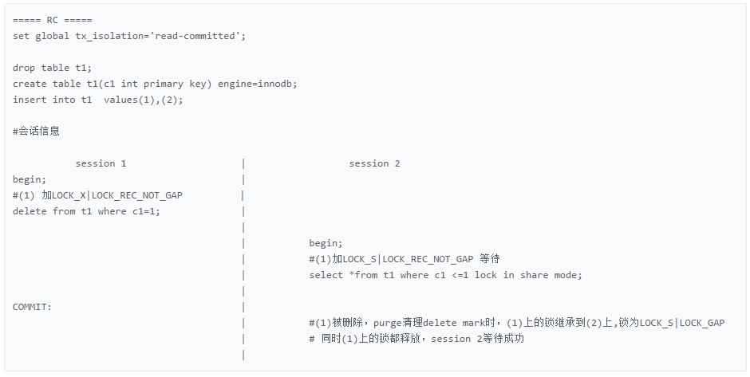
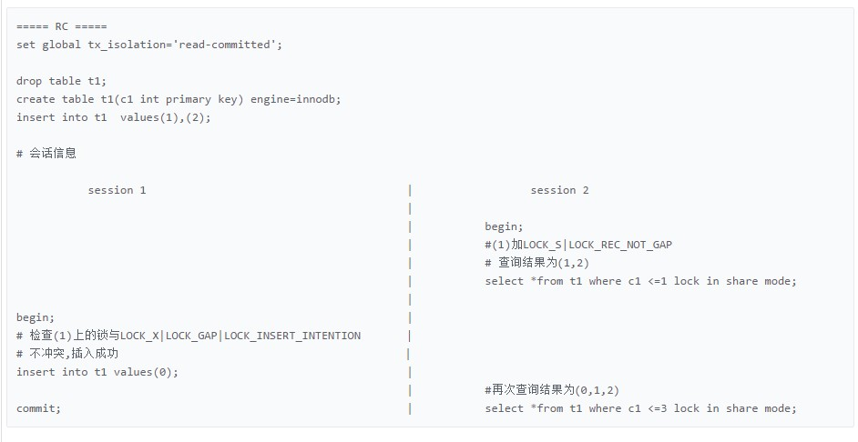

# MySQL · 特性分析 · innodb 锁分裂继承与迁移

**Date:** 2016/06
**Source:** http://mysql.taobao.org/monthly/2016/06/01/
**Images:** 5 images downloaded

---

数据库内核月报

 [
 # 数据库内核月报 － 2016 / 06
 ](/monthly/2016/06)

 * 当期文章

 MySQL · 特性分析 · innodb 锁分裂继承与迁移
* MySQL · 特性分析 ·MySQL 5.7新特性系列二
* PgSQL · 实战经验 · 如何预测Freeze IO风暴
* GPDB · 特性分析· Filespace和Tablespace
* MariaDB · 新特性 · 窗口函数
* MySQL · TokuDB · checkpoint过程
* MySQL · 特性分析 · 内部临时表
* MySQL · 最佳实践 · 空间优化
* SQLServer · 最佳实践 · 数据库实现大容量插入的几种方式
* MySQL · 引擎特性 · InnoDB COUNT(*) 优化(?)

 ## MySQL · 特性分析 · innodb 锁分裂继承与迁移 
 Author: 济天 

 ## innodb行锁简介
1. 行锁类型

` LOCK_S：共享锁
 LOCK_X: 排他锁
`
1. GAP类型

```
 LOCK_GAP：只锁间隙
 LOCK_REC_NO_GAP:只锁记录
 LOCK_ORDINARY: 锁记录和记录之前的间隙
 LOCK_INSERT_INTENTION: 插入意向锁，用于insert时检查锁冲突

```

每个行锁由锁类型和GAP类型组成
例如：
LOCK_X|LOCK_ORDINARY 表示对记录和记录之前的间隙加排他锁
LOCK_S|LOCK_GAP 表示只对记录前的间隙加共享锁

锁的兼容性：
 值得注意的是，持有GAP的锁（LOCK_GAP和LOCK_ORDINARY)与其他非LOCK_INSERT_INTENTION的锁都是兼容的，也就是说，GAP锁就是为了防止插入的。

详细可以参考之前的[月报](http://mysql.taobao.org/monthly/2016/01/01/)

## innodb 锁分裂、继承与迁移
这里的锁分裂和合并，只是针对innodb行锁而言的，而且一般只作用于GAP类型的锁。

* 锁分裂

 插入的记录的间隙存在GAP锁，此时此GAP需分裂为两个GAP

` lock_rec_inherit_to_gap_if_gap_lock:

 for (lock = lock_rec_get_first(block, heap_no);
 lock != NULL;
 lock = lock_rec_get_next(heap_no, lock)) {

 if (!lock_rec_get_insert_intention(lock)
 && (heap_no == PAGE_HEAP_NO_SUPREMUM
 || !lock_rec_get_rec_not_gap(lock))) {

 lock_rec_add_to_queue(
 LOCK_REC | LOCK_GAP | lock_get_mode(lock),
 block, heir_heap_no, lock->index,
 lock->trx, FALSE);
 }
 }

`
* 锁继承

 删除的记录前存在GAP锁，此GAP锁会继承到要删除记录的下一条记录上

` lock_rec_inherit_to_gap:

 for (lock = lock_rec_get_first(block, heap_no);
 lock != NULL;
 lock = lock_rec_get_next(heap_no, lock)) {

 if (!lock_rec_get_insert_intention(lock)
 && !((srv_locks_unsafe_for_binlog
 || lock->trx->isolation_level
 <= TRX_ISO_READ_COMMITTED)
 && lock_get_mode(lock) ==
 (lock->trx->duplicates ? LOCK_S : LOCK_X))) {

 lock_rec_add_to_queue(
 LOCK_REC | LOCK_GAP | lock_get_mode(lock),
 heir_block, heir_heap_no, lock->index,
 lock->trx, FALSE);
 }
}
`
* 锁迁移

 B数结构变化，锁信息也会随之迁移. 锁迁移过程中也涉及锁继承。

## 锁分裂示例

* 锁分裂例子

`set global tx_isolation='repeatable-read';

create table t1(c1 int primary key, c2 int unique) engine=innodb;
insert into t1 values(1,1);

begin;
# supremum 记录上加 LOCK_X|LOCK_GAP 锁住(1~)
select * from t1 where c2=2 for update;
# 发现插入(3,3)的间隙存在GAP锁，因此给（3,3）加LOCK_X | LOCK_GAP锁。这样依然锁住了（1~）
insert into t1 values(3,3);

`
这里如果插入（3,3）没有给（3,3）加LOCK_X | LOCK_GAP，那么其他连接插入（2，2）就可以成功

## 锁继承示例
* 隔离级别repeatable-read

 验证：session 1执行insert into t1 values(1,1)发生了锁等待，说明(2,2)上有gap锁

`mysql> select * from information_schema.innodb_locks;
+------------------------+-------------+-----------+-----------+-----------------+------------+------------+-----------+----------+-----------+
| lock_id | lock_trx_id | lock_mode | lock_type | lock_table | lock_index | lock_space | lock_page | lock_rec | lock_data |
+------------------------+-------------+-----------+-----------+-----------------+------------+------------+-----------+----------+-----------+
| 16582717714:888654:4:3 | 16582717714 | X,GAP | RECORD | `cleaneye`.`t1` | c2 | 888654 | 4 | 3 | 2 |
| 16582692183:888654:4:3 | 16582692183 | X,GAP | RECORD | `cleaneye`.`t1` | c2 | 888654 | 4 | 3 | 2 |
+------------------------+-------------+-----------+-----------+-----------------+------------+------------+-----------+----------+-----------+
2 rows in set (0.01 sec)
其中session 2 在(2,2) 加了LOCK_X|LOCK_GAP
 session 1 在(2,2) 加了LOCK_X|LOCK_GAP|LOCK_INSERT_INTENTION. LOCK_INSERT_INTENTION与LOCK_GAP冲突发生等待
`

* 隔离级别read-committed



验证: session 1执行insert into t1 values(1)发生了锁等待，说明(2)上有gap锁

`mysql> select * from information_schema.innodb_locks;
+------------------------+-----------------+-----------+-----------+-------------+------------+------------+-----------+----------+-----------+
| lock_id | lock_trx_id | lock_mode | lock_type | lock_table | lock_index | lock_space | lock_page | lock_rec | lock_data |
+------------------------+-----------------+-----------+-----------+-------------+------------+------------+-----------+----------+-----------+
| 1705:32:3:3 | 1705 | X,GAP | RECORD | `test`.`t1` | PRIMARY | 32 | 3 | 3 | 2 |
| 421590768578232:32:3:3 | 421590768578232 | S,GAP | RECORD | `test`.`t1` | PRIMARY | 32 | 3 | 3 | 2 |
+------------------------+-----------------+-----------+-----------+-------------+------------+------------+-----------+----------+-----------+
X.GAP insert 加锁LOCK_X | LOCK_GAP | LOCK_INSERT_INTENTION
S.GAP 加锁LOCK_S|LOCK_GAP,记录(2)从删除的记录(1)继承过来的GAP锁
`
而实际在读提交隔离级别上，insert into t1 values(1)应该可以插入成功，不需要等待的，这个锁是否继承值得商榷。

来看一个插入成功的例子



* 隔离级别serializable

 验证方法同read-committed。

## B树结构变化与锁迁移

B树节点发生分裂，合并，删除都会引发锁的变化。锁迁移的原则是，B数结构变化前后，锁住的范围保证不变。
 我们通过例子来说明

* 节点分裂

 假设原节点A(infimum,1,3,supremum) 向右分裂为B(infimum,1,supremum), C(infimum,3,supremum)两个节点

 infimum为节点中虚拟的最小记录，supremum为节点中虚拟的最大记录

 假设原节点A上锁为3上LOCK_S|LOCK_ORIDNARY，supremum为LOCK_S|LOCK_GAP,实际锁住了(1~)
锁迁移过程大致为：

 将3上的gap锁迁移到C节点3上
* 将A上supremum迁移继承到C的supremum上
* 将C上最小记录3的锁迁移继承到B的supremum上
* 节点合并

 以上述节点分裂的逆操作来讲述合并过程
B(infimum,1,supremum), C(infimum,3,supremum)两个节点，向左合并为A节点(infimum,1,3,supremum)
其中B，C节点锁情况如下
B节点：suprmum LOCK_S|LOCK_GAP
C节点：3 LOCK_S|LOCK_ORINARY, suprmum LOCK_S|GAP

 迁移流程如下(lock_update_merge_left)：

 1)将C节点锁记录3迁移到B节点

 2)将B节点supremum迁移继承到A的supremum上

 迁移后仍然锁住了范围(1~)

 节点向右合并情形类似
* 节点删除

 如果删除节点存在左节点，则将删除节点符合条件的锁，迁移继承到左节点supremum上
否则将删除节点符合条件的锁，迁移继承到右节点最小用户记录上
参考lock_update_discard

## 锁继承相关的BUG

[bug#73170](https://bugs.mysql.com/bug.php?id=73170) 二级唯一索引失效。这个bug触发条件是删除的记录没有被purge, 锁还没有被继承的。如果锁继承了就不会出现问题。

[bug#76927](https://bugs.mysql.com/bug.php?id=76927) 同样是二级唯一索引失效。这个bug是锁继承机制出了问题。

以上两个bug详情参考[这里](http://mysql.taobao.org/monthly/2015/06/02/)

 阅读： - 

[](http://creativecommons.org/licenses/by-nc-sa/3.0/)
本作品采用[知识共享署名-非商业性使用-相同方式共享 3.0 未本地化版本许可协议](http://creativecommons.org/licenses/by-nc-sa/3.0/)进行许可。

 [

 ](#0)