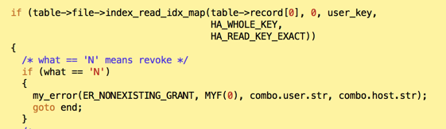
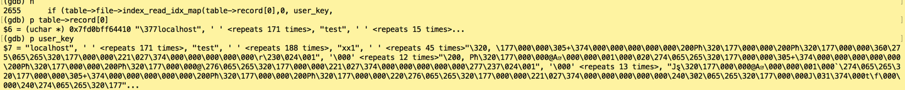

# MySQL · 源码分析 · 无法revoke单库或单表权限

**Date:** 2016/10
**Source:** http://mysql.taobao.org/monthly/2016/10/06/
**Images:** 3 images downloaded

---

数据库内核月报

 [
 # 数据库内核月报 － 2016 / 10
 ](/monthly/2016/10)

 * 当期文章

 AliSQL · 社区动态 · 关于开源之后评论的评论
* MySQL · 社区见闻 · Oracle Open World 2016 见闻
* MySQL · 社区见闻 · Percona Live 2016 见闻
* MySQL · 社区见闻 · MariaDB Developer Meeting 2016
* MySQL · myrocks · data dictionary 分析
* MySQL · 源码分析 · 无法revoke单库或单表权限
* PgSQL · 代码浅析 · PostgreSQL 可靠性分析
* PgSQL · 代码浅析 · PostgreSQL 9.6 聚合OP复用的优化分析
* MySQL · 特性分析 · 直方图的实现与分析
* SQL Server · 最佳实践 · 参数嗅探问题

 ## MySQL · 源码分析 · 无法revoke单库或单表权限 
 Author: 西加 

 ## 现象
对于拥有全局权限的用户，无法revoke单库或单表的权限，示例如下

`mysql> grant select on *.* to 'xx1'@'localhost';
Query OK, 0 rows affected (0.00 sec)

mysql> revoke select * test.* from 'xx1'@'localhost';
ERROR 1141 (42000): There is no such grant defined for user 'xx1' on host 'localhost'

mysql> revoke select * test.t1 from 'xx1'@'localhost';
ERROR 1141 (42000): There is no such grant defined for user 'xx1' on host 'localhost'
`

## 分析

根据报错信息，确定`revoke select * test.* from 'xx1'@'localhost'`报错在函数replace_db_table里面，调用栈如下

` 0 replace_db_table () at /home/xijia.xj/rds_5518/sql/sql_acl.cc:2662
 1 0x00000000005ebf44 in mysql_grant () at /home/xijia.xj/rds_5518/sql/sql_acl.cc:4230
 2 0x00000000006ac74e in mysql_execute_command () at /home/xijia.xj/rds_5518/sql/sql_parse.cc:4255
 3 0x00000000006b630c in mysql_parse () at /home/xijia.xj/rds_5518/sql/sql_parse.cc:6591
 4 0x000000000069ed9a in dispatch_command () at /home/xijia.xj/rds_5518/sql/sql_parse.cc:1214
 5 0x000000000069d072 in do_command () at /home/xijia.xj/rds_5518/sql/sql_parse.cc:837
 6 0x000000000081d9c1 in do_handle_one_connection () at /home/xijia.xj/rds_5518/sql/sql_connect.cc:1426
 7 0x000000000081d19b in handle_one_connection () at /home/xijia.xj/rds_5518/sql/sql_connect.cc:1332
 8 0x00007fd0c16fa851 in start_thread () from /lib64/libpthread.so.0
 9 0x0000003330ce767d in clone () from /lib64/libc.so.6 
`

报错条件是如下，操作是revoke，且mysql.db中找不到对应权限

`grant select on *.* to 'xx1'@'localhost'`调用栈如下

`0 replace_user_table () at /home/xijia.xj/rds_5518/sql/sql_acl.cc:2361
1 0x00000000005ebf44 in mysql_grant () at /home/xijia.xj/rds_5518/sql/sql_acl.cc:4220
2 0x00000000006ac74e in mysql_execute_command () at /home/xijia.xj/rds_5518/sql/sql_parse.cc:4255
3 0x00000000006b630c in mysql_parse () at /home/xijia.xj/rds_5518/sql/sql_parse.cc:6591
4 0x000000000069ed9a in dispatch_command () at /home/xijia.xj/rds_5518/sql/sql_parse.cc:1214
5 0x000000000069d072 in do_command () at /home/xijia.xj/rds_5518/sql/sql_parse.cc:837
6 0x000000000081d9c1 in do_handle_one_connection () at /home/xijia.xj/rds_5518/sql/sql_connect.cc:1426
7 0x000000000081d19b in handle_one_connection () at /home/xijia.xj/rds_5518/sql/sql_connect.cc:1332
8 0x00007fd0c16fa851 in start_thread () from /lib64/libpthread.so.0
9 0x0000003330ce767d in clone () from /lib64/libc.so.6 
`
`可以看出grant select on *.* to 'xx1'@'localhost'`只修改了mysql.user表
而`revoke select * test.* from 'xx1'@'localhost'` 需要删除mysql.db表中相应记录，所以会报错

## 小结

mysql权限分三个粒度，全局权限， db权限，table权限，分别保存在mysql.user, mysql.db. mysql.tables_priv(存储过程，和proxy权限有单独的表)

`grant/revoke privilege on *.* `修改mysql.user表
`grant/revoke privilege on db.* `修改mysql.db表
`grant/revoke privilege on db.table` 修改mysql.table表
三种操作互不影响，赋予一个用户大粒度的权限，并不能收回小粒度的权限

执行drop user操作后，会调用sql/sql_acl.cc:handle_grant_data修改上述三个表中，所有与被drop用户相关的记录

 阅读： - 

本作品采用[知识共享署名-非商业性使用-相同方式共享 3.0 未本地化版本许可协议](http://creativecommons.org/licenses/by-nc-sa/3.0/)进行许可。

 