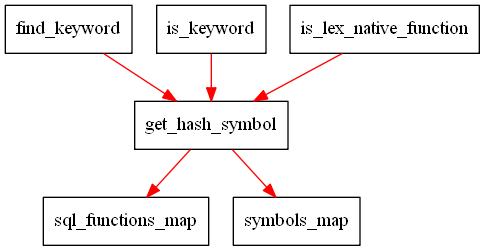

# MySQL · 源码分析 · 词法分析及其性能优化

**Date:** 2017/02
**Source:** http://mysql.taobao.org/monthly/2017/02/04/
**Images:** 5 images downloaded

---

数据库内核月报

 [
 # 数据库内核月报 － 2017 / 02
 ](/monthly/2017/02)

 * 当期文章

 AliSQL · 开源 · Sequence Engine
* MySQL · myrocks · myrocks之备份恢复
* MySQL · 挖坑 · LOCK_active_mi/LOCK_msp_map 优化思路
* MySQL · 源码分析 · 词法分析及其性能优化
* SQL优化 · 经典案例 · 索引篇
* MySQL · 新特性分析 · CTE执行过程与实现原理
* PgSQL · 源码分析 · PG优化器物理查询优化
* SQL Server · 特性介绍 · 聚集列存储索引
* PgSQL · 应用案例 · 聚集存储 与 BRIN索引
* PgSQL · 应用案例 · GIN索引在任意组合查询中的应用

 ## MySQL · 源码分析 · 词法分析及其性能优化 
 Author: wenliang 

## Table of Contents

* 1. 简介
* 2. 背景知识
* 3. 查找树的实现

3.1. 树的查找
* 3.2. 树的产生

[4. 试试折半查找](#sec-4)
[5. 总结](#sec-5)

## 简介

MySQL 支持标准的 SQL 语言，具体实现的时候必然要涉及到词法分析和语法分析。早期的程序可能会优先考虑手工实现词法分析和语法分析，现在大多数场合下都会采用工具来简化实现。MySQL、PostgreSQL 等采用 C/C++ 实现的开源数据库采用的是现代的 yacc/lex 组合，也就是 GNU bison/flex。其他比较流行的工具还有 ANTLR、JavaCC 等等。这些工具大多采用扩展的 BNF 语法，并支持很多定制化选项，使得语法比较容易维护和实现。MySQL 语法分析器的入口函数是 MYSQLparse()，词法分析器的入口函数为 MYSQLlex()。不过， MySQL 的词法分析器是手工打造的，并且为了提高关键字的查找效率做了针对性的优化。这个博客上有点介绍，建议在阅读代码之前先了解一下。

## 背景知识

MySQL 的语法分析器采用的工具是 bison，对应的语法文件是 sql/sql_yacc.yy。bison 处理语法文件的输出是 sql/sql_yacc.cc 和 sql/sql_yacc.h。对应的 sql/CMakeLists.txt 中有相关的 make 规则：

`INCLUDE(${CMAKE_SOURCE_DIR}/cmake/bison.cmake)
RUN_BISON(
 ${CMAKE_CURRENT_SOURCE_DIR}/sql_yacc.yy 
 ${CMAKE_CURRENT_BINARY_DIR}/sql_yacc.cc
 ${CMAKE_CURRENT_BINARY_DIR}/sql_yacc.h
)
`

实际在 make 的时候，这个过程比较复杂。也可以单独 make 词法语法分析的部分，例如：

`$ make -C sql gen_lex_token
`

阅读代码的时候，可以查找 MYSQLparse，以找到语法分析的代码路径。下面是清除掉生成的 yacc 代码再查找的结果：

`$ make -C sql clean
$ grep --color=auto -rwIn MYSQLparse sql/
sql/sql_parse.cc:6748:extern int MYSQLparse(class THD *thd); // from sql_yacc.cc
sql/sql_parse.cc:6752: This is a wrapper of MYSQLparse(). All the code should call parse_sql()
sql/sql_parse.cc:6753: instead of MYSQLparse().
sql/sql_parse.cc:6858: bool mysql_parse_status= MYSQLparse(thd) != 0;
sql/sql_parse.cc:6917: Check that if MYSQLparse() failed either thd->is_error() is set, or an
sql/sql_lex.cc:3442: parser before returning an error from MYSQLparse. If your
`

MySQL 手工打造的词法分析器对应的源代码文件是 sql/sql_lex.h 和 sql/sql_lex.cc。词法分析的入口函数是 MYSQLlex()。解析出一个 token 的函数为 lex_one_token()。词法分析出来的每个 token 都会对应一个语法分析器中的终结符，它们的字符串表示在 sql/lex.h 中。这些符号被分为两组，SQL 关键字以及 SQL 函数，在代码中对应数组 symbols[] 和 sql_functions[]。通常而言，在语法/词法分析过程中为了判断某个 token 是否为 SQL 的关键字，可以直接二分查找字符串数组。考虑到关键字列表是固定的一个集合，MySQL 对此作了专门的优化，用 Trie 树来进一步提高效率。下一节介绍这部分代码的实现。

## 查找树的实现

查找树的产生用的是一个独立的小程序 gen_lex_hash[.cc]。CMake 产生的 Makefile 规则为在文件 sql/CMakeFiles/sql.dir/build.make 中：

`sql/lex_hash.h: sql/gen_lex_hash
 $(CMAKE_COMMAND) -E cmake_progress_report /home/x/mysql/CMakeFiles $(CMAKE_PROGRESS_153)
 @$(CMAKE_COMMAND) -E cmake_echo_color --switch=$(COLOR) --blue --bold "Generating lex_hash.h"
 cd /home/x/mysql/sql && ./gen_lex_hash > lex_hash.h
`

可以看到，它产生的代码在 sql/lex_hash.h 中。里头包含了两个大数组：sql_functions_map[] 和 symbols_map[]，以及一个函数 get_hash_symbol()。

具体的实现自然分为两个部分，一个是产生树，另一个是查找产生的树。

### 树的查找

最主要的函数就是 get_hash_symbol()，它的调用和被调用关系为：

注：上图是使用 Graphviz 产生的。

文件 gen_lex_hash.cc 的代码注释中有一个树的示例：

可以看出，根节点是按照字符串长度从小到大排序组织的。对于每种长度的字符串，要记录首字母和尾字母以及下一层节点的指针。中间节点除了是按照字符从小到大排序外，其它部分与根节点相同。叶子节点就是 symbols 数组的成员。树的查找就是一个自然的遍历过程。

### 树的产生

理解了上面的树的结构，就很好理解树的产生逻辑了。它的做法是读取关键字数组，产生一个原始的查找树（参看函数 generate_find_structs）；然后，调整这个树，产生一个数组，也就是不用链表表示的树（参看函数 print_find_structs）。主要的函数和调用关系如下：

其中：insert_symbols 处理的是 SQL 关键字，insert_sql_functions 处理的是函数名。get_hash_struct_by_len 处理的是树的根节点，insert_into_hash 处理的是树的内节点，递归执行。

为了更好的理解，可以在处理到输入数组不同位置时，查看当时对应的树。例如：

Table 1: 查找树的产生

## 试试折半查找

如果要验证一下这个优化与普通的折半查找的性能差异，需要做一些适当的修改才行。测试中用 perf 之类的工具会发现比较函数会成为热点。在修改代码时需要注意：

1. symbols、sql_functions 这两个数组不一定是按照顺序排列的，需要认真确认。
2. 查找符号时，字符串并没有以 ‘\0’ 结尾，做比较要注意。
3. 要修改的文件 sql/lex_hash.h 是自动产生的，需要用自己的代码替换其中的 get_hash_symbol 函数。

## 总结

本文是基于 MySQL 5.6 做的分析。可以看到 MySQL 对词法分析中的关键字查找热点做了性能改进。也可以发现代码的结构不是特别清晰，存在一些代码冗余和明显的可改进之处。 WL#8016: Parser for optimizer hints 在重构的过程中顺便将其改掉了。

## Footnotes: 

[1](#fnr.1) MySQL: Query Parsing <https://blog.imaginea.com/mysql-query-parsing/>

[2](#fnr.2) MySQL Download <http://dev.mysql.com/downloads/mysql/#downloads>

[3](#fnr.3) Graphviz <http://www.graphviz.org/Gallery.php>

[4](#fnr.4) WL#8016: Parser for optimizer hints <https://dev.mysql.com/worklog/task/?id=8016>

 阅读： - 

本作品采用[知识共享署名-非商业性使用-相同方式共享 3.0 未本地化版本许可协议](http://creativecommons.org/licenses/by-nc-sa/3.0/)进行许可。

 