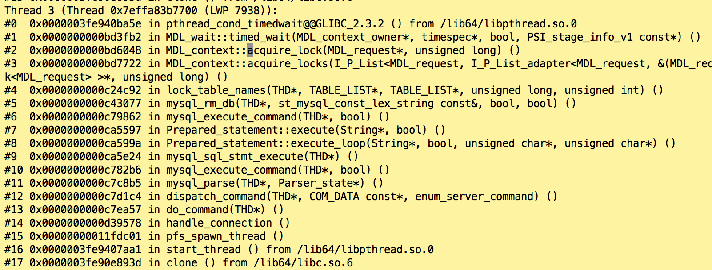

# MySQL · 捉虫动态 · 5.7 mysql_upgrade 元数据锁等待

**Date:** 2017/04
**Source:** http://mysql.taobao.org/monthly/2017/04/10/
**Images:** 4 images downloaded

---

数据库内核月报

 [
 # 数据库内核月报 － 2017 / 04
 ](/monthly/2017/04)

 * 当期文章

 MySQL · 源码分析 · MySQL 半同步复制数据一致性分析
* MYSQL · 新特性 · MySQL 8.0对Parser所做的改进
* MySQL · 引擎介绍 · Sphinx源码剖析（二）
* PgSQL · 特性分析 · checkpoint机制浅析
* MySQL · 特性分析 · common table expression
* PgSQL · 应用案例 · 逻辑订阅给业务架构带来了什么？
* MSSQL · 应用案例 · 基于内存优化表的列存储索引分析Web Access Log
* TokuDB · 捉虫动态 · MRR 导致查询失败
* HybridDB · 稳定性 · HybridDB如何优雅的处理Out Of Memery问题
* MySQL · 捉虫动态 · 5.7 mysql_upgrade 元数据锁等待

 ## MySQL · 捉虫动态 · 5.7 mysql_upgrade 元数据锁等待 
 Author: xijia.xj 

 ## 问题描述

如下图，mysql_upgrade 过程中，执行 DROP DATABASE IF EXISTS performance_schema 一直在等待 metadata lock

## 问题排查

### 简单粗暴的方法

有一种简单的解决方法，把其他连接kill掉，释放 metadata lock

对于这个案例，占用元数据锁的是 Id = 107768，User = xx1 的连接

但是这种方法指标不治本，案例中占用元数据锁的连接，是一个agent服务建立的

mysql_upgrade也是程序执行，不能每次都手工kill连接，需要查明为什么占用锁

### 详细查明问题原因

据业务方反馈，agent服务和调用mysql_upgrade的代码和5.6也在用，没有出现问题。

怀疑是5.7引入的bug

根据上述现象，显然是agent占了metadata lock，大概率不是mysql的bug

为了说服业务方，我们继续排查是在等待什么锁

#### 查询 performance_schema.metadata_locks

首先想到5.7的 performance_schema.metadata_locks ，很遗憾这张表里并没有记录

#### gdb 获取元数据锁信息

我们尝试使用 gdb 获取锁等待信息

`ps aux | grep 端口号`，找出mysqld进程号 pid，`pstack pid > stack.log`

在stack.log中搜索 acquire_lock（请求mdl锁的函数），可以看出是 thread 3 在请求元数据锁

`gdb -p pid
thread 3
切换到目标线程

#0 0x0000003fe940ba5e in pthread_cond_timedwait@@GLIBC_2.3.2 () from /lib64/libpthread.so.0
#1 0x0000000000bd3fb2 in native_cond_timedwait (this=0x7eff640e05d8, owner=0x7eff640e0540, abs_timeout=0x7effa83b2ce0, set_status_on_timeout=Unhandled dwarf expression opcode 0xf3
) 
#2 my_cond_timedwait (this=0x7eff640e05d8, owner=0x7eff640e0540, abs_timeout=0x7effa83b2ce0, set_status_on_timeout=Unhandled dwarf expression opcode 0xf3
) 
#3 inline_mysql_cond_timedwait (this=0x7eff640e05d8, owner=0x7eff640e0540, abs_timeout=0x7effa83b2ce0, set_status_on_timeout=Unhandled dwarf expression opcode 0xf3
) 
#4 MDL_wait::timed_wait (this=0x7eff640e05d8, owner=0x7eff640e0540, abs_timeout=0x7effa83b2ce0, set_status_on_timeout=Unhandled dwarf expression opcode 0xf3
) 
#5 0x0000000000bd6048 in MDL_context::acquire_lock (this=0x7eff640e05d8, mdl_request=0x7eff640aa870, lock_wait_timeout=Unhandled dwarf expression opcode 0xf3
) 

f 5
跳转到 MDL_context::acquire_lock
acquire_lock 函数参数中有 MDL_request
MDL_request::MDL_key 中有详细的锁信息

p mdl_request->key

{m_length = 34, m_db_name_length = 18, m_ptr = "\003performance_schema\000global_status", '\000' <repeats 353 times>, static m_namespace_to_wait_state_name = \{ \{m_key = 0, 
 m_name = 0x130aa9b "Waiting for global read lock", m_flags = 0}, {m_key = 0, m_name = 0x130abb0 "Waiting for tablespace metadata lock", m_flags = 0}, {m_key = 0, 
 m_name = 0x130abd8 "Waiting for schema metadata lock", m_flags = 0}, {m_key = 0, m_name = 0x130ac00 "Waiting for table metadata lock", m_flags = 0}, {m_key = 0, 
 m_name = 0x130ac20 "Waiting for stored function metadata lock", m_flags = 0}, {m_key = 0, m_name = 0x130ac50 "Waiting for stored procedure metadata lock", m_flags = 0}, {m_key = 0, 
 m_name = 0x130ac80 "Waiting for trigger metadata lock", m_flags = 0}, {m_key = 0, m_name = 0x130aca8 "Waiting for event metadata lock", m_flags = 0}, {m_key = 0, 
 m_name = 0x130aab8 "Waiting for commit lock", m_flags = 0}, {m_key = 0, m_name = 0x130aad0 "User lock", m_flags = 0}, {m_key = 0, m_name = 0x130acc8 "Waiting for locking service lock", 
 m_flags = 0} } }
`

上述信息可以看出，正在请求performance_schema.global_status这张表的锁

#### 排查业务代码

和业务方确认，agent中确实执行了 “show global status” , 但是已经设置了autocommit

简化逻辑后，agent代码如下

`import MySQLdb
from time import sleep
conn = MySQLdb.connect(host='47.93.49.119', port=3001, user='xx1')
conn.autocommit = True
cur=conn.cursor()
cur.execute("show global status")
while 1:
 sleep(1)
`

代码中确实设置了autocommit，但是并没有生效（如果执行了commit，不可能不释放元数据锁）

MySQLdb.connect 返回 Connection 类，根据上述代码，autocommit是 Connection的成员属性

`class Connection(_mysql.connection):
`

Connection 继承自_mysql.connection，_mysql 是c语言实现的python库，查看_mysql.c

`static PyMethodDef _mysql_ConnectionObject_methods[] = {
 {
 "affected_rows",
 (PyCFunction)_mysql_ConnectionObject_affected_rows,
 METH_VARARGS,
 _mysql_ConnectionObject_affected_rows__doc__
 },
 {
 "autocommit",
 (PyCFunction)_mysql_ConnectionObject_autocommit,
 METH_VARARGS,
 _mysql_ConnectionObject_autocommit__doc__
 },
 {
 "commit",
 (PyCFunction)_mysql_ConnectionObject_commit,
 METH_VARARGS,
 _mysql_ConnectionObject_commit__doc__
 },
`

autommit 并不是成员属性，而是一个成员方法

## 结论
conn.autocommit = True 强行将 autocommit 的函数指针赋值为 True，并没有真正设置autocommit

5.6中没有发现这个问题

一是 agent 中只有查询语句，不设autocommit也能返回查询结果

二是 5.6中 “show global status” 查询的是 information_shcema，5.7中是performance_schema，5.6中不会影响 drop database performance_schema

 阅读： - 

本作品采用[知识共享署名-非商业性使用-相同方式共享 3.0 未本地化版本许可协议](http://creativecommons.org/licenses/by-nc-sa/3.0/)进行许可。

 